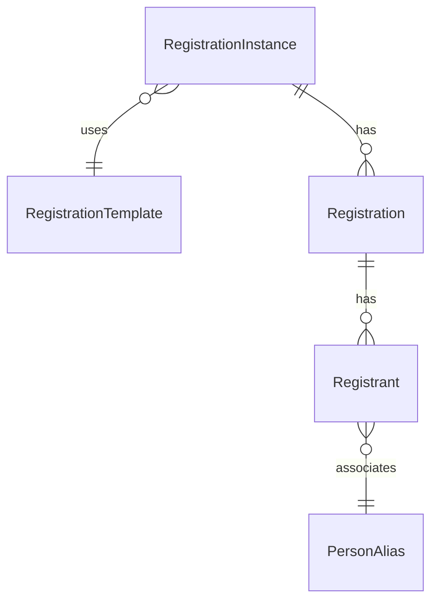

# data-model.md Template

The block's data layer: entities involved, foreign-key relationships, queries used, sibling-block scan, and the C# enum values needed for cross-language type fidelity.

This is one of the highest-value artifacts because it informs **bag design** (especially the view / edit split) and **cross-block correctness** (the sibling-block scan).

This template is a skeleton. Always produce at least the entity inventory and the sibling-block scan, even on small blocks. Other sections collapse to stubs when not relevant.

---

## Output location

`/working/{block-name-kebab}/data-model.md`

After the conversion ships, `/review-conversion` appends a `## Verification (review-conversion, ...)` section to this file with audit verdicts on the view/edit field split, sibling-block ID handoff, and cross-language enum fidelity. That section is review's territory — do not pre-populate it during convert-block phases.

---

## Body

### 1. Entities

For each entity touched by the block:

| Entity | Read | Written | Notes |
|---|---|---|---|
| `RegistrationInstance` | yes | yes | Primary entity (CRUD subject) |
| `RegistrationTemplate` | yes | no | Read-only via `Instance.RegistrationTemplate` |
| `Campus` | yes | no | Picker source; resolved via `CampusCache.All()` |
| `PersonAlias` | yes | no | Audit columns; never compare Person.Guid to a PersonPicker emit |

If an entity has a cache class, name it (`CampusCache`, `DefinedTypeCache`, etc.). The conversion should use the cache for read-only access; flag any service-based read in `improvement-analysis.md`.

### 2. Foreign keys and navigation

For every navigation property the block reads, list:
- The C# property path (`entity.Foo.Bar.Baz`)
- Whether it's eager-loaded via `.Include()` or lazy-loaded (lazy in a loop = N+1; flag in `improvement-analysis.md`)
- The cardinality (one-to-one, one-to-many)

If the block reads more than a handful of nav properties, a small ER diagram in Mermaid clarifies:



### 3. Queries

The list of LINQ chains / SQL statements the block executes. Cross-reference with `parity-map.md` Trace 2; this section adds detail (filter expressions, projections, pagination):

```
Q1, bind grid (BindGrid line 142)
  qry: new RegistrationInstanceService(rockContext).Queryable()
       .Where(...filters from PersonPreference...)
       .Include(i => i.RegistrationTemplate)
       .OrderByDescending(i => i.StartDateTime)
       .Skip(page * pageSize).Take(pageSize)
  flagged: filter list size could grow; consider IQueryable subquery (see improvement-analysis.md I3)

Q2, count for paging (BindGrid line 168)
  qry: same .Where as Q1, then .Count()
  flagged: re-evaluates the filter expression, single .ToList() with TotalRowCount would be cheaper
```

If a query has a fix planned, point to the row in `improvement-analysis.md`.

### 4. View vs edit field split (for detail blocks)

This is the section that prevents the P0 view/edit bag split issue (sensitive fields leaking into view-mode responses). For each entity field:

| Field | View bag? | Edit bag? | Reason |
|---|---|---|---|
| `Id` (IdKey) | yes | yes | Always present |
| `Name` | yes | yes | Public attribute, displayed and editable |
| `IsActive` | yes | yes | Public attribute |
| `ApiKey` | **no** | yes | Secret, must never appear in view-mode response |
| `OAuthClientSecret` | **no** | yes | Secret |
| `RawTemplateContent` | **no** | yes | Bulky; only edit page needs it |
| `MetricsHistoryBlob` | summary only | full in edit | View shows last 5 entries; edit shows full payload |

The conversion produces `GetCommonEntityBag()` (view-safe only) and `GetEntityBagForEdit()` (adds edit-only fields). The final checkpoint verifies no edit-only field leaks into the view path.

For list and custom blocks, this section may be a one-line stub: "No view/edit split applicable, block is a {list/custom} type."

### 5. Sibling-block scan

This is the section that prevents the P0 cross-block ID mismatch finding. For every linked-to block (via `LinkedPage` attributes, `NavigateToPage` calls, page-parameter handoffs):

| Linked block | Path | State | ID format expected | Mismatch? |
|---|---|---|---|---|
| `MobilePageDetail` | `RockWeb/Blocks/Mobile/MobilePageDetail.ascx.cs` | **WebForms** | `.AsInteger()` (int only) | **YES**, this list emits idKey via `((Key))` |
| `MobileApplicationList` | `Rock.Blocks/Mobile/MobileApplicationList.cs` | Obsidian | accepts idKey | no |

For each mismatch:
- Document the exact line where the parsing happens (`MobilePageDetail.ascx.cs:34: var pageId = PageParameter("PageId").AsInteger();`)
- Propose the resolver shape (`var pageId = entityService.Get(PageParameter("PageId"), !PageCache.Layout.Site.DisablePredictableIds)?.Id;`)
- Decide in Phase 2 whether the sibling fix lands in this PR or as a follow-up

If no mismatches: "All linked blocks accept idKey. No sibling-block changes needed."

### 6. C# enum value capture

If the block defines or relies on any enums that surface in the bag (and therefore in the TS layer), record the **exact integer values** of every member:

```csharp
public enum ShellTypeValue
{
    Blank = 0,
    Flyout = 1,
    Tabbed = 2
}

public enum LockedOrientation
{
    Auto = 0,
    Portrait = 1,
    Landscape = 2
}
```

The TS-side `types.partial.ts` (or .d.ts) MUST mirror these byte-for-byte. The model writes the TS enum from this section, NOT from how the Vue template uses the values. The final checkpoint verifies.

### 7. Attribute model (detail blocks only)

If the entity supports attributes (`IHasAttributes`), document:
- Whether the WebForms block `LoadAttributes()` for view, edit, or both
- Whether `SetPublicAttributeValues` is called on save
- Whether `SecurityGrantToken` is needed

For list and custom blocks, this section may be a one-line stub or omitted.

---

## Quality checks

- [ ] Every entity in Trace 2 of `parity-map.md` has a row in §1
- [ ] Every nav-property access has a row in §2 (or is acknowledged as a fix in `improvement-analysis.md`)
- [ ] Every query in Trace 2 has a row in §3
- [ ] §4 view/edit split is filled in for detail blocks
- [ ] §5 sibling-block scan is run for **every** `LinkedPage` and `NavigateTo*` in the block
- [ ] §6 C# enum values are recorded for every enum that surfaces in the bag

If §5 surfaced a mismatch, it's a Phase 2 question (in-scope fix or follow-up?). If §4 surfaced a sensitive-field leak, it must be in `improvement-analysis.md` as a P0 row.
