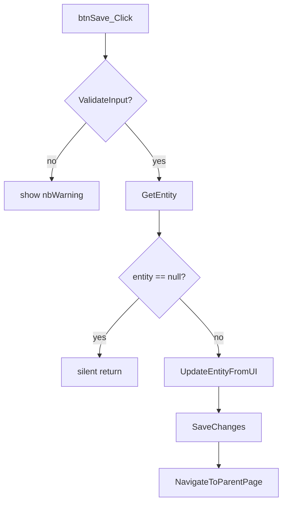

# logic-graph.md Template

A textual call graph showing how methods invoke each other and the conditional branches between them. Complements `parity-map.md` (which is a flat list of methods) and `state-machine.md` (which is about UI states).

The point is to surface implicit dependencies, methods that are called from non-obvious places, conditional branches that affect multiple downstream calls, data that flows through several helpers before being used.

This template is a skeleton. Always full for any block where Phase 1B fires; stub allowed for linear, single-flow blocks.

---

## Output location

`/working/{block-name-kebab}/logic-graph.md`

---

## Body

### 1. Entry-point map

For each entry point into the block (page lifecycle hook, button click, grid event, block action), list:
- **Trigger** (e.g., `OnLoad if !IsPostBack`, `btnSave_Click`, `gReminders.GridRebind`)
- **Top-level method** invoked
- **One-line summary** of what the chain accomplishes

Example:

| Trigger | Top method | Outcome |
|---|---|---|
| OnLoad (first) | `BindGrid()` | Hydrate grid with current filters |
| Filter button click | `gFilter_ApplyFilterClick` → `SaveUserPreferences` → `BindGrid()` | Persist filter values, re-hydrate grid |
| Add button click | `bAdd_Click` → `NavigateToLinkedPage("DetailPage", new {...})` | Navigate to detail page |

### 2. Call chains

For each top-level entry, expand the call chain. Use indented bullets for depth:

```
btnSave_Click
├─ ValidateInput()              ← returns bool; sets nbWarning if false
├─ if (!ValidateInput()) return ← short-circuit
├─ var entity = GetEntity()      ← service lookup; null if not found
├─ if (entity == null) return    ← short-circuit
├─ UpdateEntityFromUI(entity)
│   ├─ entity.Name = tbName.Text
│   ├─ entity.IsActive = cbIsActive.Checked
│   └─ entity.Attributes, entity.LoadAttributes() then SetAttributeValues
├─ entity.SaveChanges(rockContext)
└─ NavigateToParentPage()
```

Plain bullets are fine; the goal is readability, not strict syntax. Indicate side effects in `←` annotations when they're non-obvious.

### 3. Conditional flows

For every meaningful branch (`if`, `switch`, ternary affecting multi-line outcomes), document:
- **Condition** (the boolean expression as written, lightly cleaned up)
- **True path** (one line)
- **False path** (one line)
- **Notes** (defaults, fall-throughs, surprising behavior)

Example:

| Condition | True | False | Notes |
|---|---|---|---|
| `entity == null` | redirect to ParentPage | continue rendering | Silent, no error message shown |
| `entity.IsSystem` | hide Delete button, lock Name | show Delete button, allow Name edit | Carries to edit panel; controls disabled, not just hidden |
| `IsUserAuthorized(EDIT)` | show Edit button | hide Edit button | Block-level auth, not entity-level |

### 4. Data flow

For non-trivial data transformations (one input becomes multiple outputs, or multiple inputs combine into one output), draw the flow textually:

```
PageParameter("EntityId")
  → entityService.Get(int.Parse(...))   ← throws on bad input!
  → entity                              ← null if not found
  → entity.LoadAttributes()
  → bag.LoadAttributesAndValuesForPublicView(entity, currentPerson)
  → return bag                          ← caller renders ValueDetailList
```

Annotate any side effects, exception paths, or "this is where the bug would be" pointers.

---

## What this is NOT

- Not a flat list of methods. That's `parity-map.md` Trace 1.
- Not a state machine. That's `state-machine.md`.
- Not the full implementation. The goal is the *structure*, once a future reader knows the shape, they can read the original code for details.

---

## When to use a Mermaid flowchart

For one or two top-level entry points with complex branching, a `flowchart` block can be clearer than indented bullets. Use sparingly:



Reserve flowcharts for the 1-2 most complex chains. Indented bullets are usually plenty.
