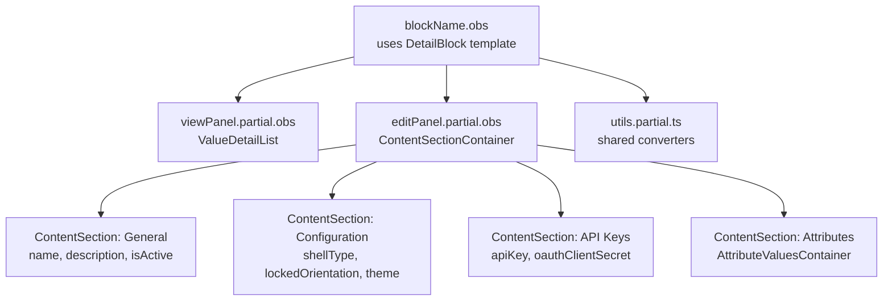

# obsidian-pattern-analysis.md Template

The idiomatic Obsidian shape for this block, plus the alternatives considered and why they were rejected. This is the "if I were rebuilding this block from scratch in Obsidian today" analysis, not a translation of the WebForms layout.

The point is to prevent the most common conversion failure modes:
- Hand-rolled DOM where a framework component exists (TabbedContent, Modal, Panel)
- `<fieldset>` + `<div class="row">` instead of ContentSection composition on detail blocks
- Anonymous block-action responses (`ActionOk(new { ... })` carrying non-trivial shape)
- Entity actions in child panels with `@emit` chains instead of root-bound DetailBlock footer slots

This artifact is **always produced** even on small blocks. The depth scales: a small block may have a 10-line analysis ("standard detail block; canonical reference is X; no alternatives considered"), a 2000-line block may have multi-section analysis with mermaid diagrams.

---

## Output location

`/working/{block-name-kebab}/obsidian-pattern-analysis.md`

After the conversion ships, `/review-conversion` appends a `## Verification (review-conversion, ...)` section to this file recording per-section audit verdicts (canonical-shape used / hand-rolled / wrong-base-class). That section is review's territory — do not pre-populate it during convert-block phases.

---

## Body

### 1. Canonical shape

Begin with the canonical reference block (per `common-patterns.md` § Canonical Reference Blocks) and a one-line statement of what this conversion will mirror. If the canonical reference unambiguously covers this block, the rest of the analysis can be brief.

```
Canonical reference: Rock.Blocks/Engagement/AchievementAttemptDetail.cs (entity detail with breadcrumbs and attributes)
This conversion follows the canonical shape with the following block-specific adaptations:
- Edit panel uses ContentSectionContainer (multiple distinct sections) rather than fieldset
- Adds a SecurityGrantToken because entity attributes are supported
```

### 2. Component selection

For every non-trivial UI region, name the Obsidian component used and the alternative considered. The defaults that should not require justification:

| Region | Component |
|---|---|
| Detail block parent | `<DetailBlock>` |
| List block parent | `<Grid>` (within a parent Block template) |
| View panel container | `<ValueDetailList>` (NOT ContentSection) |
| Edit panel container (single section) | `<fieldset>` |
| Edit panel container (multi-section) | `<ContentSectionContainer>` + `<ContentSection>` + `<ContentStack>` |
| Modal | `<Modal>` |
| Tabs | `<TabbedContent>` |
| Field validation | `propertyRef` + `ValidPropertiesBox` |
| Notification | `<NotificationBox>` |

Rows should justify only when the choice is non-obvious. Example of a justified row:

```
| Tabbed structure | TabbedContent (NOT manual nav-tabs) |
| Why? | Manual nav-tabs would silently lose the URL query-param sync; this is a recurring conversion failure. |
```

### 3. Edit panel root choice (for detail blocks)

The `<fieldset>` vs `<ContentSectionContainer>` decision. Default per `detail-block-patterns.md`:

- `<fieldset>` for ~85% of blocks (single logical group of fields, name + a few pickers + AttributeValuesContainer)
- `<ContentSectionContainer>` when the block has multiple distinct sections that benefit from sidebar nav and collapsible headers

State the chosen root and the reason in one sentence.

### 4. Block-action response shapes

For every non-trivial block action that returns more than just a refreshed entity bag, name the typed response bag (NOT an anonymous object).

```
Save() → SaveResponseBag (carries refreshed bag + lastSavedAt + applicationDetailsHtml)
Deploy() → DeployResponseBag (carries lastDeployDateTime + deploymentLogId)
RefreshAttributes() → RefreshAttributesResponseBag (carries new attribute schema + values)
```

If the block has no non-trivial responses (Save just returns the refreshed bag): "All block actions return refreshed entity bag; no typed response bags needed."

### 5. Footer-action placement (for multi-panel detail blocks)

Where do the entity-level actions (Save / Cancel / Delete / Publish / Deploy) live? Default: on the root component, bound to `<DetailBlock>`'s `#footerActions` and `#footerSecondaryActions` slots. Do NOT bury them in child panels with `@emit` chains.

State the chosen placement explicitly. If the WebForms layout had actions in panels and you're moving them to root, that's an improvement and should also be in `improvement-analysis.md`.

### 6. v-model adapter strategy

If any bag fields don't match the v-model contracts of common controls (PagePicker expects PageRouteValueBag, dropdowns need strings, ColorPicker needs non-null strings, etc.), document the converters and where they live.

Default placement:
- One panel needs it: inline at the top of the `.partial.obs`
- Two or more panels need it: extract to `utils.partial.ts`

Name each converter pair:

```
listItemToPageRoute / pageRouteToListItem    → utils.partial.ts (used by 3 panels)
lockedOrientationToString / lockedOrientationFromString → utils.partial.ts (used by 2 panels)
normalizeStyleString                          → inline in editPanel.partial.obs (used by 1 panel)
```

If no adapters needed: "All bag fields map directly to control v-models; no adapters needed."

### 7. Considered alternatives

Where a non-obvious choice was made, document the alternative considered and why rejected. This is the section that prevents review nits ("did you consider X?").

```
Considered: TabbedContent for the multi-mode UI
Rejected: block has 5 modes but only 2 user-facing tabs; the other 3 are internal state machines.
         Using TabbedContent would expose the implementation. Plain v-if guarded by a state ref is clearer.

Considered: a single bag with view-only and edit-only fields, gated by a "mode" property
Rejected: bag fields aren't filtered server-side; secrets would still ship to the client in view mode.
         Two bags (view-safe + edit-only adds) is the only way to keep secrets server-side.

Considered: server-side filters with PreferenceKey (per CommunicationList canonical reference)
Rejected: dataset is bounded to ~200 rows; column-only filters are sufficient and avoid the gridSettingsModal complexity.
```

If no alternatives were genuinely considered, drop the section.

### 8. Sketch (optional, for large blocks)

For very large blocks (Phase 1B fired with multiple triggers), a one-screen mermaid `flowchart` showing the component tree can clarify the design before the model writes any code:



Drop the diagram if the design is straightforward.

---

## Quality checks

- [ ] Canonical reference is named and matches the block's classification
- [ ] Edit-panel root choice is stated (detail blocks)
- [ ] Block-action responses are typed bags or "all return refreshed bag"
- [ ] Footer actions are on root component (multi-panel detail blocks)
- [ ] v-model adapters are placed per the dedup rule
- [ ] Alternatives considered are documented OR the section is dropped because there were none
