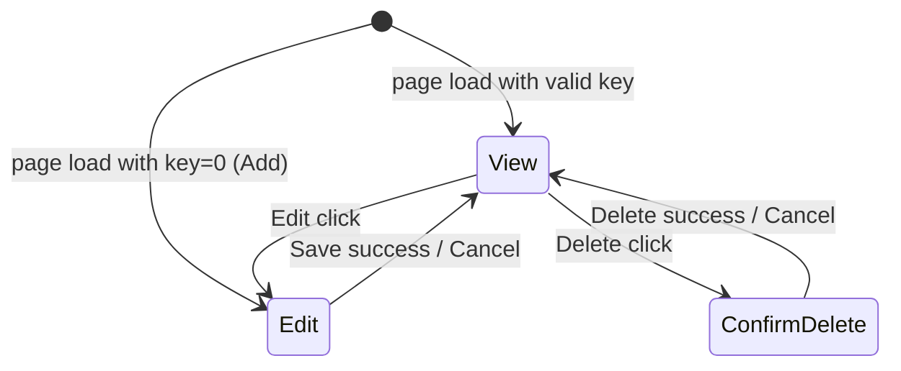

# state-machine.md Template

Maps the UI states the block can be in and the transitions between them. The point is to reveal hidden states that the parity table flattens into a list of methods.

This template is a skeleton. Use it for blocks with multiple modes or non-trivial show/hide logic; collapse to a stub for genuinely linear blocks.

---

## Output location

`/working/{block-name-kebab}/state-machine.md`

After the conversion ships, `/review-conversion` appends a `## Verification (review-conversion, ...)` section to this file recording per-state and per-transition audit verdicts. That section is review's territory — do not pre-populate it during convert-block phases.

---

## When to write a full state-machine.md

Always full when:
- Block has 3+ operating modes (view / edit / edit-attributes / modal-X / etc.)
- Visibility of major panels depends on more than one flag
- Modals open from within other modals
- A "wizard" or multi-step flow exists

Stub allowed when:
- Block has a single state (e.g., a list with no edit mode in-block)
- Block has only view ↔ edit and the transitions are trivial

A stub is one paragraph: "Block has two states, view and edit; transitions are the standard Edit / Save / Cancel buttons. No additional state machine analysis needed."

---

## Body

### 1. State inventory

A flat list. One short paragraph per state covering:
- **Name**, what to call it (`View`, `Edit`, `EditAttributes`, `AddModal`, `ConfirmDelete`, etc.)
- **Trigger**, what puts the block into this state (page-load with no key, button click, modal open)
- **Visible chrome**, which panels / sections / controls are visible
- **Save semantics**, what action commits work in this state (or "no save" for read-only states)

### 2. Transitions

A table with three columns: From, To, Trigger. Every legal transition gets a row. Implicit transitions (e.g., page reload from Edit ⇒ View on save success) are explicit rows.

| From | To | Trigger |
|---|---|---|
| View | Edit | Edit button click |
| Edit | View | Save success |
| Edit | View | Cancel button click |
| View | ConfirmDelete | Delete button click |
| ConfirmDelete | View | Delete confirmed (after server delete) |
| ConfirmDelete | View | Cancel |

### 3. Optional: a Mermaid stateDiagram-v2

If the state machine has 4+ states or non-trivial transitions, include a `stateDiagram-v2` block. Single-page-friendly:

Skip the diagram if the table already conveys everything; redundant diagrams age badly.

### 4. Hidden states (if any)

States that are easy to miss:
- "Loading" / pending states between async operations
- Error states that show notifications without changing the visible panel
- Read-only-because-IsSystem states that gate fields without a separate panel
- "Block invisible" states (block hides itself entirely if context is missing)

If these exist, they get rows in the table above and a paragraph here explaining why they're separate from the obvious states.

---

## What goes in /logic-graph.md instead

state-machine.md is about **states**. logic-graph.md is about **methods and how they call each other**. State transitions invoke methods (e.g., `Edit click → ShowEdit() → BindEditPanel()`); the state machine names the transition, the logic graph maps the call chain.

If a transition triggers a chain of 5+ method calls, mention the chain briefly here and detail it in `logic-graph.md`.
