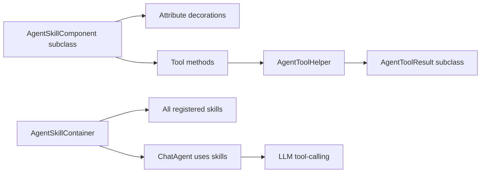

# Agent Skills Authoring

## Overview

An Agent Skill is a domain-grouped bundle of tools the LLM can invoke through Rock's ChatAgent. A `AgentSkillComponent` subclass declares the skill name, purpose, and discoverable tools (methods decorated with the agent annotations). When a chat session activates a skill, the agent infrastructure exposes the skill's tools to the LLM, which calls them like function tools and receives structured `AgentToolResult` responses. Skills are the primary extension point for "let the agent do this kind of work."

The AI subsystem is moving fast (per the deprecation work in commits `f950ad5dfe`, `a374159b01` from April 2026); this doc captures the current authoring shape but expect the API to evolve.

## Why It Exists

Raw LLM tool-calling against Rock data would force per-tool integration with security, context, pagination, and result shaping. The skill abstraction solves these once: the AgentSkillComponent gets the request context (current Person, page entities, security gates), the AgentToolHelper provides pagination and result formatting, the Result types give the chat UI consistent rendering. Authors write tool methods; the infrastructure does the rest.

## Mental Model



A skill class has decorated methods. The container registers; the agent exposes them; the LLM invokes by name; the methods return Result types that the chat surface renders.

## What You Need to Know

**Subclass `AgentSkillComponent`.** Standard component pattern; one class per skill.

**Decorate the class with `[AgentSkillNameAttribute]` and `[AgentPurposeAttribute]`.** The skill name is what the agent uses to address the skill; purpose tells the LLM what the skill is for.

**Methods are the tools.** Each method becomes a tool the LLM can invoke. Decorate with `[AgentToolNameAttribute]`.

**`[AgentToolPreambleAttribute]` on a tool describes the tool to the LLM.** A short description of what the tool does and when to use it.

**`[AgentToolPrerequisiteAttribute]` declares prerequisites.** "This tool requires the agent to have called X first." Helps the LLM compose multi-step calls.

**`[AgentUsageAttribute]` describes parameters.** Tells the LLM what each parameter is for. Decorates the method or its parameters.

**`[AgentGuardrailAttribute]` enforces safety.** Per-tool guardrails: rate limits, parameter validation, security checks.

**Return `AgentToolResult` subclasses.** Don't return free-form strings. The Result type system is what makes the chat UI render consistently across tools.

**Use `AgentToolHelper` for pagination.** Cursor-based pagination since `7db0e22828` (2026-02-11). Helper methods construct paginated results, summary results, etc.

**Custom Result types extend `AgentToolResult`.** For domain-specific shapes (a custom analytics result, a deployment-specific entity result), subclass.

**Tool calls run with the request context.** `AgentRequestContext` provides current Person, page entities (`ContextAnchor`), and security state. Tools should respect security explicitly.

**Per-tool security checks.** A tool that returns financial data should consult `IsAuthorized` on the relevant entities before returning. Don't rely on agent-level security alone.

**Skills are registered via `AgentSkillContainer`.** Standard container pattern. Subclass + register; agents auto-discover.

**Tool results should be small.** LLM context windows are bounded. Helper methods enforce reasonable result sizes; large results trigger summarization or pagination.

**`AgentToolResult` is auto-converted to NoData.** Per `d0fbc3e5da` (2026-03-27), the AgentToolResult Lava filter automatically creates a NoData result when appropriate. Custom code returning empty data sets benefits.

## Common Scenarios

**"Build a custom 'Get Recent Visitors' skill."**

```csharp
[AgentSkillName( "RecentVisitors" )]
[AgentPurpose( "Find recent church visitors and their information." )]
public class RecentVisitorsSkill : AgentSkillComponent
{
    [AgentToolName( "GetRecentVisitors" )]
    [AgentToolPreamble( "Returns visitors from the past N days." )]
    public PaginatedResult<PersonResult> GetRecentVisitors(
        [AgentUsage("Number of days to look back")] int days,
        [AgentUsage("Max results")] int? limit = 50 )
    {
        // ... query Persons, return paginated result ...
    }
}
```

Register; agent picks up.

**"Add a custom Result type for a domain-specific entity."**

```csharp
public class SermonResult : EntityResultBase
{
    public string Speaker { get; set; }
    public DateTime PreachedDate { get; set; }
}
```

Use in tool method return types.

**"Validate a parameter."** Use `[AgentGuardrailAttribute]` or in-method validation. Throw if invalid.

**"Check security on a tool."** Inside the method, consult `IsAuthorized` against the entity. Return forbidden / empty if not authorized.

**"Use cursor pagination."** Use `AgentToolHelper.PaginatedResult` factory methods. Pass the cursor; receive the next page.

**"Test a custom skill."** Mock the request context; instantiate the skill; call the method; assert the Result.

## Key Architectural Decisions

### Skills as classes, tools as decorated methods

Familiar C# shape; reflection-based discovery. Cheap authoring path.

### Annotation-based metadata

Compile-time-checked, IDE-discoverable. Each annotation has a clear purpose.

### Structured Result types

Free-form text would lose Lava and chat-UI rendering. Structured types are the right contract.

### `AgentToolHelper` for pagination

Helper enforces consistent shape. Authors don't reinvent pagination per tool.

### Per-tool security checks

Authors must explicitly check; agent-level security is insufficient for fine-grained data.

## Considered but Rejected

### Free-form text Results

Rejected. Loss of structured rendering.

### Single skill class for all tools

Rejected. Domain-grouped skills match the LLM's mental model better.

### Auto-derived security from method visibility

Rejected. Authors must consciously consider security per tool.

## Technical Reference

### Class

`AgentSkillComponent` ([Rock/AI/Agent/AgentSkillComponent.cs](../../Rock/AI/Agent/AgentSkillComponent.cs)): the base.

### Annotations

`Rock/AI/Agent/Annotations/`:
- `AgentPurposeAttribute`, `AgentSkillNameAttribute`
- `AgentToolNameAttribute`, `AgentToolPreambleAttribute`, `AgentToolPrerequisiteAttribute`, `AgentToolReturnDescriptionAttribute`, `AgentToolExampleAttribute`
- `AgentUsageAttribute`
- `AgentGuardrailAttribute`
- `JsonIgnoreAgentTypeAttribute`, `JsonIgnoreAudienceTypeAttribute`

### Helper

`AgentToolHelper` ([Rock/AI/Agent/AgentToolHelper.cs](../../Rock/AI/Agent/AgentToolHelper.cs)): pagination, summarization, NoData helpers. Cursor-based pagination since `7db0e22828`.

### Result Types

`Rock/AI/Agent/Classes/Common/`: `PaginatedResult`, `SummaryResult`, `KeyNameResult`.
`Rock/AI/Agent/Classes/Entity/`: PersonResult, GroupResult, FinancialAccountResult, etc.

### Container

`AgentSkillContainer` ([Rock/AI/Agent/AgentSkillContainer.cs](../../Rock/AI/Agent/AgentSkillContainer.cs)): standard component container.

### Affected Blocks

- **Admin:** AI Agent Detail / List, AI Skill Configuration.
- **Operational:** Chat block (consumes skills).

### Related Docs

- [docs/ai/ai-overview.md](ai-overview.md)
- [docs/ai/mcp-integration.md](mcp-integration.md)
- [docs/lava/writing-filters.md](../lava/writing-filters.md) for Lava integration via the AgentToolResult filter.

## Recent Impactful Changes

- **2026-04-16** ([commit `f950ad5dfe`](https://github.com/SparkDevNetwork/Rock/commit/f950ad5dfe)). Initial work on deprecating the legacy AI code/pattern.
- **2026-04-10** ([commit `23dc466a00`](https://github.com/SparkDevNetwork/Rock/commit/23dc466a00)). Auto-summarize threshold raised from 2,000 to 60,000 tokens.
- **2026-03-27** ([commit `d0fbc3e5da`](https://github.com/SparkDevNetwork/Rock/commit/d0fbc3e5da)). AgentToolResult Lava filter automatically creates NoData result when appropriate.
- **2026-02-11** ([commit `7db0e22828`](https://github.com/SparkDevNetwork/Rock/commit/7db0e22828)). Agent AI logic switched to cursor-based pagination.
