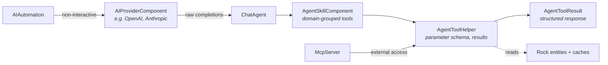

# AI Domain Overview

## Overview

AI in Rock is a relatively new and active subsystem with three layers: a **Provider** abstraction (`AIProviderComponent` / `AIProviderContainer`) over external LLM services, an **Agent** infrastructure (`ChatAgent`, `AgentSkillComponent`, `AgentToolHelper`) that wraps providers with tool-calling, skill discovery, and per-request context, and an **Automations** layer (`AIAutomation`, prayer-request analyzer/formatter) that runs AI tasks against Rock data without an interactive chat. An MCP (Model Context Protocol) integration is in active development for both inbound (external clients calling Rock) and outbound (Rock acting as MCP host).

The legacy AI provider/component pattern is being deprecated in favor of the new ChatAgent-based approach. This domain is moving fast.

## Why It Exists

Church staff time is the scarcest resource. AI in Rock targets specific pain points: drafting prayer-request follow-ups, summarizing communications, extracting data from natural-language requests, and (via the voice agent + MCP) querying Rock through conversation. The Agent infrastructure exists because raw LLM calls are not enough; tool-calling needs Rock context (the calling user, page entities, security), result objects need to be structured (so Lava and the chat UI can render them), and skill components need to be discoverable so administrators can configure agents without code changes.

The MCP work (added 2026-03-12 onward) addresses a parallel use case: external systems and assistants need a structured way to query Rock. Rather than build a new API surface for every AI consumer, MCP exposes Rock's capabilities through a standard protocol.

The cursor-based pagination work (`7db0e22828`, 2026-02-11) and the auto-summarize threshold change (`23dc466a00`, 2026-04-10, from 2,000 to 60,000 tokens) are both about scaling agents to real-world conversation lengths and dataset sizes without context-window failures.

## Mental Model

Three layers, each with its own pluggability:

A `ChatAgent` has a configuration (provider, model, system prompt, available skills), one or more `AgentSkillComponent` instances (Person skill, Group skill, Finance skill), and each skill exposes tools that resolve to `AgentToolHelper` calls. Tools return `AgentToolResult` objects, which are structured (PersonResult, GroupResult, etc.) so the chat UI and Lava integrations can render them consistently.

`AIAutomation` is the parallel non-interactive surface: a prayer-request analyzer runs each new prayer request through an AI flow to extract topics or generate a follow-up draft, without a chat session.

MCP is the external-protocol layer. Rock can act as an MCP server (exposing Rock data and actions to external assistants) and ships with public-MCP support for anonymous read access where appropriate.

## What You Need to Know

**The AI subsystem is moving fast.** Recent commits include "Initial work on deprecating the old AI code/pattern" (`f950ad5dfe`, 2026-04-16) and "Initial deprecation work, mark AI Provider as obsolete" (`a374159b01`, 2026-04-14). Code targeting `AIProviderComponent` directly should plan to migrate to the ChatAgent + Skill model.

**Tool results are structured, not free-form text.** `AgentToolResult` and the Result subclasses (PersonResult, GroupResult, FinancialAccountResult, etc.) are the convention. Free-form text responses lose the ability to render rich Rock-aware UI.

**Pagination is cursor-based.** Since `7db0e22828`, agent tools use cursor-based pagination instead of offset. The `AgentToolHelper` provides `PaginatedResult<T>` for tool implementations.

**Auto-summarize threshold is 60,000 tokens.** A chat that exceeds 60K tokens is automatically summarized to keep within model context windows. Custom agents that disable summarization risk failure on long conversations.

**Skill components register via attributes.** `[AgentPurposeAttribute]`, `[AgentSkillNameAttribute]`, `[AgentToolNameAttribute]`, `[AgentToolPreambleAttribute]`, `[AgentToolPrerequisiteAttribute]`, `[AgentUsageAttribute]`, `[AgentGuardrailAttribute]` decorate skills and tools so the agent infrastructure can discover and constrain them.

**MCP support is in flight.** Public MCP endpoint added `48ce4ec53d`, public MCP for REST endpoints added `60ebae0c18`, OAuth/CIMD/DCR support `f0917ef979` and follow-ups (2026-04). The voice agent (`f20c13ad67`) drove much of the MCP rollout. Custom MCP integrations should expect the API surface to evolve.

**Automations run independently of chat.** `AIAutomation` rows configure non-interactive AI tasks. The Prayer Request Analyzer/Formatter are the canonical examples; new automations follow the same pattern.

**Lava integration via `AgentToolResult` filter.** The AI Agent Lava filter (`LavaFilters.AIAgent.cs`) plus updates like `d0fbc3e5da` (auto NoData result) integrate agent tooling into Lava templates.

**Old AI code is obsolete but still present.** The deprecation is staged. New work should target the ChatAgent/Skill model; touching the old `AIProviderComponent` code should migrate it.

## Common Scenarios

**"Build a chat assistant that can answer questions about Rock data."** Configure a ChatAgent with the relevant skills (Person, Group, Finance). The agent's tool-calling layer resolves user questions through the registered tools.

**"Analyze each new Prayer Request for sentiment / topic / urgency."** Configure an AIAutomation referencing the prayer-request analyzer. Each save triggers analysis; results are stored as attribute values or used to launch workflows.

**"Expose Rock data to an external AI assistant via MCP."** Configure an MCP server endpoint with the appropriate scopes. Public read access uses anonymous MCP; authenticated access uses OAuth/CIMD/DCR (added 2026-04).

**"Add a custom Agent Skill."** Implement `AgentSkillComponent`. Decorate methods with the attribute set for discovery and guardrails. Skill registration is automatic via the container.

**"Use an Agent tool from Lava."** The AgentToolResult Lava filter resolves a tool call inside a template; pagination, error handling, and structured rendering happen via the Result types.

## Key Architectural Decisions

### Provider abstraction

Multiple LLM providers exist (OpenAI, Anthropic, etc.). Abstracting at the provider layer lets administrators swap providers without changing skill code.

### Agent + Skill + Tool layering

Tool calls need Rock context (current user, security, page entities); raw LLM tool-use does not. The Agent + Skill layer wraps the provider with the structure tools need.

### Structured Result types

`AgentToolResult` subclasses (`PersonResult`, `GroupResult`, etc.) keep tool outputs renderable in Lava, the chat UI, and the mobile shell without custom adapters per consumer.

### Cursor-based pagination over offset

For large datasets, offset pagination produces inconsistent windows; cursor pagination is stable across edits. The agent tools use cursors.

### Deprecating the legacy AI pattern

The original `AIProviderComponent` model did not have the structure needed for tool-calling and result rendering. Rather than retrofit, the team chose to build a new pattern alongside and migrate.

## Considered but Rejected

### Free-form text tool results

Rejected. Without structure, Lava and the chat UI cannot render results consistently.

### Provider-specific agent code

Rejected. The provider abstraction lets agents be portable.

### Synchronous AI calls in save hooks

Rejected. AI calls are too slow and unreliable to put in the synchronous save path. Automations run asynchronously after the save commits.

## Technical Reference

### Major Components

| Class / Concept | Purpose |
|---|---|
| `AIProviderComponent`, `AIProviderContainer` | Legacy provider abstraction (being deprecated). |
| `ChatAgent`, `ChatAgentBuilder`, `ChatAgentOptions` | New agent runtime. |
| `AgentProviderComponent`, `AgentProviderContainer` | New provider abstraction for the agent runtime. |
| `AgentSkillComponent`, `AgentSkillContainer` | Skill registration. |
| `AgentToolHelper`, `AgentTool`, `AgentToolResult` | Tool plumbing and result shape. |
| `AgentRequestContext`, `AgentRequestContextExtensions` | Per-request context (user, page, transient anchors). |
| `Annotations/Agent*Attribute` | Discovery and guardrail attributes for skills and tools. |
| `AIAutomation`, `PrayerRequestAnalyzerResponse`, `PrayerRequestFormatterResponse` | Non-interactive automation surface. |
| `IMcpServer`, `McpAgentSettings`, `McpRequest`, `McpResponse` | MCP integration. |
| `LavaFilters.AIAgent.cs` | Lava integration. |

### Result Types

`Rock/AI/Agent/Classes/Entity/` holds the Result subclasses: PersonResult, GroupResult, GroupTypeResult, GroupMemberResult, FinancialAccountResult, FinancialTransactionResult, FinancialTransactionRefundLinkResult, NoteResult, NoteTypeResult, PrayerRequestResult, PersonalDeviceResult, PhoneNumberResult, ReminderResult, ReminderTypeResult, AttributeResult, AttributeValueResult, CampusResult, CategoryResult, DefinedValueResult, SystemPhoneNumberResult, CampusScheduleResult, CampusTeamMemberResult, LocationResult, FinancialAccountTransactionResult.

`Rock/AI/Agent/Classes/Common/` holds shared shapes: PaginatedResult, SummaryResult, KeyNameResult, SetOrClear, ToolResultContent.

### Affected Blocks and UI Surfaces

- **Chat:** Chat block (mobile + web), AI Voice Agent (mobile, MCP-driven).
- **Admin:** AI Provider Detail/List, AI Agent Detail/List, AI Automation Detail/List, MCP Server List/Detail.
- **Prayer:** Prayer Request analysis/formatting integrations.
- **Lava:** AI Agent Lava filter.

### Extension Points

- **Custom Agent Skills.** Implement `AgentSkillComponent`, decorate with attributes.
- **Custom Provider components.** Implement `AgentProviderComponent`.
- **Custom Automations.** Implement an automation handler; configure as `AIAutomation`.
- **Custom Tool Result types.** Inherit from `AgentToolResult` for new structured outputs.

### File Index

- `Rock/AI/` (provider, agent, automations)
- `Rock.AI.Agent/` (separate project for the new agent runtime)
- `Rock.AI.OpenAI/` (OpenAI provider implementation)
- `Rock/Lava/Filters/LavaFilters.AIAgent.cs` (Lava integration)

## Recent Impactful Changes

The AI subsystem's churn is in `-` (minor) commits, not release-note `+ (AI)` commits, because most work is implementation iteration on a new feature rather than user-facing change announcements. Highlights from the period:

- **2026-04-16** ([commit `f950ad5dfe`](https://github.com/SparkDevNetwork/Rock/commit/f950ad5dfe)). Initial work on deprecating the legacy AI code pattern.
- **2026-04-14** ([commit `a374159b01`](https://github.com/SparkDevNetwork/Rock/commit/a374159b01)). Marked `AIProviderComponent` as obsolete; new code should target the ChatAgent + Skill model.
- **2026-04-10** ([commit `23dc466a00`](https://github.com/SparkDevNetwork/Rock/commit/23dc466a00)). Auto-summarize threshold raised from 2,000 to 60,000 tokens.
- **2026-03-17** ([commit `f20c13ad67`](https://github.com/SparkDevNetwork/Rock/commit/f20c13ad67)). AI Voice Agent enabling administrator interaction with Rock through voice via MCP.
- **2026-02-11** ([commit `7db0e22828`](https://github.com/SparkDevNetwork/Rock/commit/7db0e22828)). Agent AI logic switched to cursor-based pagination.
