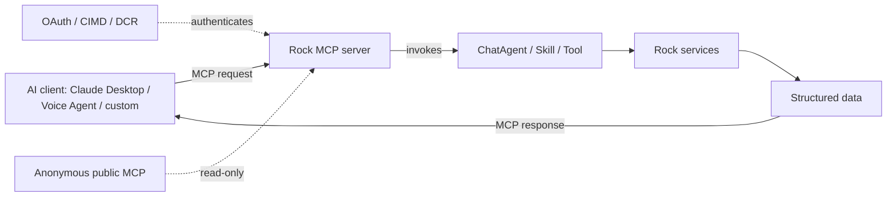

# MCP Integration

## Overview

MCP (Model Context Protocol) is the standard protocol for AI assistants to query and act on external systems. Rock acts as an MCP server, exposing data and capabilities to external AI clients (Claude desktop, custom integrations, voice agents). The MCP integration was added in 2026 (initial commit `f20c13ad67`, 2026-03-17, the AI Voice Agent), with iterative additions for public access (`48ce4ec53d`), REST endpoint support (`60ebae0c18`), and OAuth/CIMD/DCR registration (`f0917ef979`). The work is in active development; expect API evolution.

## Why It Exists

External AI clients want structured access to Rock data and actions: an admin's Claude desktop wanting to ask "show me last week's giving"; a voice assistant taking attendance via voice commands; a custom integration plugging into the church's AI strategy. Building a custom REST API for each AI consumer would multiply the surface area; MCP gives them a standard protocol Rock implements once.

The voice agent work (`f20c13ad67`) drove much of the MCP rollout: a voice-driven UI requires fast, structured access to data and actions, and MCP is the right shape. Subsequent commits expanded coverage (REST endpoints exposed via MCP, public anonymous access, OAuth-based authenticated access).

## Mental Model

External clients connect via MCP. The Rock MCP server resolves to ChatAgent / Skill / Tool execution, runs through Rock services, returns structured responses. Authentication varies: OAuth for full access, public anonymous for read-only / public-data scenarios.

## What You Need to Know

**MCP is in active development.** The API surface is evolving. Custom MCP integrations should expect breaking changes between Rock versions until the surface stabilizes.

**Public MCP endpoint exists.** Per `48ce4ec53d` (2026-03-18), Rock exposes a public anonymous MCP endpoint. Useful for read-only public-data scenarios. Configurable scope; do NOT expose sensitive data through it.

**Public MCP for REST endpoints.** Per `60ebae0c18` (2026-03-12), Rock REST endpoints can be exposed via MCP. The same authentication / authorization as the underlying REST endpoints applies.

**OAuth / CIMD / DCR for authenticated MCP.** Per `f0917ef979` (2026-04-27), Dynamic Client Registration (DCR) and CIMD (Cross-Instance Model Distribution) registration support OAuth-based MCP clients. The standard OAuth flow authenticates; the resulting tokens scope access.

**`mcp:invoke` OAuth scope.** Per `1fee2605c0` (2026-04-27), a new OAuth scope authorizes MCP clients. Sites configuring OAuth must include this scope for MCP-aware clients.

**MCP wraps the ChatAgent + Skill infrastructure.** Same agent runtime, different transport. Skills authored for the chat surface work for MCP automatically.

**Voice Agent uses MCP.** Per `f20c13ad67` (2026-03-17), the AI Voice Agent that lets administrators interact with Rock via voice runs through MCP. Same skills; voice-specific UX layer.

**Authentication validation matters.** Per `34821e8647` (2026-04-27), CIMD MCP client validation during token exchange was fixed. Custom MCP integrations should verify against the latest fixes.

**API key handling on the MCP Server List block.** Per `a361af2fee` (2026-04-29), an "Append API Key to URL" block setting controls whether the API key is included in the displayed MCP URL. Default off; useful for security demos.

**Custom MCP servers via `IMcpServer`.** The interface is the extension point for deployments that want different MCP server behavior (custom skill set, custom authentication, custom routing).

**Tool calls run with MCP request context.** Same security and context as in-Rock chat agent invocations; the MCP transport carries authentication and request metadata.

## Common Scenarios

**"Connect Claude Desktop to Rock."** Configure OAuth client in Rock with the `mcp:invoke` scope. Claude Desktop's MCP configuration points at the Rock MCP endpoint with the OAuth credentials. Skills become tools.

**"Expose a public read-only endpoint via MCP."** Configure an anonymous MCP endpoint scoped to a specific skill set (e.g., upcoming events, public sermons). External anonymous clients access without authentication.

**"Use the Voice Agent."** Mobile shell exposes voice-activation; voice transcription becomes MCP tool calls. The agent runs through skills and returns spoken responses.

**"Custom integration with an AI workflow tool."** OAuth client + MCP endpoint. The integration calls Rock tools as part of its flow.

**"Audit MCP usage."** Standard interaction logging; MCP requests get logged. Reports query for tool invocations per client.

**"Verify CIMD client registration."** Per `34821e8647`, CIMD validation during token exchange is correct. Test with the relevant client.

## Key Architectural Decisions

### MCP as the standard

Industry-standard protocol; building Rock as an MCP server lets any MCP client interoperate.

### Reuse ChatAgent + Skill infrastructure

MCP wraps the existing infrastructure. Skill authors don't need to know about MCP specifically.

### OAuth + CIMD + DCR for authentication

Standard OAuth flows; CIMD and DCR support modern AI client patterns (dynamically-registered clients with cross-instance trust).

### Public anonymous MCP for read-only scenarios

Lowers integration friction for public-data use cases.

### Configurable API key visibility

Operational security; admins control whether API keys appear in displayed URLs.

## Considered but Rejected

### Custom Rock-specific protocol

Rejected. MCP is the industry standard.

### Auth-required for all MCP

Rejected. Public read-only scenarios benefit from anonymous access.

### Single MCP endpoint for all clients

Rejected. Different scopes / capabilities per client require flexible endpoint configuration.

## Technical Reference

### Interface

`IMcpServer` ([Rock/AI/Agent/Mcp/IMcpServer.cs](../../Rock/AI/Agent/Mcp/IMcpServer.cs)): the extension point.

### Settings

`McpAgentSettings` ([Rock/AI/Agent/Mcp/McpAgentSettings.cs](../../Rock/AI/Agent/Mcp/McpAgentSettings.cs)): per-server configuration.

### Request / Response

`McpRequest`, `McpResponse` in `Rock/AI/Agent/Mcp/`: the protocol shapes.

### OAuth Scope

`mcp:invoke` (since `1fee2605c0`): the standard scope for MCP clients.

### Affected Blocks

- **Admin:** MCP Server List/Detail, OAuth client configuration.
- **Voice Agent:** mobile shell consumes via MCP.

### Related Docs

- [docs/ai/ai-overview.md](ai-overview.md)
- [docs/ai/agent-skills-authoring.md](agent-skills-authoring.md) for skill authoring (MCP and chat both consume skills).

## Recent Impactful Changes

- **2026-04-29** ([commit `a361af2fee`](https://github.com/SparkDevNetwork/Rock/commit/a361af2fee)). MCP Server List block: "Append API Key to URL" setting (default off).
- **2026-04-27** ([commits `f0917ef979`, `1fee2605c0`, `34821e8647`](https://github.com/SparkDevNetwork/Rock/commit/f0917ef979)). DCR and CIMD registration for MCP clients via OAuth; new `mcp:invoke` OAuth scope; CIMD client validation during token exchange fixed.
- **2026-03-18** ([commit `48ce4ec53d`](https://github.com/SparkDevNetwork/Rock/commit/48ce4ec53d)). Public anonymous MCP endpoint.
- **2026-03-17** ([commit `f20c13ad67`](https://github.com/SparkDevNetwork/Rock/commit/f20c13ad67)). AI Voice Agent enabling voice interaction with Rock via MCP.
- **2026-03-12** ([commit `60ebae0c18`](https://github.com/SparkDevNetwork/Rock/commit/60ebae0c18)). Public MCP support for REST endpoints.
