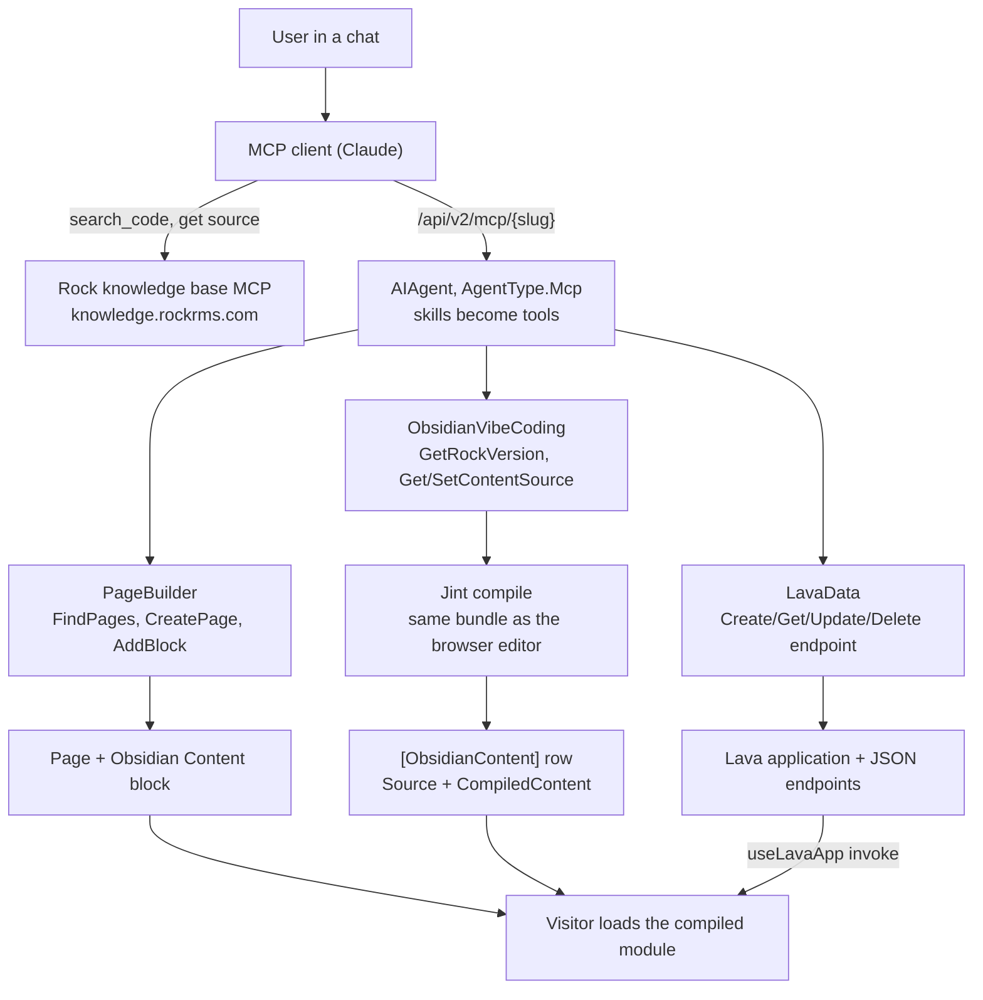

# Vibe Coding Architecture

> **Prototype, not in `develop`.** Everything here lives on `feature-kh-obsidian-content`. The `DeleteLavaEndpoint` and `DeleteLavaApplication` tools, template linting, and the `testParameters` argument were uncommitted working-tree changes when this doc was written.

## Overview

Vibe coding is Rock hosting an AI agent that builds custom UI inside Rock, from a chat, with no repository file and no Rock build. A user says "build me a serving dashboard"; an external MCP client (Claude) creates a page, drops one block on it, writes a Lava endpoint for the data, writes a Vue component, and saves it. Rock compiles the component server side and stores it. Every visitor to that page then loads a precompiled, framework-native Obsidian component.

This doc is the architectural view: the agent, the skills it carries, what it has to reach outside Rock for, and the four pieces of Rock infrastructure the feature added (a table, a block, a client helper, and an in-process JavaScript engine). For the step-by-step authoring flow and the compiler internals, see [Obsidian Content](../cms/obsidian-content.md).

## Why It Exists

Two capabilities already existed and had not been connected. Rock was already an MCP server: agents expose skills as tools at `/api/v2/mcp/{slug}`, and the ChatAgent and skill runtime is a transport-agnostic execution layer. Separately, the Obsidian Content block could already turn author-written Vue into a live component with no build step.

The gap was who could use the second one. It required a human who could open an editor, know which of Rock's 275 Obsidian controls exist, know which API returns the data, and hand-write correct Vue. That is exactly the work an AI client is good at, and exactly what MCP was added to enable. Connecting them turns "an admin who can code Vue" into "any admin who can describe what they want."

The payoff is disproportionate to the new surface because the hard rendering problem was already solved. Most of this project is discovery (teaching the client what Rock offers) and orchestration (letting the client create and fill a block), not new rendering technology.

## Mental Model

**Rock is the MCP server, not the AI.** There is no model running inside Rock here. The intelligence is the external client; Rock's contribution is a set of tools with honest descriptions, real authorization, and feedback loops that fail loudly. When you are reasoning about this feature, picture Rock as a well-documented API surface being driven by something smarter than itself, and ask what that surface does when the caller is wrong.

**The agent is a database record, not a class.** An `AIAgent` row with `AgentType.Mcp` is the MCP server. Its `Slug` becomes the endpoint URL, its `Instructions` become the text sent on MCP `initialize`, and the skills attached to it become the tool list. An administrator assembles this in the Rock UI. Nothing in the codebase names a "vibe agent"; the skills exist in core and an admin decides which agent carries them.

**Three skills that compose by handing off identifiers.** PageBuilder makes somewhere for content to live and returns a block `IdKey`. ObsidianVibeCoding writes source against that `IdKey`. LavaData makes endpoints the source calls by slug. Each skill is independently useful and they chain because the output of one is the input of the next.

**Discovery was split: replaced for data, delegated for controls.** Finding an existing REST endpoint that returns the right shape is a bad-shaped problem, so the feature deleted it rather than solving it, by having the agent write a Lava endpoint that returns exactly what the component renders. Finding the right Obsidian control is a genuine search problem, so it is delegated to the Rock knowledge base, a second MCP server that already indexes every control's source.

**The trust boundary is authoring, not execution.** Authored code runs in the visitor's browser as the visitor, with their cookie and their permissions. Nothing sandboxes it. That is why every write tool is administrator-gated: you control who writes the code, because the code inherits whoever views it.

## What You Need to Know

**Authored code is not sandboxed, and it runs as the visitor.** It can call anything the viewing person could call from their browser console, and nothing more. The security model is entirely at the authoring gate. Treat `SetContentSource` as equivalent to giving someone script access to that page.

**A newly created Lava application has no security rules.** `LavaApplication` deliberately breaks security inheritance, so an endpoint the agent just created is governed by nothing until an administrator adds rules. Combined with the point above, this means anything built this way needs one pass viewed as a non-admin before you trust it. Data that looked fine while you and the agent tested as an administrator can be empty or over-shared for a member.

**Test execution is not a dry run.** `CreateLavaEndpoint` and `UpdateLavaEndpoint` render the template and return the output, which is the feature that lets the agent find its own broken Lava. But a template containing `modifyentity` or `deleteentity` commands performs real writes during that test, and those writes lack the acting person's attribution. Keep diagnostic templates read only.

**Version-scope every knowledge base lookup.** The knowledge base is scoped per Rock release. An unscoped query answers for whatever release that service treats as current, which is the wrong answer for any church not on it. `GetRockVersion` exists solely to feed those lookups. The failure this prevents is the nastiest kind: a prop that exists in the docs, does not exist on this instance, and surfaces much later as a compile error.

**Control discovery is composition across two MCP servers, not an integration.** Rock cannot see, verify, or version-check the knowledge base's tools. The skill instructions name tools that only resolve when the client has both servers connected. When it is unavailable the instructions require the agent to say so and ask, because the alternative failure mode is an agent inventing control props from a control's name, which produces components that compile and then render wrong.

**A failed compile stores nothing.** `SetContentSource` returns the compiler's error text and writes no row. This is deliberate: a saved-but-blank block with no error anywhere was the exact failure this feature exists to kill. The one exception is a half-deployed instance whose compiler bundle is missing, where source is saved and the tool says plainly that the content will not render until an administrator saves from the editor.

**Authored source is plain JavaScript, not TypeScript.** `lang="ts"` is not supported. Adapting an existing repo `.obs` file means stripping the attribute and every type annotation. Imports must also be plain top-level forms, because the compiler extracts them with a regex rather than a real parser.

**`@Obsidian/ViewModels/*` is not importable.** The alias map at [Rock.JavaScript.Obsidian/System/core.ts:37](../../Rock.JavaScript.Obsidian/System/core.ts:37) defines what resolves at runtime. Repo blocks import view models as TypeScript types, which vanish at compile time, so nothing ever requests them from the loader. Authored code has no compile step that erases types, so an import of one is a runtime failure.

**Jint can still take down the worker process.** The compile runs on a dedicated thread with a 16 MB stack because a `StackOverflowException` cannot be caught in .NET and would terminate every request on the site, not just the one save. That is a mitigation with roughly eighteen times the measured margin, not a proof. See the Jint section below before you change anything about how the compiler is invoked.

## Common Scenarios

**"Stand up a new dashboard from chat."** `FindPages` to confirm the parent, `CreatePage` with a kebab-case `route`, `AddBlock` with the `Obsidian Content Detail` block type. Keep the returned `IdKey`. `GetRockVersion`, then knowledge base lookups for the controls. `CreateLavaEndpoint` for each data shape, all sharing one `applicationSlug`. `SetContentSource` with the block `IdKey` and the source.

**"Iterate on something the agent already built."** `GetContentSource` to read the current source, then `SetContentSource` to replace it. Repeated saves overwrite; there is no version history. Endpoints are corrected with `UpdateLavaEndpoint` rather than by sending the user to the admin pages.

**"Give the component data."** Write a Lava endpoint rather than hunting for a REST one. In the component, `useLavaApp("application-slug")` once, then `lavaApp.invoke("endpoint-slug")`. Never hand-roll the URL, the CSRF header, or the JSON parsing, because [lavaApp.ts](../../Rock.JavaScript.Obsidian/Framework/Utility/lavaApp.ts) ships as framework code and a fix there reaches components already compiled and stored in the database. Values sent by `invoke` arrive under the `Body` merge field for POST and `QueryString` for GET, never as bare merge fields.

**"Clean up after an experiment."** `DeleteLavaEndpoint` and `DeleteLavaApplication` only accept records the skill itself created, identified by a `ForeignKey` provenance stamp. Anything a person authored through the admin pages is refused.

**"Audit what the agent built."** Query `[ObsidianContent]` joined to `[Block]` and `[Page]` for authored components. Lava applications and endpoints carrying `ForeignKey = 'AI-Agent:LavaDataSkill'` are the agent's work.

## Key Architectural Decisions

### Ride the existing MCP endpoint and skill runtime

No new transport, controller, or authentication path. Authoring is just more tools on the surface that already carries authenticated, per-person requests and already maps skills to tools. A separate transport would duplicate auth, logging, and context handling for no benefit.

### Write Lava instead of discovering REST endpoints

From the engineering note on [LavaDataSkill.cs](../../Rock/AI/Agent/LavaDataSkill.cs): hunting for an existing REST endpoint "is the worst-shaped step in that flow: Rock has hundreds of endpoints, almost none return the shape a specific dashboard wants, and their permissions are separate from the page's. Writing Lava avoids all three." This replaced the hardest unbuilt step in the original design rather than solving it.

### Test-execute on every endpoint write

The tool renders the template and returns the result so the agent finds out the Lava is broken while it can still fix it, rather than a visitor seeing Lava error text later. The same instinct drives server-side compile: put the error where the thing that can fix it is still listening.

### Delegate control discovery to the knowledge base

That service already indexes every `Framework/Controls/*.obs` file with a semantic description, a role classification, per-release version scoping, and a raw-source URL. That is the search-then-fetch shape an agent needs and is expensive to reproduce inside Rock. The agent reads `defineProps` and the JSDoc, which is the real API rather than documentation about the API.

### Compile on the server, with the browser's own bundle

There is exactly one compiler implementation, and it runs in two hosts. Same source always produces the same module. This reversed an earlier decision (see below) once it was clear that repo-less clients had no feedback loop at all.

### Gate writes on the existing block and page authorization

`SetContentSource` checks EDIT on the block, exactly as the block's own `SaveContent` action does. PageBuilder gates on ADMINISTRATE of the target page. LavaData gates on ADMINISTRATE of the Lava application. No tool invents a second authorization path, and every check uses `AgentRequestContext.CurrentPerson` rather than a service account.

### Guardrails as skill metadata, not code

Behavior the agent must follow lives in `[AgentUsage]` and `[AgentGuardrail]` attributes that become part of the tool description. The clarifying-question behavior, the version-scoping rule, and the "tell the user before using an internal control" rule are all instructions. Where a rule must actually hold, it is also enforced in code: requesting the `Sql` Lava command is refused outright without a `sqlJustification` argument.

## Considered but Rejected

### No server-side JavaScript engine (reversed)

The original design (spec 260722) rejected an in-process JS engine, on the grounds that Rock had deliberately removed one before (ReactJS.NET via JavaScriptEngineSwitcher) and that a client-compiles path plus a compile-on-view fallback covered the same ground. Reversed on 2026-08-06 by [commit `45e4995a86`](https://github.com/SparkDevNetwork/Rock/commit/45e4995a86). The client-compiles path only works for a client with a repo checkout and a Node toolchain, and the compile-on-view fallback was never built, so every other client saved source that silently never rendered.

### Compile on next administrator view

The planned fallback for clients that cannot compile. Never built, and no longer needed now that the server compiles. The bundle-missing path says so honestly rather than promising a compile that does not exist.

### A generated control manifest for discovery

The build already produces 249 `.d.ts` files under `dist/Framework/Controls/` carrying every prop, type, default, required flag, JSDoc, and slot list. Cleaner to parse than source, but not currently deployed. Kept as the escape hatch if the knowledge base dependency ever needs replacing. A second option exists and is already shipping: `RockWeb/Obsidian/Controls/*.obs.js.map` embeds complete original source for 242 of 248 controls, about 1.69 MB, readable off disk today with no build change.

### Accepting client-supplied compiled output with no validation

Rejected. A version-mismatched or structurally broken module would reach the store and fail to load for every visitor with no clear error. Client-supplied output is still accepted, but must carry a version string and match a `System.register` structural check.

### A brand-new MCP transport for authoring

Rejected. See the first architectural decision above.

### Exposing authoring tools to any authenticated user

Rejected. Authored code runs with the visitor's own permissions and can call any API they can. Only read-only tools such as `GetRockVersion` are ungated, and that one only because the Rock version is already visible to anonymous visitors in page markup and asset fingerprints.

## Technical Reference

### The Agent Record

There is no agent class. The MCP server is an `AIAgent` row ([Rock/Model/AI/AIAgent/AIAgent.cs](../../Rock/Model/AI/AIAgent/AIAgent.cs)) with `AgentType.Mcp`:

| Field | Role in this feature |
|---|---|
| `AgentType` | `Mcp` (1). Selects MCP server behavior over chat. |
| `Instructions` | Sent to the client on MCP `initialize`. Home for conversation-level behavior such as clarifying questions. |
| `AudienceType` | Passed through to tools on `AgentRequestContext`. |
| `AdditionalSettingsJson` | Deserializes to `McpAgentSettings`: the `Slug` that forms the endpoint URL, and `IsExcludingSystemSkills`. |
| `AIAgentSkills` | The attached skills, whose tool methods become the advertised tool list. |

Endpoint: `/api/v2/mcp/{slug}`, where the slug comes from [McpAgentSettings.cs:40](../../Rock/AI/Agent/Mcp/McpAgentSettings.cs:40). Authentication is the standard Rock MCP story (OAuth with the `mcp:invoke` scope, or an API key). See [MCP Integration](mcp-integration.md).

### Skills and Tools

All three skills are `internal` subclasses of `AgentSkillComponent` ([Rock/AI/Agent/AgentSkillComponent.cs:45](../../Rock/AI/Agent/AgentSkillComponent.cs:45)), each carrying an `[AgentSkillGuid]`, and each tool method carrying an `[AgentToolGuid]`. For the authoring pattern itself see [Agent Skills Authoring](agent-skills-authoring.md); this table is the inventory.

| Skill | Tool | Gate | Notes |
|---|---|---|---|
| PageBuilder | `FindPages` | View | Partial name match, so the agent can confirm the page with the user first. |
| PageBuilder | `CreatePage` | ADMINISTRATE of parent | Inherits parent layout, site, and zones. Copies parent authorization. Optional kebab-case `route`; publishes `PageRouteWasUpdatedMessage` or the friendly URL 404s until restart. |
| PageBuilder | `AddBlock` | ADMINISTRATE of page | Defaults to the `Main` zone. Returns the block `IdKey`, the handle everything downstream uses. |
| ObsidianVibeCoding | `GetRockVersion` | None | Ungated by design. Feeds knowledge base version scoping. |
| ObsidianVibeCoding | `GetContentSource` | EDIT of block | Returns `NoData` when nothing is authored yet. |
| ObsidianVibeCoding | `SetContentSource` | EDIT of block | Compiles when no `compiledContent` is supplied. Stores nothing on compile failure. |
| LavaData | `CreateLavaEndpoint` | ADMINISTRATE of application | Lints the template, test-executes it, stamps provenance. Sets `ContentType` to JSON. |
| LavaData | `GetLavaEndpoint` | ADMINISTRATE of application | Keyed by slug AND method. |
| LavaData | `UpdateLavaEndpoint` | ADMINISTRATE of application | Same lint and test-execute path as create. |
| LavaData | `DeleteLavaEndpoint` | ADMINISTRATE + provenance | Refuses anything not created by the skill. |
| LavaData | `DeleteLavaApplication` | ADMINISTRATE + provenance | Same. |

Skill GUIDs: ObsidianVibeCoding `647770A9-F3D7-4924-B046-5C9C43959ECB`, PageBuilder `EE27BE5A-1276-433F-A636-1BEF3550EC1E`, LavaData `8660E7C0-1101-4058-BAF5-20B860600027`.

**Provenance stamp.** [LavaDataSkill.cs:122](../../Rock/AI/Agent/LavaDataSkill.cs:122) defines `AgentProvenanceKey = "AI-Agent:LavaDataSkill"`, written to `ForeignKey` on every application and endpoint the skill creates. The delete tools accept only records carrying it. As the code comment puts it, that stamp "is the whole safety model: the skill can only unwind its own work, never something a person built through the admin pages."

**SQL gating.** Requesting the `Sql` Lava command is refused unless the caller also passes `sqlJustification`, which the guardrails permit only after telling the user why entity commands cannot do the job and getting explicit approval. The reason is per-row security: `` returns every row the query matches regardless of the viewing person's rights, while the entity commands filter by them automatically.

### Knowledge Base Dependency

The one part of the flow that reaches outside Rock. [knowledge.rockrms.com](https://knowledge.rockrms.com) indexes every `Rock.JavaScript.Obsidian/Framework/Controls/*.obs` file (currently 247 top-level controls plus 28 under `Internal/`).

The contract, encoded in `[AgentUsage]` attributes on `ObsidianVibeCodingSkill`:

1. Call `GetRockVersion` first and pass that version to every lookup.
2. `search_code` with `source_type: "obs"`, searching by concept ("person picker", "grid with columns") rather than by guessed filename.
3. Fetch the `file_url` on each result and read `defineProps`, `defineEmits`, slots, and JSDoc. That is the authoritative API.
4. Prefer a top-level control; say so before using one under `Controls/Internal/`.
5. If the knowledge base is unavailable, say so and ask. Do not guess props, and do not silently substitute plain HTML.

Filenames map directly onto import paths, so no lookup table is needed: `Framework/Controls/personPicker.obs` becomes `import PersonPicker from "@Obsidian/Controls/personPicker.obs"`.

Two boundaries are conventions rather than enforcement. `Controls/Internal/` does resolve at runtime (the alias map is a wildcard), and Rock cannot verify the knowledge base's tool names or parameters, so a change on that side goes stale silently with nothing in Rock catching it.

### Data Model

One table, one row per block placement. Created by [202607221200000_AddObsidianContent.cs](../../Rock.Migrations/Migrations/202607221200000_AddObsidianContent.cs).

| Column | Type | Why |
|---|---|---|
| `BlockId` | `int` null | Owning block placement, the `HtmlContent` pattern. Cascade delete. Null is reserved for a future shared library. |
| `Name` | `nvarchar(100)` | Unused today. For the future library. |
| `Source` | `nvarchar(max)` | The authored Vue. Source of truth for re-editing and for recompiling after a Rock upgrade. |
| `CompiledContent` | `nvarchar(max)` | The SystemJS module browsers actually load. |
| `CompiledVueVersion` | `nvarchar(50)` | Which Vue it was built against, so a post-upgrade recompile can be decided. |
| `CompiledDateTime` | `datetime` null | Stamped on save. |
| `IsActive` | `bit` | Unused today. For the future library. |

Plus the standard `Model<T>` columns. Entity at [ObsidianContent.cs:47](../../Rock/Model/CMS/ObsidianContent/ObsidianContent.cs:47), EntityType GUID `38F182A7-9FE4-4D7B-B483-59F615BDE41C`.

**The cascade is deliberate and unusual.** Rock's default is `WillCascadeOnDelete( false )`. The engineering note at [ObsidianContent.cs:190](../../Rock/Model/CMS/ObsidianContent/ObsidianContent.cs:190) explains the exception: "This is the rare parent-child ownership case: a per-instance record has no meaning once its owning block placement is gone." Future library records carry a null `BlockId` and are unaffected by any block deletion.

**Service surface** is two methods on [ObsidianContentService.cs:25](../../Rock/Model/CMS/ObsidianContent/ObsidianContentService.cs:25): `GetByBlockId` and `GetOrCreateByBlockId`. Both write paths (the block action and the MCP tool) go through the latter, so there is one upsert.

The migration also registers the block's EntityType explicitly before calling `AddOrUpdateEntityBlockType`, because EntityType registration normally happens at application startup, which runs after EF migrations. It uses the entity-based helper, not the path-based `UpdateBlockTypeByGuid`, which can delete entity-based block types.

### The Block

[ObsidianContentDetail.cs](../../Rock.Blocks/Cms/ObsidianContentDetail.cs), a `RockBlockType`. BlockType GUID `D4A5F720-493C-4DE8-B4B6-D6667D7ED2A2`, EntityType GUID `8C7E29E5-E2C5-4331-B7F7-06EF894E7316`. Web sites only.

One block, dropped on any page, resolving its single `ObsidianContent` row by its own `BlockId`. The whole security posture is in [GetObsidianBlockInitialization](../../Rock.Blocks/Cms/ObsidianContentDetail.cs:56): `CompiledContent` goes to every viewer, `Source` only when the person has EDIT. A plain visitor never receives the source. The `SaveContent` block action re-checks EDIT ([ObsidianContentDetail.cs:97](../../Rock.Blocks/Cms/ObsidianContentDetail.cs:97)) and is the browser editor's write path.

Rendering runs the stored module by hand: `viewPanel.partial.obs` supplies a fake `System` object to catch the registration, loads each dependency through Rock's real loader, executes it, and mounts the result. It does not load a URL because Rock's loader appends `.js` and `?fingerprint` to any path, which a `blob:` URL cannot carry. No compiler is involved in rendering, which is the point: the compiler and its `eval` only ever load in the admin edit path.

**Known gotcha.** The authored component mounts inside the host block's tree, so `useInvokeBlockAction()` resolves and points at the host block's `SaveContent`. That action re-checks permissions server side, so it is not an escalation, but it is not an intended surface either.

### Server-Side Compile (Jint)

`Jint` 4.15.3, a `PackageReference` at [Rock/Rock.csproj:37](../../Rock/Rock.csproj:37), added by [commit `8480bdf289`](https://github.com/SparkDevNetwork/Rock/commit/8480bdf289). Its only consumer in the codebase is [ObsidianContentCompiler.cs](../../Rock/Cms/ObsidianContentCompiler.cs). This is Rock reintroducing an in-process JavaScript engine, having previously removed one, so the constraints below are load-bearing rather than incidental.

The engine runs `~/Obsidian/Libs/obsidianContentCompiler.js`, the same built bundle the browser editor loads through the import map. One compiler implementation, two hosts, so the same source always produces the same module.

| Constraint | Value | Why |
|---|---|---|
| Engine lifetime | Created per compile, disposed after | Compiles are rare, administrator-initiated, and a human is waiting. Roughly one second cold is acceptable; steady-state memory cost is zero. Matters on web farms, and sidesteps every engine thread-safety question. Do not cache the engine or the bundle text. |
| Thread stack | 16 MB dedicated thread | The critical one. See below. |
| Timeout | 10 s engine, plus a 5 s join backstop | A pathological source cannot pin a thread. The worker is background so a wedged compile cannot hold up shutdown. |
| `LimitRecursion` | 1024 | Bounds runaway recursion in authored code. Explicitly does NOT protect against the stack overflow. |
| Execution | Compiles only, never runs the output | The output runs later in visitors' browsers. |

**The 16 MB stack is a mitigation for an uncatchable failure.** A `StackOverflowException` cannot be caught in .NET: it terminates the worker process, taking every request on the site with it rather than failing the one save. The cause is frame amplification. Jint is a tree-walking interpreter, so one JavaScript call frame costs many native frames, and the bundle contains recursive-descent parsers written in JavaScript (Babel for the script block, the template AST walk, then a final parse of the generated module). Measured: a moderately complex component needs about 900 KB against a 1 MB default, and an ASP.NET request has already spent part of that budget before this code runs. The same source compiles in a console harness and dies under IIS for exactly that reason.

Two things it is not, both established by experiment and recorded at [ObsidianContentCompiler.cs:58](../../Rock/Cms/ObsidianContentCompiler.cs:58):

- **Not a size problem.** A 30 KB component compiled fine while a 10 KB one overflowed. Structural depth drives stack use, not byte count.
- **Not solved by `LimitRecursion`.** That counts JavaScript frames; the recursion that exhausts the stack is inside the engine. A value of 64 still let the process die.

The margin is roughly eighteen times the measured need, and reserved address space rather than committed memory. But any input that recurses deeply enough can still reach the end of any fixed stack, and the failure remains uncatchable. Compiling in a short-lived child process is the only complete answer and is an open question rather than a decision.

**Two Jint-specific constraints live in the bundle and must stay there.** Source map generation is disabled, because Jint's `Function.prototype.toString` returns `[native code]`, which breaks `source-map-js` regenerating its own sort function. And the Vue version comes from `@vue/compiler-sfc`'s own `version` export rather than an `import` from `vue`, keeping the bundle dependency-free so the server needs no import map.

The engine is fed a minimal `System.register` shim ([ObsidianContentCompiler.cs:157](../../Rock/Cms/ObsidianContentCompiler.cs:157)) that mirrors the technique the block's view panel uses, and throws if the bundle ever declares dependencies rather than mis-linking silently. Output is structurally checked against `^\s*System\.register\s*\(\s*\[` before anything is stored, the same check the MCP save path applies to client-supplied output.

`JavaScriptException.Message` carries the real compile problem (parse errors, bad filters, unknown syntax) and is passed through unaltered. That text is the feedback loop.

### Extension Points

- **Skills.** Any `AgentSkillComponent` subclass with an `[AgentSkillGuid]` is discoverable and can be attached to an agent. Adding a tool is adding a method with an `[AgentToolGuid]`.
- **Agent composition.** Which skills an agent carries is data, so an administrator can build a narrow authoring agent or a broad one without code.
- **`IMcpServer`.** The extension point for deployments wanting different MCP server behavior.
- **Alias map.** [core.ts:37](../../Rock.JavaScript.Obsidian/System/core.ts:37) defines what authored code can import. Widening it widens the authoring surface.
- **`lavaApp.ts`.** Framework code, so a fix reaches components already compiled and stored in the database. This is why authored code must never hand-roll the endpoint call.

### File Index

| Purpose | Path |
|---|---|
| Skill base class | [Rock/AI/Agent/AgentSkillComponent.cs](../../Rock/AI/Agent/AgentSkillComponent.cs) |
| Authoring tools | [Rock/AI/Agent/ObsidianVibeCodingSkill.cs](../../Rock/AI/Agent/ObsidianVibeCodingSkill.cs) |
| Page and block tools | [Rock/AI/Agent/PageBuilderSkill.cs](../../Rock/AI/Agent/PageBuilderSkill.cs) |
| Lava endpoint tools | [Rock/AI/Agent/LavaDataSkill.cs](../../Rock/AI/Agent/LavaDataSkill.cs) |
| MCP agent settings | [Rock/AI/Agent/Mcp/McpAgentSettings.cs](../../Rock/AI/Agent/Mcp/McpAgentSettings.cs) |
| Agent entity | [Rock/Model/AI/AIAgent/AIAgent.cs](../../Rock/Model/AI/AIAgent/AIAgent.cs) |
| Compile service (Jint) | [Rock/Cms/ObsidianContentCompiler.cs](../../Rock/Cms/ObsidianContentCompiler.cs) |
| Compiler (shared bundle) | [Rock.JavaScript.Obsidian/Framework/Libs/obsidianContentCompiler.ts](../../Rock.JavaScript.Obsidian/Framework/Libs/obsidianContentCompiler.ts) |
| Entity and service | [Rock/Model/CMS/ObsidianContent/ObsidianContent.cs](../../Rock/Model/CMS/ObsidianContent/ObsidianContent.cs), [ObsidianContentService.cs](../../Rock/Model/CMS/ObsidianContent/ObsidianContentService.cs) |
| Block | [Rock.Blocks/Cms/ObsidianContentDetail.cs](../../Rock.Blocks/Cms/ObsidianContentDetail.cs) |
| Client endpoint helper | [Rock.JavaScript.Obsidian/Framework/Utility/lavaApp.ts](../../Rock.JavaScript.Obsidian/Framework/Utility/lavaApp.ts) |
| Alias map and loader | [Rock.JavaScript.Obsidian/System/core.ts](../../Rock.JavaScript.Obsidian/System/core.ts) |
| Migration | [Rock.Migrations/Migrations/202607221200000_AddObsidianContent.cs](../../Rock.Migrations/Migrations/202607221200000_AddObsidianContent.cs) |

### Design History

The specs are still active (in `specs/`, not `specs/completed/`), so they are linked here rather than in a Related Specs section:

| Spec | Covers |
|---|---|
| `specs/260721-obsidian-content-block-and-component-model.md` | The block, the model, and the browser compile pipeline. |
| `specs/260722-mcp-driven-obsidian-content-vibe-coding.md` | Lifting authoring out of the browser and into MCP. |
| `specs/260803-lava-endpoint-data-for-obsidian-content.md` | The Lava endpoint data approach. |
| `specs/260803-lava-endpoint-implementation-plan.md` | Build phases for the LavaData skill. |
| `specs/260803-mcp-vibe-coding-skill-candidates.md` | Which skills were worth building. |
| `specs/260804-vibe-coding-findings.md` | Investigation results, including the control-source-on-disk finding. |
| `specs/260806-jint-in-process-obsidian-compile-plan.md` | The Jint design, Phase 0 spike, and the source-map constraint. |

## Recent Impactful Changes

- **2026-08-07** ([commit `e1b9182e68`](https://github.com/SparkDevNetwork/Rock/commit/e1b9182e68)). Fixed Obsidian Content components with unscoped styles failing to load with an is-not-a-function error.
- **2026-08-06** ([commit `ef28a456bb`](https://github.com/SparkDevNetwork/Rock/commit/ef28a456bb)). Fixed a stack overflow that terminated the worker process when compiling structurally complex Obsidian Content.
- **2026-08-06** ([commit `a09396ca30`](https://github.com/SparkDevNetwork/Rock/commit/a09396ca30)). Added Obsidian control discovery guidance and a Rock version tool so AI agents look up control APIs for the version actually deployed.
- **2026-08-06** ([commit `45e4995a86`](https://github.com/SparkDevNetwork/Rock/commit/45e4995a86)). Added server-side compilation of Obsidian Content source so MCP clients receive real compile errors instead of saving content that never renders.
- **2026-08-06** ([commit `8480bdf289`](https://github.com/SparkDevNetwork/Rock/commit/8480bdf289)). Added the server-side compile service that runs the shared compiler bundle in an in-process Jint engine.
