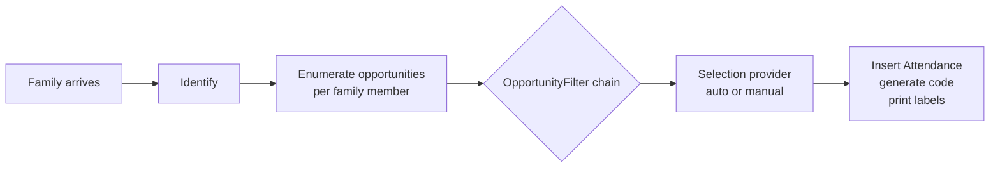

# Check-in Domain Overview

## Overview

Check-in is the kiosk and mobile self-service flow for recording attendance at services, classrooms, and events. It runs against the same `Attendance` and `AttendanceOccurrence` entities that the Group domain uses for after-the-fact attendance recording, but the entry path is different: a family arrives, identifies themselves, and the system selects appropriate Groups, Locations, and Schedules from the available "opportunities" using configurable filters. The result is one or more `Attendance` rows plus printed labels.

Two engines exist in the codebase: **Legacy Check-in** (`Rock.CheckIn`) and **Next-Gen Check-in / v2** (`Rock.CheckIn.v2`). The v2 engine is the default for new deployments; legacy is in maintenance mode for sites that have not migrated.

## Why It Exists

Self-service attendance recording at scale has constraints standard attendance UIs do not: a kiosk has a 6-second budget per family before queues form; printed labels must be deterministic across reruns of the same check-in; ability levels (toddler vs preschool vs elementary) must be enforced based on age and grade; security backgrounds must be checked before a volunteer is assigned to a children's classroom; over-capacity rooms must reject new check-ins gracefully. Each of these is a constraint the rest of Rock's attendance recording does not face.

The v2 rewrite addressed several recurring problems of the legacy system: stateful workflow-action-style chains were hard to extend; the opportunity-filter pattern made adding a new filter (e.g., Special Needs, Birth Month) a one-class change instead of a workflow rewrite; the label printing system was brittle when shared printers received multiple kiosk requests at the same moment (commit `cd43d120de` on 2025-10-01 fixed legacy label interleaving). The v2 engine is a `Provider`-based architecture where each phase (selection, filtering, labels, conversion) is a swappable component.

The recent over-capacity fix (`c6d1ec2679`, 2026-03-17, Fixes #6735) is illustrative: family check-in configured for fully-automatic group/location selection can run multiple services on the same day, and the v2 capacity check had to be aware of cumulative day-of-service occupancy. Same-day double-counting was the visible bug; the underlying lesson is that capacity enforcement must be temporally scoped to the actual occurrence window, not just "now."

## Mental Model

A check-in session walks through phases:

1. **Identify** the family (search by phone, last name, code).
2. **Enumerate opportunities**: every `(GroupType, Group, Location, Schedule)` combination that could host this family member at this time.
3. **Filter** opportunities through a chain of `OpportunityFilter` components: age, grade, gender, ability level, membership, schedule requirement, location closed, location overflow, threshold (capacity), data view membership, special needs, preferred groups, duplicate check-in.
4. **Select** what to actually check the person into. The selection provider can be auto (no UI; the system picks) or manual (the family taps through screens).
5. **Save** the check-in: insert `Attendance` rows, generate `AttendanceCode`, render and print labels.

The legacy engine modeled this as a stateful workflow with `CheckInState` carrying the in-progress selection. The v2 engine is more functional: each provider returns data; the session orchestrates them; persistence is the last step.

`KioskDevice` is the configuration root for a kiosk: which campus, which `CheckinType` (defines policies), which printer for which label type. `LocalDeviceConfiguration` persists per-kiosk runtime state (current schedules, group-type whitelist).

## What You Need to Know

**v2 is the default; legacy still ships.** New configurations should use v2. Legacy is maintained for upgrade compatibility; commits like `3c27476a73` (Fixes #6196, 2025-05-08) still address legacy bugs for sites that have not migrated.

**Archived groups never participate in check-in.** Since `cd1ee3883c` (Fixes #6618, 2025-12-11), archived groups are excluded from opportunities even when they would otherwise match. This is enforced at the opportunity-enumeration level; downstream filters do not need to repeat the check.

**Person creation in family-edit only requires NickName.** `3f10a44840` (Fixes #6464) addressed a case where new Persons created in family edit had only a NickName but no FirstName. The fix populates both. Older records with NickName-only may still exist; downstream code should treat both as authoritative for display.

**Default Person Connection Status applies to in-flow Person creation.** When check-in adds a new Person (visitor, family member added at the kiosk), the connection status comes from the check-in template's `Default Person Connection Status` setting. `7bf1e46b97` fixed v2 to honor this; pre-fix, the value was ignored.

**Record Source attribution applies to in-flow Person creation.** Configurable default per check-in template (commit `5911d3046b`). The Person record-source value tells reporting which entry point produced the new record.

**`Display Address on Families` is per-template (`42659c7705`, 2025-10-16).** Hide, optional, or required. Affects family edit screens during check-in. Required-mode blocks completing check-in until an address is entered.

**Label printing uses cloud-print sockets in v2.** `Rock/CheckIn/v2/CloudPrintLabelConsumer.cs` is the consumer side. Multiple kiosks printing to the same physical printer must serialize through the cloud-print socket; pre-fix interleaving (`cd43d120de`) is resolved.

**Label Designer rectangles are width-aware.** Commit `ecc4115a7b` (Fixes #6354) fixed a Label Designer bug where vertical rectangles (taller than wide) rendered at the wrong size, preventing vertical-bar layouts.

**Schedule selection only includes named schedules.** `6c68685089` (2026-03-31) changed v2 to exclude unnamed schedules from the selection list, preventing empty checkbox options.

**Family check-in over-capacity correctness is about cumulative day occupancy.** `c6d1ec2679` (2026-03-17, Fixes #6735) fixed multi-service-per-day capacity counts. Custom capacity logic must scope to the same occurrence window the framework uses.

**Search by short names had timeout risk.** `780ab66a77` (Fixes #6715, 2026-03-03) addressed timeouts when family search received short queries like "te de". The fix optimizes the search query; older builds may hang on similar inputs.

**`Prefer Enrolled Groups` interacts with location-closed filtering.** `3fd680347f` (Fixes #6382, 2025-07-21) fixed a case where Prefer-Enrolled-Groups on a group with only-closed locations blocked check-in for other matching groups. Custom filter ordering should leave the framework's built-in chain as the canonical reference.

**Label fields expanded in `af0e525bd9`.** Campus Name, Device Name, Search Type Name, Source Name are all available as label data sources. Custom labels designed pre-fix may not include them.

## Common Scenarios

**"Configure a new check-in template for nursery."** Group Type Detail with `TakesAttendance = true`, plus a `CheckinType` configuration. Define ability-level filters, age cutoffs, label templates. The template is the policy; the kiosk applies it.

**"Add a custom opportunity filter (e.g., 'must have completed orientation')."** Implement `OpportunityFilter` with the new logic. Register and configure in the check-in template's filter ordering.

**"Print a child label with their allergy info."** Label Designer block. Drag the Allergy attribute onto the label canvas. Configure the data formatter (size, position). The label generation in `DefaultLabelProvider` resolves the field on print.

**"Check in a family with three children to multiple services on Sunday."** Family check-in, automatic mode. The opportunity filter chain enumerates per-child options across all services; capacity is checked against same-day cumulative occupancy.

**"Manually start check-in for a person from the Manager block."** Check-in Manager Roster (Obsidian as of `3ab0ca2523`, 2026-02-09). The block tracks check-ins in real time and allows manager-initiated additions.

**"Override capacity for a specific group."** Group-level override on the check-in template. Note since `cd1ee3883c`, archived groups never participate; overrides on archived groups have no effect.

## Key Architectural Decisions

### Two engines (legacy and v2)

The check-in surface is too central to risk a forced cutover. v2 is the default for new deployments; legacy stays in maintenance for sites that have not migrated. The cost is parallel maintenance; the benefit is risk reduction.

### Filter chain instead of stateful workflow

v2's `OpportunityFilter` chain is a sequence of pluggable components, each one removing opportunities that fail its check. Adding a new filter is a one-class change. Legacy used a stateful workflow which made extension harder.

### Provider pattern for label, conversion, opportunity-filter, and selection

`DefaultLabelProvider`, `DefaultConversionProvider`, `DefaultOpportunityFilterProvider`, `DefaultSelectionProvider`. Each phase is overridable per-deployment without forking the engine.

### Same-day cumulative capacity

Capacity must be evaluated against actual day-of occupancy, not just "now," to handle multi-service days correctly. `c6d1ec2679` codified the rule.

### Cloud-print sockets for shared printers

Multi-kiosk printing to a shared printer must serialize through the cloud-print path to avoid interleaved label content.

## Considered but Rejected

### Forcing all sites onto v2 immediately

Rejected. Rollout risk is too high; legacy stays available until adoption is high enough to retire it.

### Real-time capacity recomputation in the kiosk UI

Rejected. The kiosk's 6-second budget per family does not allow live recomputation. Capacity is computed at session start and re-validated at save; mid-session optimistic display is acceptable.

### Stateless label rendering

Rejected (or partially rejected). Cloud-print sockets serialize per-printer to prevent interleaving; pure stateless rendering at the kiosk level was insufficient when multiple kiosks targeted one printer.

## Technical Reference

### Legacy Engine (`Rock/CheckIn/`)

- `CheckInBlock`, `CheckInBlockMultiPerson`, `CheckInEditFamilyBlock`, `CheckInSearchBlock` (block bases)
- `CheckInState` (carries selection through phases)
- `CheckInFamily`, `CheckInPerson`, `CheckInGroupType`, `CheckInGroup`, `CheckInLocation`, `CheckInSchedule` (selection model)
- `CheckinType`, `CheckinConfigurationHelper` (template config)
- `KioskDevice`, `KioskGroup`, `KioskLocation`, `KioskLabel` (cached kiosk runtime)
- `LocalDeviceConfiguration` (per-device persistence)

### Next-Gen Engine (`Rock/CheckIn/v2/`)

- `CheckInSession` (session orchestrator; replaces `CheckInState`)
- `DefaultLabelProvider`, `DefaultConversionProvider`, `DefaultOpportunityFilterProvider`, `DefaultSelectionProvider` (overridable phases)
- `Filters/` (opportunity-filter implementations: AbilityLevel, Age, BirthMonth, DataView, DuplicateCheckIn, Gender, GradeAndAge, Grade, LocationClosed, LocationOverflow, Membership, PreferredGroups, ScheduleRequirement, SpecialNeeds, Threshold)
- `Labels/` (label data sources, formatters, field configurations)
- `CloudPrintLabelConsumer`, `CloudPrintSendProxyStatusConsumer`, `CloudPrintSocket` (cloud-print path)
- `AreaOpportunity`, `GroupOpportunity`, `AbilityLevelOpportunity` (per-phase data shapes)
- `AttendanceSessionRequest` (the inbound request shape)

### Data Model

Check-in writes to:

- `Attendance` (the per-person row; `Rock/Model/Event/Attendance/Attendance.cs`)
- `AttendanceOccurrence` (the gathering; `Rock/Model/Event/AttendanceOccurrence/AttendanceOccurrence.cs`)
- `AttendanceCode` (the printable short code; `Rock/Model/Event/AttendanceCode/AttendanceCode.cs`)
- `AttendanceCheckInSession` (the session lineage)

It reads from `Group`, `GroupType`, `GroupLocation`, `Schedule`, and the active `CheckinType` configuration.

### Affected Blocks and UI Surfaces

- **Kiosk:** Welcome, Search, Family Select, Person Select, Group Type / Group / Location / Schedule Select, Action Select (check-in vs check-out), Success, Edit Family.
- **Manager:** Check-in Manager (live roster, Obsidian as of `3ab0ca2523`).
- **Configuration:** Check-in Areas and Groups, Check-in Configuration List, Check-in Configuration Settings, CheckinType Detail, Label Designer, Check-in Label Detail/List, Check-in Schedule Builder.
- **Mobile:** Mobile check-in flows in `Rock.Blocks.CheckIn` and `Rock.Blocks.Types.Mobile`.

### Extension Points

- **Custom `OpportunityFilter` implementations.** Add a class in `Rock/CheckIn/v2/Filters/`.
- **Custom `LabelProvider`, `ConversionProvider`, `SelectionProvider`.** Subclass the default and register.
- **Custom `DataFormatter` and `FieldDataSource`.** For new label-content kinds.
- **`KioskDevice` configuration.** Per-device runtime overrides (printer routing, schedule whitelist).

### File Index

- `Rock/CheckIn/` (legacy engine)
- `Rock/CheckIn/v2/` (next-gen engine)
- `Rock.Blocks/CheckIn/` (Obsidian-aware blocks)
- `Rock/Model/Event/Attendance/` and `AttendanceOccurrence/` (write targets)

## Recent Impactful Changes

- **2026-03-31** ([commit `6c68685089`](https://github.com/SparkDevNetwork/Rock/commit/6c68685089)). Next-Gen Check-in excludes unnamed schedules from the schedule-selection list.
- **2026-03-17** ([commit `c6d1ec2679`](https://github.com/SparkDevNetwork/Rock/commit/c6d1ec2679)). Fixed incorrect counts during over-capacity checks for fully-automatic family check-in across multiple services on the same day (Fixes #6735).
- **2026-03-03** ([commit `780ab66a77`](https://github.com/SparkDevNetwork/Rock/commit/780ab66a77)). Family search no longer times out on short-name queries like "te de" (Fixes #6715).
- **2026-02-09** ([commit `3ab0ca2523`](https://github.com/SparkDevNetwork/Rock/commit/3ab0ca2523)). Check-in Manager Roster block updated to Obsidian with real-time check-in tracking.
- **2025-12-11** ([commit `cd1ee3883c`](https://github.com/SparkDevNetwork/Rock/commit/cd1ee3883c)). Archived groups are no longer eligible for check-in, including overrides (Fixes #6618).

## Related Specs

- [Check-in Areas and Groups: WebForms to Obsidian Conversion](../../specs/completed/check-in/260506-check-in-areas-and-groups-obsidian-conversion.md) (2026-05-06, Jason Hendee)
