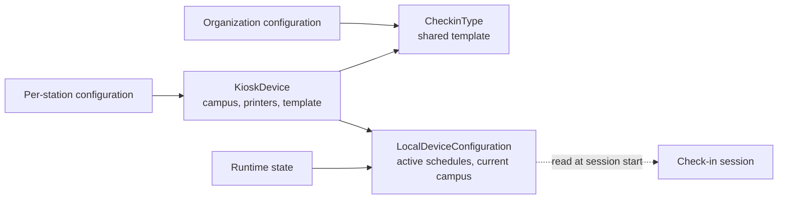

# Kiosk Configuration

## Overview

A kiosk in Rock is a configured station for self-service check-in: a hardware device (Windows tablet, kiosk PC) running the Rock check-in client. The configuration has three layers: a **`KioskDevice`** row defining which campus, which printer routing, and which check-in template applies; the **`CheckinType`** (the check-in template configuration) defining the policies (which schedules, which group types, age requirements, label formats); and **`LocalDeviceConfiguration`** holding per-device runtime state (current schedules, group-type whitelist, currently-selected campus). Together they answer "what does THIS kiosk show right now."

## Why It Exists

A church-management system that did not separate kiosk-level from organization-level configuration would force every kiosk to use the same setup, which fails the moment a church has multiple campuses or different ministries running at different times. The `KioskDevice` row is the per-station configuration; the `CheckinType` is the shared policy. Modeling them separately lets a single template serve many kiosks while letting each kiosk diverge on local concerns (which printer, which schedule subset).

The `LocalDeviceConfiguration` exists for runtime state that changes during a check-in session: which campus is currently selected, which schedules are active for the current service, which group types are whitelisted. Keeping this separate from the `KioskDevice` configuration row prevents the device's identity from being mutated mid-session.

## Mental Model

A kiosk references one CheckinType (the policy) and has its own runtime state (which schedules to honor right now). At session start, the active session reads both.

## What You Need to Know

**`KioskDevice` is the per-station identity.** One Rock instance can have many kiosks; each `KioskDevice` row identifies one. The Device entity (under Rock/Model) is the underlying registration; `KioskDevice` is the cached check-in-aware projection.

**`CheckinType` is shared across kiosks.** Kiosks in the same campus typically share a CheckinType. Different campuses can have different templates with different policies.

**`CheckinType` defines the policies.** Schedule selection, age cutoffs, ability-level matching, label formats, group-type whitelist, search-type configuration (phone / name / family code), special-case behaviors (special needs, RSVP-required), terminology. The CheckinType is the org-wide configuration knob.

**`LocalDeviceConfiguration` is runtime state.** Survives across check-ins but typically resets at the start of a service. Holds: which schedules are active, which group types are enabled, currently-selected campus, per-device feature flags.

**`Display Address on Families` is a CheckinType setting.** Per `42659c7705` (2025-10-16), check-in configuration controls if the family address is hidden, optional, or required on the family edit screens.

**`Default Person Connection Status` lives on the CheckinType.** When check-in adds a new Person (visitor at kiosk), the connection status comes from this setting (per `7bf1e46b97`, 2025-05-07; pre-fix v2 ignored it).

**Default Record Source applies to in-flow Person creation.** Configurable default per CheckinType. Tags new Persons created during check-in with the appropriate Record Source DefinedValue.

**Printer configuration is per-`KioskDevice`.** The printer routing (which printer for which label type) lives on the device row. Multiple kiosks can target the same printer; the cloud-print path serializes to prevent interleaving.

**`KioskDevice.Location` defines the kiosk's physical location.** Used for proximity-based features and reporting on kiosk usage.

**Check-in Schedule Builder is the shared schedule editor.** Configures which schedules are active during check-in for a given CheckinType. Available since the standard schedule infrastructure; configures `ScheduleId` references.

**Areas and groups are configured in the Obsidian "Check-in Areas and Groups" block.** A check-in template's areas (its child check-in group types) and the groups beneath them are edited in a campus-aware, split-pane editor with drag-reorder and up to 5 levels of nesting (`Rock.Blocks/CheckIn/Configuration/CheckInAreasAndGroups.cs`). It replaced the legacy WebForms areas editor, and the check-in configuration pages now sit directly under Admin Tools rather than nested in settings. Every area or group mutation pushes a configuration-refresh notification to connected kiosks (`RefreshConnectedKiosks`) so they reload without an app recycle.

**Configuration changes propagate via cache invalidation.** A change to a CheckinType invalidates the cache; running kiosks pick up the new configuration on next session start.

**Custom check-in templates are configuration, not code.** A new CheckinType row covers most ministry-specific needs.

## Common Scenarios

**"Set up a new kiosk for nursery check-in."** Provision the hardware. Register a `Device` row. Create a `KioskDevice` referencing the appropriate CheckinType (Children / Nursery template). Configure printer routing.

**"Multi-campus kiosk identity."** One CheckinType, many KioskDevices, each tagged with its campus. The `LocalDeviceConfiguration.CampusId` distinguishes per-kiosk.

**"Add a custom CheckinType for a special event."** Internal -> Check-in -> Group Types. Create a new CheckinType with the event-specific policy. Reference it from kiosks designated for the event.

**"Display the family address on check-in forms."** CheckinType setting `Display Address on Families` -> "Required" or "Optional" (since `42659c7705`).

**"Disable ability-level matching for a specific kiosk."** Customize the CheckinType (or use a different one for that kiosk). Or override at the LocalDeviceConfiguration level if supported.

**"Configure a default Record Source for visitors."** CheckinType -> Default Record Source. New Persons created at check-in get the configured value (since `5911d3046b`, 2025-10-24).

**"Investigate a kiosk showing wrong schedules."** Check the LocalDeviceConfiguration for the device. Check the active CheckinType's schedule configuration. Verify the schedules are not excluded by category (legacy fix `3c27476a73` addressed legacy schedule category exclusion).

## Key Architectural Decisions

### Three-layer configuration

`CheckinType` (shared policy) + `KioskDevice` (per-station identity) + `LocalDeviceConfiguration` (runtime state). Each layer changes at a different cadence.

### Shared CheckinType for similar kiosks

Per-kiosk policy duplication would multiply admin work. Shared template with per-kiosk campus / printer override is the right factoring.

### Runtime state separate from configuration

Mid-session mutations (current campus, active schedules) should not corrupt the device's identity. Separate row keeps each clean.

### Cache invalidation propagates configuration changes

Eventual consistency on the kiosk; next session picks up the change. Forcing immediate restart would be hostile.

### Default Person settings on CheckinType

In-flow Person creation needs sensible defaults; per-template configuration lets each CheckinType define its own.

## Considered but Rejected

### Per-kiosk full configuration

Rejected. Multiplies admin work; shared CheckinType plus per-kiosk overrides is right.

### Single combined `KioskConfiguration` row

Rejected. Mixing identity (which kiosk this is) with runtime (currently active state) makes mid-session mutations risky.

### Hardcoded schedule selection

Rejected. Schedule selection varies per service; configuration must be data-driven.

## Technical Reference

### Schema (relevant subset)

`Device`:
- `Name`, `DeviceTypeValueId` (CheckIn Kiosk / etc.)
- `LocationId`
- `IsActive`

`KioskDevice` (cached projection of Device + check-in-specific configuration):
- DeviceId
- Campus configuration
- Printer routing
- KioskGroupTypes (which Group Types this kiosk handles)

`CheckinType` (configured via Group Type with `GroupTypePurposeValueId = Check-in Template`):
- Schedule configuration
- Age / grade requirements
- Label formats
- Search type configuration
- `Display Address on Families`
- `Default Person Connection Status`
- `Default Record Source`
- Special-needs and RSVP-required flags

`LocalDeviceConfiguration`:
- `CampusId`
- Active `ScheduleId`s
- Allowed `GroupTypeId`s (whitelist)
- Per-device feature flags

### Service / API

`CheckinConfigurationHelper`: helpers for resolving CheckinType configuration values.

### Affected Blocks

- **Admin:** Check-in Configuration (list + settings), **Check-in Areas and Groups** (Obsidian; edits a configuration's areas, group types, and groups), Check-in Schedule Builder, CheckinType Detail, Group Type Detail (when the Group Type is a check-in template), KioskDevice configuration UIs.
- **Kiosk:** all the kiosk-side blocks (Welcome, Search, Family Select, etc.) consume the configuration.

### Related Docs

- [docs/check-in/check-in-overview.md](check-in-overview.md)
- [docs/check-in/v2-vs-legacy.md](v2-vs-legacy.md)
- [docs/check-in/opportunity-filters.md](opportunity-filters.md)
- [docs/check-in/label-designer-and-printing.md](label-designer-and-printing.md)

## Recent Impactful Changes

- **2026-06-02** ([commit `61353768a5`](https://github.com/SparkDevNetwork/Rock/commit/61353768a5)). Replaced the legacy WebForms Check-in Areas editor with the Obsidian "Check-in Areas and Groups" block and moved the check-in configuration pages directly under Admin Tools.
- **2025-10-24** ([commit `5911d3046b`](https://github.com/SparkDevNetwork/Rock/commit/5911d3046b)). Default Record Source for new Person records during check-in (Fixes #6507).
- **2025-10-16** ([commit `42659c7705`](https://github.com/SparkDevNetwork/Rock/commit/42659c7705)). New "Display Address on Families" check-in configuration setting: hide, optional, or required.
- **2025-05-07** ([commit `7bf1e46b97`](https://github.com/SparkDevNetwork/Rock/commit/7bf1e46b97)). Next-Gen Check-in correctly sets the connection status from the check-in template's Default Person Connection Status when adding a new person.
- **2025-05-08** ([commit `3c27476a73`](https://github.com/SparkDevNetwork/Rock/commit/3c27476a73)). Legacy check-in schedule category exclusions now honored when loading schedules (Fixes #6196).

## Related Specs

- [Check-in Areas and Groups: WebForms to Obsidian Conversion](../../specs/completed/check-in/260506-check-in-areas-and-groups-obsidian-conversion.md) (2026-05-06, Jason Hendee)
