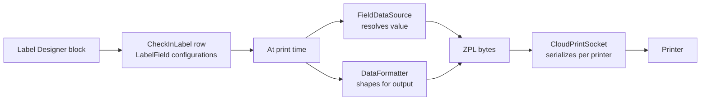

# Label Designer and Printing

## Overview

The Label Designer is the visual editor for kiosk-printed check-in labels (child name tag, parent receipt, security tag). A label is a `CheckInLabel` row holding a layout of `LabelField` configurations: each field references a `FieldDataSource` (where the value comes from: child's name, security code, attendance datetime) and a `DataFormatter` (how to format it). The print path uses cloud-print sockets so multiple kiosks targeting the same printer serialize their requests, preventing interleaved label content.

## Why It Exists

Children's-ministry check-in produces multiple labels per check-in: a name tag for the child, a matching pickup receipt for the parent, optionally a bag tag and an allergy alert. Hardcoding each label as fixed layout would force per-deployment forks for every customization (every church wants to put its logo somewhere, include or exclude photos, change the security-code format). The visual designer + field-source pattern lets administrators design labels without code; the cloud-print path lets shared printers handle multi-kiosk traffic without label-content interleaving.

The vertical-rectangle bug (commit `ecc4115a7b`, Fixes #6354, 2025-06-25) is illustrative: rectangles taller than they were wide rendered at wrong sizes, preventing vertical-bar layouts. A small but visible bug; the fix made the designer correct for the full set of layouts admins try.

The interleaved-labels fix (commit `cd43d120de`, 2025-10-01) is the canonical "shared printer" problem: two kiosks printing simultaneously to the same physical printer could produce intermingled label content. The cloud-print socket path serializes per-printer and prevents this.

## Mental Model

A label is a layout: positioned fields, each pointing at a data source and a formatter. The designer writes the layout to the database. At print time, the engine resolves each field's value, formats it, and produces the printer's wire format (Zebra ZPL is the standard).

The cloud-print socket is a shared, serializing channel per printer: kiosks send bytes; the socket releases them one at a time to the printer. Concurrent kiosks queue rather than interleave.

## What You Need to Know

**A `CheckInLabel` row is the layout.** Stored in the database; the designer is its editor.

**Fields reference a `FieldDataSource` for the value.** Built-in sources include child name, parent name, security code, attendance time, group name, location name, schedule name, campus name, device name, search type name, source name (last four added in `af0e525bd9`, 2025-10-01).

**`DataFormatter` shapes the output.** Built-in formatters: full name, date, datetime, weekday-date, person age, gender, grade, security-code-and-name, callback-data. Custom formatters add to this list.

**Photo fields use `AttendeePhotoFieldConfiguration`.** Renders the child's photo on the label. Useful for security verification.

**Barcode fields use `BarcodeFieldConfiguration`.** Renders the security code as a scannable barcode for parent pickup verification.

**Vertical rectangles render correctly since `ecc4115a7b`.** Pre-fix (Fixes #6354), rectangles taller than wide rendered at wrong sizes. Custom designers using vertical bars need the fix in their build.

**Cloud-print sockets serialize per-printer.** Two kiosks targeting the same printer go through the same socket; the socket releases requests sequentially. Pre-fix `cd43d120de`, concurrent prints could interleave (one label's content mixed into another's).

**Multiple labels per check-in.** A check-in session typically generates multiple `CheckInLabel` instances: child name tag, parent receipt, optional security/allergy tags. Each goes through the print path.

**Label printing happens in `DefaultLabelProvider`.** The provider is overridable per-deployment for sites with custom layout/print logic.

**ZPL is the standard wire format.** Zebra printers consume ZPL. Custom printer types may need a different format; the wire-format generation is in the formatter / provider stack.

**Test prints from the designer.** The Label Designer block has a test print action that generates the label with sample data and sends to a configured printer.

**Disabled `IsActive = false` excludes the label from generation.** Useful for retired layouts; `IsActive = true` is the default.

## Common Scenarios

**"Customize the child name tag for our church."** Label Designer block. Open the active "Child Tag" CheckInLabel. Drag the church logo onto the canvas; reposition fields. Save. The next check-in uses the new layout.

**"Add a photo to a label."** Drag the AttendeePhoto field onto the canvas. Configure size and position. Configuration is per-label.

**"Add allergy info to the child label."** Add a Person Attribute field referencing the "Allergy" attribute. Configure formatter (text). Position on the label.

**"Configure barcode for parent pickup."** Add a Barcode field bound to the security-code data source. Configure barcode type (Code 128, Code 39).

**"Test a label."** Designer's Test Print action. Sends the label with sample data to a configured printer.

**"Add a custom data source."** Implement `FieldDataSource`. Register. The designer surfaces the new source as a field option.

## Key Architectural Decisions

### Visual designer with field-source pattern

Configuration-as-data. Admin designs labels without code; data sources are pluggable for custom values.

### Cloud-print sockets for shared printers

Multi-kiosk shared printing produces interleaved labels without serialization. The socket serializes; the fix codifies this.

### ZPL as the standard wire format

Zebra is the industry standard for thermal label printers. Targeting ZPL covers the common case; custom formats can be added.

### `DefaultLabelProvider` overridable

Per-deployment custom layout/print logic is a known need for advanced integrations.

### Multiple labels per check-in

Multi-label is the realistic case (child + parent + optional). Hardcoding "one label" would have forced workarounds.

## Considered but Rejected

### Hardcoded label templates

Rejected. Per-church customization is the universal need.

### One-printer-per-kiosk to avoid interleaving

Rejected. Real deployments share printers; serialization is the right answer.

### Custom wire format for each printer model

Rejected (so far). ZPL covers the dominant case; custom formats can be added per deployment.

## Technical Reference

### Schema

`CheckInLabel`:
- `Name`, `Description`
- `LabelType` (Family / Person / Attendance / Checkout)
- `LabelFormat` (typically ZPL)
- `IconCssClass`
- `IsActive`

### Label Composition (in v2)

`LabelField`: one positioned field on the label.
- `LabelFieldType`: text, image, barcode, line, ellipse, rectangle.
- Position (X, Y, width, height).
- `FieldDataSource` reference.
- `DataFormatter` reference.

`FieldDataSource` (in `Rock/CheckIn/v2/Labels/`):
- Subclasses for each data source.
- Resolves the value at print time.

`DataFormatter` (in `Rock/CheckIn/v2/Labels/Formatters/`):
- Subclasses for each format type.
- Shapes the resolved value for output.

### Built-in Field Data Sources (selected)

- Person name (Full / Nick / Last / First)
- Group name
- Location name
- Schedule name
- Attendance datetime
- Security code
- Campus name
- Device name (added `af0e525bd9`)
- Search type name (added `af0e525bd9`)
- Source name (added `af0e525bd9`)
- Person attribute value (custom attribute reference)

### Built-in Formatters (selected)

- `FullNameDataFormatter`
- `DateDataFormatter`, `DateTimeDataFormatter`, `WeekdayDateDataFormatter`
- `PersonAgeDataFormatter`
- `GradeDataFormatter`
- `GenderDataFormatter`
- `SecurityCodeAndNameDataFormatter`
- `CallbackDataFormatter`
- `CheckInDetailDataFormatter`

### Cloud-Print Path

`CloudPrintLabelConsumer`: receives label-print events.
`CloudPrintSocket`: per-printer socket, serializes requests.
`CloudPrintSendProxyStatusConsumer`: status events from the print path.

### Affected Blocks

- **Label Designer**: visual editor.
- **Check-in Label Detail/List**: admin management.

### Related Docs

- [docs/check-in/check-in-overview.md](check-in-overview.md)
- [docs/check-in/v2-vs-legacy.md](v2-vs-legacy.md)

## Recent Impactful Changes

- **2025-10-01** ([commit `cd43d120de`](https://github.com/SparkDevNetwork/Rock/commit/cd43d120de)). Fixed interleaved labels when multiple kiosks print to the same physical printer simultaneously.
- **2025-10-01** ([commit `af0e525bd9`](https://github.com/SparkDevNetwork/Rock/commit/af0e525bd9)). Added Campus Name, Device Name, Search Type Name, Source Name fields and filters to next-gen labels.
- **2025-06-25** ([commit `ecc4115a7b`](https://github.com/SparkDevNetwork/Rock/commit/ecc4115a7b)). Fixed Label Designer rectangles taller than wide rendering at wrong sizes (Fixes #6354).
- **2025-03-14** ([commit `822b3cc251`](https://github.com/SparkDevNetwork/Rock/commit/822b3cc251)). Group Role Name available on check-in labels and as a filter (Fixes #6243).
