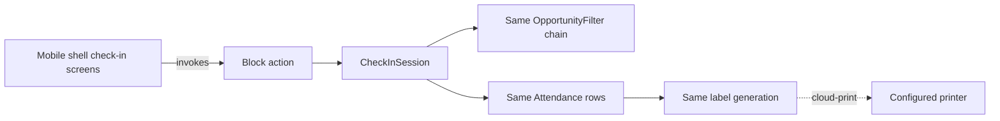

# Mobile Check-in

## Overview

Mobile Check-in is the phone-app version of the kiosk flow. The Rock Mobile shell exposes check-in screens that drive the same v2 engine the kiosk uses, with a different UI surface. Family search, person selection, group/location/schedule selection, and save all happen through the standard `CheckInSession`. The mobile blocks live under `Rock.Blocks.Types.Mobile.CheckIn/`. The same `Attendance` rows are written, the same opportunity filters apply, and the same labels are produced (printed via cloud-print to a connected printer if configured).

## Why It Exists

Many churches want to offer self-check-in via the mobile app: parents can check their kids in from the parking lot, volunteers can mark themselves present from anywhere, members can record their own service attendance. Mobile shares the v2 engine to ensure consistency: the same eligibility filters, the same capacity rules, the same security code. Forking the engine for mobile would have multiplied the surface and produced subtle correctness divergence.

The v2 engine was designed with this in mind: provider pattern + opportunity filter chain + session orchestrator means mobile can drive the engine through the same entry points the kiosk uses. Mobile's UI is mobile-native (touch-driven, swipe gestures), but the engine state and decisions are identical.

## Mental Model

The mobile entry path differs (touch UI, mobile shell rendering), but the engine internals are identical to kiosk.

## What You Need to Know

**Same engine, different shell.** Mobile uses the v2 engine's `CheckInSession` and the same opportunity filters. UI is mobile-native; the underlying selection / save / label logic is shared.

**Mobile blocks live under `Rock.Blocks.Types.Mobile.CheckIn/`.** Server-side block definitions; the mobile shell renders them.

**`AttendanceSessionRequest` is the inbound request shape.** The mobile shell builds this from user actions; the server processes through `CheckInSession`.

**Family resolution works the same.** Phone search, name search, family code: the mobile UI calls the same search APIs. The same `PersonSearchKey` lookup applies.

**Capacity, age, grade, ability checks all apply identically.** No mobile-specific opportunity filter override; same chain runs.

**Labels can print from mobile.** Mobile devices typically don't have direct printer access; cloud-print routes labels to a configured printer at the venue. The kiosk-side printer prints the label.

**Mobile check-in respects all CheckinType policies.** Display address, default connection status, default record source, ability-level requirements. The CheckinType is the policy; mobile honors it.

**Authentication is via the mobile shell's standard auth.** The user is logged in; check-in actions are scoped to their family. Public-mobile check-in (anonymous from a phone) is not the typical flow; standard mobile is authenticated.

**Custom mobile blocks work the same as web.** The Rock Mobile block infrastructure (server-side blocks plus mobile shell rendering) is shared across domains; check-in mobile blocks follow the standard pattern.

**Same Attendance rows, no special "mobile check-in" type.** Reports do not need to distinguish mobile from kiosk attendance unless they specifically want to (`SourceTypeValueId` on `Attendance` records the entry channel).

**`SourceTypeValueId` records the entry channel.** Mobile check-in tags attendance rows with the mobile source type; kiosk tags with the kiosk source type. Reports filtering by source can distinguish.

## Common Scenarios

**"Parent checks kids in from the parking lot via the mobile app."** Authenticated user opens the check-in screen, picks the kids, picks the service. The session runs through the v2 engine, writes Attendance, generates labels (printed at the venue's connected printer).

**"Volunteer self-check-in from the mobile app."** Same flow, with the volunteer as the family member. The eligibility filters apply; the volunteer's GroupMember relationship to their serving Group satisfies the membership filter.

**"Member self-records service attendance."** Some churches enable adult self-attendance via mobile. Same engine; CheckinType configuration controls whether this is enabled.

**"Configure mobile-specific behavior."** Most behavior is engine-driven and shared. Mobile-shell-side rendering tweaks happen in the mobile shell codebase; mobile blocks server-side mostly mirror web blocks (with mobile-tailored bag responses).

**"Print labels from mobile check-in."** Cloud-print path. Configure the venue's printer; mobile check-in routes labels to it. The print serialization (`cd43d120de` fix) applies the same way.

## Key Architectural Decisions

### Same v2 engine, different shell

Forking the engine for mobile would have multiplied maintenance and risked correctness divergence. Sharing is the right tradeoff.

### Cloud-print for label routing

Mobile devices do not have direct printer access. Cloud-print routes through the venue's configured printer.

### `SourceTypeValueId` for entry channel

Reports that need to distinguish mobile from kiosk attendance can; for most reports, the same Attendance row is the same row.

### CheckinType policies apply identically

Operational consistency: a Person eligible at kiosk is eligible on mobile; a kid blocked by capacity is blocked from both surfaces.

### Authentication via mobile shell

Standard auth; no separate check-in-specific login flow.

## Considered but Rejected

### Forked mobile-only check-in engine

Rejected. Maintenance and correctness concerns.

### Direct printing from mobile devices

Rejected (or partial). Most mobile devices lack thermal-printer drivers; cloud-print is the universal path.

### Anonymous mobile check-in by default

Rejected. Authenticated mobile is the dominant case; anonymous flows would multiply security surface for marginal benefit.

## Technical Reference

### Mobile Block Folder

`Rock.Blocks.Types.Mobile.CheckIn/` (or similar; structure parallels web `Rock.Blocks.CheckIn/`):

- Welcome / search blocks
- Family / person select
- Group / location / schedule select
- Action select (check-in vs check-out)
- Success / Edit Family

### Server-Side Block Type

Inherits from `RockMobileBlockType<TBag>` or `RockMobileBlockType`. Standard mobile block infrastructure.

### Engine Integration

The mobile blocks invoke the same `CheckInSession` API:
- Start session with family / phone search
- Run opportunity filter chain
- Surface eligible groups / locations / schedules
- Receive selection
- Save (insert Attendance, generate code, render labels)

### Print Path

Mobile devices submit print requests to `CloudPrintLabelConsumer`. The configured `CloudPrintSocket` for the destination printer serializes; the printer at the venue produces labels.

### Affected Areas

- **Mobile shell:** rendering, gesture handling, push notifications.
- **Server-side blocks:** the bag-based action surface for mobile check-in.
- **CheckinType:** policy applies; no mobile-specific overrides typical.

### Related Docs

- [docs/check-in/check-in-overview.md](check-in-overview.md)
- [docs/check-in/v2-vs-legacy.md](v2-vs-legacy.md)
- [docs/check-in/opportunity-filters.md](opportunity-filters.md)
- [docs/check-in/label-designer-and-printing.md](label-designer-and-printing.md)
- [docs/mobile/mobile-overview.md](../mobile/mobile-overview.md)

## Recent Impactful Changes

(No release-note-tagged changes specifically to mobile check-in in the last 18 months. Mobile follows the v2 engine's evolution; recent v2 fixes (`c6d1ec2679`, `cd1ee3883c`, `42659c7705`, `cd43d120de`) apply to mobile through the shared engine.)
