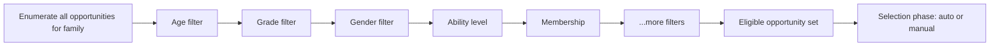

# Opportunity Filters

## Overview

In Rock's v2 check-in engine, an "opportunity" is a `(GroupType, Group, Location, Schedule)` combination that could host a person at a given time. The engine enumerates all opportunities for the family at session start, then runs them through a chain of `OpportunityFilter` components. Each filter inspects an opportunity and either keeps it (the person is eligible) or drops it (this Group/Location does not apply to this person right now). What remains is the eligible-set the selection phase picks from. Filters are pluggable; new filters are one-class additions.

## Why It Exists

Real check-in eligibility has many dimensions: age cutoffs, grade levels, gender restrictions, ability-level matching for special-needs ministries, membership requirements (members-only kids' classes), schedule requirements (must be enrolled in this Sunday's roster), location capacity, special-needs accommodations, preferred groups (this kid usually goes here), duplicate prevention. Hardcoding all of this in a single filter function would multiply the complexity of one method; modeling each dimension as its own filter keeps each tractable.

Each filter is independent and idempotent: it drops opportunities that fail its check, ignores opportunities that pass. The chain composes by intersection.

## Mental Model



The chain runs in a fixed order (configurable per check-in template). Each filter has the opportunity set as input and produces a (typically smaller) set as output. The selection phase then picks from what remains.

## What You Need to Know

**Each filter is one class implementing `OpportunityFilter`.** New filters are a one-class change. Browse `Rock/CheckIn/v2/Filters/` for examples.

**Filter order matters.** Cheap filters (age, grade) run first to reduce the opportunity set quickly; expensive filters (DataView membership, schedule requirements that involve queries) run later. Order is configurable per check-in template.

**Filters are idempotent.** Running the same filter twice produces the same result. This is important because the chain is reorderable; filter authors should not rely on a specific run-time context.

**Capacity (`ThresholdOpportunityFilter`) checks day-cumulative occupancy.** Pre-fix `c6d1ec2679` (Fixes #6735, 2026-03-17), capacity for fully-automatic family check-in across multiple services was miscounted. The fix correctly computes cumulative day occupancy. Custom capacity filters should follow the pattern.

**Archived groups never participate.** `LocationClosedOpportunityFilter` and the underlying enumeration both honor `Group.IsArchived`. Pre-fix `cd1ee3883c` (Fixes #6618, 2025-12-11), archived groups could be eligible for check-in including overrides; the fix excludes them at enumeration time.

**`PreferredGroupsOpportunityFilter` interacts with `LocationClosedOpportunityFilter`.** Pre-fix `3fd680347f` (Fixes #6382, 2025-07-21), the "Prefer Enrolled Groups" setting on a group with only-closed locations would block check-in for other matching groups. The fix corrected the interaction; custom filter ordering should respect the framework's built-in chain as the canonical reference.

**Ability level matching uses an attribute on Person.** Special-needs ministries assign ability levels to children; the `AbilityLevelOpportunityFilter` matches Person ability against Group ability level. Configuration is per Group.

**`GradeAndAgeOpportunityFilter` is the combined version.** Some check-in configurations need both grade AND age to match (e.g., kindergarten requires both grade-K and age 5-6). The combined filter is more efficient than running grade and age separately.

**`MembershipOpportunityFilter` enforces "members-only" classes.** Some Groups only allow members (vs visitors); the filter checks Person's GroupMember status against the target Group.

**`SpecialNeedsOpportunityFilter` accommodates accessibility.** Person attribute flags special needs; certain rooms support special needs. The filter routes accordingly.

**Custom filter use cases:** "Must have completed orientation," "Volunteer-only Groups for paid staff," "Geographic radius from campus." Each is a one-class addition.

**The filter chain runs once at session start.** Re-running on each step would multiply the cost. The session caches the eligible-set; selection works against it.

## Common Scenarios

**"Add a 'must have completed orientation' filter."** Implement `OpportunityFilter`. In `Filter`, check the Person's "Orientation Complete" attribute; drop the opportunity if false. Register and add to the chain ordering.

**"Skip duplicate check-in (don't let a kid check into two Groups simultaneously)."** Use the built-in `DuplicateCheckInOpportunityFilter`. Already in the default chain.

**"Filter out groups whose room is at capacity."** `ThresholdOpportunityFilter` is the built-in. It uses cumulative day occupancy (since `c6d1ec2679`).

**"Geographic radius filter."** Custom filter: query the Person's primary address location, compare distance to the Group's location. Can be expensive; run last in the chain.

**"Override capacity for a specific kid (e.g., the pastor's kid always gets in)."** Per-Person attribute that custom filter respects to skip the threshold check. Or modify the threshold filter's logic to honor the attribute.

**"Diagnose 'why isn't this kid eligible for this Group?'"** The check-in admin path can show the filter chain's elimination steps; check which filter dropped the opportunity. Custom filters should log clearly.

## Key Architectural Decisions

### Each filter is one class

Adding a new filter is a one-class change. Single-class filters are testable in isolation.

### Chain ordering is configurable

Different deployments have different priorities (cost, importance). Per-template ordering gives the right tuning surface.

### Filters are idempotent

Reordering should not break correctness. Filters that depend on prior-filter state would defeat this; the convention is "drop based on inherent properties of the opportunity, not based on what other filters did."

### Cumulative day occupancy in capacity

Real-world capacity must account for total-day occupancy across services, not "right now." The fix codifies this.

### Archived groups excluded at enumeration

Pre-fix, archived groups could leak through; the fix puts the exclusion at enumeration. Filters do not need to repeat the check.

## Considered but Rejected

### Single mega-filter with all logic

Rejected. One method handling all eligibility would be unmaintainable.

### Filter chain in the workflow runtime (legacy approach)

Rejected. Hot-path performance and authoring concerns drove v2's component pattern.

### Real-time capacity recompute on each check-in step

Rejected. Cost would dominate; cache at session start, validate at save.

## Technical Reference

### Built-in Filters

| Filter | Purpose |
|---|---|
| `AgeOpportunityFilter` | Age cutoffs (`MinAge`, `MaxAge` on Group). |
| `GradeOpportunityFilter` | Grade-level match. |
| `GradeAndAgeOpportunityFilter` | Combined check. |
| `GenderOpportunityFilter` | Gender-restricted Groups. |
| `AbilityLevelOpportunityFilter` | Ability-level matching for special-needs. |
| `MembershipOpportunityFilter` | Members-only Groups. |
| `LocationClosedOpportunityFilter` | Honors location's "closed" state and Group archive. |
| `LocationOverflowOpportunityFilter` | Overflow location handling. |
| `ScheduleRequirementOpportunityFilter` | Must be on roster for this schedule. |
| `ThresholdOpportunityFilter` | Capacity check (cumulative day occupancy). |
| `BirthMonthOpportunityFilter` | Birth-month-specific groups (rare). |
| `DataViewOpportunityFilter` | DataView-membership-restricted Groups. |
| `DuplicateCheckInOpportunityFilter` | Prevent simultaneous check-in to multiple Groups. |
| `PreferredGroupsOpportunityFilter` | "Prefer Enrolled Groups" setting. |
| `SpecialNeedsOpportunityFilter` | Special-needs accommodation routing. |

### `OpportunityFilter` Base

Provides:
- `Filter(opportunities, family, person, ...)`: the filter method.
- Standard logging and result-tracking.

### Standard Idiom

```csharp
public class MyCustomFilter : OpportunityFilter
{
    public override IEnumerable<Opportunity> Filter( IEnumerable<Opportunity> input, ... )
    {
        foreach ( var op in input )
        {
            if ( /* my eligibility check */ )
                yield return op;
        }
    }
}
```

### Affected Areas

Filters apply during the Selection phase of the v2 engine. The same filter set runs for kiosk, mobile, and admin-initiated check-ins.

### Related Docs

- [docs/check-in/check-in-overview.md](check-in-overview.md)
- [docs/check-in/v2-vs-legacy.md](v2-vs-legacy.md)
- [docs/check-in/kiosk-configuration.md](kiosk-configuration.md)
- [docs/check-in/skip-screen-behavior.md](skip-screen-behavior.md)

## Recent Impactful Changes

- **2026-03-17** ([commit `c6d1ec2679`](https://github.com/SparkDevNetwork/Rock/commit/c6d1ec2679)). Threshold filter's cumulative day-occupancy logic fixed for fully-automatic family check-in across multiple same-day services (Fixes #6735).
- **2025-12-11** ([commit `cd1ee3883c`](https://github.com/SparkDevNetwork/Rock/commit/cd1ee3883c)). Archived groups excluded from check-in eligibility (Fixes #6618).
- **2025-09-15** ([commit `fd6404a7c7`](https://github.com/SparkDevNetwork/Rock/commit/fd6404a7c7)). Family check-in no longer surfaces extra schedules that were not actually available (Fixes #6347).
- **2025-07-21** ([commit `3fd680347f`](https://github.com/SparkDevNetwork/Rock/commit/3fd680347f)). "Prefer Enrolled Groups" no longer blocks check-in to other matching groups when the preferred group has only closed locations (Fixes #6382).
