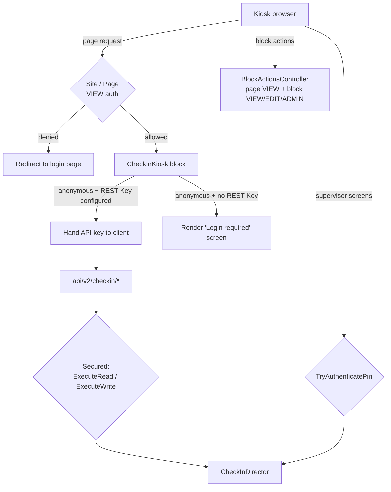

# Check-in Security

## Overview

The check-in kiosk page is a self-service screen that an unattended device displays in a lobby, yet it reads and writes personal data for an entire congregation: names, ages, phone numbers, family relationships, and attendance. Rock therefore does not treat the kiosk page as "public." It secures it with a **logged-in identity** — either a staff person or, more typically, a dedicated device account — and layers a **separate PIN challenge** on top for the supervisor-only operations.

There are four distinct gates, and they are easy to confuse because they protect different things:

1. **Site and page authorization** — who may load the kiosk page at all.
2. **Block action authorization** — who may invoke the block's server methods.
3. **REST controller authorization** — who may call `api/v2/checkin/*`.
4. **PIN authentication** — who may use the supervisor/manager functions once the kiosk is already running.

## Why It Exists

A kiosk is physically exposed. Anyone can walk up to it, and the browser it runs is reachable from any machine on the same network if someone guesses the URL. If the check-in page were anonymous, the family-search endpoint alone would be a congregation-wide directory dump. So Rock's default posture is **deny anonymous**, and the deployment is expected to supply an identity for the device rather than opening the page up.

The PIN layer exists for a different reason. Once the kiosk is running under a device identity, every person standing in front of it has that identity. The supervisor functions (reprint labels, open/close rooms, override age/grade requirements) must not be available to a parent who taps the corner of the screen, so they require a second factor that only staff know.

## Mental Model

## What You Need to Know

### The site denies anonymous access by default

`202411182318196_UpdateNextGenCheckInDefaultSecurity` sets the Auth rows on the **Next-gen Check-in site** (`BFBB35BD-D0B0-459E-9329-B082CE4F253E`) in this order:

| Order | Action | Allow/Deny | Role |
|---|---|---|---|
| 0 | View | Allow | `RSR - Rock Administration` |
| 1 | View | Allow | `RSR - Staff Workers` |
| 2 | View | Allow | `RSR - Staff Like Workers` |
| 3 | View | **Deny** | All Users |

The same migration grants View on the Next-gen Check-in root page (`7D1732D5-3957-475F-A259-4DB8261C2049`) to **`APP - Check-in Devices`** (`51e02a99-b7cb-4e64-b7c8-065076aabc05`), the built-in security role described in the seed data as "used to give rights to the accounts that access and run the check-in application."

The legacy `Rock Check-in` site (`15aefc01-acb3-4f5d-b83e-ab3ab7f2a54a`) carries the identical shape in the create-database seed: Allow View to the administration role, Allow View to `APP - Check-in Devices`, then Deny View to All Users.

So out of the box, **both** check-in engines require a login. The intended deployment is a device-specific `UserLogin` placed in `APP - Check-in Devices`.

### Anonymous kiosks are opt-in, via a REST key

An organization that genuinely wants an anonymous kiosk page has to change the page security *and* give the block a REST key. `CheckInKiosk` has a `REST Key` block setting whose description states the rule directly: "If your kiosk pages are configured for anonymous access then you must create a REST key with access to the check-in API endpoints and select it here."

In `GetObsidianBlockInitialization`, when `RequestContext.CurrentPerson` is null:

- If a REST key is configured, the block looks up that `UserLogin`'s `ApiKey` — but only if the owning person's record status is **Active** — and returns it to the client.
- If no REST key is configured, the block returns a `LoginRequiredUrl` instead and the Vue component renders a login prompt rather than the kiosk.

The client stores the key on its `CheckInSession` and appends it as `?apiKey=…` to every `api/v2/checkin/*` request (`checkInSession.partial.ts`, `getApiUrl`). `AuthenticateAttribute` accepts the key from either the `Authorization-Token` header or the `apikey` query string and resolves it to the matching `UserLogin`.

Two consequences worth stating plainly: the API key is **visible in the page's block configuration and in request URLs**, so it is a device credential, not a secret belonging to a person; and the REST key lookup only filters on record status, so deactivating the REST user is the way to revoke it.

### REST endpoints are secured per-verb

Every data endpoint on `Rock.Rest.v2.CheckInController` carries `[Authenticate]` plus a `[Secured(...)]` action:

| Endpoint | Required action |
|---|---|
| `Configuration`, `KioskStatus`, `SearchForFamilies`, `FamilyMembers`, `AttendeeOpportunities` | `ExecuteRead` |
| `SaveAttendance`, `ConfirmAttendance`, `Checkout`, `PendingAttendance/{sessionGuid}` (DELETE) | `ExecuteWrite` |

`Rollup_20240718` seeds the matching grants: `APP - Check-in Devices` gets View and Edit on `Rock.Rest.v2.CheckInController`, which is what makes the REST-key path work for a device account without handing it broader API rights.

Each endpoint also declares `[ExcludeSecurityActions(...)]` for the actions it does not use, so the security UI for that REST action only offers the one that matters. This is presentation only — it removes inherited actions from the secured item, it does not enforce anything.

Two endpoints are deliberately different:

- **`ProximityCheckIn`** has `[Authenticate]` but no `[Secured]`. It authorizes on identity instead: it returns `Unauthorized` unless `RockRequestContext.CurrentPerson` is set, because the endpoint only ever checks in the caller.
- **`CloudPrint/{deviceId}`** has neither. It is a WebSocket upgrade for a printer proxy; it rejects non-WebSocket requests and resolves the `Device` by IdKey or Guid. Anyone who can reach the endpoint and supply a valid device identifier can register as that device's print proxy, so this endpoint's protection is network-level, not Rock-level. Do not expose it publicly.

### Block actions ride on page and block security

The kiosk's non-REST server calls (`GetKioskConfiguration`, `SubscribeToRealTime`, `SaveFamily`, `AddIndividual`, `RemoveAttendee`, …) are `[BlockAction]` methods, routed through `BlockActionsController`. That controller requires the caller to pass **page VIEW** and **block VIEW, EDIT, or ADMINISTRATE**. There is no separate check-in-specific gate on them, which is why loosening the page's security loosens these too.

`MobileCheckInLauncher` is the exception that proves the pattern: its `GetCustomSettings` / `SaveCustomSettings` actions explicitly re-check `BlockCache.IsAuthorized( Authorization.ADMINISTRATE, … )` because block configuration is a higher bar than block use.

### PIN authentication guards the supervisor functions

`CheckInDirector.TryAuthenticatePin` is the second factor. Every supervisor-facing operation calls it before doing anything:

- `CheckInKiosk` block actions: `ValidatePinCode`, `SetLocationStatus`, `GetReprintAttendanceList`, `PrintLabels`, `GetScheduledLocations`, `SaveScheduledLocations`.
- `CheckInController` endpoints: the `OverridePinCode` on `FamilyMembers`, `AttendeeOpportunities`, and `SaveAttendance`, which is how a supervisor overrides age/grade/capacity rules for a single check-in.

The method treats the PIN as a username: it requires the PIN authentication component to be active, looks up the `UserLogin` by that username, requires the login's entity type to actually be `PINAuthentication`, calls `Authenticate`, and rejects unconfirmed or locked-out accounts. Every failure path returns the same message — "Sorry, we couldn't find an account matching that PIN" — so the response does not distinguish "no such PIN" from "locked out."

`ValidatePinCode` passes `saveHistoryLogin: true`, so the initial supervisor login writes a `HistoryLogin` row with `ExternalSource = "Check-in Supervisor Login"` and the PIN obfuscated to `XXXXX`. The subsequent per-operation calls pass the default `false` to avoid flooding the login history.

**A valid PIN is sufficient on its own.** `TryAuthenticatePin` does not check role membership or any check-in-specific permission — it only checks that the PIN resolves to a usable PIN login. Access control here is "who was issued a PIN," so PIN logins should be provisioned only for staff who should hold supervisor rights.

### PIN logins cannot authenticate the REST API

`SecuredAttribute` explicitly rejects a request whose `UserLogin` is a PIN authentication login, returning `401` before any authorization check runs. This is intentional: a PIN is a short shared secret suitable for a supervisor tapping a kiosk, and it must not become a general-purpose API credential. It is also why the PIN flows above pass the code as a *parameter* to an already-authenticated request rather than authenticating with it.

### Mobile check-in identifies rather than authenticates

`MobileCheckInLauncher.GetIdentifiedIndividual` resolves the person from `RequestContext.CurrentPerson` when logged in, and otherwise falls back to the `Authorization.COOKIE_UNSECURED_PERSON_IDENTIFIER` cookie left by a prior phone-number identification. The name says what it is: the cookie is an identification hint, not proof of identity. Every mobile block action returns `ActionUnauthorized` when no individual resolves, and scopes what it will act on to that individual's primary family — the client's `familyId` is ignored in favor of the identified individual's family, and a supplied person identifier is honored "only after it is confirmed to be someone this individual may check in."

### Kiosk identity is not a security boundary

The kiosk device is resolved by URL `KioskId` page parameter, by IP address (optionally with a reverse-DNS name match, behind `Enable Kiosk Match By Name`), or by geofence (behind `Enable Location Sharing`). `Allow Manual Setup` lets a person pick the kiosk from a list.

None of this authenticates anything. `DeviceCache.GetByIdKey( options.KioskId )` trusts the identifier the client sent. A caller already authorized for the check-in API can name any kiosk. Kiosk resolution answers "which configuration should this station show," not "may this station check people in" — that question was answered by the site/page and REST authorization above.

### Idle timeout is privacy, not authorization

The `Idle Timeout` block setting (default 20 seconds) returns the kiosk to the welcome screen after inactivity. It limits how long one family's data stays on a lobby screen after they walk away. It does not expire any credential — the API key and the page session are unaffected.

## Gotchas

- **Granting the kiosk page to All Users without a REST key breaks it, silently-ish.** The block renders a login prompt instead of the kiosk. Granting anonymous page access *with* a REST key is the supported combination; one without the other is not.
- **The API key appears in request URLs.** Query strings land in web-server and proxy logs. Treat the REST user as a device credential: scope it to `APP - Check-in Devices`, rotate it when a kiosk is lost, and deactivate the person record to revoke.
- **`ExcludeSecurityActions` does not enforce.** It trims the actions offered in the security UI. The enforcement is `[Secured]`.
- **PIN strength is a deployment concern.** PINs are short, the kiosk accepts them repeatedly, and a correct PIN grants every supervisor function. The `HistoryLogin` trail from `ValidatePinCode` is the detection mechanism; there is no check-in-specific lockout beyond the standard `UserLogin` lockout.
- **`CloudPrint` is unauthenticated by design.** Keep the printer-proxy endpoint on a trusted network segment.
- **Legacy and next-gen have the same default posture but separate Auth rows.** Changing security on one site does not affect the other.
