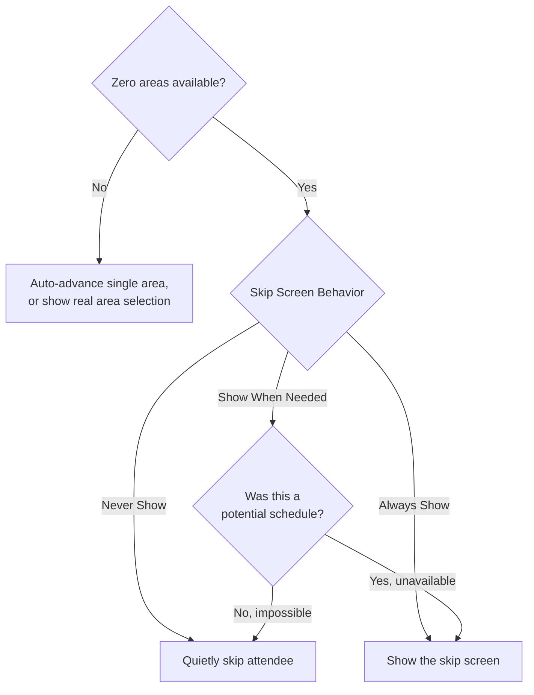

# Skip Screen Behavior

## Overview

Skip Screen Behavior is a per-kiosk (Device) setting that controls when the check-in "skip" screen appears. The skip screen is the area selection screen shown when an attendee reaches area selection but has no valid opportunity to check into. It is a tri-state setting: `Never Show` (quietly skip the attendee), `Show When Needed` (skip only when the attendee could never check in, but show when a valid room exists yet is unavailable), and `Always Show`. It applies to the web/Obsidian check-in kiosk.

## Why It Exists

The two prior behaviors were each wrong in opposite directions. Legacy check-in always auto-skipped an attendee with no option, so staff did not learn that (say) a 4-year-old could not join a high-school-only group until after the older sibling was already checked in and labels had printed. Next-gen check-in flipped to always showing the skip screen, which is correct for the "room is full" case but noisy when the attendee could never have checked in at all: operators had to acknowledge a skip screen for a person who was never eligible.

Skip Screen Behavior lets each kiosk choose where on that spectrum it wants to sit, and makes `Show When Needed` (the middle ground) the default: show the screen when it plausibly matters, skip silently when it never could.

## Mental Model

The "skip screen" is not a distinct screen. It is the ordinary area selection screen in the specific case where there are zero available areas for the current attendee, so the operator's only real action is to skip that person or schedule.

The decision is made at one point in the check-in session flow, immediately before the area screen would render (`withNextScreenFromAbilityLevelSelect`). At that point the session already knows how many areas are available. Skip Screen Behavior only governs the zero-area case; a single available area still auto-advances and multiple areas still show a genuine selection screen regardless of this setting.

The middle mode hinges on one distinction:

- **Impossible** — the schedule was never a real possibility for this attendee (no group ever matched). Example: a 4-year-old and a high-school-only room.
- **Unavailable** — a valid group existed for the attendee but no location survived filtering, typically because the room is full.

`Show When Needed` skips the impossible case and shows the unavailable case. `Never Show` treats both as skip; `Always Show` treats both as show.



## What You Need to Know

**It is a Device attribute, not a template or block setting.** The value is stored as the entity attribute `core_device_KioskSkipScreenBehavior` on the kiosk Device, qualified to the Check-in Kiosk device type. Like the other next-gen kiosk settings (adding/editing families), it is edited on the Device record and read through `DeviceCache.GetAttributeValue`. See [docs/check-in/kiosk-configuration.md](kiosk-configuration.md) for the broader kiosk configuration picture.

**The default is `Show When Needed`, and the enum backs that with `0`.** `SkipScreenBehavior.ShowWhenNeeded = 0` deliberately, so that a missing or unset attribute value resolves to the intended default rather than to `Never Show`. This matters during the window before the attribute registration is rolled up, and defensively anywhere the value is read.

**The "when needed" gate is family-mode only.** The impossible-vs-unavailable distinction is evaluated using the current attendee's `potentialScheduleIds` against the current family schedule, and only when the check-in type is Family. In individual mode, `Show When Needed` behaves like `Always Show` for the zero-area case. This is intentional given the current scope (the setting governs the area screen, and the potential-schedule signal is a family-flow concept).

**It supersedes the skip side effect of "Select All Schedules Automatically".** That kiosk block setting previously also suppressed the skip screen when there was nothing to check into. Skip Screen Behavior is now the single authority on the skip decision, so that side effect was removed. "Select All Schedules Automatically" keeps its actual job (auto-selecting schedules so the schedule screen is not shown). See [Rock.Blocks/CheckIn/CheckInKiosk.cs](../../Rock.Blocks/CheckIn/CheckInKiosk.cs) for the reworded description.

**It only affects the area screen.** The ability-level, group, and location screens have their own show/skip logic that this setting does not touch. The name is intentionally screen-agnostic ("Skip Screen", not "Area Skip Screen") to leave room for future screens, but today it is scoped to area selection only.

**Web kiosk only.** This governs the Obsidian check-in kiosk session (`checkInSession.partial.ts`). Mobile check-in is out of scope here.

**Reload the kiosk after changing the value.** The kiosk configuration (including this value) is fetched into the client and cached; an already-running session will not pick up a mid-flow change.

## Common Scenarios

**"A young child keeps forcing operators through an empty skip screen."** If the child is genuinely never eligible for what is offered, set the kiosk to `Show When Needed` (the default) so the impossible case is skipped silently while a merely-full room still prompts.

**"We want operators to confirm every skip explicitly."** Set `Always Show`. Every zero-area attendee produces the skip screen.

**"Restore the old auto-skip behavior for a specific kiosk."** Set `Never Show`. Attendees with no option are skipped without a prompt (with the original caveat that staff may not notice until after other family members are checked in).

## Key Architectural Decisions

### Stored as a per-kiosk Device attribute

The behavior is a station-level concern (different kiosks in different ministries want different noise levels), so it follows the established next-gen kiosk pattern: an entity attribute on Device qualified to the kiosk device type, read via `DeviceCache`. It rides to the client on the existing kiosk bag rather than requiring new block-config plumbing.

### `ShowWhenNeeded = 0` for a safe default

The enum's zero value is the default behavior on purpose. A missing attribute value, or any read that falls through to `default(SkipScreenBehavior)`, lands on the intended `Show When Needed` rather than silently reverting to the legacy `Never Show`.

### Single authority for the skip decision

Rather than let both this setting and "Select All Schedules Automatically" influence whether the skip screen shows (which can contradict each other, for example `Always Show` versus an auto-skip side effect), the skip decision was consolidated here. The schedule setting keeps only its schedule-selection role.

### Scoped to the area screen

The setting governs only the area selection screen for now, matching the concrete problem being solved. The label avoids "Area" so the same setting can later extend to other screens without a rename.

## Considered but Rejected

### A boolean "show/hide skip screen" toggle

Rejected. There are three genuinely distinct behaviors (never, conditional, always); a boolean cannot express the middle ground that is the whole point of the feature.

### Storing the setting on the CheckinType template

Rejected. The desired noise level is a per-station concern, not an org-wide policy. A template-level setting would force every kiosk sharing a template to behave the same.

### Keeping the "Select All Schedules Automatically" skip side effect

Rejected. Two independent settings both deciding whether the skip screen shows can contradict each other. Consolidating the decision into Skip Screen Behavior removes the conflict.

## Technical Reference

### Enum

`Rock.Enums/CheckIn/SkipScreenBehavior.cs`:

| Member | Value | Meaning |
|---|---|---|
| `ShowWhenNeeded` | 0 | Default. Skip when impossible, show when a valid room exists but is unavailable. |
| `NeverShow` | 1 | Always skip the attendee when there is no valid opportunity. |
| `AlwaysShow` | 2 | Always show the skip screen when there is no valid opportunity. |

The generated client enum is `Rock.JavaScript.Obsidian/Framework/Enums/CheckIn/skipScreenBehavior.ts`.

### Storage

- Attribute key constant: `DeviceAttributeKey.DEVICE_KIOSK_SKIP_SCREEN_BEHAVIOR = "core_device_KioskSkipScreenBehavior"` (`Rock/SystemKey/DeviceAttributeKey.cs`).
- Registered as a `SINGLE_SELECT` entity attribute on `Rock.Model.Device`, qualified to `DeviceTypeValueId = 41` (Check-in Kiosk), default `"0"`, `ddl` field type. The dropdown `values` qualifier is `1^Never Show,0^Show When Needed,2^Always Show` so the list reads in spectrum order while `0` remains the default.

Because it is an entity attribute qualified to the kiosk device type, it renders automatically as a dropdown on the Device edit panel for kiosk devices; no DeviceDetail UI code is involved.

### Read and flow to the client

`CheckInKioskSetup.GetKioskBag` (`Rock.Blocks/CheckIn/CheckInKioskSetup.cs:149`) reads the attribute and sets `KioskBag.SkipScreenBehavior`:

```csharp
var skipScreenBehavior = kiosk
    .GetAttributeValue( SystemKey.DeviceAttributeKey.DEVICE_KIOSK_SKIP_SCREEN_BEHAVIOR )
    .ConvertToEnum<SkipScreenBehavior>( SkipScreenBehavior.ShowWhenNeeded );
```

The runtime kiosk configuration builds its `Kiosk` bag through the same method (`Rock.Blocks/CheckIn/CheckInKiosk.cs:189`), so the value reaches the client as `KioskConfigurationBag.Kiosk.SkipScreenBehavior` and is read in the session as `configuration.kiosk?.skipScreenBehavior`. `Rock.ViewModels/CheckIn/KioskBag.cs` defines the property.

### Decision point

`checkInSession.partial.ts`, in `withNextScreenFromAbilityLevelSelect` (the transition into the area screen). When zero areas are available:

- `NeverShow` returns `withNextScreenBySkippingAttendee()`.
- `ShowWhenNeeded` skips only when, in Family mode, the current attendee's `potentialScheduleIds` does not include `currentFamilyScheduleId`; otherwise it shows the area screen.
- `AlwaysShow` shows the area screen.

`potentialScheduleIds` is populated server-side before location filtering (a schedule is "potential" if a group matched even if no location survived), which is what encodes the impossible-vs-unavailable distinction. See [docs/check-in/opportunity-filters.md](opportunity-filters.md) for the filtering that produces the available-area set.

### File Index

| File | Role |
|---|---|
| `Rock.Enums/CheckIn/SkipScreenBehavior.cs` | The enum. |
| `Rock/SystemKey/DeviceAttributeKey.cs` | Attribute key constant. |
| `Rock.ViewModels/CheckIn/KioskBag.cs` | `SkipScreenBehavior` property on the kiosk bag. |
| `Rock.Blocks/CheckIn/CheckInKioskSetup.cs` | `GetKioskBag` reads the attribute. |
| `Rock.Blocks/CheckIn/CheckInKiosk.cs` | Runtime kiosk config wiring; "Select All Schedules Automatically" block setting. |
| `Rock.JavaScript.Obsidian.Blocks/src/CheckIn/CheckInKiosk/checkInSession.partial.ts` | The skip decision in the session flow. |

### Related Docs

- [docs/check-in/kiosk-configuration.md](kiosk-configuration.md)
- [docs/check-in/opportunity-filters.md](opportunity-filters.md)
- [docs/check-in/check-in-overview.md](check-in-overview.md)
