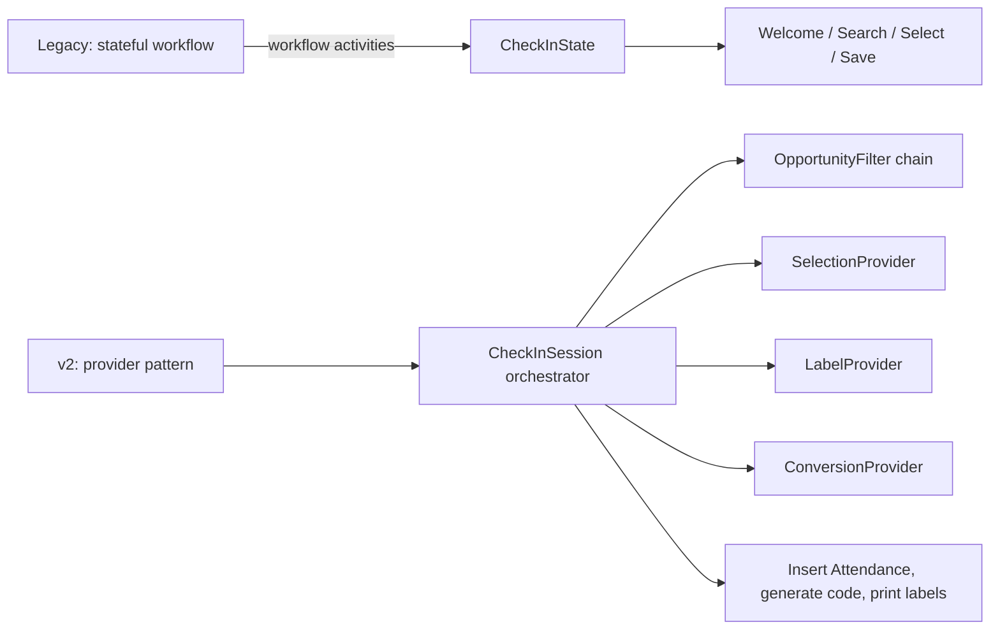

# Next-Gen Check-in (v2) vs Legacy

## Overview

Two check-in engines exist in Rock today: the **legacy engine** (`Rock.CheckIn`, written as a stateful workflow) and the **next-generation engine** (`Rock.CheckIn.v2`, a provider-pattern architecture with pluggable opportunity filters and label rendering). v2 is the default for new deployments; legacy is in maintenance mode for sites that have not migrated. Both write to the same `Attendance` and `AttendanceOccurrence` entities; the difference is the entry path and the extension model.

## Why It Exists

The legacy engine was built as a stateful workflow: each phase (Welcome, Search, Family Select, Person Select, Group/Location/Schedule Select, Save) was a workflow activity, with `CheckInState` carrying selection through. This made check-in slow to extend (a new opportunity filter required workflow surgery), hard to test (the workflow runtime made unit isolation difficult), and brittle (workflow state corruption manifested as confusing UI bugs).

The v2 rewrite addresses each concern with a different architecture: a `CheckInSession` orchestrator drives the phases, each phase is delegated to a swappable provider (`Default{Label,Selection,Conversion,OpportunityFilter}Provider`), and opportunity filters are individual classes implementing `OpportunityFilter`. Adding a new filter is a one-class change; provider replacement is supported per-deployment.

The migration is gradual. Sites deeply customized on the legacy engine continue to run it; new deployments use v2 by default. The team has been aggressive about porting and fixing in v2 (most recent fixes target v2, not legacy), but legacy still gets occasional fixes (`3c27476a73`, Fixes #6196, 2025-05-08 fixed schedule category exclusions).

## Mental Model

Legacy: workflow runtime drives a state machine. Customization means workflow surgery.

v2: the session orchestrates phases; each phase calls a provider. Customization is a new component implementation registered at startup.

## What You Need to Know

**v2 is the default for new deployments.** New configurations should use v2. Legacy is maintained for upgrade compatibility; do not start new deployments on it.

**Both engines write to the same `Attendance` rows.** The downstream side (Group attendance recording, reporting, Person profile) does not know which engine produced a row. Migration concerns are purely about the entry-side experience and customization model.

**v2's `OpportunityFilter` chain is the extension point for filtering.** Each filter is one class. The default chain includes Age, Grade, Gender, Ability Level, Membership, Schedule Requirement, Location Closed/Overflow, Threshold (capacity), Special Needs, Preferred Groups, Birth Month, DataView, Duplicate Check-in. Custom filters add to the chain.

**Legacy filtering is workflow-action-based.** Adding a filter to the legacy engine requires wiring a workflow action into the right phase activity. Operationally awkward; one of the main reasons v2 exists.

**v2 is faster.** The provider pattern executes more directly than the workflow runtime. For a kiosk's 6-second-per-family budget, this matters.

**Legacy still gets bug fixes for sites that need them.** Commit `3c27476a73` (Fixes #6196, 2025-05-08) fixed legacy schedule category exclusion. Site running legacy and hitting an issue can request a fix; the team supports both.

**Recent fixes target v2.** Most 2025-2026 check-in fixes are v2-specific: `c6d1ec2679` (Family check-in over-capacity), `cd1ee3883c` (archived groups), `42659c7705` (Display Address on Families), `af0e525bd9` (label fields), `3f10a44840` (NickName fix), `cd43d120de` (interleaved labels).

**Migration from legacy to v2 is per-deployment.** Configuration is largely portable; custom workflow actions in legacy do NOT auto-port to v2 OpportunityFilter implementations. Sites with custom filters need to rewrite them in v2's component model.

**Legacy and v2 cannot mix in one configuration.** A check-in template is one or the other; the kiosk renders one engine for the entire session. Some sites run both during transition (different kiosks on different engines).

**The `DefaultOpportunityFilterProvider` is overridable per-deployment.** Implement a custom provider; register at startup. Lets sites with substantially different filtering needs replace the entire chain rather than just add filters.

## Common Scenarios

**"I'm setting up a new check-in deployment."** Use v2. Configure the check-in template (CheckinType), label templates, KioskDevice rows. The default OpportunityFilter chain handles common cases.

**"I'm on legacy and want to migrate."** Plan rewrites of any custom workflow actions as v2 OpportunityFilter components. Configure new check-in templates targeting v2. Test against historic check-in scenarios. Migrate kiosks one at a time.

**"I need to add a custom 'must have completed orientation' filter."** Implement `OpportunityFilter` in v2. Register and add to the filter ordering. Custom filters work for v2; legacy needs workflow surgery.

**"I'm hitting a bug in legacy."** Verify it's not already fixed in a v2 (or v2-targeted release-note commit). Open an issue; legacy gets fixes when they're requested and trivial.

**"I want to override the entire selection logic."** v2 provider pattern: implement `DefaultSelectionProvider` (or its base) with custom logic. Register. The entire selection phase is now your code.

**"How do I tell which engine my check-in template uses?"** Check-in template configuration; the v2 engine binds to specific check-in template configurations. Older check-in templates are typically legacy unless explicitly migrated.

## Key Architectural Decisions

### Two engines during the migration

Legacy is too established to retire forcibly. v2 is the path forward for new deployments. Parallel maintenance is the cost.

### v2 as a provider-pattern architecture

Workflow-style state machines are awkward for hot-path code (kiosk's 6-second budget). Provider pattern executes directly and is easier to extend.

### `OpportunityFilter` as one-class units

Each filter is a discrete class. Adding a filter is a one-class change. This is the single biggest authoring win over legacy.

### Default providers (Selection, Label, Conversion, OpportunityFilter)

Each phase is overridable per-deployment. Lets organizations with substantially different needs swap a provider rather than fork the whole engine.

### Same Attendance rows in both engines

Reusing the existing Attendance entity preserves the value of historical data and downstream reporting. Forking the schema would have been operationally awful.

## Considered but Rejected

### Forced cutover from legacy to v2

Rejected. Customer-site impact too high.

### Adding more workflow-action-based filters to legacy

Rejected. Legacy was the wrong shape for this kind of extension; v2 was the answer.

### Replacing Attendance with a new entity for v2

Rejected. Reusing the existing entity preserves history and downstream paths.

## Technical Reference

### Legacy Engine (`Rock/CheckIn/`)

- `CheckInBlock`, `CheckInBlockMultiPerson`, `CheckInEditFamilyBlock`, `CheckInSearchBlock`: block bases.
- `CheckInState`: carries selection through workflow phases.
- `CheckInFamily`, `CheckInPerson`, `CheckInGroupType`, `CheckInGroup`, `CheckInLocation`, `CheckInSchedule`: selection model.
- `CheckinType`, `CheckinConfigurationHelper`: template configuration.
- `KioskDevice`, `KioskGroup`, `KioskLocation`, `KioskLabel`: cached kiosk runtime.

### v2 Engine (`Rock/CheckIn/v2/`)

- `CheckInSession`: session orchestrator.
- `DefaultLabelProvider`, `DefaultConversionProvider`, `DefaultOpportunityFilterProvider`, `DefaultSelectionProvider`: overridable phases.
- `Filters/`: opportunity-filter implementations.
- `Labels/`: label data sources, formatters, field configurations.
- `CloudPrintLabelConsumer`, `CloudPrintSendProxyStatusConsumer`, `CloudPrintSocket`: cloud-print path.
- `AreaOpportunity`, `GroupOpportunity`, `AbilityLevelOpportunity`: per-phase data shapes.

### Migration Status

- Default for new deployments: v2.
- Legacy in maintenance mode.
- Most 2025-2026 fixes target v2; legacy fixes are case-by-case.

### Affected Blocks

Both engines have parallel block sets. Configuration determines which.

### Related Docs

- [docs/check-in/check-in-overview.md](check-in-overview.md)
- [docs/check-in/opportunity-filters.md](opportunity-filters.md)
- [docs/check-in/label-designer-and-printing.md](label-designer-and-printing.md)
- [docs/check-in/kiosk-configuration.md](kiosk-configuration.md)
- [docs/check-in/mobile-check-in.md](mobile-check-in.md)

## Recent Impactful Changes

- **2026-03-31** ([commit `6c68685089`](https://github.com/SparkDevNetwork/Rock/commit/6c68685089)). v2 schedule selection excludes unnamed schedules.
- **2026-03-17** ([commit `c6d1ec2679`](https://github.com/SparkDevNetwork/Rock/commit/c6d1ec2679)). v2 Family check-in over-capacity logic correct across multi-service days (Fixes #6735).
- **2025-12-11** ([commit `cd1ee3883c`](https://github.com/SparkDevNetwork/Rock/commit/cd1ee3883c)). v2 archived-group exclusion (Fixes #6618).
- **2025-05-08** ([commit `3c27476a73`](https://github.com/SparkDevNetwork/Rock/commit/3c27476a73)). Legacy schedule category exclusion fix (Fixes #6196). Demonstrates that legacy still gets fixes when requested.
