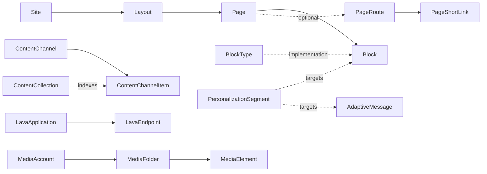

# CMS Domain Overview

## Overview

CMS is Rock's content, page, and site management system: `Site` -> `Layout` -> `Page` -> `Block` is the rendering hierarchy; `ContentChannel` -> `ContentChannelItem` is the content authoring model; `Lava Application` and `Lava Endpoint` provide URL-routable Lava-powered pages; `MediaElement` / `MediaFolder` / `MediaAccount` handle audio/video; `PersonalizationSegment` and `AdaptiveMessage` add audience-targeted content; `ContentCollection` indexes content for site-wide search; `PageShortLink` provides short URL aliases.

This is the most surface-area-heavy domain in Rock. The orientation here covers the major axes; deeper docs (Pages and Routing, Content Channels, Content Collections, Personalization, Lava Applications, Adaptive Messages, Media) deserve their own.

## Why It Exists

Rock has to be both a back-of-house management system and a front-of-house public website. The CMS is what lets churches build their public site (announcements, ministry pages, event calendars, sermon archives) on the same platform that runs their giving and check-in. Reusing one platform means content can join across domains (a sermon page can pull in attendance counts, a small group finder can filter by a person's preferences) without integration plumbing.

The Lava Applications subsystem (Helix support added `18d928dba9`, 2025-05-07) exists because non-developer administrators needed a way to build interactive Lava-powered pages without the full block-development cycle. A Lava Application is a URL-routed Lava endpoint that an admin can edit through Rock's UI.

The Content Collection / Universal Search work (`7fcfa422da` Lucene 10x speedup, `3cfb2abcec` index size limits, `3cf07ec652` ObjectDisposedException) addresses real-world performance and reliability problems in the search layer. Sites with thousands of content items hit edge cases that small sites do not.

The IP Geolocation country-blocking feature (`9b9da70e28`, 2025-04-19) was added in response to operator-reported high-risk traffic; blocking visitor access by country at the page or instance level is now configurable.

## Mental Model

Three orthogonal hierarchies, joined at the page/block layer:

The rendering side: `Site` defines a domain (or set of domains via `SiteDomain`), a default Layout, theming, security, and policies. `Layout` is the master template (the wrapping HTML around the page). `Page` is one URL location; it has zero or more `Block` rows that are placed in named zones in the Layout. `BlockType` is the implementation (a C# class for legacy WebForms or a `Rock.Blocks.IRockObsidianBlockType` for Obsidian); `Block` is the placement (this BlockType, on this Page, in this Zone, with these settings).

The content side: `ContentChannel` is the container (Sermons, Articles, Press Releases). `ContentChannelItem` is the content unit. `ContentCollection` aggregates items across multiple channels for site-wide search (Lucene-backed by default).

The personalization layer: `PersonalizationSegment` defines an audience ("Active givers", "First-time visitors"). Blocks and Adaptive Messages can be filtered to show only when the visitor matches a segment. `RequestFilter` is the request-time evaluator that decides which segments apply.

## What You Need to Know

**Block edits are real-time and global.** Editing a block's settings affects every page rendering with that block (zone) immediately. There is no preview/draft state. Use a separate test site for risky changes.

**ContentChannelItem approval has multiple paths.** `IsApproved`, the channel's `RequiresApproval`, and the item's lifecycle (Pending -> Approved -> Denied) interact. Commit `559605a5d8` (2026-03-30) fixed an inconsistency where the Content Channel List block determined approved-status differently from the rest of Rock; the canonical evaluation now lives in one place.

**Content Channel Item caching exists since 2026-03-31.** Commit `a026231d9c` introduced caching for content channel items; sites that previously took the perf hit on repeated retrievals now hit the cache. Custom Lava that retrieves items via the `` block benefits automatically.

**Universal Search has TWO backends: Lucene (default) and Elasticsearch.** Lucene is local and zero-config; Elasticsearch is for high-volume sites. The 10x Lucene perf improvement (`7fcfa422da`, 2025-04-14) is forward-only. Elasticsearch added bulk indexing (`23ec04fc1f`).

**Content Collection indexing fails gracefully on oversized fields.** Commit `3cfb2abcec` (Fixes #6385) addressed an issue where large attribute values caused the entire collection-index job to throw, even when the attribute was not selected for indexing. The fix isolates the failure to the specific item.

**Page Short Links can expire.** Since `75e8de1bc4` (2026-01-01), short links support expiration dates. The Rock Cleanup job removes expired links and their interactions. Custom links should set expiration when the use case is bounded.

**IP Geolocation blocking is per-Page or instance-wide.** A high-risk country can be blocked across the entire Rock instance or for specific pages (`9b9da70e28`). Useful for limiting attack surface on public-facing forms.

**`AdaptiveMessage` is content-side personalization.** A message has multiple `Adaptation` rows, each tagged with `PersonalizationSegment`s. The Adaptive Message block selects the adaptation that matches the visitor's segments. Default adaptation (no segments) shows when no targeted version applies.

**Structured Editor supports file attachments since `f344809bbd`.** The structured-editor field type (used by Content Channel Items, several block bodies) handles file uploads inline.

**`RequestFilter` runs on every request.** Heavy custom request filters can affect performance. The default filters are cheap (cookie + segment-membership lookups).

## Common Scenarios

**"Add a new public-facing page."** Page Detail under the target Site. Choose Layout, set route, add Blocks per zone. Configure security if not public.

**"Create a sermon archive."** Define a ContentChannel "Sermons" with item attributes (Speaker, Series, Audio URL). The Sermon List block filters and presents items.

**"Site-wide search across sermons + articles + ministry pages."** Configure a ContentCollection that sources from each ContentChannel. The Universal Search block queries the collection.

**"Personalize a page header for first-time visitors."** Define a `Visitor` PersonalizationSegment, configure an AdaptiveMessage with a default adaptation and a visitor-targeted adaptation. The Adaptive Message block selects at render.

**"Build a custom Lava-powered REST endpoint."** Lava Application + Lava Endpoint. Configure the route, write the Lava in the endpoint body, optionally configure security. Helix support (`18d928dba9`) adds reactive/interactive capability.

**"Block traffic from a specific country."** IP Geolocation settings, instance-wide or per-Page (`9b9da70e28`).

## Key Architectural Decisions

### BlockType separation from Block

Modeling the implementation (BlockType) separately from the placement (Block) lets one block class be used across thousands of placements with per-placement settings. Editing the class affects every placement; editing a placement affects only that page.

### Content Channel as a configurable container

ContentChannelType defines the schema (which attributes are required, which fields exist on the channel itself); ContentChannel is one container of that type. This lets the same "type" be reused for multiple channels with different policies.

### ContentCollection as a separate aggregation layer

Site-wide search needs to query across multiple channels with different schemas. A separate aggregation layer (ContentCollection + ContentCollectionSource) keeps the per-channel model simple while supporting the cross-channel use case.

### Two universal-search backends

Lucene for sites that do not need an external service; Elasticsearch for sites with the volume and operational maturity to run one. Pluggable backend keeps both viable.

### LavaApplication on top of the page hierarchy

Lava Applications are URL-routable but not Pages: they are independent routes with their own Lava-driven content. This sidesteps the page/block infrastructure for use cases (interactive Lava, REST endpoints) that do not need it.

## Considered but Rejected

### Single content model across the platform

Rejected. ContentChannel works for content; Pages work for navigation; Lava Applications work for interactive endpoints. Unifying them would have produced one entity that does each badly.

### Always-on Elasticsearch dependency

Rejected. Most Rock instances are small enough that Lucene is sufficient. Forcing every deployment to run Elasticsearch would have been operationally onerous.

### Real-time block edits visible only to admins

Rejected. Edits go live immediately. The lack of preview/draft state is a known sharp edge; the alternative would have multiplied state-management complexity.

## Technical Reference

### Data Model (high-level)

| Entity | Purpose |
|---|---|
| `Site`, `SiteDomain` | Rendering root, theming, default layout, error pages, allowed domains. |
| `Layout` | Master template wrapping pages. |
| `Page`, `PageRoute`, `PageContext` | URL location, optional named route, optional context entity. |
| `Block`, `BlockType` | Block placement and implementation. |
| `PageShortLink` | Short-URL alias with optional expiration. |
| `HtmlContent` | Versioned HTML content for the HtmlContent block. |
| `ContentChannel`, `ContentChannelItem`, `ContentChannelType` | Content authoring. |
| `ContentCollection`, `ContentCollectionSource` | Cross-channel aggregation for search. |
| `ContentTopic`, `ContentTopicDomain` | Cross-channel topic tagging. |
| `LavaApplication`, `LavaEndpoint` | URL-routable Lava endpoints. |
| `LavaShortCode` | Database-backed Lava shortcodes. |
| `MediaAccount`, `MediaFolder`, `MediaElement` | Audio/video assets and metadata. |
| `PersonalizationSegment` | Audience definition. |
| `AdaptiveMessage`, `AdaptiveMessageAdaptation`, `AdaptiveMessageAdaptationSegment`, `AdaptiveMessageCategory` | Per-segment content variants. |
| `RequestFilter` | Per-request segment evaluator. |
| `PersistedDataset` | Cached dataset for high-volume Lava queries. |
| `PersonalLink`, `PersonalLinkSection`, `PersonalLinkSectionOrder` | Per-person bookmarks. |
| `RestController`, `RestAction` | REST API surface tracking. |

### Save Hook Behavior

`Page.SaveHook`, `Site.SaveHook`, `Layout.SaveHook`, `Block.SaveHook` invalidate `PageCache`, `SiteCache`, `BlockCache` respectively. Cache mirroring of `ISecured` is critical here (see [docs/group/group-caching.md](../group/group-caching.md) for the pattern).

`ContentChannel.SaveHook` triggers cleanup of items if the channel changes type.

`ContentCollectionSource.SaveHook` triggers re-indexing.

`MediaElement.SaveHook` triggers metadata refresh from the media provider.

### Affected Blocks and UI Surfaces

- **Site/Page admin:** Site Detail/List, Page Map, Page Properties, Layout Detail, Layout Block List, Page Routes, Block Type List/Detail.
- **Content:** Content Channel Detail/List, Content Channel Item Detail/View, Content Channel Type Detail.
- **Content Collection:** Content Collection Detail/List.
- **Personalization:** Personalization Segment Detail/List, Adaptive Message Detail/Adaptation Detail.
- **Media:** Media Account Detail/List, Media Folder Detail, Media Element Detail/List.
- **Lava:** Lava Application Detail/List, Lava Endpoint Detail/List, Lava Shortcode Detail/List.
- **Misc:** Cache Manager, HTML Content Approval, Personal Links.

### Extension Points

- **Custom block types.** Implement `Rock.Blocks.IRockObsidianBlockType` (or legacy `RockBlock` for WebForms) and register the entity-type.
- **Custom content channel types.** Configure `ContentChannelType` rows.
- **Custom personalization segments.** Configure with custom evaluator if needed.
- **Custom universal-search backends.** Implement an index component.
- **Custom request filters.** `RequestFilter` rows with custom evaluator components.

### File Index

- `Rock/Model/CMS/` (entities)
- `Rock.Blocks/Cms/` (Obsidian-aware C# blocks)
- `Rock/Cms/` (helpers, content collection indexing)
- `Rock/Web/Cache/Entities/` (Page, Site, Layout, Block, BlockType caches)

## Recent Impactful Changes

- **2026-04-24** ([commit `6638585514`](https://github.com/SparkDevNetwork/Rock/commit/6638585514)). Obsidian Content Channel View Block landed.
- **2026-03-30** ([commit `559605a5d8`](https://github.com/SparkDevNetwork/Rock/commit/559605a5d8)). Content Channel List and Content Collections now determine item approved status the same way as the rest of Rock.
- **2025-08-25** ([commit `f344809bbd`](https://github.com/SparkDevNetwork/Rock/commit/f344809bbd)). Structured Editor supports inline file attachments.
- **2025-05-07** ([commit `18d928dba9`](https://github.com/SparkDevNetwork/Rock/commit/18d928dba9)). Helix support for Lava Applications, enabling reactive/interactive Lava-powered pages.
- **2025-04-14** ([commit `7fcfa422da`](https://github.com/SparkDevNetwork/Rock/commit/7fcfa422da)). Universal Search Lucene backend ~10x faster on result retrieval.
