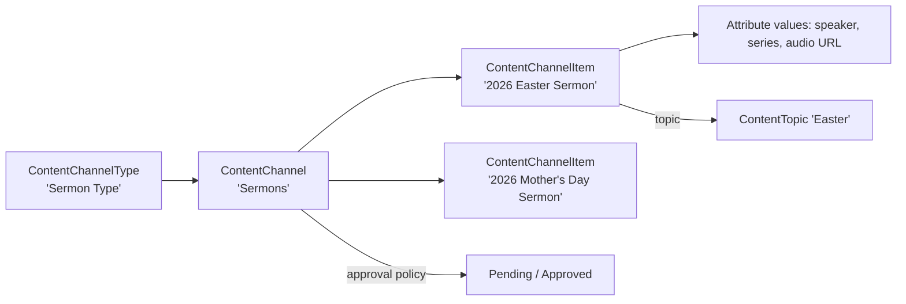

# Content Channels

## Overview

Content Channels are Rock's authored-content system: sermons, articles, press releases, devotionals. A `ContentChannel` is the container ("Sermons", "Articles"); `ContentChannelItem` rows are the items within. Each channel has a `ContentChannelType` defining the schema (which attributes are required, which date fields apply). The Content Channel View block renders items with Lava templates; the Content Channel Item Detail block edits items. Items can be approved or pending; the channel decides whether approval is required.

## Why It Exists

A church website needs authored content: sermons (with audio, speaker, series), articles (with author, summary, body), event announcements. Hardcoding each as a custom block would multiply effort; modeling each as a configurable channel with typed items lets administrators add new channels without code.

The recent Obsidian Content Channel View block (commit `6638585514`, 2026-04-24) is the modern render path, replacing the legacy WebForms version. Site builders should adopt the Obsidian variant for new placements.

The cache fix (commit `a026231d9c`, 2026-03-31) introduced caching for Content Channel Items, reducing repeated database hits when retrieving items. Custom Lava that retrieves items via `` benefits automatically.

## Mental Model

Each channel has its own attribute schema defined by the type. Items are authored, optionally go through approval, and become available to consuming blocks.

## What You Need to Know

**ContentChannelType defines the schema; ContentChannel is the container.** Multiple channels can share a type (Articles for English plus Articles for Spanish, both using the "Article Type"). Or each channel can have its own type.

**Items support custom attributes.** Defined on the type. Standard attribute system; custom attributes are configuration.

**Approval is per-channel configurable.** `RequiresApproval` on the channel. When true, items insert as Pending and need explicit approval.

**Approved-status determination is now consistent.** Pre-fix `559605a5d8` (2026-03-30), the Content Channel List block determined approved status differently from the rest of Rock. The fix consolidated. Custom blocks that check approved status should use the canonical evaluation.

**Content Channel Items now cache.** Since `a026231d9c` (2026-03-31), retrieved items hit the cache. Reduces database load on read-heavy public pages.

**Date fields control visibility windows.** `StartDateTime` and `ExpireDateTime` on items; the View block filters automatically.

**`ContentTopic` provides cross-channel tagging.** Topics span channels; an Easter sermon and an Easter article can share the topic. Topics use `ContentTopicDomain` for high-level grouping.

**Item body is typically Lava-rendered.** The View block applies a Lava template to items; standard merge fields apply (Item, Channel, plus attribute values).

**Indexing fails gracefully on oversized fields.** Pre-fix `3cfb2abcec` (Fixes #6385, 2025-07-30), large attribute values caused the entire collection-index job to throw. The fix isolates the failure.

**Modify-during-indexing race fixed.** Pre-fix `3cf07ec652` (Fixes #6365, 2025-07-02), modifying a Content Channel Item within a Content Collection during indexing produced ObjectDisposedException. The fix corrects the lifecycle.

## Common Scenarios

**"Set up a sermon archive."** Define ContentChannelType "Sermon" with attributes (Speaker, Series, AudioUrl). Create ContentChannel "Sermons" of that type. Add items per sermon. Display via Content Channel View block with a Lava template.

**"Add a Spanish-language article archive."** Two channels of the Article type, one English and one Spanish. Filter the View block by channel.

**"Require approval for new items."** Set `ContentChannel.RequiresApproval = true`. New items insert as Pending; approval is an admin action.

**"Set a publication date."** Item's `StartDateTime` is when it becomes visible. `ExpireDateTime` is when it's hidden.

**"Tag an item with a cross-channel topic."** Add a `ContentTopic` reference on the item. Topics span channels.

**"Custom presentation for items."** Custom Lava in the View block. Standard merge fields available.

## Key Architectural Decisions

### Type vs Channel separation

Multiple channels of the same type share schema; each channel has its own approval and content lifecycle.

### Attribute-based schema

New fields are configuration. Hardcoded schemas would multiply migration work.

### Approval as per-channel toggle

Some channels require it (announcements); some don't (internal article drafts). Per-channel toggle.

### Cross-channel topics

Some content is naturally cross-channel; topic tagging supports this without forcing duplication.

### Lava-rendered body

Standard pattern for content systems; lets administrators customize presentation without code.

## Considered but Rejected

### Hardcoded sermon / article entities

Rejected. Configuration-as-data with attribute-based schema is the right shape.

### Always-approval workflow

Rejected. Some channels do not need approval; per-channel toggle is correct.

### Per-channel item caching opt-out

Rejected (so far). The 2026-03-31 caching change benefits all channels; opt-out can be added if needed.

## Technical Reference

### Schema (relevant subset)

`ContentChannelType`:
- `Name`, `Description`
- `IncludeTime`, `DisableContentField`, `DisablePriority`
- `DateRangeType` (NoDates / SingleDate / DateRange)
- `IncludeStatus`

`ContentChannel`:
- `ContentChannelTypeId`
- `Name`, `Description`
- `IconCssClass`
- `RequiresApproval`
- `ItemsManuallyOrdered`, `ChildItemsManuallyOrdered`
- `EnableRss`, `ChannelUrl`, `ItemUrl`
- `IsTaggingEnabled`

`ContentChannelItem`:
- `ContentChannelId`
- `Title`, `Content`, `Priority`
- `StartDateTime`, `ExpireDateTime`
- `Status` (Pending / Approved / Denied)
- `ApprovedDateTime`, `ApprovedByPersonAliasId`
- `ParentItemId` (hierarchy)

`ContentTopic`, `ContentTopicDomain`: cross-channel topic tagging.

### Affected Blocks

- **Public:** Content Channel View (Obsidian since `6638585514`), Content Channel Item View, Content Channel Items List.
- **Admin:** Content Channel Detail/List, Content Channel Item Detail, Content Channel Type Detail.
- **Reporting:** Content Channel Items count metrics.

### Related Docs

- [docs/cms/content-collections.md](content-collections.md) for cross-channel aggregation.
- [docs/cms/cms-overview.md](cms-overview.md)

## Recent Impactful Changes

- **2026-04-24** ([commit `6638585514`](https://github.com/SparkDevNetwork/Rock/commit/6638585514)). Obsidian Content Channel View Block landed.
- **2026-03-31** ([commit `a026231d9c`](https://github.com/SparkDevNetwork/Rock/commit/a026231d9c)). Caching for Content Channel Items.
- **2026-03-30** ([commit `559605a5d8`](https://github.com/SparkDevNetwork/Rock/commit/559605a5d8)). Content Channel List and Content Collections determine item approved status consistently with the rest of Rock.
- **2025-07-30** ([commit `3cfb2abcec`](https://github.com/SparkDevNetwork/Rock/commit/3cfb2abcec)). Content Collection indexing fails gracefully on oversized attribute values (Fixes #6385).
- **2025-07-02** ([commit `3cf07ec652`](https://github.com/SparkDevNetwork/Rock/commit/3cf07ec652)). Content Channel Item modification during Content Collection indexing no longer throws ObjectDisposedException (Fixes #6365).
