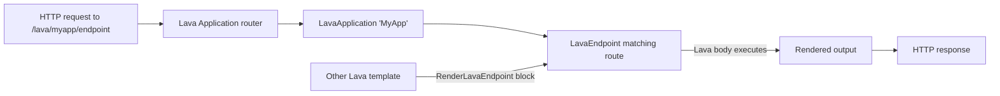

# Lava Applications

## Overview

Lava Applications are URL-routable Lava-powered endpoints that administrators author through the Rock UI. A `LavaApplication` is the namespace ("Reports", "PublicAPI"); `LavaEndpoint` rows are the individual routes within. Each endpoint has a route pattern, optional security, and a Lava body that runs on request. Helix support (added 2025-05-07 in commit `18d928dba9`) added reactive/interactive capability for richer pages. The `` block is how other Lava templates call into endpoints.

## Why It Exists

Some pages need server-side logic (querying entities, formatting output, returning JSON for AJAX) without justifying a full custom block. Hardcoding each as a custom block would be hostile to admins; Lava Applications give them a friendly authoring path with the full Lava ecosystem.

The Helix support (commit `18d928dba9`, 2025-05-07) elevated Lava Applications from "static rendered output" to "reactive pages" - HTMX-style partial-update interactions, server-driven dynamic content, all without a custom block. This is what makes Lava Applications viable for non-trivial public-facing UIs.

The querystring fix (commit `f009b63942`, Fixes #6633, 2026-01-06) addressed a bug where `RenderLavaEndpoint` did not parse querystrings appended to the route parameter. Pre-fix, `route='endpoint?param=value'` lost the param; the fix correctly parses.

The Body / RawBody merge fields (commit `8dfebb5533`, 2026-03-10) added access to the request body in Lava Applications. Previously the body was unavailable; the fix lets endpoints handle JSON POST data.

## Mental Model

Requests to the configured Lava-application URL prefix route to the matching application + endpoint. The endpoint's Lava body runs and produces the response. Other templates can call into endpoints via the `` block, embedding endpoint output within their own.

## What You Need to Know

**LavaApplication is the namespace; LavaEndpoint is the route.** One application has many endpoints; each endpoint has its own route pattern, security, and Lava body.

**Routes can have parameters.** `endpoint/{id}` captures the id as a Lava merge field. Standard route-pattern syntax.

**Helix support enables reactive interactions (since `18d928dba9`).** HTMX-style partial-page updates from Lava Applications. Useful for forms, infinite scroll, dynamic search.

**Body / RawBody merge fields available (since `8dfebb5533`).** The HTTP request body is accessible in the endpoint's Lava. Useful for JSON POST handling.

**`RenderLavaEndpoint` block embeds endpoints in templates.** Other Lava templates can call endpoints. Querystrings in the route parameter are now parsed correctly (since `f009b63942`).

**Endpoints can return any content type.** HTML (default), JSON, XML. The endpoint's Lava body can set the content type explicitly.

**Security is per-endpoint.** Public endpoints (Anonymous can View) and authenticated endpoints (specific role required) coexist in the same application.

**Lava command set is per-endpoint.** Some endpoints need `` (admin-trusted); most don't. Per-endpoint configuration.

**Caching can wrap endpoint output.** Use `` blocks within the endpoint body. Useful for public endpoints with high traffic.

**Endpoints are server-side; they're not a substitute for client-side JavaScript.** Helix gives reactive feel via HTMX, but heavy client-side logic still belongs in custom blocks or static JS.

**Endpoints can call other endpoints via `RenderLavaEndpoint`.** Composition pattern; reuse endpoint logic within other endpoints.

## Common Scenarios

**"Build a public REST endpoint that returns event JSON."** Create LavaApplication "Public API". Add LavaEndpoint with route "/events" returning JSON via `` and Lava JSON formatting. Set security to Anonymous Can View. Set content type to JSON.

**"Build a custom page with reactive search."** Helix-enabled application. One endpoint serves the initial page; another endpoint serves search results. Helix swaps in the search results without a full page reload.

**"Reuse complex Lava across templates."** Build the logic in a Lava endpoint. Other templates call it via ``.

**"Receive form submissions via Lava."** Public POST endpoint. Body merge fields available since `8dfebb5533`. Parse the body, perform actions (create entity, send communication), return success/failure JSON.

**"Cache an expensive endpoint."** Wrap the endpoint body in `` with appropriate duration. Repeated requests serve from cache.

**"Audit which endpoints exist."** LavaEndpoint List block. Surfaces all configured endpoints with their routes and security.

## Key Architectural Decisions

### Application as namespace, Endpoint as route

Multiple endpoints under one application keeps related routes grouped; matches REST API style.

### Lava as the language

Existing language; admins know it. Custom DSL would have multiplied learning.

### Helix for reactivity

HTMX-style server-driven reactivity. Avoids forcing every dynamic page through a custom block.

### Per-endpoint security and command set

Some endpoints are public (read-only); some are admin (write). Granular configuration is correct.

### `RenderLavaEndpoint` for composition

Endpoint-as-template-include lets logic be shared across templates and endpoints.

## Considered but Rejected

### One endpoint per application

Rejected. Multi-endpoint applications match real-world usage (REST APIs have multiple routes).

### Hardcoded request-body parsing

Rejected. Body merge fields make the HTTP body first-class in Lava.

### Forced Anonymous-only or authenticated-only

Rejected. Per-endpoint security is right.

## Technical Reference

### Schema (relevant subset)

`LavaApplication`:
- `Name`, `Description`
- `Slug` (URL prefix segment)
- `IsActive`
- `EnabledLavaCommands`

`LavaEndpoint`:
- `LavaApplicationId`
- `RoutePattern`
- `LavaTemplate` (the body)
- `ContentType`
- `EnabledLavaCommands` (override)
- Security via standard `ISecured`

### Service / API

`LavaApplicationService`, `LavaEndpointService`: standard CRUD.

### Block Integration

`RenderLavaEndpoint` ([Rock/Lava/Blocks/RenderLavaEndpoint.cs](../../Rock/Lava/Blocks/RenderLavaEndpoint.cs)): the `` block calls into endpoints from other templates.

### Affected Blocks

- **Admin:** Lava Application Detail/List, Lava Endpoint Detail/List.

### Related Docs

- [docs/lava/lava-overview.md](../lava/lava-overview.md)
- [docs/lava/writing-blocks.md](../lava/writing-blocks.md) for the RenderLavaEndpoint block.
- [docs/cms/cms-overview.md](cms-overview.md)

## Recent Impactful Changes

- **2026-03-10** ([commit `8dfebb5533`](https://github.com/SparkDevNetwork/Rock/commit/8dfebb5533)). Body and RawBody merge fields added to Lava Applications.
- **2026-01-06** ([commit `f009b63942`](https://github.com/SparkDevNetwork/Rock/commit/f009b63942)). `RenderLavaEndpoint` block correctly parses querystrings in the route parameter (Fixes #6633).
- **2025-05-07** ([commit `18d928dba9`](https://github.com/SparkDevNetwork/Rock/commit/18d928dba9)). Helix support for Lava Applications, enabling reactive/interactive Lava-powered pages.
