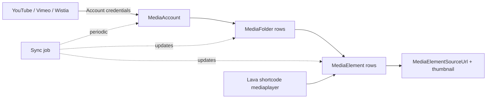

# Media Elements

## Overview

The Media subsystem manages audio and video assets sourced from external providers (YouTube, Vimeo, Wistia, Brightcove, Mux, etc.). A `MediaAccount` is one provider integration (account-level credentials, sync configuration). `MediaFolder` rows are folders within an account (matching the provider's folder hierarchy or custom organization). `MediaElement` rows are individual videos / audios with metadata (duration, thumbnail, source URLs, captions). The Media Player Lava shortcode embeds elements; sermon archives and content channels link to them.

## Why It Exists

Churches publish substantial media: sermons every week, Bible studies, special events. Hosting on Rock would multiply storage costs and bandwidth concerns; integrating with established providers (YouTube for free, Vimeo / Wistia / Mux for higher-end needs) leverages their infrastructure. Modeling the integration as a configurable Account + Folder + Element hierarchy lets Rock present a unified media library across providers.

The Media subsystem maintains its own metadata (titles, descriptions, durations, thumbnails) plus references to the provider-side asset. Sync jobs pull provider-side updates (new uploads, edited titles, changed thumbnails) into Rock so the local view stays current.

## Mental Model

The provider hosts the actual files; Rock holds metadata + references. Sync jobs keep the metadata fresh. Consumption (Media Player block, sermon archive blocks, content channel item attribute referencing a media element) hits Rock's metadata and embeds the provider's player.

## What You Need to Know

**One MediaAccount per provider integration.** A church using both YouTube and Vimeo has two accounts. Configuration includes credentials and provider-specific settings.

**Folders mirror or organize the provider's structure.** Some providers expose folders via their API; Rock can mirror them. Otherwise, custom folders organize elements logically.

**MediaElement holds the metadata.** Title, description, duration, thumbnail URL, source URLs (for streaming), captions / transcripts. The actual file lives at the provider; Rock holds the reference.

**Sync jobs run periodically.** New uploads on the provider become MediaElement rows; edits propagate. Manual re-sync via the admin UI. The sync component is per-provider.

**Source URLs include multiple resolutions / formats.** Videos typically have multiple resolutions (480p, 720p, 1080p); the player picks based on bandwidth. Rock stores the URL set so the player can choose.

**Captions are first-class.** Accessibility and search benefits. Captions stored as text with timing; the Media Player block surfaces them.

**Content Channel Item integration is via attributes.** A "Sermon" content type has a "Video" attribute of MediaElement type; per-item editors pick from configured MediaElements.

**Lava Media Player shortcode.** `{[ mediaplayer src:'<MediaElement Guid>' ]}`. Renders the provider's player with the MediaElement reference.

**Permission-protected media.** Some providers support signed URLs or DRM. Configure per-account; the player respects.

**Live streams supported in some integrations.** Account components can support live-stream events; the MediaElement may reference a live URL with start/end times.

## Common Scenarios

**"Set up a YouTube channel integration."** MediaAccount with YouTube provider. Configure API key. Run sync. Folders and Elements populate from YouTube.

**"Embed a video in a Lava template."** `{[ mediaplayer src:'<Guid>' ]}`. The shortcode renders the player.

**"Build a sermon archive."** ContentChannel "Sermons". Each item has a MediaElement attribute. The List / View blocks render the items with the player.

**"Manually sync a provider account."** Media Account Detail block has a Sync action. Useful when the scheduled sync job is delayed.

**"Add a custom provider."** Implement a `MediaAccountComponent` (or equivalent abstraction). Register. Configure as a new MediaAccount.

**"Disable a folder temporarily."** MediaFolder `IsActive = false`. Items remain accessible by direct reference; folder browsing skips inactive folders.

## Key Architectural Decisions

### External provider for hosting

Media files at scale are hosted at providers (YouTube, Vimeo, etc.). Rock holds metadata + references; the provider serves bytes.

### Account / Folder / Element hierarchy

Mirrors how providers typically organize content. Lets Rock present a unified library.

### Component-based provider abstraction

Different providers have different APIs. Pluggable components support each.

### Sync-based metadata refresh

Real-time push from providers is rare; periodic sync is the standard pattern.

### Multiple source URLs per element

Bandwidth-adaptive playback requires multiple resolutions. Storing the set lets the player pick.

## Considered but Rejected

### Hosting media directly in Rock

Rejected. Storage and bandwidth costs at scale are prohibitive for most churches.

### Single-provider integration

Rejected. Different deployments use different providers; pluggable is correct.

### Push-based provider updates

Rejected (mostly). Providers rarely push; pull-based sync with optional webhook augmentation is the realistic pattern.

## Technical Reference

### Schema (relevant subset)

`MediaAccount`:
- `Name`
- `EntityTypeId` (the component implementation)
- `LastRefreshDateTime`
- Per-provider configuration via attributes

`MediaFolder`:
- `MediaAccountId`
- `Name`, `Description`
- Provider-specific folder reference
- `IsActive`

`MediaElement`:
- `MediaFolderId`
- `Name`, `Description`
- `DurationSeconds`
- `ThumbnailDataJson` (multiple thumbnails)
- `MetricData`
- `SourceData` (multiple source URLs)
- `Captions`
- `MediaElementType`

### Service / API

`MediaAccountService`, `MediaFolderService`, `MediaElementService`: standard CRUD plus sync helpers.

### Affected Blocks

- **Admin:** Media Account Detail/List, Media Folder Detail, Media Element Detail/List.
- **Lava:** `mediaplayer` shortcode.
- **Content Channels:** items reference MediaElement via attribute.

### Related Docs

- [docs/cms/cms-overview.md](cms-overview.md)
- [docs/cms/content-channels.md](content-channels.md) for MediaElement-attribute usage.
- [docs/lava/shortcodes.md](../lava/shortcodes.md) for the `mediaplayer` shortcode.

## Recent Impactful Changes

(No release-note-tagged changes specifically to media in the last 18 months. Provider-specific updates ship as plugin migrations.)
