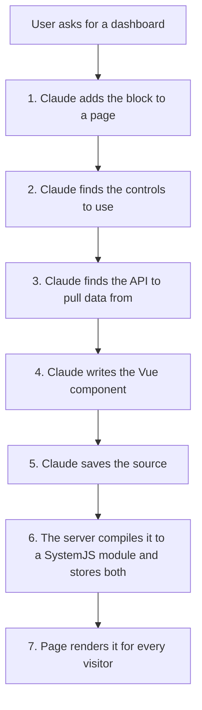

# Obsidian Content

> **Prototype, not in `develop`.** All of this lives on `feature-kh-obsidian-content`. Design history is in [specs/260721](../../specs/260721-obsidian-content-block-and-component-model.md) and [specs/260722](../../specs/260722-mcp-driven-obsidian-content-vibe-coding.md).

## What It Is

An admin drops one **Obsidian Content Detail** block on a page and writes a Vue component right there. The code is turned into a loadable module (in the admin's browser when saved from the editor, or on the server when saved through MCP), then stored in the database next to the original source. Visitors get only the finished module. No repo file, no Rock build.

The MCP layer lets Claude do the same thing from a chat, without anyone opening the editor.

## The MCP Path



| Step | Tool | Status |
|---|---|---|
| 1. Place the block | `FindPage`, `CreatePage`, `AddBlock` | Works |
| 2. Find controls | `ListObsidianControls`, `GetObsidianControl` | Not built. Claude reads the repo instead. |
| 3. Find APIs | `SearchRockApis` | Not built. Claude reads the repo instead. |
| 5 and 6. Save and compile | `SetContentSource` (and `GetContentSource` to re-read) | Works. The server compiles source-only saves itself. |

Two of the tools are unbuilt, and Claude works around both the same way, by reading the Rock repo off disk. Discovery (controls and data) is the remaining gap for a repo-less client; the compile step no longer is one, because the server does it.

Everything rides Rock's existing MCP endpoint at `/api/v2/mcp/{slug}`. Each tool is a C# method with an `[AgentToolGuid]`, and gets the acting person from `AgentRequestContext`. Writing is admin-gated.

---

### Step 1: Placing the block

[PageBuilderSkill](../../Rock/AI/Agent/PageBuilderSkill.cs) has three tools. `FindPage` does a partial name match so Claude can confirm the right page with you before touching anything. `CreatePage` makes a child page under a parent, inheriting the parent's layout (and therefore its site and zones). `AddBlock` places the block in a zone, defaulting to `Main`, and returns the new block's `IdKey`.

That `IdKey` is the handle for everything after this. It is what `SetContentSource` writes against.

No `ObsidianContent` row exists yet. The first save creates it.

---

### Step 2: Finding the right controls

**Today, Claude reads the repo.** The controls live in `Rock.JavaScript.Obsidian/Framework/Controls/`, currently 247 `.obs` files.

The filename maps straight onto the import path, so no lookup table is needed:

```
Framework/Controls/rockButton.obs   ->   import RockButton from "@Obsidian/Controls/rockButton.obs";
Framework/Controls/personPicker.obs ->   import PersonPicker from "@Obsidian/Controls/personPicker.obs";
```

To find a control by concept, Claude greps the directory. To learn how to use one, it opens the file and reads the `defineProps` block, the `defineEmits` block, the slots, and the template. That is the real API, not documentation about the API, which is the main advantage of reading source.

Two constraints on what Claude may reach for:

- **Only what is in the alias map is importable at runtime.** See [What Authored Code Can Use](#what-authored-code-can-use). Notably `@Obsidian/ViewModels/*` is not in the map: repo blocks import those as TypeScript types, which vanish at compile time, so nothing ever requests them at runtime.
- **There is no signal about which controls are safe to use.** No manifest, no public-versus-internal marker. Claude can pick a control that exists, compiles, and renders, but was never meant for general use.

**Without a repo, Claude has nothing.** `ListObsidianControls` and `GetObsidianControl` would read the same files off the instance's own disk and return them. The catch, already flagged in the spec: that assumes the control source is present, which holds for a development checkout but not for a deployed instance that ships only compiled output. That is the case a generated manifest would eventually solve.

---

### Step 3: Finding the right API

**The first move is usually to avoid the question.** Many Obsidian controls fetch their own data. A picker takes no data prop; it calls its own endpoint on mount. So picking the right control often deletes the API problem instead of solving it.

When the component genuinely needs data, **Claude reads the repo again.** Three places, in order of usefulness:

| Where | What is there |
|---|---|
| `Rock.Rest/v2/ControlsController.cs` | The endpoints the Obsidian controls themselves call. Pickers, trees, searches, preview lists. |
| `Rock.Rest/v2/Models/` | Entity endpoints (`PeopleController`, `EventItemsController`) plus action controllers for data views, followings, and workflows. |
| `Rock.Rest/Controllers/` | The v1 surface, much of it generated per entity from `ApiController<T>` rather than written as files. |

A v2 action carries everything Claude needs to call it correctly, as attributes:

```csharp
[RoutePrefix( "api/v2/controls" )]                        // class level: the base route
...
    [HttpPost]
    [Route( "AccountPickerGetChildren" )]                 // the verb and the route
    [Authenticate]                                        // requires a logged-in person
    [ProducesResponse( HttpStatusCode.OK,
        Type = typeof( List<TreeItemBag> ) )]             // the response shape
    public IActionResult AccountPickerGetChildren(
        [FromBody] AccountPickerGetChildrenOptionsBag options )   // the request shape
```

So route, verb, request bag, and response bag all read straight off the method. The bag types resolve into `Rock.ViewModels`, where Claude can read the actual fields.

**The trap worth knowing.** REST actions carry their own security, tracked as `RestController` and `RestAction` entities and enforced through attributes like `[Authenticate]` and `[ExcludeSecurityActions]`. Authored code runs **as whoever views the page**, not as the admin who wrote it. So an endpoint that returns data fine while Claude and you are testing as an admin can return 403 for a normal member, and the dashboard silently shows nothing. Anything built this way needs one pass viewed as a non-admin.

**Without a repo,** `SearchRockApis` would query the same metadata Rock already carries and return endpoint signatures.

---

### Step 4: Writing the component

The authoring contract is narrow, and Claude has to stay inside it:

- A `<template>`, a `<script setup>` in **plain JavaScript**, and optional `<style>` blocks (scoped or not).
- `lang="ts"` is not supported. If Claude is adapting an existing repo `.obs`, it has to strip the `lang="ts"` and every type annotation.
- Imports are limited to the alias map plus the vendor bundle.
- The import statements must be plain top-level forms. The compiler pulls them out with a regex, not a real parser, so exotic import syntax is not guaranteed to survive.

---

### Steps 5 and 6: Compiling it

**The server compiles.** There is exactly one compiler implementation, the [obsidianContentCompiler](../../Rock.JavaScript.Obsidian/Framework/Libs/obsidianContentCompiler.ts) library bundle, and it runs in two hosts:

- **The browser editor** loads it on demand through the import map (edit mode only, never for a visitor) and compiles on save.
- **The server** runs the same built bundle (`~/Obsidian/Libs/obsidianContentCompiler.js`) inside a [Jint](https://github.com/sebastienros/jint) JavaScript engine via [ObsidianContentCompiler.cs](../../Rock/Cms/ObsidianContentCompiler.cs) whenever `SetContentSource` receives source without compiled output.

Because both hosts run the same bundle, the same source always produces the same module. The engine is created per compile and disposed afterward (steady-state memory cost is zero; the measured cold path is under a second), it is constrained by a timeout and a recursion limit, and it only ever compiles, never executes, the output. A client that can compile (Claude Code with the repo) may still supply `compiledContent` itself; both paths store the same thing.

Two Jint-specific constraints live in the bundle and must stay there: source map generation is disabled (Jint's `Function.prototype.toString` returns `[native code]`, which breaks `source-map-js` regenerating its own sort function), and the Vue version comes from `@vue/compiler-sfc`'s own `version` export rather than an `import` from `vue`, keeping the bundle dependency-free so the server needs no import map.

**What the compiler actually does,** in order:

1. `parse()` the single-file component into a descriptor. Parse errors stop here.
2. Hash the source into a scope id, used for scoped styles and to dedupe injected style tags.
3. `compileScript(descriptor, { id, inlineTemplate: true })`. The `inlineTemplate` flag compiles the template **into** the setup function's returned render function, resolving template names against the setup scope. This is what produces clean strict-mode output instead of the old `with (_ctx)` block.
4. `rewriteDefault()` turns `export default` into a plain local variable.
5. `compileStyle()` per style block, applying the scope id to the scoped ones.
6. Pull the imports out of the compiled script, then rebuild the whole thing as a `System.register` module: dependency list, one setter per dependency to copy bindings in, the body, the scope id, a guarded style injection, and `_export("default", ...)`.
7. `new Function("System", output)` to **parse** the result without running it, so a syntax error is caught now rather than at render time.

The output has to be SystemJS format rather than normal ESM because Rock resolves `@Obsidian/...` through a SystemJS alias map, not a browser import map. A native `import()` of those names would simply fail.

**Why this runs fine outside a browser.** The compiler is Node-native and the assembler is pure string manipulation. The only `document` reference is *inside the generated output string*, and that runs later in the visitor's browser, never during the compile.

---

### Saving it

`SetContentSource(blockId, source, compiledContent?, compiledVueVersion?)`.

The server checks, in this order:

1. **Is there source at all.**
2. **If compiled output was supplied:** a version string must be present, and the payload must match `^\s*System\.register\s*\(\s*\[`.
3. **Is the caller allowed:** EDIT authorization on that block, using `AgentRequestContext.CurrentPerson`.
4. **If no compiled output was supplied:** the server compiles the source itself (see above). On success the compiled module and its Vue version are stored alongside the source. **On failure nothing is stored** and the tool returns the compiler's error text, so the agent fixes the source and retries. A saved-but-blank block with no error anywhere was the failure mode this replaced.

Then it upserts the row through `GetOrCreateByBlockId` and stamps `CompiledDateTime`.

The server still never **runs** the module; it compiles it. Whether the code behaves correctly at render time remains the author's responsibility.

**The one uncompiled path left:** when the compiler bundle itself is not deployed (a half-built instance), the source-only save still succeeds so work is not lost, and the tool says plainly that the content will not render until an administrator opens the editor and saves there. No compile-on-view is promised, because none exists.

---

### Step 7: Rendering

Identical whether a human or Claude wrote it. See [How Content Renders](#how-content-renders).

## How Content Renders

The block looks up its `ObsidianContent` row by its own `BlockId`. Everyone gets `CompiledContent`. Only editors get `Source`.

To render, [viewPanel.partial.obs](../../Rock.JavaScript.Obsidian.Blocks/src/Cms/obsidianContentDetail/viewPanel.partial.obs) runs the stored module with a fake `System` object to catch its registration, loads each dependency through Rock's real loader, executes it, and mounts the result. It does this by hand instead of loading a URL because Rock's loader appends `.js` and `?fingerprint` to any path, which a `blob:` URL cannot carry.

No compiler is involved in rendering. That is the point: the compiler and its `eval` only ever load in the admin edit path.

## What Authored Code Can Use

**Controls and utilities.** Any `@Obsidian/...` path in the alias map ([System/core.ts:37](../../Rock.JavaScript.Obsidian/System/core.ts:37)): Controls, Core, Directives, Enums, FieldTypes, Libs, PageState, SystemGuids, Templates, Utility, ValidationRules. Plus `vue`, `axios`, `luxon`, `mitt`, `ant-design-vue`, and `tslib` from the vendor bundle. `@Obsidian/ViewModels/*` is not in the map.

**API calls.** `get`, `post`, `useHttp`, and friends from `@Obsidian/Utility/http`. Authored code runs **as the visitor**, in their browser, with their cookie and their permissions. It can reach anything they could reach from the browser console, and nothing more. That is why authoring is admin-only: you gate who writes the code, because the code inherits whoever views it.

**Gotcha.** The authored component mounts inside the host block's tree, so `useInvokeBlockAction()` resolves and points at the host block's `SaveContent`. That action re-checks permissions on the server, so it is not an escalation, but it is not an intended surface either.

## The Data

One row per block placement, in `[ObsidianContent]`.

| Column | Why |
|---|---|
| `BlockId` | The owning block. Cascade delete. Null is reserved for a future shared library. |
| `Source` | The original code. Kept so it can be re-edited and recompiled later. |
| `CompiledContent` | What browsers actually load. |
| `CompiledVueVersion` | Which Vue it was built against. |
| `CompiledDateTime` | Stamped on save. |
| `Name`, `IsActive` | Unused today. For the future library. |

## Files

| Purpose | Path |
|---|---|
| MCP authoring tools | [ObsidianVibeCodingSkill.cs](../../Rock/AI/Agent/ObsidianVibeCodingSkill.cs) |
| MCP page and block tools | [PageBuilderSkill.cs](../../Rock/AI/Agent/PageBuilderSkill.cs) |
| Entity and service | [ObsidianContent.cs](../../Rock/Model/CMS/ObsidianContent/ObsidianContent.cs), [ObsidianContentService.cs](../../Rock/Model/CMS/ObsidianContent/ObsidianContentService.cs) |
| Block (C#) | [ObsidianContentDetail.cs](../../Rock.Blocks/Cms/ObsidianContentDetail.cs) |
| Block (Vue) and partials | [obsidianContentDetail.obs](../../Rock.JavaScript.Obsidian.Blocks/src/Cms/obsidianContentDetail.obs) |
| Compiler (shared lib, both hosts) | [obsidianContentCompiler.ts](../../Rock.JavaScript.Obsidian/Framework/Libs/obsidianContentCompiler.ts) |
| Compiler loader (browser edit path) | [obsidianContentCompiler.partial.ts](../../Rock.JavaScript.Obsidian.Blocks/src/Cms/obsidianContentDetail/obsidianContentCompiler.partial.ts) |
| Compile service (server, Jint) | [ObsidianContentCompiler.cs](../../Rock/Cms/ObsidianContentCompiler.cs) |
| Alias map and loader | [System/core.ts](../../Rock.JavaScript.Obsidian/System/core.ts) |
| Control endpoints | [Rock.Rest/v2/ControlsController.cs](../../Rock.Rest/v2/ControlsController.cs) |
| Migration | [202607221200000_AddObsidianContent.cs](../../Rock.Migrations/Migrations/202607221200000_AddObsidianContent.cs) |

## Gaps

1. **No discovery tools.** Claude finds controls and APIs by reading the repo. Works from Claude Code, impossible from anywhere else. This is now the only thing keeping the flow off Claude Chat and Claude Desktop.
2. **No Vue version check on render.** The server stamps the compile-time version on saves it compiles, but client-supplied versions are stored as given and nothing validates at render time.
3. **The editor's preview note is wrong.** It claims API calls will not work in the preview. They do: `useHttp()` falls back to the real functions and the frame is same-origin. The preview isolates crashes and DOM changes, not the login session.
4. **The branch is 124 commits behind `develop`.** The migration's EF snapshot needs regenerating with `Add-Migration`.
5. **The block's own editor still compiles client-side.** Harmless (it runs the same shared bundle), but consolidating its save path onto the server compiler is a future cleanup.
