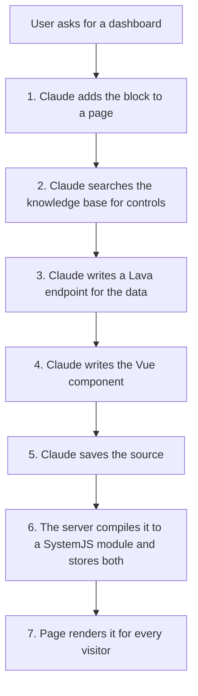

# Obsidian Content

> **Prototype, not in `develop`.** All of this lives on `feature-kh-obsidian-content`. Design history is in [specs/260721](../../specs/260721-obsidian-content-block-and-component-model.md) and [specs/260722](../../specs/260722-mcp-driven-obsidian-content-vibe-coding.md).

## What It Is

An admin drops one **Obsidian Content Detail** block on a page and writes a Vue component right there. The code is turned into a loadable module (in the admin's browser when saved from the editor, or on the server when saved through MCP), then stored in the database next to the original source. Visitors get only the finished module. No repo file, no Rock build.

The MCP layer lets Claude do the same thing from a chat, without anyone opening the editor.

## The MCP Path



| Step | Tool | Status |
|---|---|---|
| 1. Place the block | `FindPage`, `CreatePage`, `AddBlock` | Works |
| 2. Find controls | Knowledge base `search_code`, scoped by `GetRockVersion` | Works, via a second MCP server |
| 3. Find data | `CreateLavaEndpoint`, `GetLavaEndpoint`, `UpdateLavaEndpoint` | Works |
| 5 and 6. Save and compile | `SetContentSource` (and `GetContentSource` to re-read) | Works. The server compiles source-only saves itself. |

Every step now has a path that does not require a repo checkout. Control discovery is the one that reaches outside Rock: it depends on the client also being connected to the Rock knowledge base MCP server. Data discovery was replaced rather than solved, by having Claude write a Lava endpoint that returns exactly the shape the component renders instead of hunting for an existing REST endpoint.

Everything rides Rock's existing MCP endpoint at `/api/v2/mcp/{slug}`. Each tool is a C# method with an `[AgentToolGuid]`, and gets the acting person from `AgentRequestContext`. Writing is admin-gated.

---

### Step 1: Placing the block

[PageBuilderSkill](../../Rock/AI/Agent/PageBuilderSkill.cs) has three tools. `FindPage` does a partial name match so Claude can confirm the right page with you before touching anything. `CreatePage` makes a child page under a parent, inheriting the parent's layout (and therefore its site and zones). `AddBlock` places the block in a zone, defaulting to `Main`, and returns the new block's `IdKey`.

That `IdKey` is the handle for everything after this. It is what `SetContentSource` writes against.

No `ObsidianContent` row exists yet. The first save creates it.

---

### Step 2: Finding the right controls

**Claude searches the Rock knowledge base** ([knowledge.rockrms.com](https://knowledge.rockrms.com)), which indexes every `.obs` file in `Rock.JavaScript.Obsidian/Framework/Controls/` (currently 247 top-level controls plus 28 under `Internal/`) with a written description, a role classification, per-release version scoping, and a raw-source URL per file.

The flow is search then fetch. `search_code` with `source_type: "obs"` finds candidates by concept ("person picker", "grid with columns") rather than by guessed filename; each result carries a `file_url` that returns the actual source. Claude reads the `defineProps` block, the `defineEmits` block, the slots, and the JSDoc comments. That is the real API rather than documentation about the API, which is the point of reading source.

The filename maps straight onto the import path, so no lookup table is needed:

```
Framework/Controls/rockButton.obs   ->   import RockButton from "@Obsidian/Controls/rockButton.obs";
Framework/Controls/personPicker.obs ->   import PersonPicker from "@Obsidian/Controls/personPicker.obs";
```

**Version scoping is not optional.** The knowledge base is scoped per Rock release, so an unscoped lookup answers for whatever release that service treats as current. `GetRockVersion` (on the ObsidianVibeCoding skill) reports this instance's version, and the skill instructions require passing it to every lookup. Skipping it produces the worst kind of failure: a prop that exists in the docs, does not exist on this instance, and only surfaces as a compile error much later.

Two constraints on what Claude may reach for:

- **Only what is in the alias map is importable at runtime.** See [What Authored Code Can Use](#what-authored-code-can-use). Notably `@Obsidian/ViewModels/*` is not in the map: repo blocks import those as TypeScript types, which vanish at compile time, so nothing ever requests them at runtime.
- **`Controls/Internal/` is the public-versus-internal signal.** It is a path convention rather than an enforced boundary (the alias map is a wildcard, so `Internal` controls do resolve at runtime), but the skill instructions tell Claude to prefer a top-level control and to say so before using an internal one.

**This is composition across two MCP servers, not an integration.** Rock cannot see or verify the knowledge base's tools; the skill instructions name them, and they only resolve when the client has both servers connected. When the knowledge base is unavailable, the instructions require Claude to say so and ask rather than guess a control's props or quietly substitute plain HTML.

**Two fallbacks exist if that dependency ever needs replacing.** Neither is built, and both were confirmed viable during the investigation that chose this approach:

- **Source maps already ship the source.** `RockWeb/Obsidian/Controls/*.obs.js.map` embeds the complete original `.obs` in `sourcesContent` for 242 of 248 controls, about 1.69 MB total. An instance can read its own control source off disk today with no build change. This falsifies the earlier claim in [specs/260804](../../specs/260804-vibe-coding-findings.md) that a deployed instance ships only compiled output.
- **The build already generates an API manifest.** 249 `.d.ts` files under `dist/Framework/Controls/` carry every prop with its type, default, required flag, JSDoc, and slot list. They are cleaner to parse than source but are not currently deployed.

---

### Step 3: Getting the data

**The first move is usually to avoid the question.** Many Obsidian controls fetch their own data. A picker takes no data prop; it calls its own endpoint on mount. So picking the right control often deletes the data problem instead of solving it.

When the component genuinely needs data, **Claude writes a Lava endpoint rather than hunting for an existing REST one.** The [LavaDataSkill](../../Rock/AI/Agent/LavaDataSkill.cs) exposes `CreateLavaEndpoint`, `GetLavaEndpoint`, and `UpdateLavaEndpoint`. This replaced API discovery instead of solving it: writing Lava returns exactly the shape the component renders, with permissions decided at creation time, and it removes the hardest unbuilt step from the original flow.

The design is covered in [specs/260803](../../specs/260803-lava-endpoint-data-for-obsidian-content.md). The parts that matter when reading authored components:

- **One Lava application per block**, named after the dashboard. Every endpoint for that block shares the `applicationSlug`, so security and configuration rigging are set once.
- **Endpoints return `application/json`**, set through `ContentType` in the endpoint's settings blob.
- **The component calls them through `useLavaApp`** from `@Obsidian/Utility/lavaApp`, never a hand-rolled URL. It ships as framework code so a fix there reaches components already compiled and stored in the database.
- **`invoke` returns the same shape as `invokeBlockAction`**, so `isSuccess` / `data` / `errorMessage` work exactly as they do in a repo block.
- **Every write test-executes the template** and returns the result, so the agent finds out the Lava is broken while it can still fix it. The test renders as the current person with no HTTP request context, so a pass is not proof it works for a visitor.

**The trap worth knowing.** Authored code runs **as whoever views the page**, not as the admin who wrote it. A Lava endpoint that returns data fine while you and Claude test as an admin can return nothing for a normal member, and the dashboard silently shows an empty state. A newly created Lava application also has no security rules until an administrator adds them. Anything built this way needs one pass viewed as a non-admin.

**Existing REST endpoints are still reachable** from authored code through `@Obsidian/Utility/http`, and a control that fetches its own data does exactly that. What went away is the need for Claude to *discover* them: writing a Lava endpoint is both easier to get right and easier to secure than finding an existing controller action and matching its request and response bags.

---

### Step 4: Writing the component

The authoring contract is narrow, and Claude has to stay inside it:

- A `<template>`, a `<script setup>` in **plain JavaScript**, and optional `<style>` blocks (scoped or not).
- `lang="ts"` is not supported. If Claude is adapting an existing repo `.obs`, it has to strip the `lang="ts"` and every type annotation.
- Imports are limited to the alias map plus the vendor bundle.
- The import statements must be plain top-level forms. The compiler pulls them out with a regex, not a real parser, so exotic import syntax is not guaranteed to survive.

---

### Steps 5 and 6: Compiling it

**The server compiles.** There is exactly one compiler implementation, the [obsidianContentCompiler](../../Rock.JavaScript.Obsidian/Framework/Libs/obsidianContentCompiler.ts) library bundle, and it runs in two hosts:

- **The browser editor** loads it on demand through the import map (edit mode only, never for a visitor) and compiles on save.
- **The server** runs the same built bundle (`~/Obsidian/Libs/obsidianContentCompiler.js`) inside a [Jint](https://github.com/sebastienros/jint) JavaScript engine via [ObsidianContentCompiler.cs](../../Rock/Cms/ObsidianContentCompiler.cs) whenever `SetContentSource` receives source without compiled output.

Because both hosts run the same bundle, the same source always produces the same module. The engine is created per compile and disposed afterward (steady-state memory cost is zero; the measured cold path is under a second), it is constrained by a timeout and a recursion limit, and it only ever compiles, never executes, the output. A client that can compile (Claude Code with the repo) may still supply `compiledContent` itself; both paths store the same thing.

Two Jint-specific constraints live in the bundle and must stay there: source map generation is disabled (Jint's `Function.prototype.toString` returns `[native code]`, which breaks `source-map-js` regenerating its own sort function), and the Vue version comes from `@vue/compiler-sfc`'s own `version` export rather than an `import` from `vue`, keeping the bundle dependency-free so the server needs no import map.

**What the compiler actually does,** in order:

1. `parse()` the single-file component into a descriptor. Parse errors stop here.
2. Hash the source into a scope id, used for scoped styles and to dedupe injected style tags.
3. `compileScript(descriptor, { id, inlineTemplate: true })`. The `inlineTemplate` flag compiles the template **into** the setup function's returned render function, resolving template names against the setup scope. This is what produces clean strict-mode output instead of the old `with (_ctx)` block.
4. `rewriteDefault()` turns `export default` into a plain local variable.
5. `compileStyle()` per style block, applying the scope id to the scoped ones.
6. Pull the imports out of the compiled script, then rebuild the whole thing as a `System.register` module: dependency list, one setter per dependency to copy bindings in, the body, the scope id, a guarded style injection, and `_export("default", ...)`.
7. `new Function("System", output)` to **parse** the result without running it, so a syntax error is caught now rather than at render time.

The output has to be SystemJS format rather than normal ESM because Rock resolves `@Obsidian/...` through a SystemJS alias map, not a browser import map. A native `import()` of those names would simply fail.

**Why this runs fine outside a browser.** The compiler is Node-native and the assembler is pure string manipulation. The only `document` reference is *inside the generated output string*, and that runs later in the visitor's browser, never during the compile.

---

### Saving it

`SetContentSource(blockId, source, compiledContent?, compiledVueVersion?)`.

The server checks, in this order:

1. **Is there source at all.**
2. **If compiled output was supplied:** a version string must be present, and the payload must match `^\s*System\.register\s*\(\s*\[`.
3. **Is the caller allowed:** EDIT authorization on that block, using `AgentRequestContext.CurrentPerson`.
4. **If no compiled output was supplied:** the server compiles the source itself (see above). On success the compiled module and its Vue version are stored alongside the source. **On failure nothing is stored** and the tool returns the compiler's error text, so the agent fixes the source and retries. A saved-but-blank block with no error anywhere was the failure mode this replaced.

Then it upserts the row through `GetOrCreateByBlockId` and stamps `CompiledDateTime`.

The server still never **runs** the module; it compiles it. Whether the code behaves correctly at render time remains the author's responsibility.

**The one uncompiled path left:** when the compiler bundle itself is not deployed (a half-built instance), the source-only save still succeeds so work is not lost, and the tool says plainly that the content will not render until an administrator opens the editor and saves there. No compile-on-view is promised, because none exists.

---

### Step 7: Rendering

Identical whether a human or Claude wrote it. See [How Content Renders](#how-content-renders).

## How Content Renders

The block looks up its `ObsidianContent` row by its own `BlockId`. Everyone gets `CompiledContent`. Only editors get `Source`.

To render, [viewPanel.partial.obs](../../Rock.JavaScript.Obsidian.Blocks/src/Cms/obsidianContentDetail/viewPanel.partial.obs) runs the stored module with a fake `System` object to catch its registration, loads each dependency through Rock's real loader, executes it, and mounts the result. It does this by hand instead of loading a URL because Rock's loader appends `.js` and `?fingerprint` to any path, which a `blob:` URL cannot carry.

No compiler is involved in rendering. That is the point: the compiler and its `eval` only ever load in the admin edit path.

## What Authored Code Can Use

**Controls and utilities.** Any `@Obsidian/...` path in the alias map ([System/core.ts:37](../../Rock.JavaScript.Obsidian/System/core.ts:37)): Controls, Core, Directives, Enums, FieldTypes, Libs, PageState, SystemGuids, Templates, Utility, ValidationRules. Plus `vue`, `axios`, `luxon`, `mitt`, `ant-design-vue`, and `tslib` from the vendor bundle. `@Obsidian/ViewModels/*` is not in the map.

**API calls.** `get`, `post`, `useHttp`, and friends from `@Obsidian/Utility/http`. Authored code runs **as the visitor**, in their browser, with their cookie and their permissions. It can reach anything they could reach from the browser console, and nothing more. That is why authoring is admin-only: you gate who writes the code, because the code inherits whoever views it.

**Gotcha.** The authored component mounts inside the host block's tree, so `useInvokeBlockAction()` resolves and points at the host block's `SaveContent`. That action re-checks permissions on the server, so it is not an escalation, but it is not an intended surface either.

## The Data

One row per block placement, in `[ObsidianContent]`.

| Column | Why |
|---|---|
| `BlockId` | The owning block. Cascade delete. Null is reserved for a future shared library. |
| `Source` | The original code. Kept so it can be re-edited and recompiled later. |
| `CompiledContent` | What browsers actually load. |
| `CompiledVueVersion` | Which Vue it was built against. |
| `CompiledDateTime` | Stamped on save. |
| `Name`, `IsActive` | Unused today. For the future library. |

## Files

| Purpose | Path |
|---|---|
| MCP authoring tools | [ObsidianVibeCodingSkill.cs](../../Rock/AI/Agent/ObsidianVibeCodingSkill.cs) |
| MCP page and block tools | [PageBuilderSkill.cs](../../Rock/AI/Agent/PageBuilderSkill.cs) |
| MCP Lava endpoint tools | [LavaDataSkill.cs](../../Rock/AI/Agent/LavaDataSkill.cs) |
| Lava endpoint client helper | [lavaApp.ts](../../Rock.JavaScript.Obsidian/Framework/Utility/lavaApp.ts) |
| Entity and service | [ObsidianContent.cs](../../Rock/Model/CMS/ObsidianContent/ObsidianContent.cs), [ObsidianContentService.cs](../../Rock/Model/CMS/ObsidianContent/ObsidianContentService.cs) |
| Block (C#) | [ObsidianContentDetail.cs](../../Rock.Blocks/Cms/ObsidianContentDetail.cs) |
| Block (Vue) and partials | [obsidianContentDetail.obs](../../Rock.JavaScript.Obsidian.Blocks/src/Cms/obsidianContentDetail.obs) |
| Compiler (shared lib, both hosts) | [obsidianContentCompiler.ts](../../Rock.JavaScript.Obsidian/Framework/Libs/obsidianContentCompiler.ts) |
| Compiler loader (browser edit path) | [obsidianContentCompiler.partial.ts](../../Rock.JavaScript.Obsidian.Blocks/src/Cms/obsidianContentDetail/obsidianContentCompiler.partial.ts) |
| Compile service (server, Jint) | [ObsidianContentCompiler.cs](../../Rock/Cms/ObsidianContentCompiler.cs) |
| Alias map and loader | [System/core.ts](../../Rock.JavaScript.Obsidian/System/core.ts) |
| Control endpoints | [Rock.Rest/v2/ControlsController.cs](../../Rock.Rest/v2/ControlsController.cs) |
| Migration | [202607221200000_AddObsidianContent.cs](../../Rock.Migrations/Migrations/202607221200000_AddObsidianContent.cs) |

## Gaps

1. **Control discovery depends on a second MCP server.** The skill instructions name the knowledge base's tools, but Rock cannot see, verify, or version-check them. If those tool names or parameters change, this goes stale silently and nothing in Rock catches it. Whether the `.obs` index is a maintained surface or a side effect of indexing the whole repo is an open question with the knowledge base's owners.
2. **Nothing enforces the internal-control boundary.** `Controls/Internal/` is a path convention the instructions ask Claude to respect, not a rule the alias map enforces. An authored component can import an internal control and it will resolve.
3. **No Vue version check on render.** The server stamps the compile-time version on saves it compiles, but client-supplied versions are stored as given and nothing validates at render time.
4. **The editor's preview note is wrong.** It claims API calls will not work in the preview. They do: `useHttp()` falls back to the real functions and the frame is same-origin. The preview isolates crashes and DOM changes, not the login session.
5. **The branch is 124 commits behind `develop`.** The migration's EF snapshot needs regenerating with `Add-Migration`.
6. **The block's own editor still compiles client-side.** Harmless (it runs the same shared bundle), but consolidating its save path onto the server compiler is a future cleanup.
