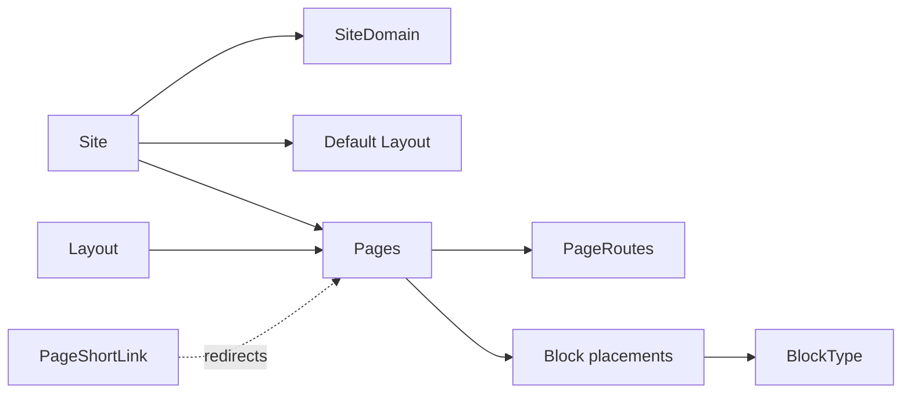

# Pages and Routing

## Overview

Page rendering in Rock is the four-layer hierarchy `Site -> Layout -> Page -> Block`. A `Site` is one domain (or one set of domains via `SiteDomain`), with theming and default layout. A `Layout` is the master template (the wrapping HTML around any page using it). A `Page` is one URL location with security, SEO, and zone-mapped block placements. A `Block` is one placement of a `BlockType` in a Page's zone, with per-placement settings. `PageRoute` lets a Page be reached via friendly URLs ("/give" instead of "/page/123"). `PageShortLink` provides short-URL aliases that redirect to a target.

## Why It Exists

Multi-page websites need a hierarchy: shared site-wide theming (Site), shared layout templates (Layout), per-page security and content (Page), reusable functional units (BlockType + Block placement). The four-layer split lets each axis change independently: a theme update is a Site change; adding a new banner is a Layout change; adding a new ministry page is a Page; placing a Lava block on three pages is three Block placements of one BlockType.

The Page Short Link expiration support (commit `75e8de1bc4`, 2026-01-01) addressed a real-world need: short-URL campaigns are time-bounded; expired links should be cleaned up automatically. The Rock Cleanup job removes expired links and their interactions.

## Mental Model

A request to `https://example.com/foo` resolves: Site (by domain) -> Layout (default or page-specific) -> Page (by route) -> Blocks (by zone). Block configuration determines what each block renders.

## What You Need to Know

**Block edits are real-time and global.** Editing a block placement's settings affects every render with that block immediately. There is no preview or draft. Use a separate test site for risky changes.

**`Block` is the placement; `BlockType` is the implementation.** One BlockType (the C# class + Vue SFC + bag types) can have hundreds of Block placements with different per-placement settings. See [docs/core/obsidian-block-lifecycle.md](../core/obsidian-block-lifecycle.md).

**Page security is per-page.** Standard `ISecured` authorization. Pages inherit from their parent Page (and ultimately from Site).

**`PageRoute` provides friendly URLs.** A Page can have multiple routes; pick one as canonical. Routes can include parameters (`/group/{GroupId}`).

**Page parameter naming convention.** Per `.claude/rules/block-architecture.md`, page parameters that accept entity references should be named for the simple entity: `Group`, `Person`, `Campus` (PascalCase). Not `GroupId` or `GroupKey`. The resolver figures out the form. See [docs/core/entity-reference-resolution.md](../core/entity-reference-resolution.md).

**Layout is the master template.** Header, footer, navigation, side panels go in the Layout. Page-specific content goes in Block placements. Shared layouts mean updating the layout updates every page using it.

**`Site.SiteDomain` lets one Site serve multiple domains.** Useful for redirects and multi-domain configurations.

**Page Short Links can expire.** Since `75e8de1bc4`, the Short Link entity supports expiration dates. The Cleanup job removes expired links plus their interaction data.

**Pages can have a Context Entity.** `PageContext` rows tie a Page to a specific entity type for context-aware rendering. Used by detail pages that need entity-specific UI.

**Page caches mirror security.** `PageCache.IsAuthorized` must match `Page.IsAuthorized`; the standard cache-mirrors-model rule applies (see [docs/core/cache-invalidation.md](../core/cache-invalidation.md)).

**SEO and metadata configurable per page.** Browser title, description, meta tags. The default Layout renders these in the head; pages override per-page values.

**`AdditionalSettingsJson` on Page.** Configuration bag for extension scenarios. Plugin authors store configuration here without schema changes.

## Common Scenarios

**"Add a new page under an existing parent."** Page Map. Pick parent. Configure title, route, layout, blocks. Save.

**"Create a public page with a friendly URL."** Page + PageRoute. Set security (Anonymous can View). Add Block placements for the content (HTML Content, Lava, Content Channel View).

**"Move a page in the tree."** Page Properties; change parent. The route may need updating; security inherits from the new parent.

**"Redirect /old-url to /new-url."** PageShortLink with `Token = "old-url"` and `Url = "/new-url"`. Configurable expiration if the redirect is temporary.

**"Block visitors from a country."** Per-Page IP Geolocation block (since `9b9da70e28`, 2025-04-19). Configure country block list.

**"Customize layout for a specific page."** Set the page's Layout override. The page renders with the picked Layout instead of the Site default.

**"Hide a page from navigation."** Page setting. The page still resolves at its route; menu blocks skip it.

**"Add a context entity to a page."** PageContext row tying the page to a specific entity type. The page can then access the contextual entity in its blocks.

## Key Architectural Decisions

### Four-layer hierarchy

Multiple cross-cutting concerns (theming, layout, content, function). Four layers handle each.

### Block as placement, BlockType as implementation

One implementation, many placements with different settings. Editing the implementation affects all placements; editing a placement is local.

### Real-time block edits

Preview/draft state would multiply complexity for marginal benefit. Real-time is correct; risky changes go through a test site.

### Multi-domain Site support

Multi-domain churches need it; modeling on Site lets one Site serve many.

### PageShortLink as a separate entity

Short URLs serve different needs (campaigns, redirects) and should not multiply Page rows. Separate entity is correct.

## Considered but Rejected

### Single-layer page model

Rejected. Layout reuse is too valuable to give up.

### Real-time preview / draft state

Rejected. Multiplies complexity; admin discipline plus test sites cover the use case.

### Hardcoded layouts

Rejected. Per-deployment branding requires configurable layouts.

## Technical Reference

### Schema (relevant subset)

`Site`:
- `Name`, `Description`, `Theme`
- `DefaultPageId`, `LoginPageId`, `RegistrationPageId`, `PageNotFoundPageId`
- `SiteDomain` rows (FK)
- `EnabledLavaCommands`

`Layout`:
- `SiteId`
- `Name`, `Description`, `FileName`

`Page`:
- `ParentPageId`, `LayoutId`
- `InternalName`, `PageTitle`, `BrowserTitle`, `Description`
- `BodyCssClass`, `IconCssClass`
- `IsSystem`, `Order`
- Security via standard `ISecured`
- `AdditionalSettingsJson`

`PageRoute`:
- `PageId`
- `Route` (e.g., `group/{GroupId}`)
- `IsGlobal`

`Block`:
- `PageId` (or `LayoutId`, or `SiteId`)
- `Zone`
- `BlockTypeId`
- `Order`
- Per-placement attribute values

`BlockType`:
- `Path` (legacy WebForms file path)
- `EntityTypeId` (Obsidian-aware blocks)
- `Name`, `Description`

`PageShortLink`:
- `Token`, `Url`
- `SiteId`
- `ExpireDate` (since `75e8de1bc4`)

### Save Hook Behavior

`Page.SaveHook`, `Site.SaveHook`, `Layout.SaveHook`, `Block.SaveHook` invalidate the corresponding caches. See [docs/core/cache-invalidation.md](../core/cache-invalidation.md).

### Affected Blocks

- **Admin:** Site Detail/List, Page Map, Page Properties, Layout Detail, Block Type List, Page Routes.
- **Operational:** every page-rendered block.

### Related Docs

- [docs/cms/cms-overview.md](cms-overview.md)
- [docs/core/obsidian-block-lifecycle.md](../core/obsidian-block-lifecycle.md)
- [docs/core/entity-reference-resolution.md](../core/entity-reference-resolution.md)

## Recent Impactful Changes

- **2026-01-01** ([commit `75e8de1bc4`](https://github.com/SparkDevNetwork/Rock/commit/75e8de1bc4)). Page Short Links can have expiration dates; expired links and their interaction data are removed by the Cleanup job.
- **2025-04-19** ([commit `9b9da70e28`](https://github.com/SparkDevNetwork/Rock/commit/9b9da70e28)). IP Geolocation feature added: block visitor access from specific countries (instance-wide or per-Page).
