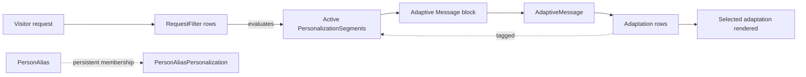

# Personalization and Segments

## Overview

Rock's personalization system targets content to specific audiences using `PersonalizationSegment` rows (audience definitions like "Active givers", "First-time visitors") and `RequestFilter` rows (request-time evaluators that determine which segments apply). `AdaptiveMessage` is the canonical content-side personalization: a message has multiple `Adaptation` rows, each tagged with segments via `AdaptiveMessageAdaptationSegment`. The Adaptive Message block selects the right adaptation per visitor at render time. `PersonalizedEntity` tracks per-Person personalization state; `PersonAliasPersonalization` records per-alias personalization data.

## Why It Exists

Generic content treats every visitor identically; personalized content speaks to different audiences appropriately. A first-time visitor needs different welcome content than a long-time member. A high-frequency giver should not see "give for the first time" calls to action. Modeling segments as configurable audiences and adaptations as content variants lets administrators design personalized experiences without code.

The system is request-aware (cookies, segment membership at the time of the request) and Person-aware (when the visitor is signed in, their Person attributes drive segment evaluation). RequestFilter is the per-request evaluator; persistent segment membership is in `PersonAliasPersonalization`.

## Mental Model

When a visitor requests a page, RequestFilters evaluate which segments apply. Blocks consult the active segments to decide what to render. Adaptive Messages have multiple adaptations tagged with segments; the block picks the matching adaptation (or a default).

## What You Need to Know

**Segments are configurable audiences.** "Active givers", "First-time visitors", "Members of small group X". Defined as DataView-like queries OR as cookie-based rules.

**RequestFilter runs per-request.** Heavy filters slow down every page render. Default filters (cookie checks, simple Person attribute lookups) are cheap; custom complex evaluations should be cached.

**`PersonAliasPersonalization` is the persistent segment-membership layer.** Per-Person segment memberships persist; reports and reactivation flows query this table.

**Adaptive Message is the canonical content-side personalization.** Define multiple adaptations of the same message, tag each with the segments it targets, place the Adaptive Message block. The block surfaces the right adaptation per visitor.

**Default adaptation handles "no segments matched."** Always include a default; visitors who don't match any segment get this.

**Multiple matching adaptations resolve by configuration.** When a visitor matches segments tagged on multiple adaptations, the message's configuration determines priority (typically by adaptation order).

**`AdaptiveMessageCategory` groups messages.** Useful for browsing in admin UIs and for audience-based filtering.

**`PersonalizedEntity` tracks per-Person personalization state.** Used by reports and recommendation engines to score Person interest.

**Anonymous personalization works via cookies.** First-time-visitor segments don't require login; the cookie-based RequestFilter detects new visitors. Once they sign in, persistent Person-attribute segments take over.

**Performance varies by segment complexity.** A segment defined as a DataView query is slow if the DataView is heavy. Persisted DataView results help.

**Custom RequestFilter components are pluggable.** Implement the standard component interface. Useful for deployment-specific logic (e.g., "is this visitor from a specific zip code").

## Common Scenarios

**"Define a 'Visitor' segment."** PersonalizationSegment with cookie-based rule (no Person login OR Person record-status = Visitor).

**"Personalize the homepage hero for first-time visitors."** AdaptiveMessage "Homepage Hero" with two adaptations: Default (existing audience) and Visitor (welcome). Tag the second with the Visitor segment. Place the block.

**"Block content for members-only segments."** Custom block that consults the active segments; renders content only if "Members" is in the active set. Similar pattern to Adaptive Message but custom.

**"Track which Persons are in which segments over time."** Query `PersonAliasPersonalization`. Reports and analytics build on this.

**"Custom segment for 'has attended a specific event'."** Define the segment as a DataView matching the criterion. RequestFilter evaluates per-request.

**"Slow page render due to segment evaluation."** Audit RequestFilter performance. Cache aggressively; defer DataView-heavy filters to less-frequent requests.

## Key Architectural Decisions

### Segments as configurable audiences

Hardcoded audiences would lock the system. Configuration-as-data lets each deployment define its own.

### RequestFilter for request-time evaluation

Per-request adaptation requires per-request evaluation. The filter component pattern is the right shape.

### `PersonAliasPersonalization` for persistent membership

Per-request evaluation alone misses long-running campaigns; persistent membership feeds reports and reactivation.

### AdaptiveMessage as the canonical content surface

Specific entity for "show different content per audience." Custom personalization can extend.

### Default adaptation as required

Every visitor gets some content; the default ensures no audience falls through.

## Considered but Rejected

### Hardcoded segments

Rejected. Per-deployment audiences are universal.

### Live evaluation only (no persistent membership)

Rejected. Reports and reactivation campaigns need persistent membership.

### Single-adaptation messages

Rejected. Defeats the purpose of personalization.

## Technical Reference

### Schema (relevant subset)

`PersonalizationSegment`:
- `Name`, `Description`
- `SegmentKey` (used in cookies / filters)
- DataView reference OR cookie-based rule definition
- `IsActive`

`RequestFilter`:
- Configured filter component reference
- Settings for the component
- Order

`AdaptiveMessage`:
- `Name`, `Description`
- `CategoryId`
- Visual / content fields

`AdaptiveMessageAdaptation`:
- `AdaptiveMessageId`
- Content of this variant
- `Order` (for tie-breaking)

`AdaptiveMessageAdaptationSegment`:
- `AdaptiveMessageAdaptationId`
- `PersonalizationSegmentId`
- Tags an adaptation with a segment

`AdaptiveMessageCategory`:
- Categorization

`PersonalizedEntity`:
- Per-Person personalization state

`PersonAliasPersonalization`:
- Per-alias persistent segment membership

### Affected Blocks

- **Configuration:** Personalization Segment Detail/List, Adaptive Message Detail/Adaptation Detail, Personalized Entity views.
- **Public:** Adaptive Message block.

### Service / API

`PersonalizationSegmentService`: standard CRUD plus segment-evaluation helpers.

### Related Docs

- [docs/cms/cms-overview.md](cms-overview.md)
- [docs/reporting/reporting-overview.md](../reporting/reporting-overview.md) for the DataView pattern segments use.

## Recent Impactful Changes

(No release-note-tagged changes specifically to personalization in the last 18 months. The subsystem is mature; per-deployment segments and adaptations continue to evolve.)
