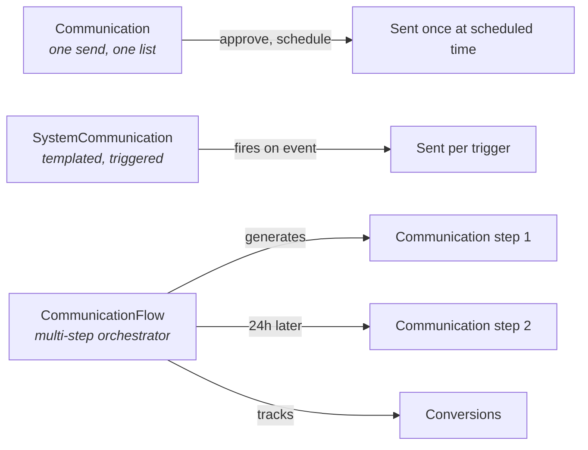

# Bulk vs System vs Flow Communication

## Overview

Rock has three parallel constructs for sending messages, each with a different lifecycle and use case:

- **`Communication`** is one bulk send: a list of recipients, frozen at create-time, sent once.
- **`SystemCommunication`** is a templated, triggered message: confirmations, reminders, automated transactional sends. Fires from save hooks, jobs, and workflow actions.
- **`CommunicationFlow`** (added 2025-08) is a multi-step orchestrator over Communications: drip campaigns, multi-channel onboarding sequences, with conversion tracking.

Picking the right one is the most consequential decision in this domain.

## Why It Exists

Bulk announcements ("Easter service times this Sunday"), transactional confirmations ("your event registration is complete"), and multi-step nurturing sequences ("first-time-visitor welcome series: email day 1, SMS day 3, push day 7") have fundamentally different operational shapes. A unified model would either force everything through bulk's approval flow (overkill for transactional) or skip approval entirely (unsafe for bulk). Three separate models match the three lifecycles.

The `CommunicationFlow` work (commit `7d024ff4fe`, 2025-08-04) added the third construct because the bulk + system pair could not handle multi-step sequences with branching and conversion tracking. Forcing flows through bulk would have meant duplicating the recipient list across every step; modeling Flow as a separate orchestrator that creates `Communication` rows per step is the cleaner model.

## Mental Model

The decision tree:

- "Send this once to a list" -> Communication.
- "When X happens, send Y to that person" -> SystemCommunication.
- "When X happens, send a sequence of messages with conversion tracking" -> CommunicationFlow.

## What You Need to Know

**Communication recipient lists are frozen at create time.** When you create a Communication targeting "All Active Members," the list is materialized as `CommunicationRecipient` rows immediately. Late additions to the source group do NOT receive the message. If you need fresh evaluation, schedule far ahead and refresh, or use a Flow.

**SystemCommunication has no recipient list.** Each trigger fires for a specific Person; the SystemCommunication template just defines the body, subject, attachment names. The triggering code provides the recipient. This is the right model for transactional ("send confirmation to THIS person").

**CommunicationFlow generates Communications at step time.** Each step is a configured time-offset and content. When a step fires for an enrolled Person, the Flow creates a `Communication` row for that step's audience and sends it. Steps can also have decision branches (skip if conversion happened, send variant B if A didn't open).

**Approval flow is bulk-only.** `Communication.Status` includes `PendingApproval`. SystemCommunications fire immediately when triggered (no approval gate). Flows generate Communications without per-step approval (they were approved when the Flow itself was approved).

**Send When Approved means "queue immediately on approval."** Pre-fix `83fd195773`, approval would not immediately queue; the Communication Job would pick it up on next sweep. The fix queues immediately when the Communication is scheduled for "now" and approval lands.

**Person merges between create and send are honored.** Commit `2a1c7d3df3` fixed an issue where a merged-away Person was dropped at send time. Recipient PersonAlias resolution re-runs at send to find the surviving Person.

**Duplicate recipients are de-duped per-Person at send.** Commit `2a6f5e87ab` (Fixes #6415) addressed slow / error behavior when the same person was on the list multiple times (cross-list-Group duplicates collapse).

**SystemCommunication + Communication Flow can interplay.** A Flow step can use a SystemCommunication as the template for its content, but the Flow still owns scheduling and conversion. SystemCommunication standalone is for one-off triggers.

**Custom code that wants "send a transactional message" should use SystemCommunication.** Creating a `Communication` row for a single transactional send works but skips the templated reusability that SystemCommunication provides.

## Common Scenarios

**"Send a one-time bulk announcement."** Communication Entry Wizard. Pick the list, compose, schedule, approve. Sent once.

**"Send an event-registration confirmation."** Configure a SystemCommunication for confirmations. Reference it from the Registration Template. The Registration save hook triggers send when registration completes.

**"Send a 5-step welcome series with email + SMS + push, tracking opens and registrations."** CommunicationFlow with 5 steps, each with content and timing. Conversion goals defined at the Flow level.

**"Send the same email next month, refreshed against the current group roster."** Schedule the Communication for next month. Edit before send to refresh. OR: build a Flow with a single recurring step.

**"Send a confirmation when someone signs up for a small group."** SystemCommunication referenced from the small-group signup workflow.

## Key Architectural Decisions

### Three constructs, not one

Different lifecycles need different shapes. Forcing transactional through bulk's approval gate, or bulk through transactional's "no list, just trigger," would compromise both.

### Recipient list frozen at Communication create

Live evaluation at send time would re-run DataViews / list-Groups, which is expensive and produces hard-to-debug "why did this person get this." Frozen list is the right contract.

### Flow as orchestrator, not extension of Communication

Multi-step branching does not fit on Communication's "one send, one list" model. Separate entity is the cleaner shape.

### SystemCommunication without an audience list

A transactional message's audience is "whoever the trigger says"; storing a list would force every trigger to populate one. Just-in-time recipient resolution is correct.

## Considered but Rejected

### Live recipient evaluation on Communication

Rejected. Cost and debugging concerns. Flows fill the live-evaluation use case.

### Single entity for all three

Rejected. The lifecycles are too different.

### Approval gate on every send (including SystemCommunication)

Rejected. Transactional messages need to fire immediately; gating them would break the use case.

## Technical Reference

### Decision Matrix

| Use case | Construct | Why |
|---|---|---|
| One-time announcement | Communication | Approval flow, frozen list |
| Confirmation / reminder | SystemCommunication | Triggered, templated |
| Multi-step sequence | CommunicationFlow | Conversion tracking, branching |
| Drip with conditions | CommunicationFlow | Steps and decision logic |
| One-off to one Person | SystemCommunication | Just-in-time recipient |
| Newsletter | Communication | Bulk, scheduled, approved |

### Entities Involved

| Entity | Purpose |
|---|---|
| `Communication` | One bulk send |
| `CommunicationRecipient` | Per-recipient state (frozen at create) |
| `CommunicationAttachment` | Files attached to a Communication |
| `CommunicationTemplate` | Reusable starting point for Communication |
| `SystemCommunication` | Triggered transactional template |
| `CommunicationFlow` | Multi-step orchestrator template |
| `CommunicationFlowInstance` | Per-enrollment Flow runtime |
| `CommunicationFlowInstanceCommunication` | Per-step generated Communication |

### Service / API

`CommunicationService.Send(communication)` is the bulk-send entry point.

`SystemCommunication` triggers happen via the standard SystemCommunication transport infrastructure.

`CommunicationFlowService` handles enrollment and step advancement.

### Affected Blocks

- **Communication Entry / Wizard / Detail:** bulk authoring.
- **System Communication Detail / List / Preview:** transactional templates.
- **Communication Flow Detail / Flow Analytics:** multi-step.

### Related Docs

- [docs/communication/communication-flows.md](communication-flows.md) for Flow internals.
- [docs/communication/sms-pipeline.md](sms-pipeline.md) for inbound SMS.
- [docs/communication/email-editor-and-sections.md](email-editor-and-sections.md) for email-content authoring.
- [docs/communication/push-notifications.md](push-notifications.md) for push-specific concerns.

## Recent Impactful Changes

- **2025-11-03** ([commit `3268e12b96`](https://github.com/SparkDevNetwork/Rock/commit/3268e12b96)). Obsidian Communication Entry Wizard no longer fails or times out when targeting very large recipient lists (Fixes #6504).
- **2025-08-28** ([commit `2a6f5e87ab`](https://github.com/SparkDevNetwork/Rock/commit/2a6f5e87ab)). Fixed long delays / errors when sending Communications with many recipients including duplicates (Fixes #6415).
- **2025-08-04** ([commit `83fd195773`](https://github.com/SparkDevNetwork/Rock/commit/83fd195773)). Communication Detail block now immediately queues Communications scheduled for "now" upon approval, instead of waiting for the Communication Job (Fixes #6396).
- **2025-08-04** ([commit `7d024ff4fe`](https://github.com/SparkDevNetwork/Rock/commit/7d024ff4fe)). Communication Flows feature shipped: multi-step automated sequences with conversion tracking.
- **2025-07-07** ([commit `2a1c7d3df3`](https://github.com/SparkDevNetwork/Rock/commit/2a1c7d3df3)). Fixed an issue where a recipient merged before a scheduled Communication was sent was removed at send time; valid recipients now retained after merge (Fixes #6255).
