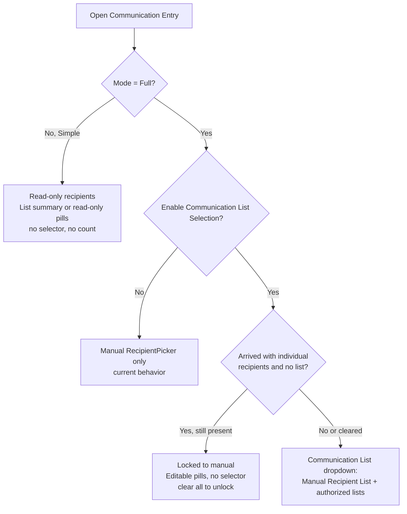

# Communication Entry List Selection

## Overview

The simple Communication Entry block (`Rock.Blocks/Communication/CommunicationEntry.cs`) can send to a Communication List as its recipient source, not only to a hand-assembled recipient list. The capability is gated behind the `Enable Communication List Selection` block setting (default off) and is only offered in Full mode. When on, the recipients area shows a single Communication List dropdown that mirrors the Communication Wizard, and the panel header shows a per-medium reachable recipient count.

## Why It Exists

Organizations standardizing on the simple editor for routine staff sends could not target a Communication List from it; recipients had to be assembled by hand, and the only workaround was to duplicate lists as ordinary groups, which drifts and breaks Rock best practice.

There is also a correctness dimension. The pre-existing workaround (List Detail then Communicate then "Use Simple Editor") materializes recipients into a frozen snapshot and never sets `Communication.ListGroupId`, so a scheduled send reflects list membership as it was at authoring time, not at send time. Letting the block set `ListGroupId` directly means membership resolves at send. The engineering note at [CommunicationEntry.cs:1938](Rock.Blocks/Communication/CommunicationEntry.cs:1938) states this directly.

## Mental Model

A communication has one recipient source at a time: either a **Communication List** (the communication carries a `ListGroupId`; a draft save snapshots the list's current members as recipient rows, and membership re-resolves at send) or a **manual** recipient list (rows materialized onto the communication). The selector is a single dropdown whose first item is the "Manual Recipient List" sentinel, followed by the authorized lists, the same shape the wizard uses. Picking a list takes over recipient selection and clears any manual rows; picking manual hands control back to the `RecipientPicker`.

`Mode` is the gate over the whole feature, and it alone decides whether recipients are editable. Simple mode is documented as preventing users from searching for or adding people, so it stays read-only: no selector, no count, and whatever recipients are on the communication (a list summary or individual pills) shown read-only, regardless of source or whether the communication is new or existing. Full mode is the editing surface: the selector is offered (when the setting is on) and defaults to the loaded list, so a saved or list-based communication stays editable. One wizard-matching exception: a communication that arrived with individual recipients and no list (for example a grid "Communicate" launch) keeps its source locked to manual until those recipients are cleared; removing them all reveals the selector, which animates in.

## What You Need to Know

- **The feature is doubly gated: the setting AND Full mode.** Both the selector and the count require `Enable Communication List Selection` to be on and the block to be in Full mode. Simple mode shows neither, by design, so an existing simple-mode page (for example an external group-roster send) keeps its read-only recipient behavior.
- **Default off, no migration.** Existing block instances are unchanged on upgrade.
- **Switching sources mutates recipients.** Choosing a list clears manually entered or snapshot recipient rows; choosing manual accepts user-chosen recipients. The save path writes or clears `ListGroupId` accordingly.
- **Simple mode locks recipients; Full mode edits.** Editability is governed by Mode, not the recipient source. Simple mode shows recipients read-only (a `Communication List: {name} ({count} individuals)` summary, or read-only pills), with no selector and no "Convert" action. Full mode offers the selector (when enabled) defaulting to the loaded list, so a saved or list-based communication is editable.
- **A grid "Communicate" launch is locked to manual until cleared.** In Full mode, a communication that arrived with individual recipients (and no list) hides the selector and shows the recipients as editable pills; remove them all and the selector animates in. This matches the wizard's read-only "Manual Recipient List" and prevents accidentally discarding a hand-picked recipient set by switching to a list. List-based and brand-new communications are not affected.
- **Saving a list-based draft snapshots the current members.** A draft save writes the list's current members as `CommunicationRecipient` rows so the communication appears in recipient-based UI such as the Communication List grid (which is built from those rows). `ListGroupId` stays set, so the membership still re-resolves at send. Without this, a list-based draft would have zero recipient rows and never list.
- **The count is a reachable count, not a member count.** The "N Recipients" chip in the panel header is filtered per medium by deliverability (email honoring the bulk flag, SMS, or push), so a list of 34 may show "30 Recipients" on email, and a manually added person who cannot receive the active medium does not increment it. It reflects whichever source is active, list or manual.
- **Only authorized lists appear.** The dropdown lists active groups of group type Communication List that the current person can `VIEW`, sorted by group order then name, by `PublicName` when set.
- **Segments are out of scope.** Unlike the wizard, there is no personalization-segment filter; the list-recipient query always passes an empty segment list.

## Key Architectural Decisions

### Set `ListGroupId` instead of snapshotting recipients
The block links the communication to the list so membership resolves at send, which is the correctness fix described in Why It Exists. See [CommunicationEntry.cs:1936](Rock.Blocks/Communication/CommunicationEntry.cs:1936).

### `Mode` is the gating signal
Simple mode's contract is "no searching for or adding people," so the recipient-source selector and the count are limited to Full mode rather than introducing a new permission concept. This is also what separates a stripped external page from the full editor.

### The reachable count is derived on the client
A `GetCommunicationListRecipients` block action returns the resolved recipient bags for a selected list; the parent block holds them as shared state and computes the per-medium reachable count from the same bags it uses for the "View List" preview. There is no dedicated count action, so the count, the preview, and the per-medium filtering all read one source.

### Single dropdown with a manual sentinel
The selector is one Communication List dropdown with "Manual Recipient List" as the first option, mirroring the wizard, rather than a separate List/Specific People toggle.

## Considered but Rejected

- **A dedicated server action for the count.** A block action returning just the count was planned, then dropped: the count is derived from the recipient bags already fetched for the preview, so a separate action was redundant.
- **A separate "List | Specific People" toggle.** Rejected in favor of the combined dropdown that matches the wizard the users already know.
- **Personalization segments.** The wizard exposes a segment filter alongside its list picker; the partner confirmed they do not need it, and it is pinned out of scope.

## Technical Reference

### Block setting
- `Enable Communication List Selection` `BooleanField`, default off, at [CommunicationEntry.cs:165](Rock.Blocks/Communication/CommunicationEntry.cs:165). Key constant at [:244](Rock.Blocks/Communication/CommunicationEntry.cs:244), read via the `IsCommunicationListSelectionEnabled` getter at [:525](Rock.Blocks/Communication/CommunicationEntry.cs:525).

### Initialization box
- `IsCommunicationListSelectionEnabled` and `CommunicationListGroups` (`List<ListItemBag>`) on [CommunicationEntryInitializationBox.cs](Rock.ViewModels/Blocks/Communication/CommunicationEntry/CommunicationEntryInitializationBox.cs). Populated at [CommunicationEntry.cs:569](Rock.Blocks/Communication/CommunicationEntry.cs:569); the list is filled only when the setting is on and the block was not launched from a list ([:575](Rock.Blocks/Communication/CommunicationEntry.cs:575)).
- `GetCommunicationListGroupBags` ([:1660](Rock.Blocks/Communication/CommunicationEntry.cs:1660)) returns the `VIEW`-authorized active Communication List groups, ported from the wizard.

### Block actions
- `GetCommunicationListRecipients( Guid communicationListGroupGuid )` at [:689](Rock.Blocks/Communication/CommunicationEntry.cs:689) resolves the list's recipient bags. The query sets `SegmentDataViewIds = new List<int>()` ([:711](Rock.Blocks/Communication/CommunicationEntry.cs:711)) so a list with no segments does not throw a `NullReferenceException`.

### Save path
- The set/clear of `ListGroupId` is at [:1928](Rock.Blocks/Communication/CommunicationEntry.cs:1928): a missing or empty list guid clears `ListGroupId`; a present guid resolves the group id and sets it ([:1941](Rock.Blocks/Communication/CommunicationEntry.cs:1941)).
- On a draft save, when `ListGroupId` is set, the Save action calls `communication.RefreshCommunicationRecipientList( rockContext )` ([CommunicationEntry.cs Save action](Rock.Blocks/Communication/CommunicationEntry.cs:721)) to snapshot the list members. Because simple comms carry no `Segments`, this takes the modern `spCommunication_SynchronizeListRecipients` path ([Communication.Logic.cs:599](Rock/Model/Communication/Communication/Communication.Logic.cs:599)), not the legacy data-view path.
- Send and schedule materialize the same way: the Send action calls `RefreshCommunicationRecipientList` after persisting, so immediate and scheduled list sends have recipient rows up front (and therefore appear in the Communication List grid). The approval / MaximumRecipients gate counts with a `CommunicationRecipientService` query rather than the `communication.Recipients` navigation collection.
- Large lists are never loaded into memory. In list mode, `UpdateCommunication` skips the recipient reconciliation and medium fixup entirely (the sync proc owns the recipient set). Switching a list back to manual clears the discarded snapshot by key with EF-tracked stub deletes, not by loading the entities.

### Frontend
- The parent `communicationEntry.obs` owns the shared list state, fetches recipients once via `GetCommunicationListRecipients`, and passes the bags to every medium partial so the count is stable across medium switches. `reachableAudienceCount` ([communicationEntry.obs:213](Rock.JavaScript.Obsidian.Blocks/src/Communication/communicationEntry.obs:213)) filters the active source by the current medium; `isRecipientCountShown` ([:232](Rock.JavaScript.Obsidian.Blocks/src/Communication/communicationEntry.obs:232)) is `Mode.Full && isCommunicationListSelectionEnabled`.
- Each medium partial renders the selector. `showListSelector` ([communicationMediumEmail.partial.obs](Rock.JavaScript.Obsidian.Blocks/src/Communication/CommunicationEntry/communicationMediumEmail.partial.obs)) is `Mode.Full && isCommunicationListSelectionEnabled && !isManualRecipientSourceLocked`, where `isManualRecipientSourceLocked = isLaunchedWithIndividualRecipients && internalRecipients.length > 0` (reactive, releases as recipients are removed). The selector and the manual `RecipientPicker` are each wrapped in `TransitionVerticalCollapse` to animate in and out. The read-only `showLockedListSummary` is `hasCommunicationList && !showListSelector` (Simple mode, or Full with the feature off). The same pattern repeats in the SMS and push partials.

### Affected UI surfaces
- `communicationEntry.obs` (parent, panel header count).
- `communicationMediumEmail.partial.obs`, `communicationMediumSms.partial.obs`, `communicationMediumPushNotification.partial.obs` (per-medium selector and recipient area).

## Recent Impactful Changes

- **2026-06-18** ([commit `7332afe5e8`](https://github.com/SparkDevNetwork/Rock/commit/7332afe5e8)). Added Communication List selection to the simple Communication Entry block.

## Related Specs

- [Communication List Selection in the Simple Communication Entry Block](../../specs/completed/communication/260617-communication-entry-list-selection.md) — 2026-06-17 (Joshua Henninger)
