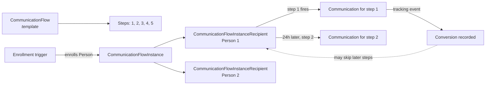

# Communication Flows

## Overview

Communication Flows are Rock's multi-step automated message sequences (added 2025-08-04 in commit `7d024ff4fe`). A Flow defines a series of steps (email then SMS then push, with timing rules), enrolls Persons through configured triggers, and tracks conversions (opens, clicks, registrations, group joins, step completions). Each step generates a `Communication` row when it fires for an enrolled Person. Analytics show per-step performance.

## Why It Exists

Drip campaigns and multi-channel onboarding sequences are common church-communication patterns: a first-time-visitor flow (email day 1, SMS day 3, push day 7), a re-engagement sequence (4 emails over 30 days for inactive members), a class-completion flow (welcome email, midpoint check-in, completion certificate, follow-up). Modeling each as a series of standalone bulk Communications would multiply admin work, force per-message recipient list management, and provide no native conversion tracking.

The Flow construct unifies the "audience definition + step content + step timing + conversion tracking" into one entity. Each step generates a `Communication` at execution time, so the existing send infrastructure handles delivery; the Flow layer adds enrollment, scheduling, and conversion logic on top.

## Mental Model

A `CommunicationFlow` is the template. `CommunicationFlowCommunication` rows define the steps (each step references content, channel, timing offset). When a trigger enrolls a Person, a `CommunicationFlowInstanceRecipient` row is created tracking that Person's progress through the steps. Each step's firing creates a `Communication` and a `CommunicationFlowInstanceCommunication` (linking the generated Communication to the Flow step). Conversion events get recorded as `CommunicationFlowInstanceCommunicationConversion` rows, attributing the conversion to the step.

## What You Need to Know

**Flows generate Communications, not standalone messages.** Each step uses the standard Communication infrastructure for actual send. The Flow layer is orchestration; Communication handles delivery, recipient state, and tracking events.

**Steps have timing offsets relative to enrollment.** "Step 2 fires 24 hours after enrollment, step 3 fires 48 hours later." The Flow runtime schedules each step's send time at enrollment.

**Per-step conversion tracking attribute multiple events.** Email opens, clicks, registrations, group joins, and step completions all qualify as conversions and get attributed to the step that triggered them. Reports show per-step conversion percentages.

**Conversion can short-circuit later steps.** A Flow can be configured so that if a Person converts at step 2, steps 3-5 are skipped (no point continuing the nurture if they already responded). Configuration is per Flow.

**Instance vs Template is the standard split.** `CommunicationFlow` is the template (content, timing rules, conversion goals). `CommunicationFlowInstance` is one running execution with its own recipients. Multiple Instances can run concurrently from one Flow.

**Recipients are enrolled via configured triggers.** Common triggers: a workflow action, a save-hook on Person registration, a manual list import. Enrollment creates the Recipient row; the Flow runtime takes over from there.

**The Communication step generates per-recipient Communication rows.** Each enrolled person who reaches a step gets a Communication. The Communication's recipient list is just that one Person. Analytics aggregate across the Flow's instances.

**Steps can be email, SMS, or push.** Each step has its own channel configuration. Multi-channel sequences (email then SMS) are common.

**Flow analytics block surfaces aggregated metrics.** Per-step send count, open rate, click rate, conversion rate. The Flow Analytics block consumes the conversion table.

**Disabling a Flow stops new enrollments but lets in-flight Recipients continue.** `CommunicationFlow.IsActive = false` prevents new enrollments; existing Instances and Recipients continue through their remaining steps unless explicitly stopped.

**Custom triggers are workflows.** A workflow action that enrolls a Person in a Flow lets administrators wire enrollment to any event (form submission, group join, registration completion).

## Common Scenarios

**"Build a 5-step welcome series for first-time visitors."** Create a Flow with 5 steps: email day 1, email day 3, SMS day 7, email day 14, push day 30. Configure conversion goals (joined a small group, attended a service, registered for an event). Configure enrollment trigger (workflow on first-visit detection).

**"Re-engage inactive members."** Flow with 4 steps over 30 days. Trigger on Persons identified by a "Inactive Member" DataView. Conversion goal: attended any service in the next 60 days.

**"Add a manual import to enroll a list."** Workflow action `Add to Communication Flow` enrolls each Person in the imported list as a Recipient.

**"View Flow performance."** Communication Flow Detail -> Analytics. Per-step send / open / click / conversion metrics.

**"Stop a Flow."** Set `IsActive = false`. Active Recipients can be kept or terminated based on the operational decision.

**"A Person should NOT receive any more steps."** Mark the specific `CommunicationFlowInstanceRecipient` as completed or stopped. The Flow runtime checks state before each step send.

## Key Architectural Decisions

### Flow as orchestrator over Communications

Modeling Flow as a layer above Communication keeps the existing send infrastructure unchanged. Each step is a Communication; the Flow knows when and to whom.

### Template-vs-instance split

Same pattern as Workflow / Group / etc. Edit the template; running instances continue. Multiple instances can run concurrently.

### Per-recipient state tracking

A Flow recipient can be at any step independently of other recipients. Tracking state per `CommunicationFlowInstanceRecipient` row gives precise control.

### Conversion tracking via dedicated table

Per-conversion attribution would not fit cleanly on Communication; a dedicated `CommunicationFlowInstanceCommunicationConversion` row per conversion event keeps the join paths clean.

### Workflow-driven enrollment

Avoids hard-coding triggers; any workflow action that "adds to Flow" can enroll a Person.

## Considered but Rejected

### Flows as a flag on Communication

Rejected. The orchestration logic (timing, branching, conversion) is too rich to model as a Communication flag.

### Synchronous step execution

Rejected. Steps span days; scheduling-driven execution is correct.

### Per-step approval gates

Rejected. The Flow itself is approved; per-step approval would multiply admin work for negligible benefit.

## Technical Reference

### Schema (relevant subset)

`CommunicationFlow`:
- `Name`, `Description`, `Category`
- `IsActive`
- Conversion-goal configuration

`CommunicationFlowCommunication`:
- `CommunicationFlowId`
- Step number / order
- Time offset from enrollment
- Channel (Email / SMS / Push)
- Content reference (template, body, etc.)

`CommunicationFlowInstance`:
- `CommunicationFlowId`
- `Status`, `StartDateTime`

`CommunicationFlowInstanceRecipient`:
- `CommunicationFlowInstanceId`
- `PersonAliasId`
- `EnrolledDateTime`, `CurrentStep`, `Status`

`CommunicationFlowInstanceCommunication`:
- `CommunicationFlowInstanceId`
- `CommunicationFlowCommunicationId` (which step)
- `CommunicationId` (the generated Communication)

`CommunicationFlowInstanceCommunicationConversion`:
- Reference to the Communication
- Conversion type (Open, Click, Register, Group Join, Step Complete)
- Conversion timestamp

### Service / API

`CommunicationFlowService`: enrollment, advance recipients, scheduled run.

`CommunicationFlowInstanceCommunicationConversionService`: record conversions from tracking events.

### Affected Blocks

- **Admin:** Communication Flow Detail/List, Flow Analytics.
- **Workflow:** "Add to Communication Flow" action.

### Related Docs

- [docs/communication/bulk-vs-system-vs-flow.md](bulk-vs-system-vs-flow.md) for when to use which construct.
- [docs/workflow/workflow-overview.md](../workflow/workflow-overview.md) for the trigger side.

## Recent Impactful Changes

- **2025-08-04** ([commit `7d024ff4fe`](https://github.com/SparkDevNetwork/Rock/commit/7d024ff4fe)). Communication Flows feature shipped: multi-step automated sequences across email, SMS, and push, with conversion tracking for opens, clicks, registrations, group joins, and step progress.
