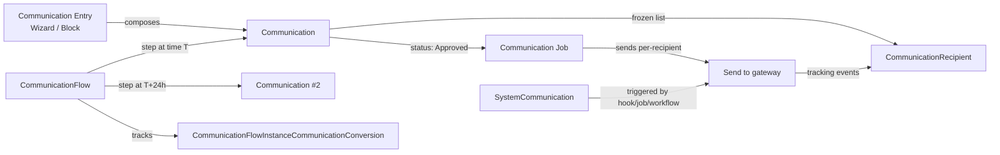

# Communication Domain Overview

## Overview

Communication is Rock's outbound messaging system: bulk emails, SMS conversations, push notifications, transactional system communications, and (since 2025-08) multi-step Communication Flows. The core entity is `Communication` (a single send), with `CommunicationRecipient` rows for per-recipient state and tracking. `SystemCommunication` is the parallel construct for templated, triggered messages (welcome emails, reminders, confirmations) that fire from blocks, jobs, and workflows.

This is the orientation doc. Sub-topics worth their own docs include the SMS Pipeline, Communication Flows, the Communication Entry Wizard, and email editor templates.

## Why It Exists

A church-management system has to send many different kinds of messages: one-time bulk announcements, drip-style onboarding sequences, transactional confirmations, automated reminders, and two-way SMS conversations. Each has different requirements: bulk needs queue management and per-recipient tracking; transactional needs reliability and merge-field rendering; SMS conversations need inbound webhook handling and opt-in/opt-out compliance. The split between `Communication` (one-time/scheduled bulk), `SystemCommunication` (templated/triggered), and `CommunicationFlow` (multi-step sequences with conversion tracking) reflects this.

Two recurring failure modes drive much of the recent work: (1) very large recipient lists (commit `3268e12b96`, Fixes #6504) caused Wizard timeouts; (2) recipient identity changes between scheduling and sending (commit `2a1c7d3df3`, Fixes #6255) caused merged-away persons to drop off scheduled communications. Both were fixed by tightening how the system materializes and re-resolves recipients at send time.

The opt-in/opt-out compliance work in 2025-08 (`02e8ba5f86`, `832716a068`, `f9bce642f1`) exists because Short Code SMS providers require specific compliant default responses to keywords like START and STOP; non-compliance gets the carrier's number flagged.

## Mental Model

Two parallel constructs, plus a multi-step orchestrator on top:

- **`Communication`** is a one-time or scheduled send. It has a list of recipients (frozen at creation, optionally backed by a list-Group or DataView snapshot), a medium (Email, SMS, Push), content (subject, body, template), and a status lifecycle (Transient -> Draft -> PendingApproval -> Approved -> Queued -> Sent).
- **`SystemCommunication`** is a templated message owned by Rock's transactional infrastructure: confirmation emails, registration reminders, schedule reminders. They fire from save hooks, jobs, and workflow actions, with merge fields evaluated at send time.
- **`CommunicationFlow`** (added `7d024ff4fe`, 2025-08-04) sits above `Communication`. A Flow defines a multi-step sequence (email then SMS then push) with timing rules and conversion tracking (opens, clicks, registrations, group joins). Each step in the flow generates a `Communication` record at execution time.

For SMS, there is also the **SMS Pipeline**: an inbound message arrives at a `SystemPhoneNumber`, the configured `SmsPipeline` runs each `SmsAction` in order, and any of them can choose to handle the message (route to a group, file as a conversation, run a workflow). The pipeline is a chain-of-responsibility pattern, not a fan-out.

## What You Need to Know

**Recipient lists are frozen at communication creation, not at send time.** The list of `CommunicationRecipient` rows is materialized when the Communication is created. Late-arriving members of the source list-Group or DataView do NOT get the message. If you need fresh recipient resolution at send time, schedule the Communication for the future and edit before send, or use a Communication Flow which evaluates step-by-step.

**Person merges between create and send are honored.** Commit `2a1c7d3df3` fixed an issue where a merged-away person was dropped at send. The fix re-resolves recipient PersonAlias at send time so the surviving person still receives the message. If a recipient is hard-deleted between create and send, they are dropped.

**Duplicate recipient suppression runs at send.** Commit `2a6f5e87ab` (Fixes #6415) addressed slow/error behavior when the same person was on the list multiple times (typically through multiple list-Groups). The de-dup is per-Person, not per-PersonAlias, so even cross-alias duplicates collapse.

**`UniqueMessageId` is what gateway tracking events join on.** Each `CommunicationRecipient` gets a `UniqueMessageId`; gateway webhooks report opens, clicks, bounces, and unsubscribes against this id. The index added in `d42c5c25fd` matters for sites that send millions of messages a year; without it, every webhook hit takes a full table scan.

**SMS opt-in/opt-out keywords are configurable per `SystemPhoneNumber`.** Defaults shipped 2025-08-13 (`02e8ba5f86`) meet Short Code compliance requirements. Per-number overrides (suppress automatic responses, prevent communication-preference updates) are in `SystemPhoneNumber` config (`832716a068`). Custom carriers must respect the configured keywords; bypassing them risks compliance.

**SMS Pipeline actions can create reply Communications.** Since `0766628398`, each `SmsAction` has an option to create a new `Communication` record when it sends an outbound reply. This makes auto-responses traceable in standard reporting. Off by default for backward compatibility; turn on per-action when you need the trail.

**Send When Approved means "queue immediately on approval".** Older behavior waited for the Communication Job. Commit `83fd195773` updated Communication Detail to immediately queue a Communication scheduled for "now" upon approval. Custom approval flows should align with this; queuing by hand after approval is no longer needed.

**SMS-vs-email fallback for system communications respects opt-out.** Group Attendance Reminders, Sign-Up Confirmations, Sign-Up Reminders, and similar system communications check whether the recipient has SMS enabled before choosing the medium (`fcd4a50879`). A recipient who opted out of SMS still receives the email path; older code that hard-coded SMS would silently fail.

**Communication Flow Instance vs Communication Flow is template-vs-instance.** `CommunicationFlow` defines the template (steps, timing, conversion goals). Each enrollment of a person creates a `CommunicationFlowInstance` plus per-step `CommunicationFlowInstanceCommunication` rows. Reporting joins through the instance to attribute conversions to the right step.

**Email editor sections have author-scoped action menus.** Commit `8205e8dbdf` (Fixes #6777) ensured Edit and Delete options on email-editor sections only show for the section's author. Cross-user editing is intentionally prevented to avoid stomping work-in-progress edits on shared templates.

## Common Scenarios

**"Send a one-time email to everyone in a small group."** Communication Entry (Wizard or non-Wizard). Pick the list, compose, schedule for now or future. The recipient list materializes at create; person merges between create and send are honored; deletes drop the recipient.

**"Send a confirmation email when a person registers for an event."** Configure a `SystemCommunication` and reference it from the Registration Template. The save hook on Registration completion triggers the SystemCommunication; merge fields render at send time.

**"Build a multi-step welcome series with email + SMS + push."** Communication Flow Detail. Define steps, timing, and conversion goals (opens, clicks, registrations, group joins, step completions). Each step generates a `Communication` at execution time. Analytics show per-step conversion.

**"Receive an inbound SMS and route it to a group."** Configure the `SystemPhoneNumber` to point at an `SmsPipeline`. Add `SmsAction` rows for each behavior (route to group, file as conversation, launch workflow). Inbound webhook hits the pipeline; first action that handles the message wins.

**"Send the same email next month, refreshed against the current group roster."** Schedule a future Communication and use the Communication Detail block to refresh the recipient list before send. Or: build a Communication Flow with a single step that triggers monthly off a date-recurrence rule.

## Key Architectural Decisions

### Recipient list frozen at create

Live recipient resolution at send time would re-evaluate DataViews and list-Groups, which is expensive and produces hard-to-debug "why did this person get this" cases. Freezing the list at create makes the contract clear: this Communication will go to exactly these people, with merges and hard-deletes the only post-create changes.

### `Communication` and `SystemCommunication` as separate entities

Bulk and transactional have different lifecycles. Bulk needs approval flows, recipient lists, schedule status; transactional needs templated bodies, merge field rendering, and triggers. Forcing both into one entity would have meant nullable columns everywhere.

### Communication Flow as a layer above Communication

Multi-step sequences could have been an enum on Communication ("this is step 2 of 5"). The decision to make Flow a separate orchestrator entity keeps Communication itself simple (still "one send, one list") and gives Flow room to model conversion tracking, branching, and timing rules without polluting the base entity.

### SMS Pipeline as a chain of responsibility

A fan-out model would have meant every inbound SMS triggers every action; the pipeline model lets actions short-circuit when one of them claims the message. This matches operator intent: a Conversation action and a Group Routing action are mutually exclusive for any given message.

### `UniqueMessageId` as the gateway-tracking join key

Webhooks come in asynchronously, sometimes days after send, with only the gateway's tracking id. A first-party `UniqueMessageId` per recipient (indexed) is what makes those webhooks resolvable cheaply.

## Considered but Rejected

### Live recipient resolution at send time

Rejected. Cost is high (re-running DataViews on every send), debugging is hard ("why did this person get this") and operator expectations match the frozen model. Communication Flows fill the live-evaluation use case.

### Hard-coding SMS opt-in/opt-out responses

Rejected. Compliance requirements vary by carrier and number type; defaults exist for the common case but admins must be able to override per `SystemPhoneNumber`.

### Single entity for bulk + transactional

Rejected. The lifecycles are too different. The maintenance cost of nullable columns and conditional logic on a unified entity exceeds the cost of two parallel models.

## Technical Reference

### Data Model (high-level)

| Entity | Purpose |
|---|---|
| `Communication` | One bulk send. Type (Email/SMS/Push), status, schedule, sender, list source, content. |
| `CommunicationRecipient` | Per-recipient state. PersonAlias, status, sent timestamp, opens/clicks, `UniqueMessageId`. |
| `CommunicationAttachment` | File attachment for a Communication. |
| `CommunicationTemplate` | Reusable email/SMS template. Used by Wizard and as a starting point. |
| `CommunicationTemplateAttachment` | Attachment for a template. |
| `SystemCommunication` | Triggered/transactional messages (welcome, reminder, confirmation). |
| `Notification`, `NotificationRecipient` | In-Rock notifications surface (bell icon, mobile app). |
| `SmsAction`, `SmsPipeline` | SMS Pipeline configuration. |
| `SystemPhoneNumber` | Provisioned SMS number on a carrier; pipeline assignment, opt-in/out config. |
| `Snippet`, `SnippetType` | Reusable text snippets for email composition. |
| `CommunicationFlow`, `CommunicationFlowCommunication` | Multi-step communication sequence template. |
| `CommunicationFlowInstance`, `CommunicationFlowInstanceCommunication` | Per-enrollment instance state. |
| `CommunicationFlowInstanceRecipient` | Per-recipient enrollment in a flow. |
| `CommunicationFlowInstanceCommunicationConversion` | Conversion tracking against flow steps. |
| `EmailSection` | Section template for the email editor. |
| `CommunicationResponse` / `CommunicationResponseAttachment` | Inbound replies and their attachments (SMS conversation history, email replies). |

### Save Hook Behavior

`Communication.SaveHook` ([Rock/Model/Communication/Communication/Communication.SaveHook.cs](../../Rock/Model/Communication/Communication/Communication.SaveHook.cs)) handles status transitions, sender resolution, and the "queue immediately on approval" path.

`CommunicationTemplateAttachment.Savehook.cs` (yes, lowercase 'h' for legacy reasons) cascades attachment file references.

### Service / API Surface

`CommunicationService.Send(communication)` is the entry point that the Communication Job calls per-due-Communication.

`CommunicationRecipientService` provides per-recipient state queries used by tracking webhooks and the Communication Detail block.

### Affected Blocks and UI Surfaces

- **Compose:** Communication Entry, Communication Entry Wizard (Obsidian beta as of `4f69ab8006`), Communication Detail.
- **Templates:** Communication Template Detail/List, Email Section Designer.
- **Flows:** Communication Flow Detail, Flow Analytics, Communication Flow Instance Recipient List.
- **SMS:** SMS Conversations, SMS Pipeline Detail, System Phone Number Detail.
- **System:** System Communication Detail/List/Preview.
- **Snippets:** Snippet Detail/List.

### Extension Points

- **Custom communication mediums.** New `CommunicationType` values plus a custom transport component.
- **SMS Pipeline Actions.** Implement `SmsActionComponent` to add a custom inbound-handler.
- **Custom transports.** `EmailTransportComponent` and `SmsTransportComponent` for new gateway providers.
- **Merge field providers.** `LavaContextProvider` registrations make new merge fields available in templates.
- **Snippet types.** `SnippetType` rows configure new categories of reusable text.

### File Index

- `Rock/Model/Communication/` (entities)
- `Rock.Blocks/Communication/` (Obsidian-aware C# blocks)
- `Rock/Communication/` (transports, components, helpers)
- `Rock/Jobs/SendCommunications.cs`, `Rock/Jobs/SendCommunicationApprovalEmail.cs` (jobs)

## Recent Impactful Changes

- **2026-04-16** ([commit `8205e8dbdf`](https://github.com/SparkDevNetwork/Rock/commit/8205e8dbdf)). Email editor section action menu now correctly shows Edit and Delete only for sections the current person created (Fixes #6777).
- **2026-03-31** ([commit `144023508a`](https://github.com/SparkDevNetwork/Rock/commit/144023508a)). SMS opt-out tracking now identifies which Communication triggered an unsubscribe, enabling more accurate engagement reporting.
- **2025-11-10** ([commit `0766628398`](https://github.com/SparkDevNetwork/Rock/commit/0766628398)). Each SMS Pipeline Action gained a configuration option to create a new Communication record when sending an outbound reply.
- **2025-11-03** ([commit `3268e12b96`](https://github.com/SparkDevNetwork/Rock/commit/3268e12b96)). Obsidian Communication Entry Wizard no longer fails or times out when targeting very large recipient lists (Fixes #6504).
- **2025-08-04** ([commit `7d024ff4fe`](https://github.com/SparkDevNetwork/Rock/commit/7d024ff4fe)). Communication Flows feature shipped: multi-step automated sequences across email, SMS, and push, with per-step conversion tracking (opens, clicks, registrations, group joins, step progress).
