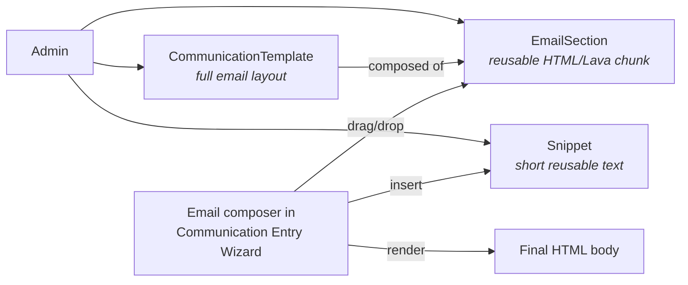

# Email Editor and Sections

## Overview

The Email Editor is Rock's drag-and-drop email composition surface used by the Communication Entry Wizard. The composer assembles emails from reusable **`EmailSection`** rows: a section is a chunk of HTML / Lava that an admin can save, name, and reuse across multiple Communications. **`CommunicationTemplate`** rows are the entire email layouts (header + body + footer in one); section authoring lets templates be assembled from smaller components. **`Snippet`** is the parallel concept for short reusable text fragments (signature lines, standard phrases).

## Why It Exists

Email composition for non-developers is the hardest UX problem in church communication. Hardcoded layouts limit creativity; raw HTML editors expose technical detail. The drag-and-drop section model is the middle ground: each section is a designed component (header banner, two-column callout, button row, photo gallery), an admin assembles them into emails, and the rendered output is consistent across email clients.

The section actions menu fix (commit `8205e8dbdf`, Fixes #6777, 2026-04-16) addressed a multi-author concern: section Edit and Delete actions should only appear for the section's author. Cross-user editing was happening in cases the team did not intend; the fix scopes actions to the creator.

The Snippet system exists for shorter reusable text (sign-offs, standard apologies, opt-in confirmation footer text). Modeling it separately from EmailSection keeps each surface focused on its size class.

## Mental Model

A `CommunicationTemplate` is the starting point: header HTML, body HTML, footer HTML, often with placeholders for content. The Communication Entry Wizard lets the author start from a template and insert sections to fill the body. Snippets are inserted as inline text (signature, standard reply text).

The Lava engine renders all of this at send time: merge fields (`{{ Person.FullName }}`), per-recipient personalization, and the standard Rock merge-field pipeline.

## What You Need to Know

**EmailSection actions are now author-scoped.** Pre-fix `8205e8dbdf` (Fixes #6777, 2026-04-16), the Edit and Delete actions in the section action menu showed for all users; multi-author teams could accidentally stomp each other's work. The fix scopes Edit/Delete to the section's creator.

**Sections and Templates are both Lava-rendered.** Both can include `{{ Person.FirstName }}`, `` conditionals, and any standard Rock merge field. Authors should be aware of which merge fields exist in the Communication context (Person, Communication, custom merge fields the entry block provides).

**Section size class differs from Snippet.** Sections are typically full HTML chunks (a hero image with headline, a two-column layout, an event card). Snippets are shorter text (a signature line, a unit-test placeholder, a footer disclaimer).

**Templates can include both sections and direct HTML.** The Communication Template Detail block lets an admin compose with sections + raw HTML for fine-grained control.

**Merge fields render at send time, not at compose time.** The author sees `{{ Person.FullName }}` literally in the editor; the recipient sees their actual name in the delivered email. Per-recipient personalization is the standard Lava pipeline.

**Image uploads in the structured editor were broken in some LMS contexts.** Pre-fix `5c39d14cd4` (2025-08-13), images uploaded into the content editor for various LMS parts (which use the same structured editor) were not being saved correctly and got removed by the Rock Cleanup job. The fix tightens save semantics; verify your build has it.

**Structured Editor supports file attachments (since `f344809bbd`).** 2025-08-25 commit added inline file attachments to the Structured Editor field type, which the email composer uses.

**EmailSection.Description is admin-facing only.** Used for hover help and section listing; recipients never see it. Use it to describe when the section is appropriate ("Hero image with CTA, use for major announcements").

**`SnippetType` categorizes snippets.** Different snippet categories can have different security and visibility. A "Personal Signature" snippet type might be private to each user; a "Standard Sign-Off" snippet type is shared.

**Templates can be filtered by category in the Wizard.** Categories help admins find the right starting point quickly. New categories are configuration.

**The editor stores content as versioned HTML and upgrades it on open.** The Obsidian email editor persists each component and the body as versioned HTML; opening an email migrates older content to the latest version in place (`migrateComponent` / `migrateGlobalProps` in `Rock.JavaScript.Obsidian/Framework/Controls/Internal/EmailEditor/utils.partial.ts`). A released version is never edited: a fix or format change ships as a new version that delegates to the prior one and re-applies the correction on top, and the version bump is what triggers the migration. Practical effect: content saved under an older version is upgraded the next time that email is opened and saved, not retroactively. This is the mechanism to reach for when the editor needs to change how it serializes existing content.

## Common Scenarios

**"Build a hero-banner section for major announcements."** Email Section Designer (or Email Section Detail). Compose the HTML / Lava with a placeholder for the announcement text. Save as a section. Admins composing announcement emails drag it in.

**"Insert a signature snippet at the bottom of every email."** Create a `Snippet` with the signature HTML. The composer's Snippet menu lets authors insert. For automated insertion, configure the active CommunicationTemplate to include it in the footer.

**"Customize a standard registration confirmation email."** Edit the configured `SystemCommunication` for registration confirmations. Use Lava merge fields to surface registration-specific data. Test with the System Communication Preview block.

**"Restrict who can edit a specific section."** Section author scoping is automatic since `8205e8dbdf`. Cross-user edits require explicit permission via the standard authorization on the section.

**"Embed an image in a snippet."** Structured Editor supports file uploads (since `f344809bbd`); upload through the editor's file picker. Image storage goes through `BinaryFile`.

**"Migrate from custom HTML email to the section model."** Copy the existing email HTML into a new EmailSection. Admins can iterate from there; the new section is reusable across future emails.

## Key Architectural Decisions

### Section model over raw HTML

Drag-and-drop sections give non-developers the right authoring surface. Raw HTML stays accessible for power users; section-based authoring is the default.

### Template separate from Section

A Template is the whole email shape (header + body + footer). Sections are body components. Splitting lets templates be reused with different section content.

### Snippet for short text

Different size class than Section. Snippets are signature-like fragments; sections are layout-like chunks.

### Author-scoped Edit / Delete

Multi-author safety. Cross-user edits required explicit authorization, not default permission.

### Lava-rendered at send time

Per-recipient personalization is the standard merge-field pipeline. Compose-time rendering would freeze the merge fields.

### Versioned adapters, migrated on load

The Obsidian editor round-trips emails through HTML, so the serialized shape is a contract. Each component and global-style adapter is versioned, and opening an email runs the migration to the latest version. Released versions are immutable ("Don't modify a specific version once released", `utils.partial.ts:2689`); a correction ships as a new version that delegates to the prior version and applies the fix on top. Because the version bump drives the migration, the same mechanism that formats new content also repairs already-saved emails when they are next opened.

## Considered but Rejected

### Single editor for both Sections and Snippets

Rejected. Different size classes need different editing affordances.

### Template-only authoring (no section assembly)

Rejected. Section reusability is a major author-experience improvement.

### Cross-user Edit by default

Rejected. Multi-author teams need scoping by default; authorization can grant cross-user access where appropriate.

## Technical Reference

### Schema (relevant subset)

`EmailSection`:
- `Name`, `Description`
- `SourceMarkup` (the HTML / Lava body)
- `Order`
- `IsSystem`, `IsActive`

`CommunicationTemplate`:
- `Name`, `Description`
- `Subject`
- `Message` (the body)
- `MessageMetaData` (sometimes JSON)
- `LavaFieldsJson` (merge field definitions)
- `CategoryId`

`Snippet`:
- `Name`, `Content`
- `SnippetTypeId`
- `OwnerPersonAliasId` (optional, for personal snippets)
- `IsActive`

### Affected Blocks

- **Composition:** Communication Entry Wizard, Communication Detail.
- **Section / Snippet management:** Email Section Designer, Snippet Detail/List.
- **Template management:** Communication Template Detail/List.

### Email editor content migration (Obsidian)

The drag-and-drop editor lives in `Rock.JavaScript.Obsidian/Framework/Controls/Internal/EmailEditor/`. Content is serialized as versioned HTML and upgraded on load:

- Components are versioned per element (`data-version`); `migrateComponent` (`utils.partial.ts:2078`) upgrades a component by delegating reads to its stored version and writes to the latest.
- Body-level styles are versioned with a meta tag; `migrateGlobalProps` (`utils.partial.ts:6246`) does the same for global body properties.
- Per-version corrections use their own helpers rather than editing shared ones. For example, the latest versions normalize `bgcolor` through `toHexBgcolorAttributeValue` (`utils.partial.ts:7149`), while the earlier `toBgcolorAttributeValue` (`utils.partial.ts:7119`) is retained unchanged so released versions still serialize exactly as before.

### Related Docs

- [docs/communication/bulk-vs-system-vs-flow.md](bulk-vs-system-vs-flow.md) for when to use which construct.
- [docs/lava/lava-overview.md](../lava/lava-overview.md) for the merge-field rendering layer.

## Recent Impactful Changes

- **2026-07-01** ([commit `8413d99fc0`](https://github.com/SparkDevNetwork/Rock/commit/8413d99fc0)). Email body and text component backgrounds no longer render green in some clients (such as Outlook); the `bgcolor` attribute is written as hex instead of `rgb()` (Fixes #6889).
- **2026-04-16** ([commit `8205e8dbdf`](https://github.com/SparkDevNetwork/Rock/commit/8205e8dbdf)). Email editor section action menu now correctly shows Edit and Delete only for sections the current person created (Fixes #6777).
- **2025-08-25** ([commit `f344809bbd`](https://github.com/SparkDevNetwork/Rock/commit/f344809bbd)). Structured Editor (used by the email composer) supports inline file attachments.
- **2025-08-13** ([commit `5c39d14cd4`](https://github.com/SparkDevNetwork/Rock/commit/5c39d14cd4)). Fixed images uploaded into the content editor for various LMS parts (same Structured Editor surface) being incorrectly removed by the Rock Cleanup job.
