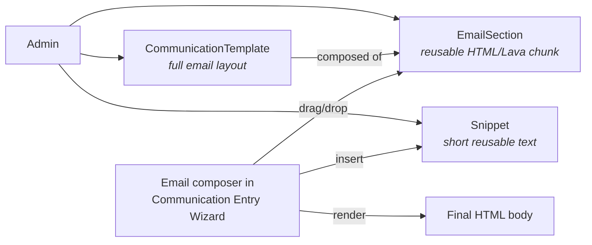

# Email Editor and Sections

## Overview

The Email Editor is Rock's drag-and-drop email composition surface used by the Communication Entry Wizard. The composer assembles emails from reusable **`EmailSection`** rows: a section is a chunk of HTML / Lava that an admin can save, name, and reuse across multiple Communications. **`CommunicationTemplate`** rows are the entire email layouts (header + body + footer in one); section authoring lets templates be assembled from smaller components. **`Snippet`** is the parallel concept for short reusable text fragments (signature lines, standard phrases).

## Why It Exists

Email composition for non-developers is the hardest UX problem in church communication. Hardcoded layouts limit creativity; raw HTML editors expose technical detail. The drag-and-drop section model is the middle ground: each section is a designed component (header banner, two-column callout, button row, photo gallery), an admin assembles them into emails, and the rendered output is consistent across email clients.

The section actions menu fix (commit `8205e8dbdf`, Fixes #6777, 2026-04-16) addressed a multi-author concern: section Edit and Delete actions should only appear for the section's author. Cross-user editing was happening in cases the team did not intend; the fix scopes actions to the creator.

The Snippet system exists for shorter reusable text (sign-offs, standard apologies, opt-in confirmation footer text). Modeling it separately from EmailSection keeps each surface focused on its size class.

Real mail clients also shape the editor. Every component is built from nested tables so margin, border, and padding survive email clients, but nesting sections multiplies that depth, and Apple Mail on iOS silently drops content past a point somewhere between 14 and 28 tables deep (issue #6995). The editor warns authors about nested sections rather than letting them discover a blank email after sending.

## Mental Model

A `CommunicationTemplate` is the starting point: header HTML, body HTML, footer HTML, often with placeholders for content. The Communication Entry Wizard lets the author start from a template and insert sections to fill the body. Snippets are inserted as inline text (signature, standard reply text).

The Lava engine renders all of this at send time: merge fields (`{{ Person.FullName }}`), per-recipient personalization, and the standard Rock merge-field pipeline.

## What You Need to Know

**EmailSection actions are now author-scoped.** Pre-fix `8205e8dbdf` (Fixes #6777, 2026-04-16), the Edit and Delete actions in the section action menu showed for all users; multi-author teams could accidentally stomp each other's work. The fix scopes Edit/Delete to the section's creator.

**Sections and Templates are both Lava-rendered.** Both can include `{{ Person.FirstName }}`, `` conditionals, and any standard Rock merge field. Authors should be aware of which merge fields exist in the Communication context (Person, Communication, custom merge fields the entry block provides).

**Section size class differs from Snippet.** Sections are typically full HTML chunks (a hero image with headline, a two-column layout, an event card). Snippets are shorter text (a signature line, a unit-test placeholder, a footer disclaimer).

**Templates can include both sections and direct HTML.** The Communication Template Detail block lets an admin compose with sections + raw HTML for fine-grained control.

**Merge fields render at send time, not at compose time.** The author sees `{{ Person.FullName }}` literally in the editor; the recipient sees their actual name in the delivered email. Per-recipient personalization is the standard Lava pipeline.

**Image uploads in the structured editor were broken in some LMS contexts.** Pre-fix `5c39d14cd4` (2025-08-13), images uploaded into the content editor for various LMS parts (which use the same structured editor) were not being saved correctly and got removed by the Rock Cleanup job. The fix tightens save semantics; verify your build has it.

**Structured Editor supports file attachments (since `f344809bbd`).** 2025-08-25 commit added inline file attachments to the Structured Editor field type, which the email composer uses.

**EmailSection.Description is admin-facing only.** Used for hover help and section listing; recipients never see it. Use it to describe when the section is appropriate ("Hero image with CTA, use for major announcements").

**`SnippetType` categorizes snippets.** Different snippet categories can have different security and visibility. A "Personal Signature" snippet type might be private to each user; a "Standard Sign-Off" snippet type is shared.

**Templates can be filtered by category in the Wizard.** Categories help admins find the right starting point quickly. New categories are configuration.

**Nesting sections inside sections is allowed, and the editor warns you about it.** Each nesting level adds seven tables. A single section sits at depth 14 and renders everywhere; three nested sit at 28 and Apple Mail on iOS drops the content; the real limit is unproven in between. Whenever a section is placed inside another, a dismissible warning appears at the top of the editor with a count of nested sections and a highlight switch that outlines them in the canvas. The switch is on by default, dismissing the warning turns it off, and otherwise it keeps whatever state you set, including when the warning hides and comes back. None of this is persisted; saved HTML is unchanged. Flattening the template is the fix; the editor does not block nesting.

**Deleting or adding a column keeps the column gap consistent.** With Gap Between Columns set, a spacer cell sits between each pair of columns. Removing a column also removes the spacer that belonged with it, and adding a column inserts one ahead of it, so a row never ends with a stray gap.

**The editor stores content as versioned HTML and upgrades it on open.** The Obsidian email editor persists each component and the body as versioned HTML; opening an email migrates older content to the latest version in place (`migrateComponent` / `migrateGlobalProps` in `Rock.JavaScript.Obsidian/Framework/Controls/Internal/EmailEditor/utils.partial.ts`). A released version is never edited: a fix or format change ships as a new version that delegates to the prior one and re-applies the correction on top, and the version bump is what triggers the migration. Practical effect: content saved under an older version is upgraded the next time that email is opened and saved, not retroactively. This is the mechanism to reach for when the editor needs to change how it serializes existing content.

## Common Scenarios

**"Build a hero-banner section for major announcements."** Email Section Designer (or Email Section Detail). Compose the HTML / Lava with a placeholder for the announcement text. Save as a section. Admins composing announcement emails drag it in.

**"Insert a signature snippet at the bottom of every email."** Create a `Snippet` with the signature HTML. The composer's Snippet menu lets authors insert. For automated insertion, configure the active CommunicationTemplate to include it in the footer.

**"Customize a standard registration confirmation email."** Edit the configured `SystemCommunication` for registration confirmations. Use Lava merge fields to surface registration-specific data. Test with the System Communication Preview block.

**"Restrict who can edit a specific section."** Section author scoping is automatic since `8205e8dbdf`. Cross-user edits require explicit permission via the standard authorization on the section.

**"Embed an image in a snippet."** Structured Editor supports file uploads (since `f344809bbd`); upload through the editor's file picker. Image storage goes through `BinaryFile`.

**"Migrate from custom HTML email to the section model."** Copy the existing email HTML into a new EmailSection. Admins can iterate from there; the new section is reusable across future emails.

## Key Architectural Decisions

### Section model over raw HTML

Drag-and-drop sections give non-developers the right authoring surface. Raw HTML stays accessible for power users; section-based authoring is the default.

### Template separate from Section

A Template is the whole email shape (header + body + footer). Sections are body components. Splitting lets templates be reused with different section content.

### Snippet for short text

Different size class than Section. Snippets are signature-like fragments; sections are layout-like chunks.

### Author-scoped Edit / Delete

Multi-author safety. Cross-user edits required explicit authorization, not default permission.

### Lava-rendered at send time

Per-recipient personalization is the standard merge-field pipeline. Compose-time rendering would freeze the merge fields.

### Warn on nested sections, do not cap

The depth problem is structural, but capping nesting in a hotfix would have made already-nested templates feel broken until someone edited them. The warning covers existing and new content alike while churches get a release to flatten; a cap and a structural depth reduction are recorded as potential future work in the linked spec. The threshold is one constant so it can be tuned once the exact iOS limit is bisected.

### Editor affordances are runtime-only

Anything the editor draws for itself lives on the runtime wrapper element or carries the runtime class prefix, and the serializer strips both. The nested-section highlight follows that rule, which is why it can default to on with no risk of leaking into a sent email. An inset outline on the section table was tried first and was invisible in practice because positioned nested content paints over it; the overlay on the wrapper is what works.

### Versioned adapters, migrated on load

The Obsidian editor round-trips emails through HTML, so the serialized shape is a contract. Each component and global-style adapter is versioned, and opening an email runs the migration to the latest version. Released versions are immutable ("Don't modify a specific version once released", `utils.partial.ts:2689`); a correction ships as a new version that delegates to the prior version and applies the fix on top. Because the version bump drives the migration, the same mechanism that formats new content also repairs already-saved emails when they are next opened.

## Considered but Rejected

### Single editor for both Sections and Snippets

Rejected. Different size classes need different editing affordances.

### Template-only authoring (no section assembly)

Rejected. Section reusability is a major author-experience improvement.

### Cross-user Edit by default

Rejected. Multi-author teams need scoping by default; authorization can grant cross-user access where appropriate.

### Migrate the Email Builder to MJML

Rejected (2026-09-10). MJML removes the nesting problem by schema (sections cannot nest) and its components carry the Outlook and iOS hardening this editor has been patching one bug at a time. But MJML is a one-way compiler and the editor is a live-DOM WYSIWYG that edits its own output, so adoption means persisting a model and rewriting drag, drop, and inline editing against it, losing independent margin and text borders, and wrapping Lava control flow in `mj-raw`. Full evaluation: `specs/rejected/communication/260910-mjml-email-builder-adoption.md`.

### Cap section nesting in the same release as the warning

Rejected (2026-09-10). Without a release in between, churches with nested templates would get a broken-feeling editor and a warning at the same time, with no chance to flatten first.

## Technical Reference

### Schema (relevant subset)

`EmailSection`:
- `Name`, `Description`
- `SourceMarkup` (the HTML / Lava body)
- `Order`
- `IsSystem`, `IsActive`

`CommunicationTemplate`:
- `Name`, `Description`
- `Subject`
- `Message` (the body)
- `MessageMetaData` (sometimes JSON)
- `LavaFieldsJson` (merge field definitions)
- `CategoryId`

`Snippet`:
- `Name`, `Content`
- `SnippetTypeId`
- `OwnerPersonAliasId` (optional, for personal snippets)
- `IsActive`

### Affected Blocks

- **Composition:** Communication Entry Wizard, Communication Detail.
- **Section / Snippet management:** Email Section Designer, Snippet Detail/List.
- **Template management:** Communication Template Detail/List.

### Email editor content migration (Obsidian)

The drag-and-drop editor lives in `Rock.JavaScript.Obsidian/Framework/Controls/Internal/EmailEditor/`. Content is serialized as versioned HTML and upgraded on load:

- Components are versioned per element (`data-version`); `migrateComponent` (`utils.partial.ts:2078`) upgrades a component by delegating reads to its stored version and writes to the latest.
- Body-level styles are versioned with a meta tag; `migrateGlobalProps` (`utils.partial.ts:6246`) does the same for global body properties.
- Per-version corrections use their own helpers rather than editing shared ones. For example, the latest versions normalize `bgcolor` through `toHexBgcolorAttributeValue` (`utils.partial.ts:7149`), while the earlier `toBgcolorAttributeValue` (`utils.partial.ts:7119`) is retained unchanged so released versions still serialize exactly as before.

### Nested section depth warning (Obsidian)

Each section nesting level adds seven tables: the section's margin, border, and padding wrapper trio, the `section-row`, and each column's own trio. Three nested sections put content at depth 28, which Apple Mail on iOS drops. The editor warns rather than caps.

- **Detection.** `findNestedSectionElements` (`Rock.JavaScript.Obsidian/Framework/Controls/Internal/EmailEditor/utils.partial.ts:3866`) returns every `.component-section` with at least `NestedSectionWarningMinimumAncestorCount` (`utils.partial.ts:140`, currently 1) section ancestors, counted by `countSectionAncestors` (`utils.partial.ts:3874`). Rows are body chrome and never count.
- **Trigger.** A body-level `MutationObserver` in the iframe (`emailIFrame.partial.obs:1224`) batches with `requestAnimationFrame` and runs only when a mutation added or removed a section. `refreshNestedSections` (`emailIFrame.partial.obs:531`) recomputes, reapplies highlighting, and emits `nestedSectionsChanged` with the count. The first pass runs after components are wrapped on load, so a saved nested template shows the banner on open.
- **Banner.** `emailEditor.partial.obs:4` renders a dismissible `NotificationBox` (`alertType="warning"`) as the first child of the editor wrapper, carrying the count and an `InlineSwitch`. The switch state is `isNestedSectionHighlightEnabled` (`emailEditor.partial.obs:261`, initial `true`). Dismissing turns it off (`emailEditor.partial.obs:321`). A count returning to zero re-arms the banner but leaves the switch as the person left it (`emailEditor.partial.obs:310`).
- **Highlight.** The prop flows through `emailDesigner.partial.obs` to the iframe (`emailIFrame.partial.obs:156`), which adds `NestedSectionCssClass` (`utils.partial.ts:128`) to each offending section's runtime wrapper. The rule at `emailIFrame.partial.obs:876` paints a `::before` overlay (2px `#c4631c` border, translucent fill, `z-index: 1`, `pointer-events: none`) so section content cannot cover it; the wrapper's `::after` belongs to the hover labels. The color is fixed because the email canvas is always light regardless of Rock's theme.
- **Persistence.** None. The class carries the runtime prefix and the wrapper is a runtime element, so `removeTemporaryClasses`, `removeTemporaryWrappers`, and `removeTemporaryElements` strip all of it in `getHtml`.

### Section column gap spacers

With Gap Between Columns set, a `td.spacer` sits between each pair of columns. `onDeleteColumn` (`Rock.JavaScript.Obsidian/Framework/Controls/Internal/EmailEditor/propertyPanels/sectionComponentPropertyPanel.partial.obs:202`) removes the spacer that belongs with the deleted column, the one before it or the one after it for the first column, and hands the `start` or `last` class to the neighbor (`sectionComponentPropertyPanel.partial.obs:221`). `onAddColumn` (`sectionComponentPropertyPanel.partial.obs:151`) clones an existing spacer ahead of the new column when a gap is active (`sectionComponentPropertyPanel.partial.obs:183`).

### Related Docs

- [docs/communication/bulk-vs-system-vs-flow.md](bulk-vs-system-vs-flow.md) for when to use which construct.
- [docs/lava/lava-overview.md](../lava/lava-overview.md) for the merge-field rendering layer.

## Recent Impactful Changes

- **2026-09-11** ([commit `a53d9c3990`](https://github.com/SparkDevNetwork/Rock/commit/a53d9c3990)). The Email Designer warns the author whenever a section is placed inside another section and can highlight the affected sections, because Apple Mail on iOS drops content nested too deeply (Fixes #6995).
- **2026-09-08** ([commit `22367385a2`](https://github.com/SparkDevNetwork/Rock/commit/22367385a2)). Fixed the Email Builder producing a blank scrollable area below the content in some mobile mail clients such as iOS Mail (Fixes #7004).
- **2026-07-01** ([commit `8413d99fc0`](https://github.com/SparkDevNetwork/Rock/commit/8413d99fc0)). Email body and text component backgrounds no longer render green in some clients (such as Outlook); the `bgcolor` attribute is written as hex instead of `rgb()` (Fixes #6889).
- **2026-06-16** ([commit `5bdacf19c1`](https://github.com/SparkDevNetwork/Rock/commit/5bdacf19c1)). Fixed Lava comparison and logical operators being HTML-encoded in the email editor, which prevented Lava in the Lava and Paragraph components from evaluating correctly at send time (Fixes #6860).
- **2026-04-16** ([commit `8205e8dbdf`](https://github.com/SparkDevNetwork/Rock/commit/8205e8dbdf)). Email editor section action menu now correctly shows Edit and Delete only for sections the current person created (Fixes #6777).

## Related Specs

- [Email Designer Nested Section iOS Mail Depth](../../specs/completed/communication/260910-email-designer-nested-section-ios-mail-depth.md), 2026-09-10 (Joshua Henninger)
