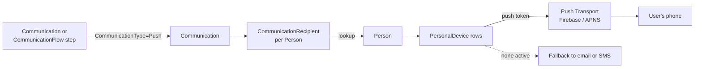

# Push Notifications

## Overview

Push Notifications are mobile-app notifications sent to a person's registered devices. The send pipeline reuses the standard `Communication` infrastructure with `CommunicationType.PushNotification` (or as a step in a `CommunicationFlow`). The recipient lookup walks Person -> registered `PersonalDevice` rows; each device has a push-notification token from the mobile shell. Delivery goes through a configured push transport (typically Firebase Cloud Messaging or Apple Push Notification Service via the Rock Mobile shell). Push as a fallback medium for system communications was added with commit `bcbe225de8` (2025-07-15), tying chat-message events to the Communication system for fallback alerts.

## Why It Exists

Members who use the church mobile app expect to receive timely notifications: "your check-in slot is open," "your prayer request received a comment," "the prayer-team alert just fired for your group." Email is too slow for those use cases; SMS works but not every recipient has SMS enabled. Push is the right channel when the user has opted in and the app is the surface they are most likely to engage with.

The chat-message fallback work (commit `bcbe225de8`, 2025-07-15) added a "Send Fallback Chat Notification" Automation Event that alerts a Person via alternate methods (email, SMS) if they do not have an active personal device or have notifications turned off. Tying the fallback into the Communication system means the same fallback logic works for any chat-message-driven push.

## Mental Model

A Communication of type Push has the standard recipient list. For each `CommunicationRecipient`, the transport walks to all of the Person's `PersonalDevice` rows that have push enabled and an active token, and submits to the push provider. If the Person has no active devices, the configured fallback (if any) routes to a different medium.

`PersonalDevice` rows are created by the mobile shell when a user installs and registers the app. The `DeviceRegistrationId` is the push token; updating tokens (which providers do periodically) goes through the standard save flow.

## What You Need to Know

**Push is a `CommunicationType` value.** Not a separate entity. The same `Communication` shape handles email / SMS / push; the type determines transport routing.

**Recipient resolution walks PersonalDevice.** Each Person can have multiple registered devices (phone + tablet, multiple family members on shared devices). Push fans out to all active push-enabled devices.

**`PersonalDevice.NotificationsEnabled` controls per-device push.** A device with the app installed but notifications disabled does not receive push. The user controls this from device settings.

**Fallback to email or SMS is configurable.** "Send Fallback Chat Notification" event (since `bcbe225de8`) checks for active device and notifications. Without a fallback, push-only sends silently fail for opt-out recipients.

**Tokens expire and rotate.** Push providers issue tokens that rotate periodically; the mobile shell re-registers and updates `DeviceRegistrationId`. Tokens that fail at send time should be flagged as inactive; failed-token cleanup is a maintenance concern.

**Click-through tracking is provider-dependent.** Open / interact tracking on push requires the mobile shell to report back; not all providers support all tracking.

**Multi-device sends produce multi-receipt status.** A single `CommunicationRecipient` can correspond to multiple device sends; status aggregates. Delivered to ANY device is typically counted as delivered.

**System communications can use push as primary or fallback.** Configure the SystemCommunication's `MediumValueId` to push, with optional fallback to email. Group attendance reminders, sign-up confirmations, and similar system notifications gained the medium-fallback awareness in commit `fcd4a50879` (2025-07-28).

**Custom workflow actions can produce push.** Workflow Action types `Send Push Notification` and the Chat Channel/Direct Message Send (`6774847b62`, 2025-10-29) generate push via the standard infrastructure.

**Push security is light.** Notifications are typically not the channel for sensitive content; the user's lock screen often shows the body. Sensitive content should be redacted or use deep-link "you have a new message, open the app to view" rather than putting content in the push body.

## Common Scenarios

**"Send a push to a specific person."** SystemCommunication of type Push, triggered with the target Person. Or a Workflow `Send Push Notification` action.

**"Send a push as part of a Flow step."** CommunicationFlow step with channel = Push. Step generates a Communication of type Push at the step's send time.

**"Notify a chat user about a new message via push, falling back to email."** "Send Fallback Chat Notification" automation event (since `bcbe225de8`) handles the fallback logic. Configuration on the chat-channel or chat-message automation.

**"Add a new push provider."** Implement the appropriate `TransportComponent`. Configure the provider attributes (server key, project id). Communications of type Push route through the new transport.

**"List all of a Person's devices."** Person Detail surfaces a Personal Devices panel. `PersonalDevice` rows include device type, registration date, last-active timestamp.

**"Disable push for a Person."** They can disable in the mobile app's notification settings (sets `NotificationsEnabled = false` on the device). Admins can also disable per-device from the Personal Devices panel.

## Key Architectural Decisions

### Push as a CommunicationType, not a separate entity

Reusing the Communication infrastructure means recipient resolution, status tracking, history, and reporting all work uniformly across mediums.

### Fan-out to all active devices

A Person typically has one phone, but tablets and shared devices exist. Sending to all active push-enabled devices ensures delivery without requiring per-device picking.

### Fallback opt-in via automation events

Hardcoded fallback would force every push to also send email; opt-in via configuration lets administrators tune per-message-type.

### Tokens stored on PersonalDevice

PersonalDevice is the natural home for push tokens (the device is the addressable unit). Token rotation goes through the standard save flow.

### Provider abstraction via TransportComponent

Different push providers have different API shapes; the abstraction lets new providers plug in without touching the Communication core.

## Considered but Rejected

### Push as a separate entity from Communication

Rejected. Reusing Communication keeps the surface area unified.

### Send only to the most recent device

Rejected. Multi-device users (phone + tablet) expect notifications on both.

### Hardcoded provider integration

Rejected. Different deployments use different providers.

## Technical Reference

### Schema (relevant subset)

`Communication.CommunicationType`: enum value `PushNotification`.

`PersonalDevice`:
- `PersonAliasId`
- `DeviceRegistrationId` (push token)
- `DeviceTypeValueId` (DefinedValue: iOS, Android, etc.)
- `NotificationsEnabled`
- `IsActive`
- `LastSeenDateTime`

### Transport Components

`Rock/Communication/Transport/` contains transport implementations for each medium. Push transports are configured per provider (e.g., Firebase, APNS).

### Service / API

Push send goes through the standard `CommunicationService.Send(communication)` path. The medium-routing logic in the transport selects push transport based on `CommunicationType`.

### Affected Blocks

- **Push delivery:** transparent; same Communication blocks handle composition.
- **PersonalDevice management:** Person Detail surfaces, Personal Device admin.
- **Workflow actions:** Send Push Notification, Chat Channel/Direct Message Send.

### Related Docs

- [docs/communication/bulk-vs-system-vs-flow.md](bulk-vs-system-vs-flow.md) for the constructs.
- [docs/communication/communication-flows.md](communication-flows.md) for multi-step flows including push.
- [docs/mobile/mobile-overview.md](../mobile/mobile-overview.md) for the mobile shell side.

## Recent Impactful Changes

- **2025-10-29** ([commit `6774847b62`](https://github.com/SparkDevNetwork/Rock/commit/6774847b62)). Two new Workflow Action Types: Chat Channel Message Send and Chat Direct Message Send, both of which can generate push.
- **2025-07-28** ([commit `fcd4a50879`](https://github.com/SparkDevNetwork/Rock/commit/fcd4a50879)). Several system notifications (Group Attendance Reminders, Sign-Up Registration Confirmations, Sign-Up Reminders) check whether the recipient has SMS enabled before choosing between SMS or email; same pattern applies to push fallback.
- **2025-07-15** ([commit `bcbe225de8`](https://github.com/SparkDevNetwork/Rock/commit/bcbe225de8)). Added "Chat Message" Automation Trigger and "Send Fallback Chat Notification" Automation Event: alerts via alternate methods (email, SMS) if a Person has no active personal device or has notifications turned off.
