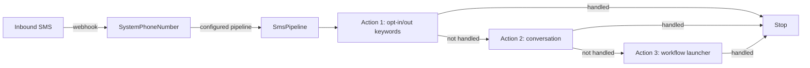

# SMS Pipeline

## Overview

The SMS Pipeline is Rock's inbound-SMS handler. When a person texts a configured `SystemPhoneNumber`, the inbound webhook hits the pipeline associated with that number. The pipeline is an ordered list of `SmsAction` rows, each implementing an `SmsActionComponent` that decides whether to handle the message. Handlers can route to a Group, file as a conversation, run a workflow, send an automated reply, or pass through. The first action that claims the message wins; subsequent actions do not run unless the first explicitly defers.

## Why It Exists

Inbound SMS in a church-management system has many possible interpretations: a prayer request, a check-in code, a giving keyword, an opt-in/opt-out keyword, a reply to a previous outbound message, a help command. Hardcoding the routing logic would force every site through the same flow; modeling it as a configurable pipeline of pluggable actions lets each church wire their own handlers in their preferred order.

The compliance work for SMS opt-in/opt-out (commits `02e8ba5f86`, `832716a068`, `f9bce642f1` in August 2025) exists because Short Code SMS providers require specific compliant default responses to keywords like START and STOP. Non-compliance gets the carrier's number flagged or blocked. The pipeline's compliance is per-`SystemPhoneNumber`: each number can configure its keyword responses and behavior.

## Mental Model

Actions execute in `Order`. Each is a chain-of-responsibility step: claim and process, or pass through. Most actions can configure conditions (matches a keyword, includes specific phrases, sender is in a DataView).

## What You Need to Know

**Chain of responsibility, not fan-out.** First action that claims the message wins. Other actions in the pipeline do not run on that message unless the first defers explicitly. This matches operator intent: a Conversation action and a Group Routing action are mutually exclusive for any given message.

**Order matters.** Higher-priority actions (opt-in/out keyword handlers, system commands) typically run first; catch-all actions (file as conversation, generic workflow launcher) run last. Reordering in the SMS Pipeline Detail UI is drag-and-drop.

**Each `SmsAction` is one component implementation.** `SmsActionComponent` is the abstract base; specific action types (Conversation, Workflow, Send Reply, Forward to Group) are subclasses. Custom action types ship as new components.

**SMS Pipeline Action can create a reply Communication.** Since `0766628398` (2025-11-10), each action has a configuration option to create a new `Communication` record when sending an outbound reply. Off by default (back-compat); turn on per-action when reply tracking matters.

**Opt-in/opt-out keywords are SystemPhoneNumber-level config.** Default compliant responses ship per the August 2025 compliance work. Per-number overrides (suppress automatic responses, prevent communication-preference updates) exist via `832716a068`. Custom carriers must respect the configured keywords.

**Opt-in/out keywords appear in conversation history.** Pre-fix `f9bce642f1` (Fixes #6397), START/STOP/HELP keywords were missing from the SMS Conversation block's history. The fix populates them when the SMS Conversations Action is configured in the pipeline.

**`SmsAction.Continue = true` lets the next action also run.** The default is `Continue = false` (claim and stop). Explicit `Continue = true` is for actions that observe but don't claim (logging, analytics).

**Custom keyword routing is just a component.** A custom `SmsActionComponent` that matches "GIVE" and routes to a giving-flow workflow is a one-class addition. Configuration is via component attributes.

**Inbound SMS can come from a Person or an unknown number.** The pipeline tries to resolve the sender to a Person via PhoneNumber match. Unknown senders are typed as anonymous; some actions accept anonymous (file in conversation), others require a Person match.

**`SmsPipeline.IsActive = false` disables the entire pipeline.** Useful for maintenance; the SystemPhoneNumber stops handling inbound until reactivated. Outbound is unaffected.

**Default reply text is configurable per pipeline.** When no action handles the message, the pipeline can reply with a default ("we got your message, please call us"). Configurable per `SmsPipeline`.

## Common Scenarios

**"Configure inbound SMS for a new System Phone Number."** Provision the number with the carrier. Add a `SystemPhoneNumber` row referencing the carrier and the number. Create or pick an `SmsPipeline`. Add `SmsAction` rows for the handlers (opt-in/out, conversation, custom keyword routing). Order them.

**"Add a custom keyword handler."** Implement `SmsActionComponent`. Register as EntityType. Add an `SmsAction` row to the pipeline using the component. Configure the keyword and behavior.

**"Make outbound replies trackable."** Edit the SmsAction's "Create Communication" config option to true. Replies generate `Communication` rows for reporting.

**"Disable a pipeline temporarily."** SmsPipeline `IsActive = false`. Outbound continues; inbound is dropped (or returns the default reply if configured).

**"Investigate why an inbound SMS didn't fire the expected workflow."** Check pipeline order: did an earlier action claim it? Check action conditions: did the message match the keyword filter? Check `SmsActionComponent` security: was the sender authorized?

## Key Architectural Decisions

### Chain of responsibility

Multiple actions claiming the same message would produce duplicate replies. First-match-wins is the right semantic.

### Per-number pipelines

Different numbers serve different purposes (general line, kid's check-in, prayer line). Per-number pipeline configuration matches operational reality.

### Compliance defaults at SystemPhoneNumber level

Opt-in/out compliance is carrier-driven and per-number. Per-number config respects this; global defaults would be too rigid.

### Component pattern for action types

New keyword handlers, integrations, and custom routing logic are all just new components. Configuration-as-data with a component reference is the right shape.

### Reply Communication creation as opt-in

Auto-creating `Communication` rows for every reply would multiply database churn for sites that don't need the trail. Opt-in per action gives the choice.

## Considered but Rejected

### Fan-out: every action runs on every message

Rejected. Duplicate replies are the result.

### Single global pipeline

Rejected. Different numbers need different routing.

### Hard-coded compliance keywords

Rejected. Carrier requirements differ; admins must be able to configure per number.

## Technical Reference

### Schema (relevant subset)

`SmsPipeline`:
- `Name`, `Description`
- `IsActive`
- (Configuration; pipeline does not own actions directly; actions reference pipeline)

`SmsAction`:
- `Name`
- `SmsPipelineId`
- `SmsActionComponentEntityTypeId` (the component class)
- `Order`
- `IsActive`
- `Continue` (whether subsequent actions can also run)
- Component-specific attribute values

`SystemPhoneNumber`:
- `Name`, `Description`
- `Number` (the actual SMS number)
- `SmsReceivedPipelineId` (FK to the inbound pipeline)
- Carrier-specific configuration via `EntityTypeId` for transport
- Opt-in/out keyword and response configuration

### Built-in Action Components

- Conversation (file in SMS Conversation)
- Forward to Group
- Workflow launcher
- Send Auto Reply
- Custom action subclasses

### Affected Blocks

- **Admin:** SMS Pipeline Detail/List, SMS Action Detail (per pipeline), System Phone Number Detail.
- **Operational:** SMS Conversations.

### Related Docs

- [docs/communication/bulk-vs-system-vs-flow.md](bulk-vs-system-vs-flow.md) for outbound bulk vs system distinction.
- [docs/communication/communication-overview.md](communication-overview.md) for the communication domain.

## Recent Impactful Changes

- **2025-11-10** ([commit `0766628398`](https://github.com/SparkDevNetwork/Rock/commit/0766628398)). Each SMS Pipeline Action gained a configuration option to create a new Communication record when sending an outbound reply.
- **2025-08-15** ([commit `f9bce642f1`](https://github.com/SparkDevNetwork/Rock/commit/f9bce642f1)). Opt-in/opt-out keywords (START/STOP) now appear in SMS Conversation history when the SMS Conversations Action is configured (Fixes #6397).
- **2025-08-14** ([commit `832716a068`](https://github.com/SparkDevNetwork/Rock/commit/832716a068)). Added per-`SystemPhoneNumber` configuration options for SMS opt-in/opt-out: suppress automatic responses, prevent communication-preference updates.
- **2025-08-13** ([commit `02e8ba5f86`](https://github.com/SparkDevNetwork/Rock/commit/02e8ba5f86)). Default SMS Opt-In/Opt-Out response messages updated to meet Short Code compliance standards.
