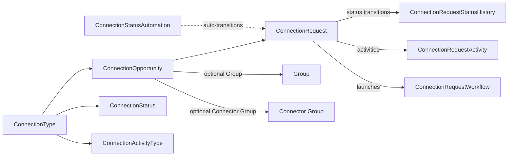

# Connection Domain Overview

## Overview

Connection is Rock's process-management system for tracking the lifecycle of an "intent to connect": a person fills out a Get Involved card, expresses interest in baptism, signs up to volunteer. Each becomes a `ConnectionRequest` belonging to a `ConnectionOpportunity` (one specific role/path) under a `ConnectionType` (the family of opportunities). A connector is assigned, activities are logged as the relationship develops, and statuses transition until the request closes (Connected, Inactive, etc.).

## Why It Exists

Churches need a system between "we got your card" and "you are now in the small group / on the volunteer team / scheduled for baptism." The space in between is where most people fall through the cracks: the card sits in a box, the email gets buried, the connector forgets to follow up. Connection exists to make that space visible, assignable, and reportable, with status automation, workflow integration, and health metrics.

The recent perf work (`f74c699b96`, Fixes #6643, 2026-02-27) addresses real-world DB blocking when many ConnectionRequests are created simultaneously (peaks after a service or event). Pre-fix, concurrent inserts blocked each other; the fix reduces contention.

The Connection Request Board (`90cae56911`, 2025-07-30) adds drag-and-drop workflow reordering and conditional workflow application (Age Classification + dataview filters). The why: connectors and ministry staff need to organize their queue visually; one-size-fits-all workflow application produced false positives when a workflow that made sense for adults fired on a child connection request.

## Mental Model

Three entity layers, like Workflow:

- **`ConnectionType`** is the family ("Volunteer", "Baptism", "Membership Steps").
- **`ConnectionOpportunity`** is the specific role ("Children's Ministry Volunteer", "Adult Baptism Class").
- **`ConnectionRequest`** is one person's signup against an opportunity.

`ConnectionStatus` defines the states ("Pending", "Active", "Future Follow-up"); `ConnectionStatusAutomation` rules transition requests automatically based on time, attendance, or attribute conditions. `ConnectionRequestStatusHistory` logs the lineage. `ConnectionRequestActivity` rows are connector-logged interactions ("Sent welcome email", "Met for coffee").

Optional Group integration: an opportunity can be tied to a Group (the team they would join when connected); placement creates a GroupMember on connection.

## What You Need to Know

**Concurrent ConnectionRequest creation could block.** Pre-fix `f74c699b96`, simultaneous inserts (post-service signup batches, event registration overflows) caused DB blocking and timeouts. The fix reduces contention; older builds may show this on weekend peak loads.

**Status automation runs on a schedule, not real-time.** `ConnectionStatusAutomation` rules are evaluated by a job. A request that meets the automation criteria right now will not transition until the next sweep. Real-time triggers should use `ConnectionWorkflow` instead.

**Workflows can be conditioned on Age Classification or DataView.** Since `90cae56911`, ConnectionType / Opportunity workflows can include or exclude Age Classifications (Adult, Child) and dataview membership. Without this, workflows ran for every connection request regardless of fit.

**Connector preferences and connector groups are different.** A connector preference is a person's stated availability; a connector group is the pool of people who could be assigned. The Board UI surfaces both for admin manual assignment.

**Activity logging is connector-driven.** No automatic activity rows are created when nothing happens. Reports that rely on "no activity in 30 days" are useful for surfacing stalled requests.

**`ConnectionType` controls reordering of workflows via drag-and-drop in the Board.** Behavior may surprise admins who expect alphabetical or creation-date ordering; the Board ordering is operator-defined.

## Common Scenarios

**"Track new volunteer signups."** Create a ConnectionType "Volunteer" and an Opportunity per role ("Greeter", "Children's Worker"). Configure connectors. The Connections Hub (or the public Connection Request Entry block) creates ConnectionRequests; connectors work them through the Board.

**"Auto-transition stagnant requests."** ConnectionStatusAutomation rule that flips Active -> Inactive after 60 days with no activity. Evaluated on the schedule.

**"Launch a workflow when a Connection Request is created."** ConnectionWorkflow row on the ConnectionType or ConnectionOpportunity. Triggered on the request lifecycle event you choose.

**"Surface stalled requests."** Health Snapshot DTO ([Rock/Model/Connection/ConnectionType/DTO/ConnectionRequestHealthSnapshot.cs](../../Rock/Model/Connection/ConnectionType/DTO/ConnectionRequestHealthSnapshot.cs)) provides aggregate metrics; the Connection Operational Snapshot block exposes them.

## Key Architectural Decisions

### Type/Opportunity/Request separation

Same template-vs-instance split as GroupType/Group and WorkflowType/Workflow. Lets one type serve many opportunities; lets one opportunity serve many requests.

### Status as configurable defined values

`ConnectionStatus` rows per ConnectionType let each ministry define their own funnel without code changes.

### Workflows and automations as separate mechanisms

Workflows are event-driven (synchronous on activity); automations are time-driven (job-evaluated). The split lets each handle the appropriate use case; combining them would have produced confusing semantics.

### Optional Group integration

Connection requests can produce Group memberships on close, but membership is not the canonical destination. Some opportunities are pure tracking ("attended baptism class"); others result in placement.

## Considered but Rejected

### Real-time evaluation of all status automations

Rejected. The cost of evaluating every automation on every request change would dominate. Job-driven evaluation gives bounded cost.

### Hard-deleting requests on close

Rejected. Closed requests are a historical record; deletion would break reporting and the Health Snapshot metrics.

### A single Group entity for "connector pool" + "destination team"

Rejected. The two roles are operationally distinct; a connector for the Greeter opportunity may not be a Greeter herself.

## Technical Reference

### Data Model

| Entity | Purpose |
|---|---|
| `ConnectionType` | Family of opportunities, defines statuses/activities, default workflows. |
| `ConnectionOpportunity` | Specific role. References ConnectionType, optional Group, optional Connector Group. |
| `ConnectionOpportunityCampus`, `ConnectionOpportunityConnectorGroup`, `ConnectionOpportunityGroup`, `ConnectionOpportunityGroupConfig` | Per-opportunity satellite configurations. |
| `ConnectionRequest` | One signup. Person, status, connector, request date, activity timestamps. |
| `ConnectionRequestActivity`, `ConnectionActivityType` | Connector-logged interactions. |
| `ConnectionRequestStatusHistory` | Lineage of status transitions. |
| `ConnectionRequestWorkflow`, `ConnectionWorkflow` | Workflow launches per type or opportunity. |
| `ConnectionStatus` | Status definitions per ConnectionType. |
| `ConnectionStatusAutomation` | Time/condition-based status transition rules. |
| `ConnectionTypeSource` | Source attribution (where the request came from). |

### Save Hook Behavior

`ConnectionRequest.SaveHook` writes status history, fires status-change workflows, updates `LastActivityDateTime`.

`ConnectionRequestActivity.SaveHook` updates the parent request's activity timestamps.

`ConnectionWorkflow.SaveHook` and `ConnectionType.SaveHook` invalidate type cache.

### Affected Blocks and UI Surfaces

- **Admin:** Connection Type Detail/List, Connection Opportunity Detail/List, Connection Type Source.
- **Operational:** Connections Hub (the single surface for viewing and creating requests), Connection Request Board, Connection Operational Snapshot. Connection Request Detail is legacy and partner-only: no core link targets it, and it survives for the per-type override on `ConnectionType` and for links an organization built themselves.
- **Mobile:** Connection Request Detail, Connection Request List (heavy fix coverage in `0bd3ec3ad9`, `f52bd2c35b`, `aa49aff6a6`, `4e1e45ff22`).
- **Public:** Connect Detail, Connect List blocks for self-service signup.

### Extension Points

- **Custom workflow triggers.** ConnectionWorkflow rows on type or opportunity, with configured trigger event.
- **Custom status automations.** ConnectionStatusAutomation rules per status.
- **Custom activity types.** ConnectionActivityType per ConnectionType.

### File Index

- `Rock/Model/Connection/` (entities)
- `Rock.Blocks/Engagement/Connection*` (Obsidian-aware blocks; the Connections Hub block is large)

## Recent Impactful Changes

- **2026-08-28** ([commit `9e9964ab4a`](https://github.com/SparkDevNetwork/Rock/commit/9e9964ab4a)). Redirected the core Connection Request links to the Connections Hub, and taught the legacy Connection Request Detail page to accept the Hub's page parameter names.
- **2026-08-28** ([commit `f9acac2205`](https://github.com/SparkDevNetwork/Rock/commit/f9acac2205)). Added support for linking to the Connections Hub with the Add Connection Request modal already open, preselected by Connection Type or Opportunity.
- **2026-08-25** ([commit `7d5c5bd4e9`](https://github.com/SparkDevNetwork/Rock/commit/7d5c5bd4e9)). Improved the internal Connections page structure and removed the legacy Add Campaign Requests and Connection Requests Bulk Update blocks.
- **2026-02-27** ([commit `f74c699b96`](https://github.com/SparkDevNetwork/Rock/commit/f74c699b96)). Reduced DB blocking and improved stability under heavy concurrent ConnectionRequest creation (Fixes #6643).
- **2025-07-30** ([commit `90cae56911`](https://github.com/SparkDevNetwork/Rock/commit/90cae56911)). Connection Request Board: drag-and-drop workflow ordering, default Connection State / Status filter block settings, workflow conditional application by Age Classification and dataview filters.

## Related Specs

- [Connection Request Link Redirection (Phase 3 of Connection Page/Block Cleanup)](../../specs/completed/connection/260827-connection-request-link-redirection.md) — 2026-08-27 (Jason Hendee)
- [Connections Hub Add Entry Point (Phase 2 of Connection Page/Block Cleanup)](../../specs/completed/connection/260825-connections-hub-add-entry-point.md) — 2026-08-25 (Jason Hendee)
- [Connection Page Tree Cleanup (Phase 1 of Connection Page/Block Cleanup)](../../specs/completed/connection/260825-connection-page-tree-cleanup.md) — 2026-08-25 (Jason Hendee)
