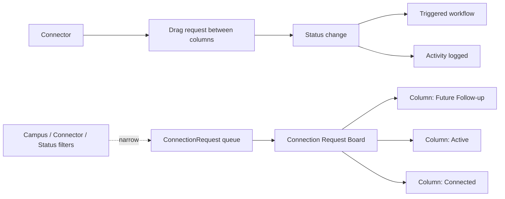

# Connection Request Board

## Overview

The Connection Request Board is the kanban-style admin surface for working a queue of `ConnectionRequest` rows. Connectors see their assignments, drag requests between status columns, log activities, and trigger workflows. The Board lives in the Connections Hub block (`Rock.Blocks/Engagement/ConnectionsHub.cs`), one of Rock's larger blocks. It supersedes the legacy Connection Request Detail block as the primary operational surface.

The 2025-07-30 enhancements (commit `90cae56911`) added campus filtering, connector preferences, conditional workflow application via Age Classification and DataView filters, and drag-and-drop workflow reordering. The 2026-02-27 perf fix (commit `f74c699b96`, Fixes #6643) addressed concurrent-creation contention that produced timeouts under load.

## Why It Exists

Manual queue management for connectors fails at scale: a list of 100 pending Connection Requests is impossible to triage by reading line by line. The Board's columns-by-status visualization, drag-and-drop transitions, and per-request workflow shortcuts compress the operational loop. Connectors stop missing requests; ministry staff get a real-time view of "where are we stuck" health metrics.

The campus filter, connector preferences, and conditional workflows added in 2025-07-30 reflect operational reality: large multi-campus churches need per-campus queue scoping; connectors specialize and need to filter to their preferences; workflows that make sense for adult connections (background-check workflow) should not auto-fire on child connections (different age class). Age Classification + DataView filtering on workflow application gives administrators that control.

## Mental Model

Filters narrow the visible queue; columns visualize statuses; drag operations transition requests with optional workflow firing. Health Snapshot DTOs aggregate metrics for the connector dashboard.

## What You Need to Know

**Concurrent creation contention is fixed.** Pre-fix `f74c699b96` (Fixes #6643, 2026-02-27), simultaneous `ConnectionRequest` creation (peaks after a service or event) caused database blocking and timeouts. The fix reduces contention. Sites running older builds may still see this.

**Drag-and-drop workflow ordering.** Per `90cae56911`, workflows on the ConnectionType / ConnectionOpportunity can be reordered via drag-and-drop. Affects the order workflows fire when their trigger condition matches.

**Campus filter narrows the queue.** Per `90cae56911`, the Board can filter by campus. Single-campus sites typically don't use it; multi-campus sites depend on it.

**Connector preferences let connectors filter to their work.** Per `90cae56911`, connectors can set preferences for opportunities; the Board filters to those.

**Default Connection State and Status filters per block.** Per `90cae56911`, block settings define which states / statuses to show by default. Useful for surfaces that should focus on "active" vs "stale" requests.

**Workflows can be conditioned on Age Classification or DataView.** Per `90cae56911`. Workflows that fire on every Connection Request can be too broad; the conditional application narrows.

**Manual status changes fire workflows.** Configured `ConnectionWorkflow` rows with the matching trigger event fire when the status transitions. Connectors moving requests between columns triggers downstream automation.

**Activities log connector interactions.** Each activity has a type (Email Sent, Phone Call, Meeting, etc.) and a date. The Board surfaces the activity history per request; reports query for "no activity in 30 days" to flag stalled requests.

**Health Snapshot DTOs aggregate metrics.** `ConnectionRequestHealthSnapshot`, `ConnectionRequestStatusDistribution`, `ConnectionRequestCompletionMetricsSummary` are the report shapes consumed by the Operational Snapshot block.

**Custom workflow triggers.** Beyond the built-in lifecycle events (Created, Status Changed, Connected), custom triggers can be wired via `ConnectionWorkflow` configuration.

## Common Scenarios

**"View my Connection Request queue."** Connections Hub block, filtered to my opportunities (via connector preference). Board view shows my pending / active / future follow-up columns.

**"Move a request from Pending to Active."** Drag the card. Status change fires any configured workflows.

**"Filter to a specific campus."** Campus filter on the Board. Useful for multi-campus connectors who serve one location.

**"Reorder workflows on an opportunity."** Connection Opportunity Detail with drag-and-drop ordering. Workflows fire in configured order.

**"Stop a workflow from firing for child connections."** Conditional application: AgeClassification = Adult on the workflow row. Child connection requests skip it.

**"View ministry-wide health metrics."** Connection Operational Snapshot block. Aggregates per-type completion metrics and status distribution.

**"Diagnose timeouts during a service."** If running pre-`f74c699b96`, the concurrent-creation contention is the likely cause. Upgrade to get the fix.

## Key Architectural Decisions

### Kanban-style Board

Status-based visualization matches connector mental model. Drag-and-drop matches operator workflow.

### Connections Hub block consolidates the surface

One block for queue + activity + workflow + reporting. Replaces the older fragmented blocks.

### Conditional workflow application

Per-workflow filters (Age Classification, DataView) prevent over-broad firing.

### Drag-and-drop workflow ordering

Operator preference for ordering should be preserved. UI matches operational tuning.

### Default filters per block setting

Different placements of the Board need different defaults. Per-block configuration is right.

## Considered but Rejected

### Per-connector queue lists (no Board)

Rejected. The Board's status visualization is too valuable.

### Hardcoded workflow filtering

Rejected. Configurable Age Class / DataView filtering is necessary.

### Single global Board (no campus / connector filters)

Rejected. Multi-campus operational reality requires it.

## Technical Reference

### Block

`Rock.Blocks/Engagement/ConnectionsHub.cs`: the Connections Hub block (large; consult before significant customization).

### DTO Types

`Rock/Model/Connection/ConnectionType/DTO/`:
- `ConnectionRequestHealthSnapshot`
- `ConnectionRequestStatusDistribution`
- `ConnectionRequestCompletionMetricsSummary`
- `ConnectionRequestCompletionMetricsComparison`
- `ConnectionRequestUpcomingFollowUpWindow`

### Service / API

`ConnectionRequestService` standard CRUD plus query helpers via `ConnectionRequestQueryOptions`.

### Affected Blocks

- **Operational:** Connections Hub, Connection Operational Snapshot.
- **Admin:** Connection Type Detail, Connection Opportunity Detail.

### Related Docs

- [docs/connection/connection-overview.md](connection-overview.md)
- [docs/connection/status-automation.md](status-automation.md)
- [docs/connection/workflows-and-triggers.md](workflows-and-triggers.md)

## Recent Impactful Changes

- **2026-02-27** ([commit `f74c699b96`](https://github.com/SparkDevNetwork/Rock/commit/f74c699b96)). Reduced DB blocking and improved stability under heavy concurrent ConnectionRequest creation (Fixes #6643).
- **2025-07-30** ([commit `90cae56911`](https://github.com/SparkDevNetwork/Rock/commit/90cae56911)). Connection Request Board updates: campus filtering, connector preferences, drag-and-drop workflow ordering, conditional workflow application via Age Classification and DataView filters, default state/status block settings.
