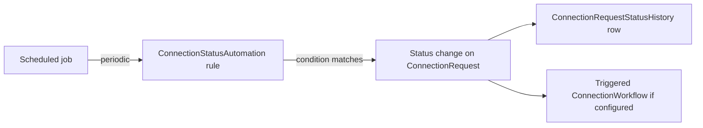

# Connection Status Automation

## Overview

`ConnectionStatusAutomation` is the rule-driven mechanism for transitioning Connection Requests between statuses without human intervention. A rule says "when a request in status X meets condition Y, transition to status Z." Conditions can be time-based (no activity in 30 days), data-based (the connected Person is now in a specific DataView), or attribute-based (a custom field changed). A scheduled job evaluates the rules; transitions fire any configured workflows. `ConnectionRequestStatusHistory` records the lineage so reports can reconstruct who changed what when.

## Why It Exists

Connection requests stall. A volunteer applies, gets assigned a connector, the connector emails once, the volunteer doesn't respond, and the request sits at "Active" forever. Without automation, manual triage is required to identify and act on stalled requests; staff time at scale becomes the bottleneck. Status automation rules let administrators encode the policies they would otherwise apply manually: stale-after-30-days transitions to Future Follow-up; converted-after-Person-attended transitions to Connected; etc.

The job-driven evaluation model exists because real-time evaluation of every rule on every save would multiply database load. Job-driven runs on a configurable cadence, evaluates the rules in batch, and applies transitions. The cost is delayed evaluation (a request that becomes stale right now does not transition until the next sweep); for status-automation use cases, that's acceptable.

## Mental Model

Rules are configured per ConnectionType (and optionally narrowed by ConnectionStatus). The job evaluates rules on schedule; matching requests transition; workflows fire; history records the lineage.

## What You Need to Know

**Status automation is job-driven, not real-time.** A rule that becomes true now does not fire until the next job sweep. Real-time-ish transitions belong in `ConnectionWorkflow` triggers, not automation rules.

**Conditions can be DataView-based.** "Person is in the 'Active Volunteers' DataView" is a common condition. The DataView runs at job-evaluation time; ensure it is performant.

**Time-based conditions use the request's timestamps.** "No activity in N days" reads the request's last-activity timestamp. "Created more than N days ago" reads creation date.

**Workflow integration via the source/target status.** Configured `ConnectionWorkflow` rows with the matching status-change trigger fire when the rule transitions a request. Same triggering mechanism as manual status changes.

**Status history is recorded for every transition.** `ConnectionRequestStatusHistory` rows track who/when. Automation transitions get a system-driven `ChangedByPersonAliasId` (or null for system).

**`ConnectionStatus.IsCriticalStatus` flags require attention.** Some statuses (e.g., "Approval Required") block downstream activity. Reports filter for these to surface action items.

**Rules are per-ConnectionType.** Multi-type configurations can have parallel automation policies; each type evolves independently.

**Disabled rules are skipped.** `IsActive = false` keeps the rule configured but inert. Useful for temporary disabling during a campaign.

**Custom condition types via subclass.** The base evaluator handles standard conditions; deployment-specific logic can subclass for custom checks.

**Job cadence is configurable.** Higher cadence (every 15 minutes) gives lower latency but higher DB load. Lower cadence (daily) is cheaper but slower-reacting. Tune to use case.

## Common Scenarios

**"Auto-transition stagnant Active requests to Future Follow-up after 30 days."** Rule: from-status=Active, to-status=Future Follow-up, condition=NoActivityInDays(30).

**"Auto-Connect a request when the Person attended a service."** Rule: from-status=Active, to-status=Connected, condition=PersonInDataView(Recent Attendees).

**"Notify staff when a request stays in Pending Approval > 5 days."** Rule plus a workflow that fires on the resulting status transition. The workflow sends the notification.

**"Disable an automation rule during a campaign."** Set `IsActive = false`. Re-enable after.

**"Custom condition: 'Person passed a background check'."** Custom condition component that queries `BackgroundCheck` for the Person; rule references it.

**"Audit which automations transitioned a request."** Query `ConnectionRequestStatusHistory` for the request; system-driven transitions are flagged.

## Key Architectural Decisions

### Job-driven evaluation

Real-time evaluation per save would multiply load. Job-driven gives bounded cost.

### Rule-as-data

Configurable per ConnectionType; new rules don't require code.

### Status history for lineage

Audit trail for every transition. Reports can reconstruct.

### Per-ConnectionType rules

Multi-type configurations evolve independently.

### Workflow integration via status-change triggers

Reuses the existing trigger mechanism; no separate automation-trigger pipeline needed.

## Considered but Rejected

### Real-time rule evaluation on every save

Rejected. Cost too high.

### Single global automation policy

Rejected. Multi-type ConnectionTypes need parallel policies.

### Hardcoded conditions

Rejected. Configurable conditions are essential for per-deployment policy.

## Technical Reference

### Schema (relevant subset)

`ConnectionStatusAutomation`:
- `ConnectionTypeId`
- `Name`, `Order`
- `SourceStatusId`, `DestinationStatusId`
- `DataViewId` (DataView-based condition)
- `AutomationConfiguration` (JSON for time-based and other conditions)
- `IsActive`

`ConnectionStatus`:
- `Name`, `Description`
- `ConnectionTypeId`
- `IsActive`, `IsCriticalStatus`, `IsDefault`
- `Order`
- `HighlightColor`

`ConnectionRequestStatusHistory`:
- `ConnectionRequestId`
- `OldConnectionStatusId`, `NewConnectionStatusId`
- `ChangedByPersonAliasId` (null for system)
- `ChangeDateTime`, `Note`

### Job

The status-automation evaluation job runs on configured cadence. Iterates active rules; applies transitions; records history.

### Affected Blocks

- **Configuration:** Connection Type Detail (status / automation configuration).
- **Operational:** Connections Hub (sees automated transitions reflect in queue).

### Related Docs

- [docs/connection/connection-overview.md](connection-overview.md)
- [docs/connection/workflows-and-triggers.md](workflows-and-triggers.md) for the workflow side.
- [docs/connection/request-board.md](request-board.md) for operator surface.

## Recent Impactful Changes

(No release-note-tagged changes specifically to status automation in the last 18 months. The mechanism is mature; the 2025-07-30 work `90cae56911` enhanced the workflow side, not automation.)
