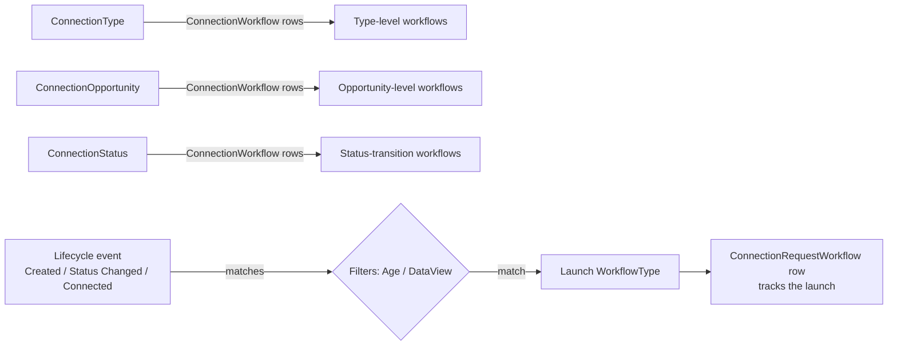

# Connection Workflows and Triggers

## Overview

Connection workflows are configured at three levels: per-`ConnectionType` (fires for every request of any opportunity in the type), per-`ConnectionOpportunity` (fires only for that opportunity), and per-`ConnectionStatus` (fires on a specific status transition). A `ConnectionWorkflow` row binds a workflow type to a trigger event with optional filtering. `ConnectionRequestWorkflow` records each launched workflow instance for audit. As of `90cae56911` (2025-07-30), workflow application can be filtered by Age Classification and DataView, preventing over-broad firing.

## Why It Exists

Connection requests need automation: send a welcome email when a request is created, notify a coordinator when a request is approved, launch a background-check workflow when a connection becomes Active, send a survey when a request transitions to Connected. Hardcoding each as block-level logic would multiply complexity; modeling each as a `ConnectionWorkflow` row referencing a generic `WorkflowType` lets administrators wire any workflow to any trigger event without code.

The conditional application work (`90cae56911`) reflects an operational reality: workflows that fire on every request are sometimes too broad. A "background check" workflow makes sense for adult connections but should not fire for child connections. Age Classification and DataView filters narrow the firing condition.

## Mental Model

Three levels of configuration; common firing path. Filters narrow which requests trigger.

## What You Need to Know

**Three configuration levels: Type, Opportunity, Status.** Most general (Type) to most specific (Status transition). All three fire on matching events; a request can launch multiple workflows from one event.

**Trigger event types.** Configurable per `ConnectionWorkflow`:
- `RequestStarted` (request created)
- `Manual` (operator-triggered button)
- `StatusChanged` (status transition)
- `StateChanged` (state transition like Active to Inactive)
- `ActivityAdded` (new activity logged)
- `Connected` (request closed as Connected)

**Conditional application via Age Classification.** Per `90cae56911`, configure the workflow to apply only to certain Age Classifications. Requests for Persons of other classifications skip.

**Conditional application via DataView.** Per `90cae56911`, configure include / exclude DataView filters. Only requests where the connected Person matches (or doesn't match) trigger.

**Drag-and-drop workflow ordering.** Per `90cae56911`, multiple workflows on the same trigger can be reordered. Affects firing order when multiple workflows match.

**`ConnectionRequestWorkflow` audits launches.** Each fired workflow gets a `ConnectionRequestWorkflow` row tying it to the request, the WorkflowType, and the launch timestamp. Reports query for "which workflows ran on this request."

**Workflow can take action on the request.** A workflow action can transition the request to a new status, set attribute values, or close it. Common pattern: workflow sends email, then transitions request to Future Follow-up if the email opens are not within a window.

**Manual workflows surface as buttons.** A workflow with `TriggerType = Manual` shows up as a button on the request detail. Useful for "Approve" / "Reject" / "Escalate" actions that connectors take.

**Workflow can read connection request data.** Standard workflow attribute pattern: the workflow's Connection Request attribute is set on launch, and actions read attribute values.

**Disabling a `ConnectionWorkflow` stops firing.** Set `IsActive = false`. Useful for testing or temporary disabling.

## Common Scenarios

**"Send a welcome email when a Connection Request is created."** ConnectionWorkflow on the Type with `TriggerType = RequestStarted`. WorkflowType: a simple "send welcome email" workflow.

**"Run a background check when a request becomes Active for adults."** ConnectionWorkflow on the Status (Active) with `TriggerType = StatusChanged`, AgeClassification filter = Adult. WorkflowType: launches a background-check request.

**"Manual escalation button."** ConnectionWorkflow with `TriggerType = Manual`. The button appears on Connection Request Detail; connectors click it to launch.

**"Survey when request connects."** ConnectionWorkflow on the Type with `TriggerType = Connected`. WorkflowType: queues a survey communication.

**"Notify staff on stalled requests."** Combine Status Automation (auto-transitions stalled requests) plus ConnectionWorkflow on the resulting status (sends notification).

**"Audit which workflows fired on a request."** Query `ConnectionRequestWorkflow` for the request id.

## Key Architectural Decisions

### Three-level configuration

Different scopes need different placement. Type for global, Opportunity for specific, Status for transition-driven.

### Trigger types as enum

Configurable trigger semantics; clear list of supported events.

### Conditional application via standard filters

Age Classification and DataView are existing Rock concepts; reusing them keeps the surface familiar.

### Audit via `ConnectionRequestWorkflow`

Every launch is recorded; reports can reconstruct the workflow history.

### Manual triggers surface as buttons

Operator-driven workflows belong on the operator surface; auto-rendering as buttons is the right shape.

## Considered but Rejected

### Single trigger type per workflow

Rejected. Multiple workflows on the same trigger is common; ordering supports it.

### Hardcoded conditional application

Rejected. Per-deployment Age Class / DataView differences require configurable filters.

### Synchronous workflow execution blocking the connection action

Rejected. Workflows are async; the connection action returns immediately while the workflow runs.

## Technical Reference

### Schema (relevant subset)

`ConnectionWorkflow`:
- `ConnectionTypeId` OR `ConnectionOpportunityId` OR `ConnectionStatusId`
- `WorkflowTypeId`
- `TriggerType` (enum)
- `QualifierValue` (for status-specific triggers)
- Conditional application: AgeClassification, IncludeDataViewId, ExcludeDataViewId
- `Order`
- `IsActive`

`ConnectionRequestWorkflow`:
- `ConnectionRequestId`
- `WorkflowId`
- `ConnectionWorkflowId`
- `TriggerType`

### Service / API

`ConnectionWorkflowService`: standard CRUD plus matching helpers (find applicable workflows for a trigger event).

### Affected Blocks

- **Configuration:** Connection Type Detail / Connection Opportunity Detail (workflow tabs).
- **Operational:** Connection Request Detail (manual buttons; auto-launched workflow audit).

### Related Docs

- [docs/connection/connection-overview.md](connection-overview.md)
- [docs/connection/status-automation.md](status-automation.md)
- [docs/connection/request-board.md](request-board.md)
- [docs/workflow/workflow-triggers.md](../workflow/workflow-triggers.md) for the underlying workflow trigger system.

## Recent Impactful Changes

- **2025-07-30** ([commit `90cae56911`](https://github.com/SparkDevNetwork/Rock/commit/90cae56911)). Drag-and-drop workflow ordering on Connection Type / Opportunity blocks. Conditional workflow application via Age Classification and include / exclude DataView filters.
