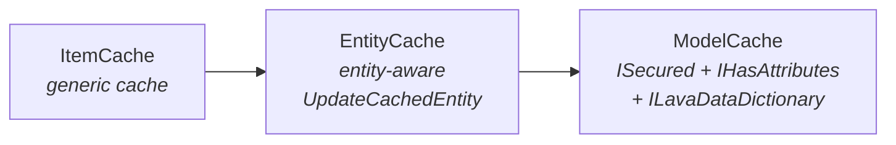

# Cache Invalidation

## Overview

Rock's caches (`PageCache`, `BlockCache`, `GroupCache`, `GroupTypeCache`, `DefinedTypeCache`, dozens more) are per-process singletons backed by `ItemCache<T>` and `EntityCache<T,TT>`. Save hooks invalidate cache entries when the underlying entity changes; multi-node deployments propagate invalidation through the configured Bus so other nodes' caches stay consistent. The whole system is event-driven (no background TTL refresh for most caches), with two exceptions noted below.

## Why It Exists

Reading entity state from the database on every request is too expensive for the hottest paths (page render, block configuration, group-type lookup, security check). Rock chose process-singleton caches as the answer: fetch once, serve from memory until the data changes. The complication is that the cache must be invalidated on change, including changes that happen on a different web-farm node. Save-hook-driven invalidation handles the "this node wrote it" case; the Bus propagation handles the "another node wrote it" case.

The `UpdateCachedEntity` design (commit history shows it stable for years; recent change `9c24366c03` on 2024-06-05 added `CreatedBy`/`ModifiedBy` person alias ids to `ModelCache`) deliberately does NOT read the entity from the database during the hook. The reason is documented in the source: "Don't read the Item into the Cache here since it could be part of a transaction that could be rolled back. Reading it from the database here could also cause a deadlock depending on the database isolation level." ([Rock/Web/Cache/EntityCache.cs:524](../../Rock/Web/Cache/EntityCache.cs))

The web-farm node-id fix (`6e15301107`, 2024-05-07) addressed a real bug: when Node A added an entity, Node B's cache did not have its id in the AllIds list, so `All()` queries on Node B silently missed the new row until something else triggered an eviction. The fix propagates `Added` state through the Bus.

## Mental Model

Three cache base classes layered on top of each other:



A specific cache (e.g. `GroupCache`) inherits from `ModelCache<GroupCache, Group>`. The `ItemCache<T>` layer handles the actual cache backend (RockCacheManager, configurable provider). `EntityCache<T,TT>` adds entity-specific operations: keyed lookup, `All()`, and crucially `UpdateCachedEntity(int entityId, EntityState entityState)`. `ModelCache<T,TT>` adds the security and attribute machinery for entities that implement `ISecured` and `IHasAttributes`.

The invalidation flow is:

1. A save hook in `PostSave` calls `MyCache.UpdateCachedEntity(Entity.Id, PreSaveState.AsEntityState())`.
2. `UpdateCachedEntity` decides what to do based on the state:
   - `Deleted` -> `Remove(entityId)` (drops the entry and removes the id from `AllIds`).
   - `Added` -> `AddToAllIds(entityId)` (registers the id without fetching; the next reader populates the entry).
   - `Modified` (or other) -> `FlushItem(entityId)` (drops the entry; next reader re-fetches).
3. In a multi-node deployment, the cache layer also publishes a `CacheWasUpdatedMessage` on the Bus so other nodes apply the same change to their local caches.

The next reader of the cache entry triggers a fetch from the database, which now reflects the committed state.

## What You Need to Know

**Invalidation does NOT read from the database.** It removes, adds-to-all-ids, or flushes the entry. The next reader populates from the database. This is intentional rollback safety: if the save's transaction rolled back, the next reader sees the rolled-back state, not a stale-cached committed-looking value.

**`UpdateCachedEntity` belongs in `PostSave`, not `PreSave`.** Cache invalidation must not happen if the transaction rolls back. `PostSave` runs only on successful commit.

**Bulk operations bypass save hooks; they bypass cache invalidation too.** Code that uses `BulkInsert`, `BulkUpdate`, `BulkDelete`, raw SQL, or `ExecuteSqlCommand` must explicitly call `UpdateCachedEntity` (or `FlushItem` for less granular invalidation) after the operation. Forgetting this is the most common stale-cache bug in Rock.

**Cache classes that mirror `ISecured` MUST replicate the model's security overrides.** This was the entire substance of commit `dd7e1d45c8` (2026-03-13) that drove the Group caching audit. A cache class that does not override `IsAuthorized`, `ParentAuthority`, and `ParentAuthorityPre` to match its model's overrides will produce divergent authorization decisions depending on whether the caller went through cache or DB. See [docs/group/group-caching.md](../group/group-caching.md) for the canonical pattern.

**`AllIds` is propagated separately from the entity itself.** When Node A adds an entity, the entity content goes into the database (visible to Node B's next read), but the `AllIds` list is per-node cached. Node B has to be told "id N now exists" via the Bus. This is what `6e15301107` fixed.

**Most caches have no TTL.** Entries persist until explicit invalidation. Two known exceptions:

- `GroupCache` for Groups whose GroupType has no check-in configuration: 10-minute TTL ([Rock/Web/Cache/Entities/GroupCache.cs:52](../../Rock/Web/Cache/Entities/GroupCache.cs)).
- `GroupLocationCache` for non-named locations: 10-minute TTL ([Rock/Web/Cache/Entities/GroupLocationCache.cs:55](../../Rock/Web/Cache/Entities/GroupLocationCache.cs)).

These TTLs exist for memory hygiene, not correctness. Code that depends on a non-TTL cache entry being permanent is wrong.

**`new RockContext()` is forbidden inside cache classes.** Use `RockApp.Current.CreateRockContext()` (per commits `b7f1eaa9e0`, `18c8ecbd47`, both 2025-10-27). The factory indirection makes cache code testable; direct construction defeats it.

**`UpdateCachedEntity(int entityId, EntityState entityState)` has overrides for entities that need the entity itself.** `GroupLocationCache.UpdateCachedEntity(GroupLocation entity, EntityState entityState)` ([line 206](../../Rock/Web/Cache/Entities/GroupLocationCache.cs)) takes the entity because it has to refresh an alternate index (`_byLocationIdCache`) when `LocationId` changes. The base id-only signature is hidden with `throw new NotSupportedException` to force callers to use the entity-aware overload.

**`DataViewFilterCache.UpdateCachedEntity(int entityId, ...)` similarly throws.** Same pattern: the cache needs the entity to refresh tree relationships, so the int-only signature is disabled.

**`Cache.All()` reads the database if AllIds is not populated.** First call fetches every id, subsequent calls hit the cache. The `GroupCache` exception is documented: `GroupCache.All()` throws because the dataset is unbounded. Other caches (`DefinedTypeCache`, `BlockTypeCache`) use `All()` freely.

**Consumers should not branch on cache hit/miss.** Just call `MyCache.Get(id)`. The cache transparently fetches on miss. Branching on hit/miss leaks an implementation detail.

## Common Scenarios

**"My save hook should invalidate the cache."**

```csharp
protected override void PostSave()
{
    MyCache.UpdateCachedEntity( Entity.Id, PreSaveState.AsEntityState() );
}
```

**"I ran a `BulkUpdate` and the cache is now stale."** Manually call `MyCache.UpdateCachedEntity(id, EntityState.Modified)` for each affected id, OR `MyCache.Clear()` to drop the entire cache (sledgehammer).

**"I'm writing a new cache for an `ISecured` entity."** Inherit from `ModelCache<TCache, TEntity>`. Override `SetFromEntity` to copy the scalar fields. **Override `ParentAuthority`, `ParentAuthorityPre`, and `IsAuthorized` to mirror the model exactly.** Add `UpdateCachedEntity` invocation in the model's `SaveHook.PostSave`.

**"My cache has an alternate index (e.g., 'all locations for a group')."** Override `UpdateCachedEntity` to take the entity (not just the id) and refresh both the primary entry and the alternate index. Hide the int-only signature with `NotSupportedException`. See `GroupLocationCache` for the pattern.

**"I need to read the entity into cache before any consumer asks."** Don't. The lazy-populate-on-read model is intentional. Pre-loading risks wasted memory and deadlocks during write transactions.

**"My cache value depends on multiple entities."** Memoize the derived value on the cache instance; recompute when any of the underlying caches invalidates. `GroupTypeCache.Roles` is the canonical example: it queries role ids on first access and bulk-fetches via `GroupTypeRoleCache.GetMany`.

**"I want to force cluster-wide cache eviction."** The Cache Manager block under Internal/CMS Configuration has a "Clear Cache" button that broadcasts a clear-everything signal. Use only when something has gone wrong; routine cache eviction is per-entity.

## Key Architectural Decisions

### Invalidation, not refresh

Rolling back transactions means the cache cannot be eagerly populated during the save. Invalidation followed by lazy re-population is the only safe model.

### Per-node caches with Bus propagation

Centralizing the cache (Redis-as-cache, not Redis-as-bus) was rejected: the latency of every cache read going across the network is too high. Per-node caches with broadcast invalidation give in-process speed while staying consistent enough.

### Cache mirrors the model's security exactly

The cache and the model must answer authorization questions the same way; otherwise security checks diverge depending on which path the caller took. Codified in commit `dd7e1d45c8`.

### Three layers (`ItemCache`, `EntityCache`, `ModelCache`)

Each layer adds capabilities at the right level: ItemCache is a generic key-value cache; EntityCache is entity-aware; ModelCache adds security and attribute machinery. Forking only at ModelCache (forcing all caches to be entity-aware) would have made simple non-entity caches awkward.

### Lazy navigation between caches

`GroupCache.GroupType` resolves through `GroupTypeCache.Get`, not by holding a strong reference to a fully-populated GroupType. This bounds memory and lets each cache invalidate independently.

### `new RockContext()` forbidden in cache code

The `RockApp.Current.CreateRockContext()` indirection enables testing with substituted contexts. Direct construction defeats the substitution and forces every cache test to talk to a real database.

## Considered but Rejected

### Eagerly populating the cache during save

Rejected. Transaction rollback would leave the cache holding committed-looking-but-rolled-back values. Lazy population on next read is the only safe model.

### Centralized Redis cache as the primary store

Rejected. Network latency on every cache read is too high. Per-node in-memory caches with broadcast invalidation give the right tradeoff.

### TTL on every cache entry

Rejected. Most entries are stable for hours or days; a short TTL would multiply DB load for no correctness benefit. The two TTL exceptions exist for memory hygiene on unbounded sets, not correctness.

## Technical Reference

### Class Hierarchy

| Class | Adds |
|---|---|
| `ItemCache<T>` ([Rock/Web/Cache/ItemCache.cs](../../Rock/Web/Cache/ItemCache.cs)) | Generic key-value cache, `GetOrAddExisting`, `FlushItem`, `Lifespan`. |
| `EntityCache<T,TT>` ([Rock/Web/Cache/EntityCache.cs](../../Rock/Web/Cache/EntityCache.cs)) | Entity-aware: `Get(int id)`, `Get(Guid)`, `All()`, `UpdateCachedEntity(int, EntityState)`. |
| `ModelCache<T,TT>` ([Rock/Web/Cache/ModelCache.cs](../../Rock/Web/Cache/ModelCache.cs)) | `ISecured` (with `ParentAuthority`, `IsAuthorized`), `IHasAttributes`, `ILavaDataDictionary`, audit-column copies. |

### `UpdateCachedEntity(int entityId, EntityState entityState)`

Defined on `EntityCache<T,TT>` ([line 522](../../Rock/Web/Cache/EntityCache.cs)):

```csharp
if ( entityState == EntityState.Deleted )
    Remove( entityId );
else if ( entityState == EntityState.Added )
    AddToAllIds( entityId );
else
    FlushItem( entityId );
```

Caches with alternate indexes override this with an entity-aware signature and disable the base signature.

### Lifespan and TTL

`ItemCache<T>.DefaultLifespan = TimeSpan.MaxValue` (effectively forever). Per-instance `Lifespan` override returns a `TimeSpan?`; if non-null, the entry expires at `cachedAt + lifespan`. `GroupCache` and `GroupLocationCache` use this for their conditional 10-minute TTL.

### Multi-Node Propagation

`Rock.Bus.Message.CacheWasUpdatedMessage` is the broadcast type. The cache layer publishes when invalidation happens; the receiver on each node applies the same `UpdateCachedEntity` call locally. See [docs/farm/farm-overview.md](../farm/farm-overview.md) for the Bus mechanics.

### Standard Save-Hook Idiom

```csharp
public partial class MyEntity
{
    internal class SaveHook : EntitySaveHook<MyEntity>
    {
        protected override void PostSave()
        {
            MyEntityCache.UpdateCachedEntity( Entity.Id, PreSaveState.AsEntityState() );
        }
    }
}
```

### Standard Custom-Cache Idiom (with security mirroring)

```csharp
public class MyEntityCache : ModelCache<MyEntityCache, MyEntity>
{
    public override void SetFromEntity( IEntity entity )
    {
        base.SetFromEntity( entity );
        var e = (MyEntity)entity;
        Field1 = e.Field1;
        // ...
    }

    public override ISecured ParentAuthority => MyParentCache.Get( ParentId );
    public override ISecured ParentAuthorityPre => null;
    public override bool IsAuthorized( string action, Person person )
    {
        // mirror MyEntity.Logic.IsAuthorized exactly
        return base.IsAuthorized( action, person );
    }
}
```

### Cache Discovery and Listing

The Cache Manager block ([Rock.Blocks/Cms/CacheManager.cs](../../Rock.Blocks/Cms/CacheManager.cs)) lists every registered cache and exposes a "Clear" action per cache plus "Clear All Caches" for the bus-propagated nuclear option.

## Recent Impactful Changes

- **2026-03-13** ([commit `dd7e1d45c8`](https://github.com/SparkDevNetwork/Rock/commit/dd7e1d45c8)). Cache classes (including `GroupCache`, `GroupTypeCache`, `GroupTypeRoleCache`) updated to mirror their model entities' `ISecured` behavior. `ParentAuthority`, `IsAuthorized`, `IsAllowedByDefault` overrides added where missing.
- **2025-10-27** ([commits `b7f1eaa9e0`, `18c8ecbd47`](https://github.com/SparkDevNetwork/Rock/commit/b7f1eaa9e0)). Cache classes switched from `new RockContext()` to `RockApp.Current.CreateRockContext()` to improve testability.
- **2024-06-05** ([commit `9c24366c03`](https://github.com/SparkDevNetwork/Rock/commit/9c24366c03)). `CreatedByPersonAliasId` and `ModifiedByPersonAliasId` added to `ModelCache` so audit data does not require a separate fetch.
- **2024-05-07** ([commit `6e15301107`](https://github.com/SparkDevNetwork/Rock/commit/6e15301107)). Fixed an issue where the cache was missing the ids of entities created on another node, causing `All()` queries to silently miss them.
