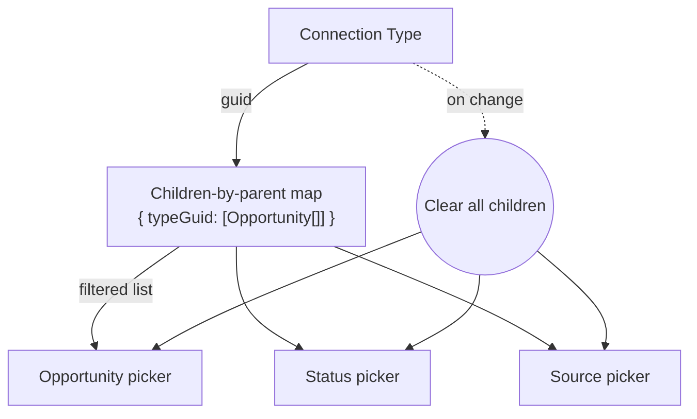

# Cascade Picker Pattern

## Overview

A cascade picker is a parent dropdown plus one or more child dropdowns whose option lists depend on the parent's selection. The Obsidian convention is one parent picker that always renders plus child pickers that are `v-if`-gated on the parent's value; changing the parent emits `null` for every child so persisted child references can never cross the parent's boundary. `connectionTypeSettingsPicker.obs` is the canonical example, with one Type picker plus three children (Opportunity, Status, Source) keyed by the chosen Type's guid.

## Why It Exists

The naive cascade UX, with child pickers always visible but option lists changing as the parent changes, looks tidy but is unsafe. A user can pick a child, change the parent, and end up with the previous child's guid persisted under a new parent's scope. The cascade picker pattern eliminates that class of bug at the UI level: a child only renders once a parent is chosen, and switching the parent clears all children atomically. The pattern also matches how the data actually flows. Parent-to-child relationships in Rock (Connection Type to Opportunity, Group Type to Group, Defined Type to Defined Value) are strictly hierarchical, so the UI should be too.

## Mental Model

Picture a parent that gates its children's visibility. The parent is always rendered. The children are rendered only after the parent has a value. The data feeding the children is a map keyed by the parent's value:



Data shape:

- **Parent option list:** `ListItemBag[]` of all parent options.
- **Children-by-parent maps:** one per child kind, shaped as `Record<string, ListItemBag[]>` keyed by parent guid.

All four data shapes are passed in as props. The picker computes the visible child lists for the current parent value and emits null whenever the parent changes.

## What You Need to Know

**The parent picker always renders; the children are gated.** Use `v-if` on a child block keyed on the parent's value, not `v-show`. `v-show` keeps mounted state alive across parent changes, which is exactly what the pattern is preventing. Re-mounting children on parent change is the feature, not a flaw.

**Changing the parent emits null for every child in a single handler.** Do not rely on a downstream watch to clear children; race conditions and multi-handler ordering bugs are guaranteed. The `onTypeChanged` handler emits `update:connectionType` followed immediately by three `update:*` calls with `null` arguments. See `connectionTypeSettingsPicker.obs:142`.

**Drifted persisted children show as no selection, not silently as a wrong selection.** If a Connection Type was renamed under an Opportunity that no longer exists, the Opportunity picker's selected value is not in the filtered list. Rock's `DropDownList` displays nothing rather than picking the first item; the user sees the slot is empty and either re-picks or chooses to clear. Do not "rescue" the value by un-filtering the child list. The persisted reference is genuinely broken.

**Child lists are pre-shipped, not fetched per pick.** The picker receives `connectionOpportunitiesByType: Record<string, ListItemBag[]>` keyed by Type guid and looks up the right slice via a computed. This avoids a per-pick block-action round-trip and keeps the picker usable in attribute editors that do not host block actions (Form Builder per-field attributes, Workflow attribute matrix). See [Composite Field Type Pattern](composite-field-type-pattern.md) for how field types pre-ship cascade data via `GetPublicConfigurationValues`.

**The parent picker carries `showBlankItem`; children should too.** A blank option on the parent lets the user clear the cascade and start over. Children get `showBlankItem` so the user can explicitly leave a slot empty without picking a "(none)" sentinel.

**Validation rules apply to the cascade root.** When the picker is consumed inside an attribute editor that flags the attribute as required, pass the `rules` prop only to the slots that must be filled (the parent and the canonical child). Optional fallback slots (Status, Source in the Connection example) stay rule-free. See the comment block in `connectionTypeSettingsPicker.obs:95`.

**Composite field-type editors that wrap a cascade picker emit phantom dirty signals on initial mount.** Vue mounts the editor, the editor parses `props.modelValue`, the four refs settle to their parsed values, and the watch on the refs fires once with a value the parent did not send. Guard the emit with a JSON-equality check: serialise the rebuilt object and compare against `props.modelValue`; skip the emit when they match. See `connectionTypeSettingsFieldComponents.ts:120`. Without the guard, every consuming block's dirty tracking spuriously fires on initial render.

## Common Scenarios

**"I want a Type plus children picker for X."**

1. Create `Rock.JavaScript.Obsidian/Framework/Controls/{name}Picker.obs` with `defineProps` declaring: one prop per slot (`{ slotName }: ListItemBag | null`), one prop for the parent options list, and one prop per child for its `Record<string, ListItemBag[]>` map.
2. Declare `defineEmits` with `update:{slotName}` for every slot.
3. Render the parent `DropDownList` always. Wrap the children in `<template v-if="hasParent">...</template>`.
4. On parent change, emit the parent bag followed by `null` for every child.
5. Compute each child's option list via `props.childrenByParent[parentValue] ?? []`.
6. Pass through a `rules` prop and attach it only to the slots that must be filled.

**"My cascade has more than one level (Type → Opportunity → SubOpportunity)."**

Apply the same pattern recursively. Level-2 children are gated on the level-1 child's value, level-2 changes clear level-3, and so on. The pre-shipped data structure becomes `Record<level1Guid, Record<level2Guid, Level3[]>>`. Pre-shipping is still preferred over per-level REST round-trips when the data fits in initialization payload.

## Key Architectural Decisions

### `v-if` not `v-show` on child blocks

Re-mounting on parent change is the entire point. `v-show` would preserve mounted state, including stale child selections, across parent changes.

### Clear all children in a single handler

Multiple watchers or multiple effects competing to clear children produce ordering bugs. One synchronous handler that emits the parent followed by three nulls is unambiguous.

### Pre-shipped maps, not block-action lookups

Per-pick block-action round-trips would couple the picker to a specific block host. Pre-shipped maps let the picker work anywhere (attribute editors, dialog content, configuration panels).

### Drifted children render empty, not silently rescued

Silently rescuing a drifted value masks a real data problem. Empty + visible-to-user is the right signal.

## Considered but Rejected

### Single combined picker (Type/Opportunity/Status/Source in one dropdown)

Rejected. The total cross product is large, the labels are unreadable, and partial fills (Type but no Opportunity) are not expressible.

### Always-visible children with cleared option lists

Rejected. Empty children look interactive and tempt the user to click them before picking a parent. `v-if` gating makes the dependency explicit.

### Server-side cascade via per-pick block actions

Rejected. Couples the picker to a host block; breaks reusability inside attribute editors and Form Builder. Pre-shipped data fits the responsiveness goal.

## Technical Reference

### Cascade picker prop shape

```ts
defineProps({
    // Slot values (one per cascade level)
    connectionType: { type: Object as PropType<ListItemBag | null>, default: null },
    connectionOpportunity: { type: Object as PropType<ListItemBag | null>, default: null },
    connectionStatus: { type: Object as PropType<ListItemBag | null>, default: null },
    connectionTypeSource: { type: Object as PropType<ListItemBag | null>, default: null },

    // Option lists
    connectionTypes: { type: Array as PropType<ListItemBag[]>, default: () => [] },
    connectionOpportunitiesByType: { type: Object as PropType<Record<string, ListItemBag[]>>, default: () => ({}) },
    connectionStatusesByType: { type: Object as PropType<Record<string, ListItemBag[]>>, default: () => ({}) },
    connectionTypeSourcesByType: { type: Object as PropType<Record<string, ListItemBag[]>>, default: () => ({}) },

    // Validation rules carried through to the slots that must be filled
    rules: { type: [Array, Object, String] as PropType<ValidationRule | ValidationRule[]>, default: "" }
});

defineEmits<{
    (e: "update:connectionType", value: ListItemBag | null): void;
    (e: "update:connectionOpportunity", value: ListItemBag | null): void;
    (e: "update:connectionStatus", value: ListItemBag | null): void;
    (e: "update:connectionTypeSource", value: ListItemBag | null): void;
}>();
```

See `Rock.JavaScript.Obsidian/Framework/Controls/connectionTypeSettingsPicker.obs:54` for the full prop block.

### Parent-change handler

```ts
function onTypeChanged(value: string | string[]): void {
    const singleValue = Array.isArray(value) ? (value[0] ?? "") : value;
    const bag = findBag(props.connectionTypes, singleValue);

    emit("update:connectionType", bag);
    emit("update:connectionOpportunity", null);
    emit("update:connectionStatus", null);
    emit("update:connectionTypeSource", null);
}
```

See `connectionTypeSettingsPicker.obs:142`.

### Phantom-emit guard for wrapping field-type editors

```ts
watch([connectionType, connectionOpportunity, connectionStatus, connectionTypeSource], () => {
    const newValue: ConnectionTypeSettings = {
        connectionType: connectionType.value,
        connectionOpportunity: connectionOpportunity.value,
        connectionStatus: connectionStatus.value,
        connectionTypeSource: connectionTypeSource.value
    };

    const serialized = JSON.stringify(newValue);

    // Skip the emit when the rebuilt JSON matches the input so the parent's
    // dirty tracking doesn't flag a phantom change on initial load.
    if (serialized === (props.modelValue ?? "")) {
        return;
    }

    emit("update:modelValue", serialized);
}, { deep: true });
```

See `connectionTypeSettingsFieldComponents.ts:106`.

### Related cross-cutting docs

- [Composite Field Type Pattern](composite-field-type-pattern.md) for the C# field type that pre-ships the cascade data.
- [Obsidian Block Lifecycle](obsidian-block-lifecycle.md) for the surrounding block conventions.

## Related Specs

- [Create Connection Request SMS Action](../../specs/completed/communication/260506-sms-action-create-connection-request.md) — 2026-05-06 (Josh Henninger)
