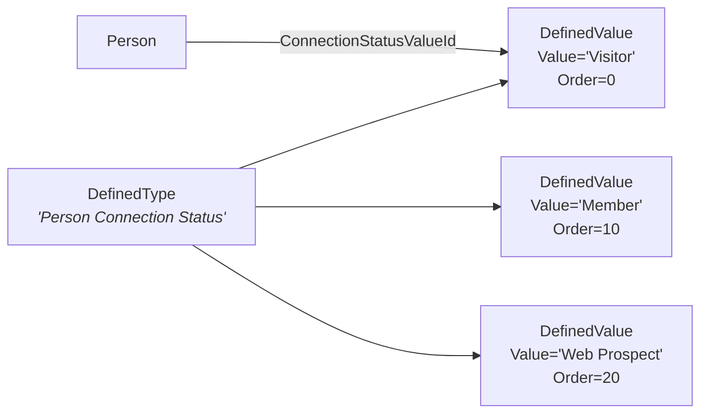

# Defined Type and Defined Value

## Overview

`DefinedType` and `DefinedValue` are Rock's configurable lookup-list pattern. A `DefinedType` is a category ("Person Connection Status", "Group Location Type", "Phone Number Type", "Currency Type"), and `DefinedValue` rows are the entries within that category ("Visitor", "Member", "Active", "Inactive"). Both are entities, both are cached, and both are referenced from across the codebase via `DefinedValueId`. The pattern is used heavily: hundreds of DefinedTypes ship with Rock, and most Rock features have at least one extension point that resolves to a DefinedValue.

## Why It Exists

A church-management system has dozens of small lookup lists that vary per deployment: connection statuses (one church says "Web Prospect", another says "Visitor"), location types ("Home", "Previous", "Work"), record sources ("Event Registration", "Walk-In", "Mobile App"). Hardcoding each as a C# enum would force a code release for every list change. Modeling each as configuration is what lets administrators add new statuses, types, or sources without a deploy.

The `DefinedType.cs` class summary frames this: "in some systems these are referred to as lookup values. The benefit of storing these values centrally is that it prevents us having to maintain `EntityTypes` for each defined value/lookup that you want to create." A separate entity type per lookup would multiply database tables and EF configuration; one shared `DefinedType`/`DefinedValue` schema with `DefinedTypeId` and a `Value` column serves them all.

The cache pair (`DefinedTypeCache`, `DefinedValueCache`) exists because lookups are read-hot and write-cold. Almost every block, save hook, and report needs at least one defined-value resolution; almost no production traffic writes to the tables. The cache eliminates the database round-trip on the hot path.

## Mental Model

A `DefinedType` is **a named lookup list**. A `DefinedValue` is **one entry in that list**:



References live as `<Domain>ValueId int?` columns on entities. A Person's connection status is `Person.ConnectionStatusValueId`, an FK to `DefinedValue.Id`. Resolution is typically through cache: `DefinedValueCache.Get( person.ConnectionStatusValueId.Value )`.

DefinedTypes are categorized through `Category`. The Defined Value field type lets attribute editors pick from a specific DefinedType; this is the universal extension point for "let an admin pick from a list."

## What You Need to Know

**Reference defined values by Guid in code, not Id.** Ids are not stable across deployments (they get assigned at insert time per database). The `Rock.SystemGuid.DefinedValue` constants give stable Guid references. Resolve to the cached entity for the current id:

```csharp
var inactiveStatus = DefinedValueCache.Get(
    Rock.SystemGuid.DefinedValue.PERSON_RECORD_STATUS_INACTIVE.AsGuid() );
```

This is exactly the pattern in `Person.SaveHook.cs:54-55`.

**Use `DefinedValueCache.Get` on hot paths.** A direct `RockContext` query for a defined value on every block render multiplies database load. The cache is the right answer; it is invalidated correctly on save.

**Defined values support categorization, ordering, and security.** `DefinedValue` inherits from `Model<DefinedValue>`, so it implements `ISecured`. Most defined values are public-default; sensitive ones (like background-check provider keys) can be locked down via standard authorization.

**Adding a new DefinedType or DefinedValue is a migration.** Plugin migrations create both. The `DefinedType` is keyed by its Guid (use `Rock.SystemGuid.DefinedType` for core types); each `DefinedValue` is also keyed by Guid for stable cross-deploy reference.

**`Value` is the user-facing label; `Description` is optional supplemental.** Both are free-text; the only required column is `Value`.

**Attribute values that point at a DefinedValue store the DefinedValue's Guid (not Id), as a string.** The Defined Value field type handles serialization. Code that reads such an attribute value resolves the Guid back through `DefinedValueCache.Get(guid)`.

**`DefinedType.FieldTypeId` constrains what fieldType powers the value editor.** Currently only the Text field type is supported on `DefinedType`. The field-type association is more of a forward-compatibility hook than an active configuration knob.

**`IsSystem = true` defined values cannot be deleted through standard UI.** Core defined values that Rock depends on (record statuses, connection statuses, location types) ship with `IsSystem = true`. The UI hides the delete action; raw SQL or service-level deletion bypasses this guard.

**`HelpText` and `IconCssClass` exist for UI affordance.** Many Defined Value pickers display the icon next to the value; the help text appears as a tooltip or sidebar hint. Custom DefinedValues that need branded display use these fields.

**DefinedValues can carry attributes.** Like any `Model<T>`, DefinedValue supports custom attributes. This is how richer lookup data attaches to values without schema changes (a "Country" defined value with an "ISO Code" attribute).

## Common Scenarios

**"Add a custom Person Record Source 'Outreach Event'."** Create a `DefinedValue` row under the `RECORD_SOURCE_TYPE` DefinedType with `Value = "Outreach Event"`. Configure the new value as the default Record Source on the relevant entry points (Check-in template, Event Registration template, Get Person From Fields workflow action).

**"Reference a specific defined value in code."** Use the Guid constant from `Rock.SystemGuid.DefinedValue`:

```csharp
var familyGroupType = DefinedValueCache.Get( Rock.SystemGuid.DefinedValue.PERSON_RECORD_TYPE_PERSON.AsGuid() );
```

**"List all values for a DefinedType."**

```csharp
var statuses = DefinedTypeCache.Get( SystemGuid.DefinedType.PERSON_CONNECTION_STATUS.AsGuid() ).DefinedValues;
```

`DefinedValues` on the cache is ordered by `Order`.

**"Filter to active defined values only."** `IsActive = true` on `DefinedValue`. The cached `DefinedValues` collection includes inactive; filter at the call site.

**"Pick a defined value in a block setting."** Use the Defined Value field type configured with the target DefinedType. The field type's editor presents the values; the stored attribute value is the Guid.

## Key Architectural Decisions

### One schema per category list

Defined types share `DefinedValue` rather than each having its own table. Hundreds of lookup lists with their own tables would be unmanageable. One shared shape with `DefinedTypeId` distinguishing entries gives the right tradeoff.

### Guid-based stable references

Defined value Ids are auto-assigned at insert time and differ per database. Guids are constant. Code references via Guid ensure cross-deployment portability.

### Cache pair for hot reads

DefinedType and DefinedValue cache classes eliminate the database round-trip on the universal lookup path. Without caching, every save hook that resolves a status would hit the database.

### Attributes on DefinedValue

DefinedValue inherits `IHasAttributes`, so custom attributes can attach without schema changes. A list of countries can grow ISO-code, calling-code, or currency-code attributes without altering the core schema.

### Configuration-as-data, not enum-as-code

Modeling lookup lists as data lets administrators add values without a deployment. Enums in code would force a release for every new connection status or location type.

## Considered but Rejected

### One table per lookup list

Rejected. Hundreds of tables with two columns each would explode schema complexity. One shared shape is correct.

### Storing references by Id rather than Guid

Rejected for code references. Cross-deployment references must be stable; Guids are. (Database FK columns store Id because the FK is local to the same database; code constants reference Guid.)

### Hardcoded enums for the most common lookup lists

Rejected. Even "core" lookups (record status, connection status) are extended per-deployment. Configuration-as-data wins.

## Technical Reference

### Schema

```
DefinedType
  Id              int                   PK
  Guid            uniqueidentifier      stable cross-deploy reference
  IsSystem        bit                   delete protection
  FieldTypeId     int?                  forward-compat (currently always Text)
  Order           int                   display order within Category
  CategoryId      int?                  parent category
  Name            nvarchar(100)         display name
  Description     nvarchar(MAX)?        admin help
  HelpText        nvarchar(MAX)?
  EnableSecurityOnValues bit            value-level security toggle

DefinedValue
  Id              int                   PK
  Guid            uniqueidentifier      stable cross-deploy reference
  IsSystem        bit                   delete protection
  DefinedTypeId   int                   parent type
  Order           int                   display order within type
  Value           nvarchar(250)         user-facing label
  Description     nvarchar(MAX)?        optional supplement
  IsActive        bit                   filter for active-only display
  CategoryId      int?                  optional inner categorization
```

Both inherit from `Model<T>` so they get the standard audit columns and `IsSystem`.

### Cache

`DefinedTypeCache` ([Rock/Web/Cache/Entities/DefinedTypeCache.cs](../../Rock/Web/Cache/Entities/DefinedTypeCache.cs)) and `DefinedValueCache` ([Rock/Web/Cache/Entities/DefinedValueCache.cs](../../Rock/Web/Cache/Entities/DefinedValueCache.cs)) are process-singleton caches. Both expose:

- `Get(int id)`, `Get(Guid guid)`, `Get(string guidString)`
- `All()` (all defined types or values; populated on first call)

`DefinedTypeCache.DefinedValues` returns ordered cached values for the type.

### Save Hook Behavior

Standard `Model<T>` save hooks: history writes on changes, cache invalidation on save. No domain-specific logic.

### Service / API Surface

`DefinedTypeService` and `DefinedValueService` provide the standard service patterns. Most code does NOT use the services directly; it goes through the cache. Service usage is for modify operations (admin UI, migrations).

### Core SystemGuid Constants

Browse `Rock/SystemGuid/DefinedType.cs` and `Rock/SystemGuid/DefinedValue.cs` for the full set of stable references. Common categories:

- `PERSON_RECORD_TYPE` (Person, Business, Nameless, REST User)
- `PERSON_RECORD_STATUS` (Active, Inactive, Pending)
- `PERSON_CONNECTION_STATUS` (deployment-specific)
- `GROUP_LOCATION_TYPE` (Home, Previous, Work, Meeting)
- `GROUP_TYPE_PURPOSE` (deployment-specific)
- `FINANCIAL_CURRENCY_TYPE` (Cash, Check, Credit Card, ACH, etc.)
- `RECORD_SOURCE_TYPE` (Event Registration, Check-in, Workflow Entry, etc.)

### Related: Field Type

The Defined Value field type ([`Rock/Field/Types/DefinedValueFieldType.cs`]) is what powers attribute editors that need to pick a defined value. The single-select and multi-select variants exist; both store the picked Guid (or comma-separated Guids) as the attribute value.

### Affected Blocks and UI Surfaces

- **Defined Type Detail/List**: admin manages types and their values.
- **Defined Value Detail**: edits a single value with attributes.
- **Defined Value field type editors**: every block-setting / attribute-value picker that resolves to a DefinedValue.

### Extension Points

- **New Defined Types and Values**: plugin migrations.
- **DefinedValue attributes**: custom attribute set per value via the standard attribute system.
- **`EnableSecurityOnValues`**: per-value authorization, useful for sensitive defined values like background-check provider configurations.

### Standard Idioms

**Resolve a known DefinedValue by Guid:**

```csharp
var dv = DefinedValueCache.Get( Rock.SystemGuid.DefinedValue.PERSON_RECORD_STATUS_ACTIVE.AsGuid() );
```

**Iterate values of a DefinedType:**

```csharp
var dtCache = DefinedTypeCache.Get( SystemGuid.DefinedType.PERSON_CONNECTION_STATUS.AsGuid() );
foreach ( var v in dtCache.DefinedValues.Where( dv => dv.IsActive ) ) { ... }
```

**Add a custom DefinedValue in a plugin migration:**

```csharp
RockMigrationHelper.AddDefinedValue(
    "<DefinedType Guid>",
    "Custom Value",
    "Optional description.",
    "<New DefinedValue Guid>" );
```

## Recent Impactful Changes

(No release-note-tagged changes to the DefinedType/DefinedValue infrastructure itself in the last 18 months. The pattern is mature and stable; the work is in adding new types and values for new features. The 2025-04-22 Record Source Defined Type addition (commit `40103e4133`) is the canonical recent example of "new DefinedType for a new feature.")
