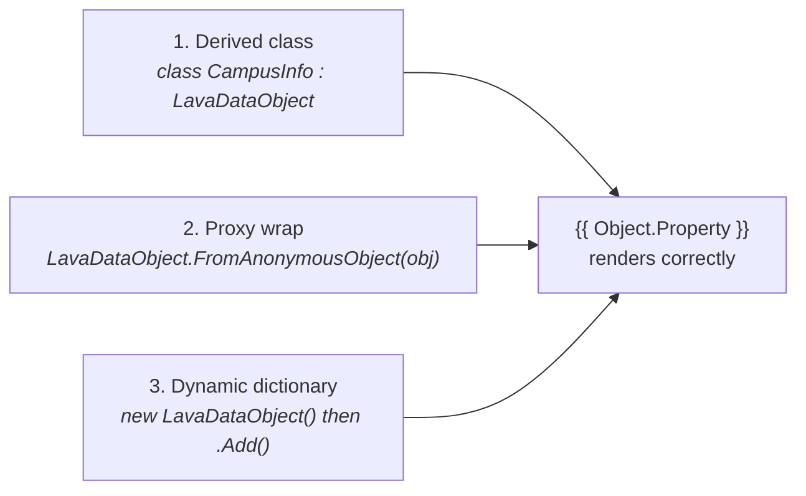

# Lava Data Object

## Overview

`LavaDataObject` is the supported way to expose custom C# data to Lava templates. Two patterns: derive from `LavaDataObject` for a strongly-typed bag, or wrap an existing object with `LavaDataObject.FromAnonymousObject(obj)` to make it Lava-accessible without inheritance. The class implements `ILavaDataDictionary`, `IDictionary`, and `IDynamicMetaObjectProvider`, so Lava can reflect over it and dot-syntax (`{{ MyObject.Property }}`) just works. The legacy alternative is `RockDynamic`, which is now discouraged for new code per the CLAUDE.md convention.

## Why It Exists

Lava is a templating language, not a programming language. Every value the template references must be reachable through the merge field tree by dot-syntax. Standard C# objects are not reachable: their property metadata is not exposed in a way Lava's resolver understands, and their methods are not safely invokable from a template. `LavaDataObject` bridges the gap: it exposes properties as a dictionary, hides methods that template authors should not invoke, and serializes deterministically (always as a dictionary of values, regardless of how the object was constructed).

The CLAUDE.md rule "When passing custom objects to Lava, use `LavaDataObject` (not `RockDynamic`)" exists because `RockDynamic` predates `LavaDataObject` and exposes too much. `RockDynamic` inherits from `DynamicObject`, which makes its dynamic-binding behavior somewhat unpredictable in template contexts, and it does not consistently hide framework-only members. `LavaDataObject` is the cleaner replacement: same use cases, fewer surprises.

The `Info` suffix convention (also from CLAUDE.md) helps reading code quickly: `CampusInfo`, `FamilyInfo`, `ScheduleInfo` are clearly Lava-targeted projection types, not entities.

## Mental Model

A LavaDataObject is **a Lava-safe view of some data**. Three usage patterns:



**Pattern 1 (derive):** Define a class with public properties; inherit from `LavaDataObject`. Properties are auto-discovered by reflection.

```csharp
public class CampusInfo : LavaDataObject
{
    public string Name { get; set; }
    public string Address { get; set; }
    public List<ServiceInfo> Services { get; set; }
}
```

**Pattern 2 (proxy):** Wrap an existing object you do not control:

```csharp
var proxy = LavaDataObject.FromAnonymousObject( someExternalObj );
```

The proxy reflects over the wrapped object's properties; access through the proxy works in Lava.

**Pattern 3 (dynamic dictionary):** Build a bag at runtime:

```csharp
var bag = new LavaDataObject();
bag["Name"] = "First Service";
bag["Time"] = "9:00 AM";
```

Lava sees these as named keys.

`OnTryGetValue` and `OnTrySetValue` are virtual hooks for derived classes that need custom resolution (computed properties, on-demand fetches, redaction).

## What You Need to Know

**Use `LavaDataObject`, not `RockDynamic`, for new code.** The CLAUDE.md rule is explicit. `RockDynamic` is the legacy pattern; new POCO types intended for Lava should derive from `LavaDataObject`. Existing `RockDynamic` usages are not actively migrated, but new code should not extend the surface.

**Name custom Lava types with an `Info` suffix.** `CampusInfo`, `FamilyInfo`, `ScheduleInfo`. The convention makes it immediately clear that the type is a Lava-targeted projection, not a domain entity. Reviewing code, you should suspect any non-Info-suffixed class being passed to Lava.

**Public properties are the merge-field surface.** Lava resolves `{{ Object.Foo }}` to the `Foo` property. Methods, fields, and non-public properties are not visible. If a value should not be exposed to a template, do not add it as a public property.

**Override `OnTryGetValue` for computed or on-demand properties.** The default implementation reads declared properties and dictionary entries. Custom resolution (synthetic properties like "FullAddress" composed from parts, lazy fetches that should only run when Lava asks) hooks here.

**Derived classes can pre-set defaults in the constructor.** Properties default to their CLR defaults; if you need a non-null collection or a computed initial value, set it in the constructor.

**Serialization is always as a dictionary.** A `LavaDataObject` round-tripped through serialization comes back as a dictionary of values, regardless of which constructor was used. Custom property logic in `OnTryGetValue` does NOT survive serialization; persisted state is just the value snapshot.

**Be deliberate about what you expose.** Lava templates can be authored by non-developers with varying trust. Properties that surface internal IDs, security tokens, or private notes are visible if exposed. The "is this visible in a template?" question is a security review item for any new LavaDataObject type.

**`ILavaDataDictionary` is the interface Lava expects.** `LavaDataObject` implements it. Custom Lava-accessible types that cannot inherit from `LavaDataObject` (perhaps because they already inherit from another base class) can implement `ILavaDataDictionary` directly, but this is rare.

**The `proxy` pattern wraps an existing object.** When you have an object from an external library or framework that you cannot modify (third-party SDK return values, EF entities you do not want to surface directly), use `LavaDataObject.FromAnonymousObject(obj)` to wrap. The proxy reflects over the wrapped object's properties.

**Don't pass entity instances directly to Lava.** Even though some entities accidentally work, exposing the full entity surface (navigation properties, EF tracking metadata, internal save-hook state) is brittle and a security concern. Project to a LavaDataObject (typically with the `Info` suffix) before handing off to a template.

## Common Scenarios

**"Surface a custom data shape to Lava."** Define a class deriving from `LavaDataObject` with the `Info` suffix:

```csharp
public class GivingSummaryInfo : LavaDataObject
{
    public decimal TotalGiven { get; set; }
    public int TransactionCount { get; set; }
    public DateTime FirstGiftDate { get; set; }
}
```

Create instances and merge into Lava context.

**"Add a computed property that derives at access time."** Override `OnTryGetValue`:

```csharp
public class CampusInfo : LavaDataObject
{
    public string Name { get; set; }
    public string Address { get; set; }
    public string City { get; set; }

    protected override bool OnTryGetValue( string key, out object result )
    {
        if ( key == "FullAddress" )
        {
            result = $"{Address}, {City}";
            return true;
        }
        return base.OnTryGetValue( key, out result );
    }
}
```

**"Wrap an SDK return value to make it Lava-accessible."**

```csharp
var sdkResult = thirdPartyApi.GetSomething();
var lavaProxy = LavaDataObject.FromAnonymousObject( sdkResult );
mergeFields["Result"] = lavaProxy;
```

**"Build a dictionary at runtime."**

```csharp
var bag = new LavaDataObject();
foreach ( var kvp in someMapping )
{
    bag[kvp.Key] = kvp.Value;
}
mergeFields["DynamicData"] = bag;
```

**"Migrate an existing `RockDynamic` derivation."** Change the base class to `LavaDataObject`. Verify the property surface still resolves the same way (in most cases it does). Add tests if the type is widely used.

## Key Architectural Decisions

### `LavaDataObject` over `RockDynamic`

Same use cases, cleaner surface. `RockDynamic` exposes more dynamic-binding behavior than templates need. `LavaDataObject` hides framework members and serializes deterministically.

### Three usage patterns from one class

Inheritance for static shapes, proxy for external objects, dictionary for runtime bags. Each pattern is one line of authoring (derive, factory call, or constructor); the class supports all three without forcing a choice up front.

### `OnTryGetValue` as the override point

Computed properties, lazy fetches, and redaction are common enough that they deserve a hook. Forcing every derived class to override `IDynamicMetaObjectProvider` directly would be hostile.

### `Info` suffix convention

Reviewing code, you can spot Lava-targeted types instantly. Without the convention, you would have to read the class hierarchy to know.

### Deterministic serialization

Lava merge fields are sometimes persisted (workflow attribute values, content channel item attribute values). Always serializing as a dictionary means round-tripping through serialization does not change the merge-field shape.

## Considered but Rejected

### Exposing entity instances directly to Lava

Rejected by convention. EF navigation properties, change-tracking metadata, and save-hook internals should not be reachable from a template. Project to an `Info` type.

### Auto-deriving a LavaDataObject from any C# class

Rejected. The "is this exposed to templates?" review is a deliberate boundary; auto-exposing makes everything reachable and breaks the boundary.

### Replacing `RockDynamic` with a hard removal

Rejected (so far). Existing usages are not actively migrated; new code should use `LavaDataObject`. The legacy class remains for backward compatibility.

## Technical Reference

### Class

`LavaDataObject` ([Rock.Lava.Shared/Core/LavaDataObject.cs](../../Rock.Lava.Shared/Core/LavaDataObject.cs)) implements:

- `ILavaDataDictionary` (the interface Lava resolution expects)
- `IDictionary` (for runtime key-value population)
- `IDynamicMetaObjectProvider` (for dot-syntax access)

Internally uses a `LavaDataObjectInternal` helper (an extended `DynamicObject`) for the dynamic resolution.

### Construction

```csharp
new LavaDataObject()                           // empty dictionary
new LavaDataObject( object proxy )             // proxy a wrapped object
LavaDataObject.FromAnonymousObject( obj )      // factory; same as the proxy constructor
```

Derived classes can implement their own constructors as needed; the base does the lazy-instantiation of the internal helper.

### Override Hooks

```csharp
protected virtual bool OnTryGetValue( string key, out object result )
protected virtual bool OnTrySetValue( string key, object value )
```

Override either to customize property resolution.

### Serialization

`LavaDataObject` is `[Serializable]`. The `[NonSerialized]` private `_lavaDataObjectInternal` field means custom dynamic logic does not survive a round-trip; only the values do. After deserialization, `GetLavaDataObjectInternal` lazily re-instantiates the helper.

### Legacy: `RockDynamic`

`RockDynamic` ([Rock/Utility/RockDynamic.cs](../../Rock/Utility/RockDynamic.cs)) is the predecessor pattern. It also implements `ILavaDataDictionary`, but inherits from `DynamicObject` directly. New code should use `LavaDataObject`. Existing `RockDynamic` derivations are not being actively migrated.

### Naming Convention

`Info` suffix for Lava-targeted projection types: `CampusInfo`, `FamilyInfo`, `ScheduleInfo`, `GivingSummaryInfo`. The convention is project-wide; new types should follow it.

### Affected Patterns

- **Workflow attributes**: workflow attribute values that need to be Lava-accessible during form rendering pass through `LavaDataObject` projections.
- **Lava merge fields**: any `mergeFields["Key"] = customObject` where `customObject` is not already a primitive, entity, or collection should be a `LavaDataObject`.
- **Custom communication merge fields**: providers of merge fields for SystemCommunication and bulk Communication wrap their values in LavaDataObjects.

### Standard Idioms

**Define a Lava-targeted info type:**

```csharp
public class FamilyInfo : LavaDataObject
{
    public string FamilyName { get; set; }
    public CampusInfo Campus { get; set; }
    public List<PersonInfo> Members { get; set; }
}
```

**Override OnTryGetValue for a computed property:**

```csharp
protected override bool OnTryGetValue( string key, out object result )
{
    if ( key == "MemberCount" )
    {
        result = Members?.Count ?? 0;
        return true;
    }
    return base.OnTryGetValue( key, out result );
}
```

**Wrap a third-party object:**

```csharp
var lavaWrapper = LavaDataObject.FromAnonymousObject( sdkResponse );
mergeFields["Sdk"] = lavaWrapper;
```

**Build a dictionary bag:**

```csharp
var bag = new LavaDataObject();
bag["Items"] = items.Select( i => new ItemInfo { Name = i.Name } ).ToList();
mergeFields["Custom"] = bag;
```

## Recent Impactful Changes

(No release-note-tagged changes to `LavaDataObject` or `RockDynamic` in the last 18 months. The classes are stable; the work is in domain code that defines new `Info` types as needed.)
