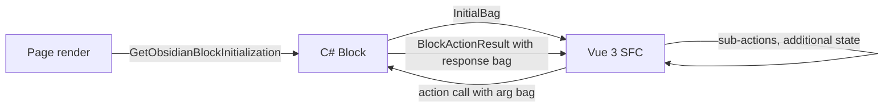

# Obsidian Block Lifecycle

## Overview

An Obsidian block is the modern Rock block: a **C# block class** (in `Rock.Blocks/`) plus a **Vue 3 SFC** (`.obs` file in `Rock.JavaScript.Obsidian.Blocks/src/`) plus **typed bag classes** (in `Rock.ViewModels/Blocks/`). The C# class produces an initial state on page render and exposes `BlockAction`-decorated methods that the Vue component calls; the Vue component renders the UI and posts back through those actions; the bag classes are the request/response contracts. Together they replace the legacy WebForms (`.ascx`/`.ascx.cs`) block model.

The migration is multi-year. Most major blocks have been converted; some are still WebForms and being chopped over time.

## Why It Exists

WebForms blocks are tightly coupled to the page lifecycle, ViewState, and post-back model: every interaction is a full page POST, every UI element binds to server-side controls, and the boundary between server logic and rendered HTML is blurry. Obsidian inverts the model: the C# block is a small REST-style backend that produces an initial bag and handles named actions; the Vue component is a real client-side application with its own state. The boundary is explicit: bags cross it, nothing else.

The benefit is operational: Vue components are testable in isolation, the C# block is small and focused, the typed bag contract makes round-trip data shape obvious, and the runtime is the modern web. The cost is the conversion work to migrate the existing block library.

The bag-based pattern (request bag in, response bag out, both with explicit C# types) was chosen because dynamic typing across the C#/JS boundary produces hard-to-debug serialization issues. Typed bags with code-generated TypeScript declarations (`.d.ts` files in the same partials folder) catch shape mismatches at build time.

## Mental Model

Three components in a fixed shape:



```
Rock.Blocks/{Domain}/{BlockName}.cs           ← C# block class (server)
Rock.JavaScript.Obsidian.Blocks/src/{Domain}/{blockName}.obs  ← Vue 3 SFC (client)
Rock.JavaScript.Obsidian.Blocks/src/{Domain}/{blockName}/    ← Vue partials folder
Rock.ViewModels/Blocks/{Domain}/{BlockName}/  ← Bag classes (contract)
```

The C# block class:

- Inherits from `RockBlockType` (or a more specific subclass like `RockDetailBlockType`).
- Implements `IRockObsidianBlockType` (which `RockBlockType` already does).
- Provides an entry method that returns the initial bag (typically auto-handled for detail blocks via the `RockDetailBlockType` helper).
- Decorates round-trip methods with `[BlockAction]`. Each becomes a server-side action callable from the Vue component.

The Vue SFC:

- Imports the bag types from the auto-generated `.d.ts` file in the partials folder.
- Receives the initial bag through the standard Obsidian framework injection.
- Calls block actions via the framework's `invokeBlockAction` helper.
- Renders all UI; the C# block produces no HTML.

## What You Need to Know

**Three folder paths must agree.** A block named `Rock.Blocks/Group/GroupAttendanceDetail.cs` has its Vue SFC at `Rock.JavaScript.Obsidian.Blocks/src/Group/groupAttendanceDetail.obs` and bags at `Rock.ViewModels/Blocks/Group/GroupAttendanceDetail/`. Mismatching the folder triplet is a common conversion mistake.

**File naming differs by side.** C# block classes are PascalCase (`GroupAttendanceDetail.cs`); Vue SFC filenames are camelCase (`groupAttendanceDetail.obs`); bag class filenames are PascalCase. The convention is enforced; mixing produces broken builds (Vue's tooling expects camelCase imports).

**Block Actions are the round-trip surface.** Methods decorated with `[BlockAction]` are callable from the Vue component. The framework auto-resolves the action name from the C# method name unless you override it. Method signatures take typed argument bags and return `BlockActionResult` (or a typed subclass).

**`RockDetailBlockType` is the canonical detail-block base.** It provides `GetInitialEntity` (resolving page-parameter Id/Guid/IdKey via `GetQueryableByKey` and the `DisablePredictableIds` setting, see [docs/core/entity-reference-resolution.md](entity-reference-resolution.md)), the box-rendering pattern (a "box" is a wrapper bag for view + edit modes plus security), and standard save flow.

**`RockListBlockType` is the canonical list-block base.** Provides grid-data-source patterns and standard list-action helpers.

**Configuration attributes on the C# class register block settings.** The `[BlockAttribute("Setting Name", ...)]` family declares per-placement settings. The Vue component reads them through the configuration bag (typically named `*OptionsBag` or similar by convention).

**Security checks happen in the C# block, not the Vue component.** Block-level authorization (`IsAuthorized("Edit", currentPerson)`) is checked server-side before the action runs. Front-end gating is for UX only; the server is the boundary.

**`BlockCache` and `PageCache` are available.** Both are populated from request context and accessible as properties on `RockBlockType`. Use them for security checks (`PageCache.Layout.Site.DisablePredictableIds`) and configuration lookups (`BlockCache.GetAttributeValue`).

**Configuration changes require explicit reload behavior.** The `[ConfigurationChangedReload]` attribute on the block class signals that an admin's configuration save should reload the block. Without it, settings changes do not propagate to live block instances until the page reloads.

**Initial-block-height attribute prevents content-shift.** `[InitialBlockHeight("400px")]` on the C# class tells the Obsidian framework to reserve that height during initial render so the page does not jump as the Vue component mounts. Use it for blocks with predictable initial UI height.

**Mobile blocks are separate.** `IRockMobileBlockType` and `RockMobileBlockType` are the mobile equivalent. The C# block can implement both interfaces (and `RockBlockType` does), but the mobile rendering surface uses different bag conventions and a different shell. See [docs/mobile/mobile-overview.md](../mobile/mobile-overview.md).

**Page-parameter naming uses the simple entity name.** From `.claude/rules/block-architecture.md`: page parameters that accept Id/Guid/IdKey forms should be named `Group`, `Person`, `Campus` (PascalCase), not `GroupId` / `GroupIdKey`. The resolver figures out the form. Hardcoding integer-only resolution (or `allowIntegerIdentifier: true`) is wrong; respect `Site.DisablePredictableIds` (see core doc).

**Custom `BlockActionResult` subclasses can return non-JSON.** `FileBlockActionResult` returns binary data; `BlockActionGridResponse` is grid-shaped data with totals and pagination. Custom return shapes can subclass.

**The `[RockInternal]` attribute marks the Obsidian interface as internal.** `IRockObsidianBlockType` is decorated with `[RockInternal("1.13", true)]`, meaning the interface is intentionally NOT a public-API contract for plugins. Plugins should inherit from `RockBlockType` (which implements the interface), not depend on the interface shape directly.

## Common Scenarios

**"Convert a WebForms detail block to Obsidian."** Use the `/convert-block` skill. It produces the C# block, the bag classes, the Vue SFC scaffold, and partials. Fill in the action methods, port the UI to Vue, chop the legacy `.ascx`/`.ascx.cs` files.

**"Add a custom action to an existing Obsidian block."** Add a `[BlockAction]`-decorated method on the C# class. Add a corresponding `invokeBlockAction("ActionName", argsBag)` call from the Vue component. The framework wires the route automatically.

**"Pass a configuration value from the C# block to the Vue component."** Add a property to the configuration bag (typically `*OptionsBag`). Populate it in the C# block's initialization. Read it in the Vue component's setup function.

**"Resolve an entity reference from a page parameter."** Use `RockDetailBlockType.GetInitialEntity<TEntity, TService>(rockContext, "EntityKeyParam")`, OR call `GetQueryableByKey(key, !PageCache.Layout.Site.DisablePredictableIds)` directly. See [docs/core/entity-reference-resolution.md](entity-reference-resolution.md).

**"Authorize an action server-side."** Inside the action method:

```csharp
if ( !BlockCache.IsAuthorized( Authorization.EDIT, GetCurrentPerson() ) )
{
    return ActionForbidden();
}
```

**"Return a file from a block action."** Return `new FileBlockActionResult(bytes, "filename.ext", "application/octet-stream")`.

**"Reload the block when its configuration changes."** Decorate the C# class with `[ConfigurationChangedReload(ConfigurationChangedReloadMode.Reload)]`.

## Key Architectural Decisions

### Bag-based contract across the C#/JS boundary

Typed bags with auto-generated TypeScript declarations catch shape mismatches at build time. Dynamic JSON across the boundary produces runtime serialization bugs. Bags are the right cost-benefit.

### `[BlockAction]`-decorated methods

REST-style routing (one URL per action) would have multiplied the API surface. Method-attribute discovery within the block class keeps the routing self-contained.

### Three-folder layout (C# / Vue / bags)

Each side lives in its own project for independent build and dependency management. The shared bags project (`Rock.ViewModels`) is referenced by both. Forcing them into one project would have coupled C# and TypeScript build cycles.

### Detail vs List vs Custom block-type bases

Most blocks fall into a small set of patterns. Providing dedicated base classes (`RockDetailBlockType`, `RockListBlockType`) eliminates boilerplate; the `RockBlockType` base is for blocks that do not fit either pattern.

### Front-end gating is UX, not security

Server-side authorization is the boundary. Front-end UI hiding is for ergonomics; never trust it as a security check.

### Configuration through `[BlockAttribute]` plus the configuration bag

Block settings are declared on the C# class (so admin UIs render them); values reach the Vue component through a typed bag. This keeps the contract discoverable without forcing the Vue component to know about the C# attribute system.

## Considered but Rejected

### Server-rendered HTML in Obsidian blocks

Rejected. Obsidian's premise is the Vue component owns rendering. Mixing server-rendered fragments back in would fragment the rendering surface and complicate state management.

### Auto-generating Vue components from C# block shape

Rejected (so far). UI design needs human judgment; auto-generated components from the bag shape would be functional but not usable. The convert-block skill scaffolds; humans design.

### Passing C# entities directly through bags

Rejected. EF entities expose navigation properties, change-tracking metadata, and internal state that should not cross the C#/JS boundary. Project to bag classes that hold only what the Vue component needs.

### Single shared block-type base

Rejected. The Detail vs List vs Custom vs Mobile differences are large enough that a single base would be a god class. Specific base classes per pattern keep each tractable.

## Technical Reference

### Class Hierarchy

```
IRockBlockType                  ← root interface
  IRockWebBlockType             ← web (Obsidian + WebForms)
    IRockObsidianBlockType      ← Obsidian-specific (internal)
  IRockMobileBlockType          ← mobile

RockBlockType                   ← abstract base; implements all three
  RockDetailBlockType           ← detail-block helpers
  RockObsidianDetailBlockType   ← Obsidian-targeted detail base
  RockMobileBlockType           ← mobile base
```

### Key Properties on `RockBlockType`

- `BlockId` (int): the placement Id
- `BlockCache` (BlockCache): cached block configuration
- `PageCache` (PageCache): cached page configuration
- `RequestContext` (RockRequestContext): per-request context including current person, page parameters
- `Logger` (ILogger): scoped to the block class

### Key Methods on `RockDetailBlockType`

- `GetInitialEntity<TEntity, TService>(RockContext, "PageParamName")`: resolves the entity from the page parameter, honoring the predictable-ids setting. Returns a new empty entity if the parameter is "0" / empty.

### Block Action Methods

```csharp
[BlockAction]
public BlockActionResult MyAction( MyArgsBag args )
{
    // ... server-side work ...
    return ActionOk( new MyResponseBag { ... } );
}
```

Standard return helpers from `RockBlockType`:

- `ActionOk()`, `ActionOk(value)`: 200 with optional body
- `ActionBadRequest(message)`: 400
- `ActionForbidden()`: 403
- `ActionNotFound()`: 404
- `ActionInternalServerError(message)`: 500

### Configuration Attributes

Declared on the C# class:

```csharp
[BlockAttribute("Show Inactive", "Whether to show inactive groups", false, "Display Options", 0, "ShowInactive")]
[GroupTypeField("Group Type", "...", true, "", "Filter Options", 1, "GroupType")]
[InitialBlockHeight("400px")]
[ConfigurationChangedReload(ConfigurationChangedReloadMode.Reload)]
public class MyBlock : RockBlockType { ... }
```

### Bag Conventions

In `Rock.ViewModels/Blocks/{Domain}/{BlockName}/`:

- `*Bag.cs`: response/request bags (typed POCOs).
- `*OptionsBag.cs`: block configuration values surfaced to the Vue component.
- `*EntityBag.cs`: detail-block entity views (matches the entity shape but Vue-friendly).
- `*EntityDetailBag.cs`: similar.

The Vue side imports auto-generated `.d.ts` files from the partials folder.

### Vue SFC Conventions

`Rock.JavaScript.Obsidian.Blocks/src/{Domain}/{blockName}.obs` is the entry SFC. Sub-components and shared logic go in `Rock.JavaScript.Obsidian.Blocks/src/{Domain}/{blockName}/`:

- `viewPanel.partial.obs`, `editPanel.partial.obs` for detail blocks
- `types.partial.ts` for shared local types
- `utils.partial.ts` for helpers
- `*.d.ts` for the auto-generated bag declarations

### Affected Areas

- **Block migration**: see `.claude/skills/convert-block/SKILL.md` for the canonical conversion process and `.claude/skills/review-conversion/SKILL.md` for the verification process.
- **Block architecture rules**: `.claude/rules/block-architecture.md` codifies attribute / page-parameter / linked-page-URL conventions.
- **Custom block development**: subclass `RockBlockType` (or `RockDetailBlockType` / `RockListBlockType`).

### Standard Idioms

**Detail block class:**

```csharp
[DisplayName("My Entity Detail")]
[Category("My Domain")]
[Description("Edits and views My Entity.")]
[IconCssClass("fa fa-thing")]
[SupportedSiteTypes(Model.SiteType.Web)]
[ContextAware(typeof(MyEntity))]
[Rock.SystemGuid.EntityTypeGuid("..." )]
[Rock.SystemGuid.BlockTypeGuid("...")]
public class MyEntityDetail : RockDetailBlockType
{
    public override object GetObsidianBlockInitialization()
    {
        // build initial bag
    }

    [BlockAction]
    public BlockActionResult Save( MyEntitySaveBag args )
    {
        // ... save flow ...
    }
}
```

**Vue SFC entry:**

```vue
<template>
    <div>
        <!-- UI -->
    </div>
</template>

<script setup lang="ts">
    import { useConfigurationValues, useInvokeBlockAction } from "@Obsidian/Utility/block";
    import type { MyEntityBag } from "./MyEntityDetail/types.partial";

    const config = useConfigurationValues<MyEntityOptionsBag>();
    const invokeBlockAction = useInvokeBlockAction();
</script>
```

## Recent Impactful Changes

(No release-note-tagged changes to the Obsidian block infrastructure itself in the last 18 months. The infrastructure is stable; per-block conversions and per-block fixes are the recurring work. The `[InitialBlockHeight]` and `[ConfigurationChangedReload]` attributes plus `RockDetailBlockType.GetInitialEntity` are the most-used pieces.)
