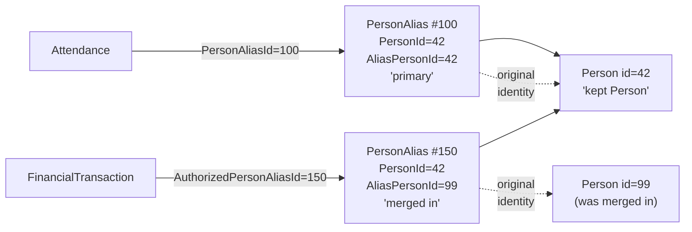

# PersonAlias Semantics

## Overview

`PersonAlias` is the indirection layer that lets Rock merge people without losing referential integrity. Every cross-domain reference to a Person uses `PersonAliasId`, not `PersonId`. When two Persons merge, the merged-away record's aliases are repointed at the surviving Person, and every transaction, attendance row, group membership, and audit reference still resolves to the right Person without table-wide rewrites. This single decision drives most of what is unusual about the CRM domain.

## Why It Exists

Consider a duplicate-detection job that finds Person 42 and Person 99 are the same human. If every cross-domain table held `PersonId` directly, you would have two bad options: delete Person 99 and lose every reference (financial transactions, attendance history, group membership, audit columns), or rewrite every row that referenced Person 99 across dozens of tables. Both are operationally awful.

The PersonAlias layer is the answer. Every cross-domain reference holds `PersonAliasId`. When 99 merges into 42, the alias rows formerly pointing at Person 99 get their `PersonId` updated to 42. Every reference resolves to the right Person without touching any of the referencing tables. The historical-record-of-merge stays intact (the alias's `AliasPersonId` retains the old Person id, so queries can still find "things that originally belonged to the now-merged Person 99").

The class summary in `PersonAlias.cs:28` says it directly: "Represents the merge history for people in Rock... The PersonAlias entity is a log containing the merge history (previous Person identifiers) and a pointer to the Person's current Id."

## Mental Model

A `PersonAlias` is **a stable handle that points at the current owning Person**. A Person has 1+ aliases:

- A **primary alias** (`AliasPersonId == PersonId`): the canonical "this is me" handle.
- **Merged-in aliases** (`AliasPersonId != PersonId`): created when another Person was merged into this one. The `AliasPersonId` retains the merged-away Person's old id; `PersonId` points at the surviving Person.
- **Anonymous aliases** (`AliasPersonId IS NULL`): special case for visitor / anonymous tracking before identification.



After the merge, both old transactions (recorded against the now-merged Person 99 via alias 150) and new transactions (against Person 42 via alias 100) resolve through `PersonAlias.Person` to Person 42. The historical record of who-it-originally-was lives in `PersonAlias.AliasPersonId`.

## What You Need to Know

**Audit columns reference `PersonAlias`, not `Person`.** Every `Model<T>` ships with `CreatedByPersonAliasId` and `ModifiedByPersonAliasId`, both `PersonAlias` FKs. Custom person FKs on new entities should follow the same pattern unless you have a specific reason not to. The reason almost always reduces to "merges should not break this reference."

**A new Person automatically gets a primary alias.** `Person.SaveHook.PostSave` ([Rock/Model/CRM/Person/Person.SaveHook.cs:419-422](../../Rock/Model/CRM/Person/Person.SaveHook.cs)) calls `PersonService.UpdatePrimaryAlias` when a new Person is inserted. The primary alias is the one where `AliasPersonId == PersonId`.

**`PersonAlias.AliasedDateTime` is auto-stamped.** The save hook ([Rock/Model/CRM/PersonAlias/PersonAlias.SaveHook.cs](../../Rock/Model/CRM/PersonAlias/PersonAlias.SaveHook.cs)) sets it on insert. This is the timestamp of when the alias was created, which for merged-in aliases is the merge time. Reports that need "when was this Person record originally created" should NOT use `AliasedDateTime` of the primary alias; use `Person.CreatedDateTime`.

**The PersonAlias save hook has known bypass paths.** The engineering note at the top of `PersonAlias.SaveHook.cs` is explicit:

> ```
> 3/20/2023 - DSH
> The following areas of Rock bypass the pre and post save actions
> for PersonAlias. Be aware that any code you put in here might not
> execute under these situations:
>     - The Stale Anonymous Visitor stage of the RockCleanup job.
> Reason: Performance
> ```

If you add logic to the PersonAlias save hook, you must accept that it does not run for the cleanup-job path. Code that needs to run universally goes elsewhere.

**`AliasPersonId IS NULL` means anonymous.** Special case for visitor tracking before identification. The unique constraint on `AliasPersonId` is a filtered unique constraint that only applies to non-null values, so there can be many NULL-alias rows.

**Some entities reference `Person` directly, by design.** `GroupMember.PersonId` and `UserLogin.PersonId` are direct FKs to `Person`, not via alias. The reasoning differs:

- `GroupMember`: membership belongs to the human across all aliases. Storing the alias would mean a merge could change "which membership row" a Person had, which is wrong.
- `UserLogin`: a login is for the canonical Person, not for any historical alias. Same logic.

When you see direct `PersonId`, treat it as deliberate; the author chose it for a specific reason.

**Merges remap aliases; they do not delete the merged-away Person row immediately.** `PersonService.MergePeople` repoints the aliases (`PersonAlias.PersonId` updated to the kept Person's id), then handles the merged-away Person record. The Person row itself may be retained (with all its FKs nulled) for historical reference depending on the merge configuration.

**`PersonAlias` inherits from `Entity<T>`, not `Model<T>`.** That means it does NOT have audit columns (`CreatedByPersonAliasId`, `ModifiedByPersonAliasId`) and does NOT participate in the standard history-write conventions. The trace of who-merged-when lives in the merge history records, not in alias-row audit columns.

**The `[NotAudited]` attribute is intentional.** PersonAlias rows are created in volume during merges; auditing every row would multiply database churn for no reporting value. The merge itself is audited through `PersonService.MergePeople` history writes.

**Resolving "the current Person for this alias" is the universal pattern.** `personAlias.Person` (navigation) or `PersonAliasService.GetPerson(aliasId)` returns the surviving Person regardless of whether the alias is primary or merged-in. Code that needs to know "is this the historical Person?" reads `personAlias.AliasPersonId`.

**`Person.PrimaryAliasId` is a denormalized convenience.** It points at the primary alias for the Person. Used hot in giving statements, attendance writes, and anywhere code needs "the alias for the current me." Updated by `Person.SaveHook` and `PersonService.UpdatePrimaryAlias`.

## Common Scenarios

**"Record an attendance for this Person."** Use `Person.PrimaryAliasId` (or `Person.PrimaryAlias.Id`). Storing the primary alias gives reports a stable handle even if this Person is later merged into another.

**"Audit who modified this entity."** The `*ByPersonAliasId` audit columns hold the alias of whoever did the write. Resolve through `PersonAlias.Person` to get the human's name.

**"Find all giving for this Person, including pre-merge history."** Walk Person -> all PersonAliases for that Person -> `FinancialTransaction.AuthorizedPersonAliasId`. The historical transactions still resolve correctly because their alias rows now point at the kept Person.

**"Identify a previously-anonymous visitor."** The visitor's anonymous PersonAlias (`AliasPersonId IS NULL`) gets its `PersonId` updated to the now-known Person, and `AliasPersonId` set. The historical attendance / interaction rows referenced the same alias, so identification preserves the trail.

**"I'm writing a new entity that references a Person."** Use `PersonAliasId` (FK to PersonAlias, cascade delete: false). Add a navigation property `PersonAlias` and resolve through it for display. Direct `PersonId` only if you have a specific reason (membership belongs to the human).

**"I'm doing duplicate detection."** Use `PersonService.GetByMatch`. The duplicate-pair flagging happens through `PersonDuplicate`. Merge happens through the Person Merge block (Internal -> CRM), which calls `PersonService.MergePeople`.

## Key Architectural Decisions

### `PersonAliasId`, not `PersonId`, in cross-domain references

Merges would otherwise either lose data or require table-wide rewrites. The alias indirection is non-negotiable.

### `Entity<T>` (no audit columns) on PersonAlias

PersonAlias rows are created in volume during merges and visitor flows. Audit columns would multiply storage and tracking overhead with no reporting value. The merge itself is audited through `PersonService.MergePeople`.

### `[NotAudited]` attribute

Same reasoning. Visitor flows and merge operations create many rows; per-row audit history is noise.

### `AliasPersonId IS NULL` for anonymous

Reusing `PersonAlias` for anonymous tracking (rather than a separate VisitorAlias entity) means visitor-to-known transitions are a simple update on the existing rows. Otherwise, identification would mean rewriting every reference.

### Direct `PersonId` for `GroupMember` and `UserLogin`

Membership and login belong to the human. Storing the alias would let a merge change which membership or login a Person had. Direct `PersonId` is correct for these specific cases.

### Auto-primary-alias on insert

`Person.SaveHook.PostSave` creates the primary alias, so callers do not have to remember. The cost is one extra INSERT per Person; the benefit is correctness by default.

## Considered but Rejected

### Direct `Person.Id` references everywhere

Rejected. The merge cost in either lost data or table-wide rewrites is unacceptable.

### Separate VisitorAlias entity for anonymous flows

Rejected. Identification (anonymous-becomes-known) would mean rewriting visitor-attendance / visitor-interaction references. Reusing `PersonAlias` with NULL `AliasPersonId` is the cheaper model.

### Storing audit columns on `PersonAlias`

Rejected. Volume is too high; reporting value is too low.

### Synchronous re-pointing of audit columns on merge

Rejected. Updating every `CreatedByPersonAliasId` row across every entity at merge time is exactly what the alias indirection exists to avoid. Only `PersonAlias.PersonId` is updated; the references to the alias stay the same.

## Technical Reference

### Schema

```
PersonAlias
  Id                int             PK
  Guid              uniqueidentifier
  Name              nvarchar(200)?  unique
  PersonId          int             FK -> Person
  AliasPersonId     int?            unique-when-not-null FK to old Person
  AliasPersonGuid   uniqueidentifier?
  AliasedDateTime   datetime?       auto-set on insert
  LastVisitDateTime datetime?
  InternalMessage   nvarchar(250)?
  ForeignId/Guid/Key
```

`PersonAlias` inherits from `Entity<PersonAlias>` (not `Model<PersonAlias>`). No audit columns.

### Indexes

- `PersonId` (FK; not unique).
- `AliasPersonId` (unique, filtered to non-null).
- `Name` (unique).

### Save Hook

Single behavior: stamp `AliasedDateTime` on insert ([Rock/Model/CRM/PersonAlias/PersonAlias.SaveHook.cs](../../Rock/Model/CRM/PersonAlias/PersonAlias.SaveHook.cs)). Bypassed by the Stale Anonymous Visitor RockCleanup stage.

### Service / API Surface

`PersonAliasService` (`Rock/Model/CRM/PersonAlias/PersonAliasService.cs`) provides resolution helpers. Notable:

- `Get(int id)`: standard entity get.
- `GetPerson(int aliasId)`: resolves the alias to its current Person.
- `GetPrimaryAlias(int personId)`: returns the primary alias for a Person.

### Auto-Primary-Alias on Person Insert

`Person.SaveHook.PostSave` ([Rock/Model/CRM/Person/Person.SaveHook.cs:419-422](../../Rock/Model/CRM/Person/Person.SaveHook.cs)) detects a newly-inserted Person without a populated `_primaryAliasId` and calls `PersonService.UpdatePrimaryAlias` to create and link the primary alias.

### Merge Behavior

`PersonService.MergePeople(keptPerson, mergedAwayPerson, ...)` performs:

1. Repoint `mergedAwayPerson`'s aliases: set their `PersonId = keptPerson.Id` (preserving `AliasPersonId` as the historical pointer to `mergedAwayPerson.Id`).
2. Apply user-selected field values to `keptPerson`.
3. Optionally retain non-selected last names as `PersonPreviousName` rows (since commit `4483145a96`, 2026-01-27).
4. Handle the `mergedAwayPerson` row (typically marked or removed depending on configuration).
5. Audit the merge via history writes.

### Cache

Alias-to-Person resolution is hot enough that caching helps. The alias cache (resolution layer) is consulted in authentication, check-in, and request-context paths.

### Standard Idioms

**Define an audit-style person FK on a new entity:**

```csharp
[DataMember]
public int? CreatedByPersonAliasId { get; set; }

[NotMapped]
public virtual PersonAlias CreatedByPersonAlias { get; set; }

// In EntityTypeConfiguration:
HasOptional( e => e.CreatedByPersonAlias )
    .WithMany()
    .HasForeignKey( e => e.CreatedByPersonAliasId )
    .WillCascadeOnDelete( false );
```

**Resolve alias to current Person:**

```csharp
var person = personAlias.Person; // navigation
// or
var person = new PersonAliasService( rockContext ).GetPerson( aliasId );
```

**Get the primary alias for a Person:**

```csharp
var primaryAliasId = person.PrimaryAliasId; // denormalized
```

## Recent Impactful Changes

- **2026-08-24** ([commit `69f42ed3b3`](https://github.com/SparkDevNetwork/Rock/commit/69f42ed3b3)). Bot traffic no longer creates Anonymous Visitor aliases or page view interactions. The crawler check now runs before alias creation, crawler detection uses a maintained pattern list, and a post-update job removes the existing orphaned-alias backlog.
- **2026-01-27** ([commit `4483145a96`](https://github.com/SparkDevNetwork/Rock/commit/4483145a96)). Person Merge enhancements: merge-completed email notification, automatic retention of non-selected last names as Previous Last Names, last-modified date/person visibility for fields and attributes during merge.

## Related Specs

- [Page View Interaction Bot Filtering](../../specs/completed/core/260824-page-view-interaction-bot-filtering.md) (2026-08-24, Jon Edmiston)
