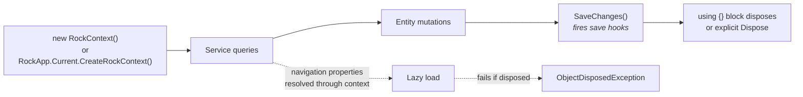

# RockContext Lifecycle

## Overview

`RockContext` is Rock's Entity Framework `DbContext`. It is the unit of work for every database read and write: open it, query through services that hold a reference to it, mutate entities, call `SaveChanges`, dispose. The class is straightforward but the rules around its lifetime, scope, and reuse are subtle. Most performance and lazy-loading bugs in Rock trace back to a misuse of `RockContext`.

## Why It Exists

EF gives you a lot of plumbing for free: change tracking, lazy loading of navigation properties, identity map (so the same row queried twice in one context returns the same object), and transactional `SaveChanges`. Rock takes those defaults but adds custom interception for save hooks, attribute loading, history writing, and analytics. `RockContext` exists as the project-specific subclass that wires those custom pieces in. The CLAUDE.md rule "Do not dispose RockContext prematurely; it kills lazy loading for any entities retrieved from that context" is a direct consequence of EF's lazy-loading model: entities hold a reference to the context that loaded them, and disposing the context invalidates that reference.

The `RockApp.Current.CreateRockContext()` factory pattern (added in commits `b7f1eaa9e0` and `18c8ecbd47` on 2025-10-27 across cache classes) exists for testability. Direct `new RockContext()` calls cannot be substituted in tests; the factory indirection lets test infrastructure swap in a different implementation. Cache classes were forbidden from using `new RockContext()` in those commits.

## Mental Model

`RockContext` is **a unit of work**. Open it, do the work for one logical operation, save and dispose. The operation can be small (load a single Group, mutate one field, save) or large (load 100 entities, run a sweep, save once at the end). What it cannot do safely:

- Survive across requests in a long-lived service (change tracking grows unbounded).
- Be shared between threads (EF contexts are not thread-safe).
- Be disposed before the entities it loaded are done being used (lazy-load navigation properties stop working).



The standard idiom is a `using` block scoped to one logical operation:

```csharp
using ( var rockContext = new RockContext() )
{
    var group = new GroupService( rockContext ).Get( groupId );
    group.Name = "New name";
    rockContext.SaveChanges();
}
```

For longer-running operations (a sweep job that processes thousands of rows), the rule is the inverse of what new contributors expect: do NOT create a fresh context per iteration. Load all the data you need into a list or dictionary up front, then iterate. The cost of one large query plus in-memory processing is far less than per-iteration context creation, save-hook initialization, and connection-pool churn.

## What You Need to Know

**Do not dispose `RockContext` prematurely.** Lazy-load navigation properties (`group.GroupType`, `transaction.AuthorizedPersonAlias.Person`) need the context that loaded the parent entity. Disposing before navigating triggers `ObjectDisposedException`. The CLAUDE.md rule is: "Do not dispose RockContext prematurely; it kills lazy loading for any entities retrieved from that context."

**Do not create `RockContext` per iteration in loops.** Each `new RockContext()` opens a new connection pool reservation, runs change-tracking initialization, and fires whatever bus-message subscriptions are wired. In a tight loop this dominates execution time. Pull the data into a list or dictionary first, then iterate over the in-memory collection.

**Cache classes use `RockApp.Current.CreateRockContext()`, not `new RockContext()`.** Direct construction in cache code defeats the testability indirection. New cache classes should follow the pattern; existing cache classes were converted in `b7f1eaa9e0` and `18c8ecbd47`.

**`RockContext` is not thread-safe.** Do not pass one context across `Task.Run` boundaries that might execute in parallel. Each thread that needs database access creates its own context. EF's documentation is explicit on this; Rock inherits the constraint.

**`SaveChanges` triggers all save hooks.** This is what makes save hooks atomic with the database write: they run as part of `SaveChanges` and share its transaction. Calling `SaveChanges` multiple times in one context creates separate transactions; calling it once with all changes batched gives one transaction.

**Bulk operations bypass the context's change tracking.** `BulkInsert`, `BulkUpdate`, and `BulkDelete` do NOT update the in-memory entity graph and do NOT fire save hooks. After a bulk operation, queries against the same context return stale data; either use a fresh context or call `Entry(entity).Reload()` on affected entities.

**The `RockContext` connection string is `RockApp.Current.InitializationSettings.ConnectionString`.** The parameterless constructor reads it. The string-parameter constructor is for cases where a custom connection string is needed (multi-tenant scenarios, read-replica routing).

**`RockContextReadOnly` and `RockContextAnalytics` share the underlying `ObjectContext`.** They exist as derived classes that constrain operations (read-only) or route to analytics views, but the EF object context is the same. Mixing them with a `RockContext` in the same operation is supported through the internal-protected constructor.

**Service classes hold a reference to the context.** `new GroupService( rockContext )` does not own the context; the caller does. The service's lifetime is bounded by the context, not the other way around. Disposing the service does not dispose the context.

**Identity map: same row queried twice returns the same object.** EF tracks loaded entities by primary key. `service.Get(42)` followed by `service.Queryable().Where(g => g.Id == 42).FirstOrDefault()` returns the same C# instance. Mutations on the second reference are visible on the first.

**`AsNoTracking` skips the identity map and change tracking.** Use it for read-only loops over many rows where you do not need EF to track changes. The tradeoff is that mutating those entities and calling `SaveChanges` does nothing.

**Global query filters apply by default.** `Group.IsArchived` is filtered out automatically (Z.EntityFramework.Plus). Use `.AsNoFilter()` to bypass when you need archived rows. Forgetting this is the most common Group-domain bug.

## Common Scenarios

**"Read a single entity and modify a field."**

```csharp
using ( var rockContext = new RockContext() )
{
    var entity = new MyEntityService( rockContext ).Get( id );
    entity.Field = newValue;
    rockContext.SaveChanges();
}
```

**"Read 1000 entities and update each."** Load once, iterate, save once:

```csharp
using ( var rockContext = new RockContext() )
{
    var entities = new MyEntityService( rockContext ).Queryable().ToList();
    foreach ( var e in entities ) { /* mutate */ }
    rockContext.SaveChanges();
}
```

Do NOT create a context per iteration.

**"I need to use lazy navigation across a method boundary."** Pass the entity, do not pass the context separately. The entity holds the reference. Document that the calling method's context must outlive any navigation use.

**"I need to do parallel database work."** Each parallel task creates its own context inside its own scope. Do not share a context across `Task.WhenAll` branches that mutate.

**"I'm writing a save hook and want to query through the context."** Use `this.RockContext` (the property on `EntitySaveHook<T>`). It is the same context the save is happening in, so any reads see the in-flight changes; any further saves are batched into the same transaction.

**"I need to pass entities outside the context's lifetime."** Project to a DTO before disposing. Detach the entity (`rockContext.Entry(entity).State = EntityState.Detached`) if you must keep the EF entity, but expect lazy-loaded navigation to fail.

## Key Architectural Decisions

### One context per unit of work

EF's design assumes the context is short-lived. Long-lived contexts grow change-tracking overhead unbounded and serve stale data on identity-map hits. Rock follows the per-operation pattern.

### Lazy loading enabled by default

The alternative (eager-only) would force every query to spell out every navigation. Lazy loading is the more ergonomic default; the cost is the must-stay-alive constraint.

### `RockApp.Current.CreateRockContext()` for cache code

Cache code is unit-tested with substituted contexts. Direct `new` defeats the substitution. The factory pattern is enforced in cache code as of 2025-10-27.

### Service classes don't own the context

Inverting the ownership (service owns context) would have meant disposing the service ends the context, which is incompatible with using one context across multiple service calls. Caller owns the context; services are lightweight wrappers.

### Save hooks share the context's transaction

History writes, denormalization updates, and cascade saves all need to commit-or-rollback with the parent save. Sharing the transaction is the simplest model.

## Considered but Rejected

### Auto-disposing context after each query

Rejected. Would break lazy navigation. EF's lazy loading is too useful to give up.

### Singleton context for an entire request

Rejected. Change tracking grows unbounded; long-running requests accumulate stale state in the identity map. Per-operation contexts are correct.

### Context pooling

Rejected (so far). The setup cost of `RockContext` is small compared to query cost. Pooling would add complexity without clear benefit.

## Technical Reference

### Constructors

```csharp
new RockContext()                                // default; uses RockApp.Current connection string
new RockContext( "ConnectionString" )            // explicit connection string or name
RockApp.Current.CreateRockContext()              // testable factory; required for cache code
```

### Save Path

```csharp
SaveChanges()                                    // synchronous; fires hooks; returns int rows affected
SaveChangesAsync()                               // async variant
```

`SaveChanges` flow:

1. EF determines added/modified/deleted entries.
2. The Rock interceptor invokes `EntitySaveHook<TEntity>.PreSave` on each entry's hook.
3. EF emits SQL inside a transaction.
4. On success, the interceptor invokes `PostSave`.
5. On failure, the interceptor invokes `SaveFailed` and re-throws.

### Query Path

`new MyEntityService( rockContext ).Queryable()` returns an `IQueryable<MyEntity>`. EF translates LINQ to SQL on enumeration. Common terminators: `ToList`, `FirstOrDefault`, `Count`, `Any`.

### Tracking Modes

| Mode | Behavior |
|---|---|
| Default | EF tracks loaded entities; mutations propagate via `SaveChanges`. |
| `AsNoTracking()` | EF does not track; mutations are not persisted on save. |
| `AsNoFilter()` | Bypasses Z.EntityFramework.Plus global filters (e.g. archive filter). |

### Connection Strings and Read Replicas

`RockContextReadOnly` ([Rock/Data/RockContextReadOnly.cs]) shares the object context but disallows save. Use for long-running reads that should not write. `RockContextAnalytics` routes to analytics views on the same connection.

### Sibling Classes

- `RockContext` (mutating)
- `RockContextReadOnly` (read-only)
- `RockContextAnalytics` (analytics views)
- `Rock.Data.DbContext` (the abstract base)

### Lazy Navigation Behavior

```csharp
Group group;
using ( var ctx = new RockContext() )
{
    group = new GroupService( ctx ).Get( id );
} // ctx disposed
var typeName = group.GroupType.Name; // throws ObjectDisposedException
```

The fix: project to a DTO inside the using block, OR keep the context alive until you are done navigating, OR eager-load with `.Include(g => g.GroupType)`.

### Save-Hook Access

Inside a save hook, `RockContext` is `Entry.DataContext as RockContext`. May be null if a custom DbContext (not deriving from `RockContext`) is used. `DbContext` is always available.

## Recent Impactful Changes

- **2025-10-27** ([commits `b7f1eaa9e0`, `18c8ecbd47`](https://github.com/SparkDevNetwork/Rock/commit/b7f1eaa9e0)). Cache classes converted from `new RockContext()` to `RockApp.Current.CreateRockContext()` for testability. New cache classes must follow the pattern.
