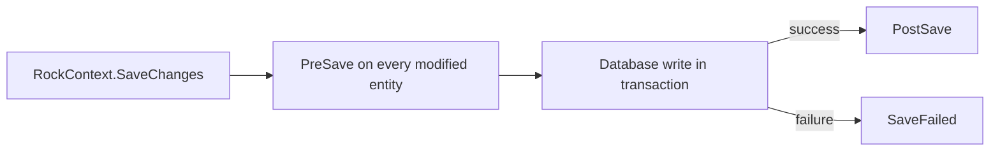

# Save Hook Pattern

## Overview

A save hook is a class that participates in the entity save lifecycle: it sees the entity before the database write (Pre-save), can react to a failed save (SaveFailed), and runs after a successful commit (Post-save). Every meaningful entity in Rock has a save hook, and almost all derived state (history rows, denormalized fields, cache invalidation, workflow triggers) lives in one of these three methods. The base class is `EntitySaveHook<TEntity>` ([Rock/Data/EntitySaveHook.cs](../../Rock/Data/EntitySaveHook.cs)).

## Why It Exists

Direct EF inserts and updates leave the database self-inconsistent in Rock: history rows are not written, parent-child cascades that the schema does not enforce do not happen, denormalized columns drift, and caches go stale. Push that logic into save hooks and the database stays self-consistent for any code that goes through `RockContext.SaveChanges`. The cost is that any code that bypasses `SaveChanges` (raw SQL, `BulkUpdate`, `BulkDelete`) skips this logic and must replicate the relevant pieces. The benefit is that the typical write path is correct by default.

The hook lifecycle (Pre/PostSave plus SaveFailed) exists because some derived state must be written in the same transaction as the entity (history evaluation needs the original values), some must be written after the commit (cache invalidation must not happen if the transaction rolls back), and some compensating logic must run only on failure (releasing reserved resources). The three method split lets each piece run at the right moment.

## Mental Model

A save hook is **a class that runs alongside the save, in three phases**:



`PreSave` runs while the entity is still in `Added`, `Modified`, or `Deleted` state. The database has not been touched yet. Anything that needs to read original values (`OriginalValues`), inspect what fields changed (`ModifiedProperties`), or attach side effects to the same transaction (history rows in the same context) goes here.

`PostSave` runs after the transaction commits successfully. The entity now has its new `Id` (if Added), its new persisted state, and any database-generated values are populated. Cache invalidation, workflow launches, async fire-and-forget work, and bus messages go here.

`SaveFailed` runs only if `PreSave` succeeded and the database write threw. Use it sparingly; most hooks do not need it. Released resources, reverted in-memory state, or compensating actions for things `PreSave` did go here.

The hook is wired up by convention: a class named `SaveHook` nested inside the entity (or a `*.SaveHook.cs` partial file) with `internal class SaveHook : EntitySaveHook<TEntity>` is auto-discovered. The discovery requires the hook class to be in the same assembly as `TEntity`.

## What You Need to Know

**`PreSaveState` vs `State` matters in `PostSave`.** Inside `PostSave`, the entity's `State` has already moved on (a new entity is now `Unchanged`, a deleted entity is `Detached`). Use `PreSaveState` to ask "what kind of save was this?" `EntityContextState.Added`, `Modified`, or `Deleted` are the values that meaningfully differ post-save.

**Never assume `RockContext` is non-null.** The `RockContext` property casts `Entry.DataContext as RockContext`. Custom contexts that derive from `Rock.Data.DbContext` but not `RockContext` will return null. Use the `DbContext` property when you only need the EF context, or null-check before using `RockContext`.

**`OriginalValues` is only valid for Modified or Deleted.** For an Added entity it is empty (no previous values). For a Modified entity it has the field values as loaded; this is what you compare against the entity to detect changes. The `ModifiedProperties` list is the names of changed properties for the Modified case.

**Cache invalidation belongs in `PostSave`, not `PreSave`.** Cache update is a side effect that must not happen if the transaction rolls back. `EntityCache.UpdateCachedEntity` is explicitly documented to NOT read the item from the database during the hook ([Rock/Web/Cache/EntityCache.cs:522](../../Rock/Web/Cache/EntityCache.cs)). It just flushes / removes / adds-to-all-ids; the next reader populates the entry from the now-committed database state. See [docs/core/cache-invalidation.md](cache-invalidation.md).

**History writes go in `PreSave` so they share the transaction.** A history row that would only be written post-save would land outside the transaction; if the parent save rolled back, the history would orphan. By writing history rows to the same `RockContext` during `PreSave`, both saves succeed or both fail.

**Validation failures should throw in `PreSave`.** Throwing aborts the save before the database is touched. `GroupMemberValidationException` (from `GroupMember.SaveHook`) is the canonical example: requirement validation runs in `PreSave` and a failure throws, which prevents the row from being saved.

**Bulk operations bypass the hook.** `BulkInsert`, `BulkUpdate`, `BulkDelete`, raw SQL, and `ExecuteSqlCommand` do NOT trigger `EntitySaveHook`. Code that uses those must replicate the relevant logic manually (cache invalidation, history, denormalized field updates). This is the most common source of stale-state bugs in Rock.

**Each save operation creates a fresh hook instance.** Do NOT store request-scoped state in static fields on the hook class. A field like `private bool _FamilyCampusIsChanged;` (as in `Group.SaveHook`) is fine because each save operation gets its own instance; the field is ephemeral within that save.

**`internal class SaveHook` is the convention.** Hooks are not part of the public API and are not discovered through `[RockObsolete]` or any explicit registration. The discovery is reflective by the EF interceptor; visibility above `internal` is not required and exposing them as `public` invites plugin code to take dependencies the team does not intend.

**`PreSave` runs once even if `SaveChanges` is retried.** EF's transaction retry loop re-invokes `SaveChanges` on transient failures, but the save-hook entries are tracked per-attempt. Hooks should be idempotent if possible; in particular, do not modify the same entity twice in `PreSave` based on the entity's own state, because the second attempt will see the modification and act on it again.

## Common Scenarios

**"Write a history row when this entity changes."** `PreSave`. Build a `History.HistoryChangeList`, populate via `History.EvaluateChange` for each tracked property, save inside the same context. The `Group.SaveHook` is the canonical example.

**"Cascade `IsActive = false` to children when the parent goes inactive."** `PreSave`, on `Modified` state with `OriginalValues["IsActive"] != Entity.IsActive`. Update the child rows through the same `RockContext`. Same transaction, same atomic outcome.

**"Invalidate the cache after this entity saves."** `PostSave`. Call `MyEntityCache.UpdateCachedEntity(Entity.Id, PreSaveState.AsEntityState())` (where `AsEntityState` translates `EntityContextState` to EF's `EntityState`).

**"Launch a workflow when this entity transitions to a specific status."** `PostSave` to ensure the workflow only fires on a successful commit. If the workflow needs the new entity ID (Added case), `PostSave` also gives you the populated `Entity.Id`.

**"Validate that the entity's foreign key targets actually exist."** `PreSave`. Throw with a descriptive exception; the save aborts before the database is touched.

**"Compensate when the save failed."** `SaveFailed`. Rare; only when `PreSave` reserved an external resource (a slot in a queue, a file lock) that needs explicit release.

## Key Architectural Decisions

### Three lifecycle methods, not one

A single `Save` hook would conflate "before commit" and "after commit" concerns. The split forces the author to put cache invalidation and async work in `PostSave` and validation in `PreSave`, which is the right shape.

### Hooks discovered reflectively, not registered

Forcing every author to register their hook in a startup file would multiply boilerplate. Reflective discovery on `*.SaveHook.cs` files keeps the authoring path frictionless.

### Hooks live in the same assembly as the entity

The reflection looks within the entity's assembly. This keeps the cross-assembly dependency graph tractable and prevents plugins from quietly hooking core entities.

### `PreSaveState` snapshot for `PostSave`

`State` is mutated by EF as the save progresses. Snapshotting the original state in `PreSaveState` gives `PostSave` a stable "what kind of save was this?" answer without requiring the author to track it.

### Hooks bypass on bulk operations is intentional

`BulkInsert`/`BulkUpdate` exist precisely because per-row hook overhead is unacceptable for large batch operations. Forcing hooks to run there would defeat the purpose. The cost is documented; callers must replicate logic.

## Considered but Rejected

### Single combined `Save` method

Rejected. The cache-invalidation-must-be-post-commit constraint alone justifies the split.

### Synchronous workflow launches in `PostSave`

Rejected by convention rather than mechanism. Workflows are slow and unreliable enough that holding the save thread waiting for them produces user-visible latency. `PostSave` queues async workflow runs.

### Cross-assembly hook discovery

Rejected. Plugins quietly modifying core entity behavior would be operationally unsafe. Hooks must live in the entity's own assembly.

## Technical Reference

### Class Hierarchy

`EntitySaveHook<TEntity>` ([Rock/Data/EntitySaveHook.cs](../../Rock/Data/EntitySaveHook.cs)) is the abstract class authors derive from. It implements `IEntitySaveHook` and provides:

- `Entity` (typed access to `TEntity`)
- `Entry` (the `IEntitySaveEntry`)
- `RockContext` (the cast of `Entry.DataContext as RockContext`, may be null)
- `DbContext` (the underlying `Rock.Data.DbContext`)
- `OriginalValues` (read-only dictionary, valid for Modified/Deleted)
- `State` (current `EntityContextState`)
- `PreSaveState` (snapshot taken before save started)
- `Logger` (an `ILogger` scoped to the hook's full type name)

`IEntitySaveEntry` ([Rock/Data/IEntitySaveEntry.cs](../../Rock/Data/IEntitySaveEntry.cs)) is marked as an internal API; do not depend on it from plugins. Properties:

- `object Entity`
- `IReadOnlyDictionary<string, object> OriginalValues`
- `IReadOnlyList<string> ModifiedProperties`
- `object DataContext` (declared as object to avoid forcing an EF dependency)
- `EntityContextState PreSaveState`
- `EntityContextState State`

### Lifecycle Methods (override)

```csharp
internal class SaveHook : EntitySaveHook<MyEntity>
{
    protected override void PreSave() { /* validation, history, cascades */ }
    protected override void SaveFailed() { /* compensating work */ }
    protected override void PostSave() { /* cache invalidation, workflow launches */ }
}
```

### `EntityContextState` Values

- `Detached`: not tracked
- `Unchanged`: loaded but not modified
- `Added`: new entity, will INSERT
- `Modified`: edited, will UPDATE
- `Deleted`: marked for delete, will DELETE

In `PostSave`, an Added or Modified entity moves to `Unchanged`; a Deleted entity moves to `Detached`. Use `PreSaveState` to recover the operation type.

### Discovery

The Rock EF interceptor scans the entity's assembly for a class named `SaveHook` nested in the entity's class, and a class derived from `EntitySaveHook<TEntity>`. Both are wired up. The convention in core is to use a `*.SaveHook.cs` partial file with `internal class SaveHook : EntitySaveHook<TEntity>` nested inside the entity's `partial class TEntity` declaration.

### Standard Idioms

**State branching:**

```csharp
switch ( PreSaveState )
{
    case EntityContextState.Added:
        // initial-insert work
        break;
    case EntityContextState.Modified:
        // change-detection work
        break;
    case EntityContextState.Deleted:
        // bulk-cleanup of dependent rows
        break;
}
```

**Detect a property change:**

```csharp
var oldName = OriginalValues[nameof( Entity.Name )] as string;
if ( oldName != Entity.Name )
{
    // name changed
}
```

**Throw to abort save:**

```csharp
if ( !IsValid )
{
    throw new InvalidEntityException( "Cannot save: ..." );
}
```

**Cache invalidation in PostSave:**

```csharp
protected override void PostSave()
{
    MyEntityCache.UpdateCachedEntity( Entity.Id, PreSaveState.AsEntityState() );
}
```

### Affected Areas

Save hooks are in every domain. Notable examples:

- `Rock/Model/Group/Group/Group.SaveHook.cs` (heavy: family sanitization, cascades, history, bulk delete on archive)
- `Rock/Model/Group/GroupMember/GroupMember.SaveHook.cs` (denormalization of `GroupTypeId`, requirement validation)
- `Rock/Model/CRM/Person/Person.SaveHook.cs` (primary-campus recompute, history, previous-name capture)
- `Rock/Model/Workflow/Workflow/Workflow.SaveHook.cs` (attribute serialization, history)
- `Rock/Model/Finance/FinancialTransaction/FinancialTransaction.SaveHook.cs` (history, batch reconciliation)
- `Rock/Model/Communication/Communication/Communication.SaveHook.cs` (status transitions, immediate-queue on approval)

## Recent Impactful Changes

(No release-note-tagged changes to the save-hook infrastructure itself in the last 18 months. The infrastructure is mature and stable; the work happens inside individual `*.SaveHook.cs` files per domain.)
