# Background Checks

## Overview

Background Checks are the system Rock uses to integrate with third-party background-check providers (Checkr, Protect My Ministry / PMM, others). A `BackgroundCheck` row records a single request: the person, the provider, the request and response timestamps, the response data (typically JSON), the status, and an optional response document. A custom `BackgroundCheckComponent` per provider handles the request-submission and response-parsing flow. The result drives Group Requirement evaluation for volunteers (the "background check current" requirement type).

## Why It Exists

Children's-ministry, security-team, and counseling volunteers in most churches require a background check. Manual tracking via spreadsheets is error-prone and fails the audit standard most insurance carriers expect. Integrating directly with providers (so a renewal request dispatches automatically, results land back as data, and Group Requirements evaluate "is this volunteer current?") is what makes the system viable for sites with hundreds of volunteers.

The pluggable component model exists because providers have different APIs, package offerings, and response formats. A single hardcoded integration would lock the church into one vendor; the component pattern lets organizations switch providers (or add a new one) by writing a `BackgroundCheckComponent` implementation.

## Mental Model

```mermaid
flowchart LR
    Request[Volunteer-onboarding workflow<br/>OR manual request] --> BC[BackgroundCheck row<br/>Status=Pending]
    BC --> Provider["BackgroundCheckComponent<br/>(Checkr / PMM / etc.)"]
    Provider --> ProviderAPI[Third-party provider API]
    ProviderAPI -->|webhook / poll| Response[Response data + status]
    Response --> BCUpdate[Update BackgroundCheck<br/>Status=Pass/Fail/Expired<br/>ResponseData populated]
    BCUpdate --> Req[Group Requirement evaluator]
    Req --> Vol[Volunteer eligibility]
```



A request originates from a workflow (typical), the Background Check Request block, or a manual API call. The `BackgroundCheckComponent` for the configured provider handles submission. Results return via webhook or polling; the component updates the `BackgroundCheck` row's `Status`, `ResponseDate`, `ResponseData`, and `RecordFound`. Group Requirements (see [docs/group/group-requirements.md](../group/group-requirements.md)) consult the latest `BackgroundCheck` for the volunteer when evaluating "is the current background check valid?"

The optional `ConnectionRequestId` ties a background check to a Connection Request (typically the volunteer-onboarding Connection), so the connector can see check status alongside other intake fields.

## What You Need to Know

**`Status` is a free-text string with provider-specific values.** Common values: `Pending`, `Submitted`, `Pass`, `Fail`, `Expired`, `Error`. The Group Requirement evaluator typically treats `Pass` as current and within an expiration window. Custom Status values from provider components must be evaluated explicitly by consumers; there is no enum constraint.

**`ResponseData` is provider-shaped, usually JSON.** Some providers return XML or proprietary formats; `ResponseData` is `nvarchar(MAX)` to accept whatever they send. Code that needs to read structured fields from the response should know its provider.

**`PersonAliasId` cascades on delete.** When a Person merge or delete propagates, `BackgroundCheck` rows go with the merged-away alias.

**`ResponseDocumentId` is a `BinaryFile` reference.** Providers that return signed PDFs (the actual report document) store the file ID here. The file is retrieved via the standard `BinaryFile` infrastructure with appropriate access control.

**`PackageName` records what was requested.** Providers offer different package levels (criminal-only, criminal + driving, full background, etc.). Records the package the request used so renewal can match.

**`RecordFound = true` does NOT mean fail.** It means the provider found records of some kind. The interpretation depends on what records were found; `Status` is the authoritative pass/fail. Some flows treat `RecordFound = true` as "needs human review."

**`ConnectionRequestId` cascade is `ON DELETE SET NULL`.** Per the migration `AddConnectionRequestToBackgroundCheck`. If the Connection Request is deleted, the background check survives with `ConnectionRequestId = NULL`. Comment in source: `[IgnoreCanDelete]` is set on the navigation property because the cascade is set-null, not the EF default.

**Provider configuration goes through the EntityType + component pattern.** The provider component is configured via attributes on its class; per-provider settings (API key, webhook URL, default package) are configured in the standard component-attribute UI (Internal -> Security -> Background Check Providers).

**Group Requirement integration is via the standard requirement type.** A "Background Check Current" Group Requirement Type queries `BackgroundCheck` for the volunteer with logic like "most recent record where Status = Pass AND RequestDate within N years." See [docs/group/group-requirements.md](../group/group-requirements.md) for how requirements work.

**Background checks are sensitive data.** The Background Check Detail block enforces explicit authorization; `BackgroundCheck` itself disables entity security (`DisableEntitySecurity = true` in `[CodeGenerateRest]`). Block-level authorization is the access boundary, not row-level.

**Renewal cycles are managed externally.** Rock does not auto-trigger renewal requests on expiration; that is the job of a workflow watching the most recent BackgroundCheck date and launching a new request when it crosses a threshold.

## Common Scenarios

**"Submit a background check for a volunteer."** Volunteer-onboarding workflow with the standard Background Check action. The action creates the `BackgroundCheck` row with `Status = Pending`, dispatches via the configured provider component.

**"Receive a webhook callback from the provider."** The provider component implements the webhook handler. Updates `BackgroundCheck.Status`, `ResponseDate`, `ResponseData`, optionally `ResponseDocumentId`. Workflow continues from the updated row state.

**"Renew expiring background checks."** A scheduled workflow that queries `BackgroundCheck` for the most-recent-per-volunteer record older than the renewal threshold, launches new requests for each. Custom workflow; not built-in.

**"Configure a custom package."** Some providers offer custom packages. Configure via the provider component's attributes. The `PackageName` on the request determines what the provider runs.

**"Block scheduling for volunteers without a current check."** Add a Group Requirement Type that queries `BackgroundCheck` for `Status = Pass` and `RequestDate > DATEADD(year, -N, GETDATE())`. Group members who fail get `MeetsGroupRequirement = NotMet` and are blocked from scheduling.

**"Delete a background check."** Generally not needed; let cascades from merge / Person delete handle it. Manual delete bypasses standard data retention; consult retention policies.

## Key Architectural Decisions

### Pluggable provider components

Provider APIs differ enough that a single hardcoded integration would lock the church to one vendor. Component pattern lets sites change providers.

### Free-text `Status` instead of an enum

Provider statuses do not align across vendors. A free-text column (with consumer-side normalization) is more flexible than a forced enum.

### Response document as BinaryFile reference

Storing PDF blobs directly on the row would bloat the table and complicate access control. The BinaryFile abstraction handles file storage and security uniformly.

### Optional ConnectionRequest tie

Background checks are often part of a volunteer-onboarding Connection. Linking lets the connector see check status without a separate query; the SET NULL cascade preserves the check if the connection is deleted.

### Person FKs cascade on delete

When a Person is deleted (rare; usually only test data), the background-check rows go with them. Audit and reporting should be aware that Person deletes lose the records.

## Considered but Rejected

### Storing the actual report PDF on the row

Rejected. Blob storage on the entity table is the wrong pattern; BinaryFile abstraction is purpose-built.

### Hard-coded provider integration

Rejected. Vendor lock-in is operationally risky.

### Auto-renewal scheduling built into the entity

Rejected. Renewal logic varies (some sites renew yearly, some every 3 years, some only on role change). Custom workflow handles per-deployment policy.

## Technical Reference

### Schema

```
BackgroundCheck
  Id                       int             PK
  Guid                     uniqueidentifier
  PersonAliasId            int             FK -> PersonAlias, cascade delete
  WorkflowId               int?            FK -> Workflow, cascade delete
  RequestDate              datetime
  ResponseDate             datetime?
  RecordFound              bit?
  ResponseData             nvarchar(MAX)?  provider-specific JSON/XML
  ResponseId               nvarchar(100)?  provider's reference id
  RequestId                nvarchar(100)?  our submission id
  ResponseDocumentId       int?            FK -> BinaryFile
  ProcessorEntityTypeId    int?            FK -> EntityType (the provider component)
  Status                   nvarchar(25)?
  PackageName              nvarchar(100)?
  ConnectionRequestId      int?            FK -> ConnectionRequest, ON DELETE SET NULL
```

### Cascade Behavior

| FK | Cascade |
|---|---|
| PersonAliasId | Delete (the PersonAlias going away takes the check with it) |
| WorkflowId | Delete |
| ResponseDocumentId | None |
| ProcessorEntityTypeId | None |
| ConnectionRequestId | SET NULL (per migration) |

### Service / Component

`BackgroundCheckComponent` is the abstract base for provider implementations. Each provider:
- Implements `SendRequest` (submit to provider)
- Handles webhook or polling for response
- Updates the `BackgroundCheck` row accordingly

Built-in provider components ship in `Rock.Plugin.HotFixes/` and similar paths; check the `EntityType` table for `BackgroundCheckComponent`-derived classes.

### Affected Blocks

- **Background Check Detail** ([Rock.Blocks/Security/BackgroundCheck/](../../Rock.Blocks/Security/BackgroundCheck/)): admin view of a single check.
- **Background Check Request List** ([RequestList.cs](../../Rock.Blocks/Security/BackgroundCheck/RequestList.cs)): admin queue.
- **Checkr Request List**: Checkr-specific list.

### Group Requirement Integration

Group Requirement Types of `RequirementCheckType.Sql` typically query `BackgroundCheck` with logic like:

```sql
SELECT bc.PersonAlias_PersonId
FROM [BackgroundCheck] bc
INNER JOIN [PersonAlias] pa ON bc.PersonAliasId = pa.Id
WHERE bc.[Status] = 'Pass'
  AND bc.[RequestDate] > DATEADD(year, -3, GETDATE())
```

The result feeds the `MeetsGroupRequirement` evaluation.

### Extension Points

- **Custom provider component:** subclass `BackgroundCheckComponent`, register as EntityType.
- **Custom workflow actions:** wrap the request submission for use in onboarding flows.
- **Custom requirement-evaluation SQL:** GroupRequirementType with custom expression querying `BackgroundCheck`.

## Recent Impactful Changes

(No release-note-tagged changes specifically to background-check infrastructure in the last 18 months. The component model is mature; provider-specific updates happen in the provider plugins, not the core entity.)
