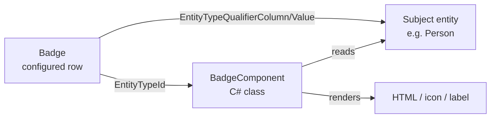
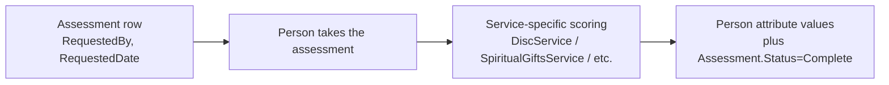

# Badges and Assessments

## Overview

Badges and Assessments are two CRM features that share a slot in the Person profile UI but differ in shape:

- **Badges** are display widgets attached to Person (or other) entities. They run a `BadgeComponent` against the entity to compute display content (giving total, attendance summary, family campus). Badges are configuration-as-data: a `Badge` row references a `BadgeComponent` entity-type and configures its inputs.
- **Assessments** are taken-once-per-person evaluations: DISC, Spiritual Gifts, Motivators, Conflict Profile, EQ Inventory. Each has its own service that computes scores and writes results as Person attribute values plus an `Assessment` row tracking the request/take lifecycle.

## Why It Exists

Badges exist as a configurable display system: the Person profile needs to show different signals to different staff (a connections coordinator wants visit history, a children's-ministry leader wants security clearance status, finance wants giving consistency). Hardcoding each as a custom block placement would multiply admin work; modeling each as a `Badge` row with a `BadgeComponent` reference lets administrators add and remove signals without code changes.

Assessments exist because churches use validated personality / spiritual-gifts / discipleship instruments for staff and volunteer development. Modeling each as a separate service with shared lifecycle (`Assessment` row tracking "requested by, taken on, status") gives reporting and follow-up workflows a uniform shape across instruments.

## Mental Model

### Badges

A Badge runs a BadgeComponent against a Person. The component's render output appears in the badges section of the profile. Custom badge types are new BadgeComponent classes registered as Rock entity types.

### Assessments

`AssessmentType` defines an instrument; `Assessment` records one Person's request to take it (`RequesterPersonAliasId`, `RequestedDateTime`, `RequestedDueDate`, `Status`). The service for that instrument (`DiscService`, etc.) handles scoring and attribute writes.

## What You Need to Know

**Badges run on every Person profile render.** Inefficient BadgeComponents make the profile slow. Components should cache aggressively and avoid expensive queries on the hot path.

**Custom BadgeComponents implement scoped subject-matching.** `EntityTypeId`, `EntityTypeQualifierColumn`, `EntityTypeQualifierValue` narrow the badge to specific entities (e.g., only Persons in a specific GroupType, only Adults). The component reads the qualifier and decides whether to render.

**`Badge.IsActive = false` hides without deleting.** The configurable row is preserved; the badge stops rendering. Use for seasonal badges (post-event "Recently Visited" markers).

**Badge order is configurable.** `Order` controls display sequence within the profile's badges section.

**Assessments are taken once per Person (typically).** The `Assessment` row tracks the request; once `Status = Complete`, retaking generates a new row with a new request. Old rows are retained for history.

**Each assessment service stores results as Person attribute values.** DISC scores (D, I, S, C plus natural / adapted) become Person attributes; SpiritualGifts results become attributes; same for the others. The attribute values are the authoritative store; the Assessment row is the lifecycle wrapper.

**Assessment requests can be made without immediate completion.** Staff can request a Person take an assessment; the request creates an `Assessment` row with `Status = Pending` and `RequestedDueDate`. Reminder emails / workflows can fire from this state.

**`AssessmentType` is the configurable definition.** Each instrument (DISC, Spiritual Gifts, etc.) has a `SystemGuid.AssessmentType` constant. New instruments are configuration plus a service implementation.

**Badge security is light.** Badges typically display public-ish information (visit history, family relationships). Sensitive badges (background-check status, financial signals) need explicit authorization checks in the BadgeComponent.

**Badges are CACHED via `ICacheable`.** The `Badge` entity implements `ICacheable`; changes invalidate the cache. Custom code that bulk-modifies Badge rows should call cache invalidation explicitly.

## Common Scenarios

**"Show a 'Top Giver' badge on the Person profile."** Implement a `BadgeComponent` that queries giving for the Person, computes a threshold flag, renders an icon. Register as an entity type. Insert a `Badge` row referencing the component.

**"Add a custom assessment instrument."** Add a `SystemGuid.AssessmentType` constant. Create a service class with the scoring logic. Register Person attributes for the score storage. Wire a custom take/result block.

**"Request a person take the DISC assessment."** Internal -> CRM -> Assessment Request. Pick the Person and the AssessmentType. Creates an `Assessment` row with `Status = Pending`. Reminder communications fire from system communications.

**"List everyone who completed an assessment."** Query `Assessment` filtered by `AssessmentTypeId` and `Status = Complete`. Join to PersonAlias to get the Persons.

**"Hide a seasonal badge after an event."** Set `Badge.IsActive = false`. Re-enable next year by flipping the flag.

**"Disable a badge for a specific Person."** Not directly supported; badges are configured globally. Customize the BadgeComponent to skip specific persons (typically via attribute lookup) if needed.

## Key Architectural Decisions

### Badge as configuration referencing a component

Hardcoded badges would force code changes for every new signal. Configuration-as-data with pluggable components is the right shape.

### Assessment as lifecycle wrapper, attributes as result storage

The lifecycle (request, due-date, complete-by) belongs on a row; the actual scores belong on Person attributes (queryable, reportable, surfaced in standard attribute views).

### One service per assessment instrument

DISC and Spiritual Gifts have different scoring shapes. A single generic service would have been hostile to instrument-specific logic. Per-service classes match each instrument's needs.

### Badges cached via `ICacheable`

Profile renders are hot. Caching the Badge configuration eliminates the per-render database hit.

## Considered but Rejected

### Auto-rendering all badges for all entities

Rejected. EntityType-qualifier scoping lets badges target specific entity subsets without rendering everywhere.

### Storing assessment results as JSON on the `Assessment` row

Rejected. Person attributes are the standard "queryable per-Person value" surface; using them keeps reporting consistent.

### Mandatory assessment retake schedule

Rejected. Some instruments are once-in-a-lifetime (Spiritual Gifts is typically not retaken yearly). Forcing a schedule would be wrong for those.

## Technical Reference

### Badge Data Model

| Field | Purpose |
|---|---|
| `Name`, `Description` | Display |
| `BadgeComponentEntityTypeId` | Required FK to the BadgeComponent class's EntityType |
| `EntityTypeId` | Optional: limits the subject entity type |
| `EntityTypeQualifierColumn`, `EntityTypeQualifierValue` | Optional: narrows to subject subset |
| `IsActive` | On/off |
| `Order` | Display sequence |

### Assessment Data Model

| Field | Purpose |
|---|---|
| `PersonAliasId` | Subject Person |
| `AssessmentTypeId` | Which instrument |
| `RequesterPersonAliasId` | Who requested it |
| `RequestedDateTime`, `RequestedDueDate`, `CompletedDateTime` | Lifecycle |
| `Status` | Pending / Complete / etc. |
| `LastReminderDate` | Reminder dispatch tracking |

### Assessment Service Classes

`Rock/Model/CRM/Assessment/`:
- `AssessmentService` (base CRUD)
- `DiscService` (DISC scoring + Person-attribute writes)
- `SpiritualGiftsService`
- `MotivatorService`
- `ConflictProfileService`
- `EQInventoryService`

### Affected Blocks

- **Badges:** Badge List, Badge Detail; per-domain badge widgets in profile blocks.
- **Assessments:** Assessment Request, AssessmentType Detail/List, per-instrument intro / take / result blocks.

### Extension Points

- **Custom Badge:** subclass `BadgeComponent` and register as EntityType; insert `Badge` row.
- **Custom Assessment:** define `SystemGuid.AssessmentType`, write a service, register Person attributes for scores, build take/result blocks.

## Recent Impactful Changes

(No release-note-tagged changes specifically to badges or assessments in the last 18 months. Both subsystems are mature; the work is in adding new badges per deployment and per-instrument tweaks.)
