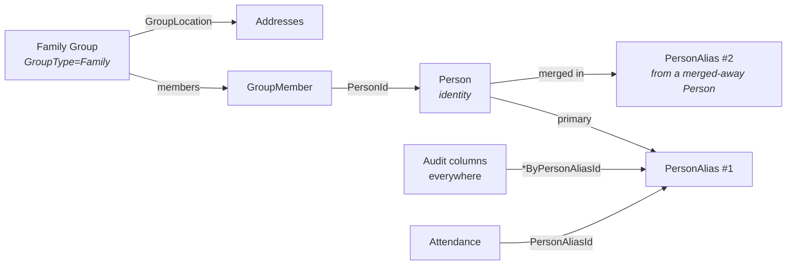

# CRM Domain Overview

## Overview

CRM is the people side of Rock: `Person`, the alias machinery that lets identity be merged without losing referential integrity, the supporting metadata (phone numbers, addresses through Family Groups, search keys, duplicates), record-source attribution, badges, assessments, and background checks. Almost every other domain in Rock joins to `PersonAlias`, not directly to `Person`, and that single decision drives most of what is unusual about this domain.

This is the orientation doc. Specific subsystems (merge, search keys, badges, assessments, background checks, record source) deserve their own docs and will be added separately.

## Why It Exists

A church management system has to handle the reality that people change. Names change after marriage, individuals get merged when duplicates are found, and visitors become members. If every reference in the system pointed directly at `Person.Id`, a merge would either lose history (deleting one Person and its references) or fragment it (splitting attendance, giving, and group membership across two records). The `PersonAlias` indirection solves this: every cross-domain reference uses `PersonAliasId`, and a merge consolidates the surviving Person while remapping aliases.

The Record Source feature (Defined Type added in commit `40103e4133`, expanded in `5911d3046b`) exists for a different reason: churches need to know how each person first showed up, so they can attribute new connections to events, registrations, check-in, or workflow entries. This was not modeled at the start because it became important only as Rock grew into the front door of more ministries.

## Mental Model

Three concepts to internalize:

- **`Person` is identity.** Name, birthdate, gender, marital status, record type, record status. One row per real human (or business, or REST user, or anonymous visitor; `RecordTypeValueId` distinguishes).
- **`PersonAlias` is reference.** Every other domain references PersonAlias, not Person. A new Person inserts gets a primary alias automatically. Merges remap aliases without losing the references that pointed at them.
- **Family is a Group.** "Family" is a `GroupType` and a person's family relationships, addresses, and primary campus all flow through `GroupMember` rows on a Family Group. Phone numbers live on Person; addresses live on the family.

The reason almost everything points at `PersonAlias` is so a merge from `OldPerson` into `KeepPerson` only has to update `PersonAlias.PersonId` (re-pointing the merged-away person's aliases at the kept Person). Every transaction, attendance row, group membership, and audit reference still resolves to the right Person without table-wide rewrites.

A few things deliberately point at `Person` directly: `GroupMember.PersonId` (membership belongs to the human across aliases) and `UserLogin.PersonId` (logins belong to the person, not a transient alias). When you see direct `PersonId`, ask why.

## What You Need to Know

**Audit columns reference `PersonAlias`, not `Person`.** Every `Model<T>` ships with `CreatedByPersonAliasId` and `ModifiedByPersonAliasId` (and these are `PersonAlias` FKs). Custom person FKs on new entities should follow the same pattern unless you have a specific reason not to.

**`Person.IsDeceased` is a flag, not a delete.** Removing a person from the system is rare; marking them deceased preserves giving history, attendance, and family relationships. Reports must filter by `IsDeceased` where appropriate, and most default queries do.

**`PersonSearchKey` exists for non-Person identifiers that resolve to a Person.** Email addresses (legacy and current), externalized identifiers from integrations, alternate identifiers that need to find a Person by some external system's key. The check-in family search uses these. Adding a search key is preferable to overloading `Person` with more identifier columns.

**Phone numbers live on `Person`, addresses live on the Family `Group`.** `PhoneNumber.PersonId` is direct (a phone number belongs to one human). Addresses are `GroupLocation` rows on the family Group, mapped via the Family GroupType. Editing "this person's address" is editing the Family Group's primary mailing location.

**`PersonDuplicate` is the merge candidate table, not a soft-delete.** The duplicate detection job populates this; the Person Merge UI consumes it. Rows in `PersonDuplicate` do NOT mean either Person is invalid; they are pairs flagged for human review.

**Merge preserves Previous Last Names by default since `4483145a96`.** When a merge resolves a name conflict, the non-selected last name is now retained as a `PersonPreviousName` row instead of being silently lost. Custom merge flows need to follow this pattern explicitly.

**Record Source attribution is opt-in per entry point.** A `Record Source` Defined Value indicates how a Person first entered Rock. Set during Check-in (configurable default), event registration, the internal Add Family page, the Get Person From Fields workflow action. Code that creates new Person records should set this; code that only reads it should not assume every Person has one (older records do not).

**`Person.PrimaryCampusId` is recomputed from the family.** It is denormalized from `GroupMember.Group.CampusId` for the person's family Group. The family Group save hook triggers the recomputation when the family campus changes. Direct edits to `PrimaryCampusId` are overwritten on the next family save.

**Anonymous visitor support uses a designated Person record.** A `RecordTypeValue` of "Nameless" exists for cases where Rock has captured a phone number or other identifier without a real name (typically from SMS opt-in or check-in by phone number). Reports and queries must decide whether to include nameless records.

**`Person.NickName` is what gets displayed.** `FirstName` is the legal name; most UI surfaces show `NickName` (which defaults to `FirstName` when not set). The check-in family-edit screens had a bug (commit `3f10a44840`) where new persons got NickName but no FirstName; that is fixed for new records but legacy data may have the inverse.

## Common Scenarios

**"Find a Person by email."** Search `PersonSearchKey` first; the email may be a legacy alternate. Then `Person.Email`. Then phone-number search through `PhoneNumber`.

**"Merge two duplicate Persons."** Use the Person Merge block (Internal -> CRM). It moves the merged-away PersonAliases to point at the kept Person, applies the user's selected values, and creates `PersonPreviousName` rows for non-selected last names.

**"Add a new visitor through check-in."** The check-in Add Family flow creates a Person with the configured default Record Source (commit `5911d3046b`). The check-in template's `Default Person Connection Status` controls the connection status.

**"Look up someone's giving history."** Walk Person -> all PersonAliases for that Person -> `FinancialTransaction.AuthorizedPersonAliasId`. This is why the alias indirection matters: a person who was merged still has historical transactions findable through their old alias.

**"Determine a person's primary address."** Walk Person -> family `GroupMember` -> family `Group` -> `GroupLocation` filtered by `IsMailingLocation = true`. There is no `Person.Address` column.

**"Audit who modified this entity."** The `*ByPersonAliasId` audit columns tell you which alias did the write. Resolve through `PersonAlias.Person` to get the human.

## Key Architectural Decisions

### `PersonAlias` indirection for cross-domain references

A church-management system without a stable identity-vs-reference split cannot merge people without breaking history. The alias layer was the answer. The cost is one extra join everywhere, but the join is cheap and the indexes make it imperceptible.

### Phone numbers on Person, addresses on Family

A phone number belongs to a human. An address is shared across a family unit. Modeling each on the right entity matches reality and avoids the "which family member's address is the family's address" problem.

### Family is a `GroupType`, not a separate table

Reusing the Group infrastructure for families means address management, member roles (Adult, Child), and history all share code with the rest of the Group system. The cost is a few family-specific code paths in `Group.SaveHook` (name sanitization, primary-campus recomputation).

### `IsDeceased` instead of delete

Hard-deleting a Person would cascade through every domain. Marking deceased preserves the historical record while letting reports and active-list queries filter appropriately.

### Record Source as a Defined Type, not a column

Record Source values are configurable per deployment (a church might add "Outreach Event" or "Volunteer Sign-Up" beyond the system defaults). Modeling as a `DefinedValue` keeps it data-driven; modeling as an enum would require a migration for every new source.

## Considered but Rejected

### Direct `Person.Id` references in cross-domain entities

Rejected. Merges would either lose data or require table-wide rewrites. The alias indirection is non-negotiable.

### Storing addresses directly on Person

Rejected. Family-level addresses serve almost every reporting and check-in scenario; per-person address overrides for the rare exceptions go on the family member's row or are handled through `GroupLocationTypeValue` (e.g., "Previous Address").

### Hard delete as a primary "remove" path

Rejected. The blast radius is too wide (giving, attendance, group history, peer network, communication). `IsDeceased` plus archive-on-merge handles the realistic cases.

## Technical Reference

### Data Model (high-level)

| Entity | Purpose |
|---|---|
| `Person` | Identity. Name, birthdate, gender, record type, record status, connection status. |
| `PersonAlias` | Reference layer. Every cross-domain FK should use this. One Person has 1+ aliases (more after merges). |
| `PhoneNumber` | Person-level phone numbers, optionally typed (Mobile, Home), with messaging-enabled flags. |
| `PersonSearchKey` | Non-Person identifiers (legacy emails, external system keys) that resolve to a Person. |
| `PersonPreviousName` | Last names retained from merges or marriage changes. |
| `PersonDuplicate` | Merge candidate pairs from the duplicate detection job. |
| `PersonViewed` | Privacy-related: who viewed which Person profile. |
| `PersonalDevice` | Devices associated with a Person (push notifications, MAC presence). |
| `UserLogin` | Authentication credentials. Direct `PersonId`, not via alias. |
| `Badge` | Display widgets attached to Person profiles (giving, attendance summaries). |
| `Assessment`, `AssessmentType` | DISC, Spiritual Gifts, Motivators, Conflict Profile, EQ Inventory. |
| `BackgroundCheck` | Result + status of an integration-driven check (Checkr, PMM, etc.). |
| `IdentityVerification`, `IdentityVerificationCode` | Phone-based identity verification (used for self-service flows). |
| `PersonalizedEntity`, `PersonAliasPersonalization` | Personalization segment membership for content targeting. |

### Save Hook Behavior

`Person.SaveHook` ([Rock/Model/CRM/Person/Person.SaveHook.cs](../../Rock/Model/CRM/Person/Person.SaveHook.cs)) handles primary-campus recomputation, history entries on key field changes, and `PersonPreviousName` capture when last names change.

`PhoneNumber.SaveHook` normalizes the phone format and updates the `NumberFormatted` and `FullNumber` denormalized columns.

`UserLogin.SaveHook` applies password hashing rules and confirmation-required flags.

`PersonAlias.SaveHook` ensures the primary alias relationship is maintained on insert.

### Service / API Surface

`PersonService` is the largest service in Rock. Notable methods include `FindPerson`, `GetByMatch` (duplicate detection, used by check-in and merge), `MergePeople`, and the v2 API endpoints (`504887dcb2`) `FindPerson` and the conditional-create POST.

`PersonAliasService.Get(Guid)` resolves any historical alias to its current Person.

### Caching

`Person` is not aggressively cached at the entity level; `RockContext` queries are the typical access path. `PersonAliasCache` (in `Rock/Web/Cache/`) caches alias-to-person resolution for hot paths like authentication and check-in.

### Affected Blocks and UI Surfaces

- **Person:** Person Detail, Person Profile, Edit Person, Add Family, Person Search, Person Merge.
- **Bio:** Family Members, Person Badges, Person Tags.
- **Auth:** Login, Account Edit, User Login Edit, Login History (added `866903708d`).
- **Background:** Background Check Detail, Checkr Request List.
- **Assessments:** Each assessment type has its own intro, take, and result blocks.

### Extension Points

- **Custom Record Sources.** `RECORD_SOURCE_TYPE` Defined Type rows; configure default per check-in template, event registration template, and Get Person From Fields workflow action.
- **Custom Connection Statuses.** `PERSON_CONNECTION_STATUS` Defined Type.
- **Badge components.** Custom `BadgeComponent` implementations register through the `Badge` entity.
- **Assessment types.** New assessments inherit from `AssessmentType` with a custom service.
- **Background check providers.** Implement `BackgroundCheckComponent`.

### File Index

- `Rock/Model/CRM/` (entities)
- `Rock.Blocks/Crm/` (Obsidian-aware C# blocks)
- `Rock/Security/` (authentication, password rules, login history)
- `Rock/UniversalSearch/IndexComponents/` (Person index for search)

## Recent Impactful Changes

- **2026-03-26** ([commit `504887dcb2`](https://github.com/SparkDevNetwork/Rock/commit/504887dcb2)). v2 People API POST endpoint gained an optional "Create Person If Missing" parameter; new FindPerson endpoint allows searching by identifying fields with optional create-if-missing.
- **2026-01-27** ([commit `4483145a96`](https://github.com/SparkDevNetwork/Rock/commit/4483145a96)). Person Merge enhancements: merge-completed email notification to the requester, automatic retention of non-selected last names as Previous Last Names, and visibility into last-modified date/person for fields/attributes during merge.
- **2025-10-24** ([commit `5911d3046b`](https://github.com/SparkDevNetwork/Rock/commit/5911d3046b)). Record Source support added to the Get Person From Fields workflow action, the internal Add Family page, and Check-in (with a configurable default) (Fixes #6507).
- **2025-04-22** ([commit `40103e4133`](https://github.com/SparkDevNetwork/Rock/commit/40103e4133)). New "Record Source" Defined Type to track where each individual is first introduced into Rock.
- **2025-03-31** ([commit `866903708d`](https://github.com/SparkDevNetwork/Rock/commit/866903708d)). New "Login History" block under Administration -> Security displaying both successful and unsuccessful login attempts.
