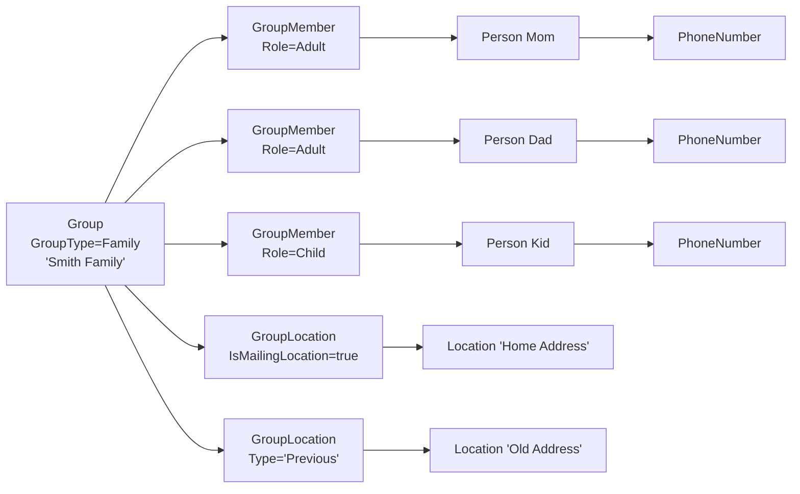

# Family and Addresses

## Overview

A "Family" in Rock is a `Group` of `GroupTypeId = Family`. Family relationships, addresses, and primary-campus computation all flow through the standard Group infrastructure with family-specific code paths in `Group.SaveHook`. Phone numbers live on `Person` directly. Addresses live on the family Group as `GroupLocation` rows. There is no `Person.Address` column; "this person's address" resolves through their family Group's primary mailing location.

## Why It Exists

Modeling families as a special-case entity would have multiplied schema and code paths. Families are one of many GroupType variants, so reusing the Group infrastructure is the right cost-benefit. The savings are large: address management, member roles (Adult / Child), history tracking, and search all share code with the rest of the Group system.

The few family-specific paths in `Group.SaveHook` exist because families have constraints other groups do not: family-group names get sanitized to remove emoji and special-font characters (the canonical example in CLAUDE.md), and a family's `CampusId` change must trigger a recomputation of `Person.PrimaryCampusId` for every member. These are exceptions to the generic Group flow, not separate code paths.

The split between "phone on Person" and "addresses on family" reflects ownership: a phone number belongs to one human (a teenager has their own phone), an address typically belongs to a household.

## Mental Model



The address question "what is this person's address" walks: Person -> family `GroupMember` -> family `Group` -> `GroupLocation` filtered by `IsMailingLocation = true` -> `Location.Address1`, etc.

`Person.PrimaryCampusId` is denormalized from the family Group's `CampusId`. The `Group.SaveHook` triggers recomputation when a family Group's campus changes (the `_FamilyCampusIsChanged` flag).

## What You Need to Know

**Family is a `GroupType`, not a separate entity.** Code that distinguishes families checks `GroupTypeId == GroupTypeCache.GetFamilyGroupType().Id` (or equivalent Guid lookup). Do not invent a "family" marker outside this convention.

**Family-group name sanitization is automatic.** `Group.SaveHook.PreSave` strips emoji and special-font characters from family-group names on insert. Custom code that creates families bypassing the save hook will produce non-sanitized names; rely on `SaveChanges` to apply the regex.

**`Person.PrimaryCampusId` is recomputed by the family save hook.** When a family Group's `CampusId` changes, the save hook flags `_FamilyCampusIsChanged = true`, and `PostSave` recomputes `PrimaryCampusId` for every Person in the family. Direct edits to `Person.PrimaryCampusId` are overwritten on the next family save.

**Addresses are `GroupLocation` rows, not Person rows.** Editing "this Person's address" through any address-editor UI is editing the family Group's primary mailing GroupLocation. There is no per-Person address override at the schema level (per-Person needs go through the GroupLocationTypeValue, e.g., "Previous Address").

**Phone numbers are per-Person.** `PhoneNumber` rows have `PersonId` directly (not via PersonAlias). Each Person can have multiple phones (Home, Mobile, Work) typed via `NumberTypeValueId` (DefinedValue from `PERSON_PHONE_TYPE`).

**`IsMailingLocation` and `IsMappedLocation` are independent flags.** `IsMailingLocation = true` marks the address used for mailings. `IsMappedLocation = true` marks it for map display. Both can be true. Multiple GroupLocations can have either flag true; UI flows typically enforce a single primary, but the schema does not.

**Family Group save-hook special cases:**
- Name sanitization (regex strips emoji and special-font characters).
- `_FamilyCampusIsChanged` flag for primary-campus recomputation.
- See [docs/group/group-overview.md](../group/group-overview.md) and [docs/group/group-locations.md](../group/group-locations.md) for the full GroupLocation model.

**`Person.GivingId` and `Person.GivingGroupId` track giving aggregation.** A family typically gives as a unit; `GivingGroupId` references the family Group. `GivingId` is `"P{PersonId}"` for individual giving or `"G{GroupId}"` for family giving. The `Group.SaveHook` and `Person.SaveHook` keep these consistent.

**Children's records have age-classification logic.** `Person.AgeClassification` (Adult / Child / Unknown) is computed from `BirthDate`. The Person save hook recomputes on save; `Group.SaveHook` recomputes when family role changes.

**Adding a Person to a family is creating a GroupMember.** The standard `GroupMemberService.Add` path with `Role = Adult` or `Role = Child`. The save hook for `GroupMember` denormalizes `GroupTypeId`, runs requirement validation (none for families typically), and writes history.

**A Person can be in multiple families.** Children of divorced parents are often in two family Groups. The "primary family" is determined by `Person.PrimaryFamilyId` (denormalized); the `Person.SaveHook.UpdatePrimaryFamily` keeps it current.

## Common Scenarios

**"Get a Person's primary mailing address."**

```csharp
var family = person.PrimaryFamily;
var mailingLocation = family.GroupLocations
    .FirstOrDefault( gl => gl.IsMailingLocation && gl.Group.IsActive );
var addressLine1 = mailingLocation?.Location?.Street1;
```

**"Add a phone number to a Person."**

```csharp
var phone = new PhoneNumber
{
    PersonId = person.Id,
    NumberTypeValueId = mobileTypeId,
    Number = "5555551234",
    IsMessagingEnabled = true
};
person.PhoneNumbers.Add( phone );
rockContext.SaveChanges();
```

**"Change a family's address."** Edit the appropriate `GroupLocation` on the family Group (typically the one with `IsMailingLocation = true`). The Edit Family UI surfaces this as an "Address" panel.

**"Move a Person from one family to another."** Remove the GroupMember row from the old family (typically archive); insert a new GroupMember row into the new family. The `Person.SaveHook` will update `PrimaryFamilyId` and `PrimaryCampusId` accordingly.

**"Mark someone as the head of household."** Family-group has the standard role hierarchy (Adult / Child). The "head of household" is implicit (typically the first Adult); if specific tagging is needed, use Person attributes or custom logic.

**"Sanitize a family name in custom code."** Going through `RockContext.SaveChanges` runs the sanitization automatically. Direct EF inserts that bypass `SaveChanges` skip it; replicate the regex if you must bulk-insert.

## Key Architectural Decisions

### Family as a `GroupType`

Reusing the Group infrastructure for families means address management, member roles, history, and search all share code. The cost is a few family-specific code paths in `Group.SaveHook`.

### Phone on Person, address on family

A phone belongs to one human; an address belongs to a household. Modeling on the right entity matches reality.

### `IsMailingLocation` and `IsMappedLocation` independent

Real-world cases: a P.O. box for mailings plus a physical address for mapping. Independent flags handle both.

### Primary-campus denormalization

`Person.PrimaryCampusId` could be computed on every read by walking through the family. The denormalization is a hot-path optimization; the save hook keeps it correct.

### Multiple families per Person supported

Divorced-parent custody, grown children with their own family plus parents' family, etc. The data model allows many GroupMember rows; `PrimaryFamilyId` denormalizes the canonical one.

## Considered but Rejected

### Separate `Family` entity

Rejected. Reusing Group is cheaper and maintains consistency.

### Per-Person address column

Rejected. Most people share an address with their family; per-Person duplicates the data and complicates updates.

### Hard-deleting Persons on family removal

Rejected. Person rows are valuable historical references.

## Technical Reference

### Data Model (relevant pieces)

| Entity | Relevant fields |
|---|---|
| `Group` (Family GroupType) | `Name`, `CampusId`, `IsActive`, `IsArchived` |
| `GroupMember` (in Family Group) | `PersonId`, `GroupRoleId` (Adult/Child), `GroupOrder` |
| `GroupLocation` | `GroupId`, `LocationId`, `GroupLocationTypeValueId`, `IsMailingLocation`, `IsMappedLocation` |
| `Location` | `Street1`, `Street2`, `City`, `State`, `PostalCode`, `Country` |
| `Person` | `PrimaryFamilyId`, `PrimaryCampusId`, `GivingGroupId`, `GivingId`, `AgeClassification` |
| `PhoneNumber` | `PersonId`, `NumberTypeValueId`, `Number`, `IsMessagingEnabled`, `IsUnlisted` |

### Save Hook Highlights

`Group.SaveHook` (family-specific paths):
- PreSave (Added): name sanitization for family GroupTypeId (`Group.SaveHook.cs:62-65`).
- PreSave (Modified): if family Group's `CampusId` changes, set `_FamilyCampusIsChanged = true`.
- PostSave: if `_FamilyCampusIsChanged`, call `PersonService.UpdatePrimaryCampusId` for each member.

`Person.SaveHook.PostSave`:
- `PersonService.UpdatePersonAgeClassification` (recomputes from `BirthDate`).
- `PersonService.UpdatePrimaryFamily` (recomputes from family GroupMember rows).
- `PersonService.UpdateGivingLeaderId`.
- `PersonService.UpdateGroupSalutations`.

### Affected Blocks

- **Person Detail / Bio**: surfaces family members, addresses, phones.
- **Edit Person / Edit Family**: edit Person properties, family addresses, family member roles.
- **Add Family / New Family**: create a family with members.

### Related Docs

- [docs/group/group-overview.md](../group/group-overview.md) for Group fundamentals.
- [docs/group/group-locations.md](../group/group-locations.md) for the GroupLocation model.
- [docs/core/person-alias-semantics.md](../core/person-alias-semantics.md) for why Person FKs differ.

## Recent Impactful Changes

(No release-note-tagged changes specifically to family or address handling in the last 18 months. The model is mature; recent fixes touched unrelated parts of the Group save hook. The 2025-04-22 Record Source Defined Type addition (commit `40103e4133`) lets internal Add Family flows tag new Persons with a record source.)
