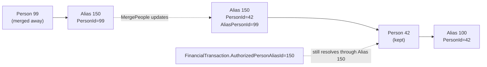

# Person Merge

## Overview

Person Merge is the supported workflow for combining two Rock Person records that turn out to be the same human. The work happens in `PersonService.MergePeople`. The mechanism is straightforward: repoint the merged-away Person's aliases to the kept Person, apply user-selected field values, retain non-selected last names as `PersonPreviousName` rows, and (optionally) email the requester. Cross-domain references are NOT rewritten; that is exactly why `PersonAlias` exists.

## Why It Exists

A church-management system accumulates duplicates: a visitor signs up for an event under one email, returns later as a check-in walk-in under a phone number, and gets a third record from a workflow form. Without a merge mechanism, the duplicates split giving history, attendance, and group membership. Hard-deleting the duplicates would lose every cross-domain reference.

The PersonAlias indirection (see [docs/core/person-alias-semantics.md](../core/person-alias-semantics.md)) lets the merge operation leave every reference intact: only `PersonAlias.PersonId` is updated, every transaction / attendance / group-member row keeps its `PersonAliasId` and resolves through the alias to the kept Person.

The 2026-01-27 enhancements (commit `4483145a96`) were a substantive UX upgrade: requesters now get an email when their merge request completes, non-selected last names are retained as Previous Last Names (preserving historical search-by-old-name capability), and the merge UI surfaces last-modified date / person for fields and attributes during the merge so reviewers can make decisions with confidence.

## Mental Model

A merge has a **kept Person** and a **merged-away Person**. The operation:

After the merge:

- All aliases formerly pointing at Person 99 now have `PersonId = 42`.
- Their `AliasPersonId` retains 99 (the historical pointer), so "find things originally created against Person 99" still works.
- Person 99's row is typically retained (with its FKs nulled) for historical reference, depending on configuration.
- User-selected values from the merge UI are written to Person 42.
- Non-selected last names from Person 99 (if any) become `PersonPreviousName` rows on the kept Person's primary alias.

## What You Need to Know

**Cross-domain references are NOT rewritten.** This is the whole reason the PersonAlias layer exists. A merge updates `PersonAlias.PersonId` for the merged-away aliases; transactions, attendance rows, group memberships, and audit columns continue to point at their existing aliases.

**Previous Last Names are retained automatically since `4483145a96`.** Pre-fix, a merged-away Person's last name was lost if not selected. Now the non-selected last name becomes a `PersonPreviousName` row, which the search-by-name path consults so historical search still works.

**The merge requester can be notified by email.** Configurable; when enabled, the merge-completed email goes to the person who submitted the merge request via the Person Merge Request List. Useful for organizations where merges are reviewed by a separate team.

**Field-level decisions are surfaced with last-modified context.** The merge UI displays which Person had the most recent edit for each field and attribute, with timestamps. This helps reviewers pick the more current value when both Persons have data.

**Same-Group duplicates are handled deterministically.** A pre-existing edge case: if the same person is a member of the same Group/class with the same number of completed assignments, the merge should preserve the kept-Person path. Commit `19a0a00e03` fixed this for Step assignments specifically; same pattern applies to other count-based duplicates.

**`PersonDuplicate` rows feed merge candidates.** The duplicate-detection job populates `PersonDuplicate`. The Person Merge Request workflow lists candidates; reviewers initiate merges. `IsConfirmedAsNotDuplicate = true` on a `PersonDuplicate` row hides it from the candidate list permanently.

**Hard delete of the merged-away Person is configurable.** Some deployments retain the Person row (with FKs nulled) for audit. Others delete it after the alias repointing completes. The default behavior preserves the row.

**Custom code that adds a Person should not bypass the merge candidate path.** New Persons created via integrations or APIs should run through `PersonService.GetByMatch` first; the v2 People API POST endpoint does this since `504887dcb2` (the "Create Person If Missing" parameter is the explicit opt-in).

## Common Scenarios

**"Merge two duplicate Persons through the UI."** Internal -> CRM -> Person Merge. Pick the kept Person, the merged-away Person; review field-by-field, picking the value that should survive. Submit. The merge completes, aliases repoint, Previous Last Names are retained.

**"Find candidates programmatically."** `PersonService.GetByMatch(firstName, lastName, email, ...)` returns potential matches with confidence scores. Used by the v2 People API and the `Get Person From Fields` workflow action.

**"Create a Person only if no match exists."** v2 People API POST with `CreatePersonIfMissing = true` (default since `504887dcb2`). Searches for an existing match, creates only if none found, prevents most accidental duplicates.

**"Audit which merges happened."** History rows are written for the kept Person on merge. The merge action itself is captured in the standard history-write path.

**"Reverse a merge."** Not directly supported. The PersonAlias repointing is reversible only through manual SQL plus understanding of the original state. Treat merges as one-way and review carefully before submitting.

## Key Architectural Decisions

### Repoint aliases, do not rewrite cross-domain FKs

The whole reason the alias layer exists. Forcing a merge to rewrite every cross-domain reference would multiply database writes by orders of magnitude.

### Retain Previous Last Names automatically

Searching for someone by their pre-marriage name is a real use case. Auto-retention preserves the capability without admin work.

### Surface last-modified context in the merge UI

Reviewers need to know which value is more current. Last-modified-date display turns merge decisions from guesses into informed picks.

## Considered but Rejected

### Auto-merging high-confidence duplicates

Rejected. Even high-confidence matches can be wrong (twins with similar names). All merges go through human review.

### Hard-deleting merged-away Persons by default

Rejected. Audit and reversibility considerations argue for retention; specific deployments can configure delete if they prefer.

## Technical Reference

### Service / API Surface

`PersonService.MergePeople( keptPerson, mergedAwayPerson, ... )` is the entry point.

`PersonService.GetByMatch( firstName, lastName, email, ... )` finds potential duplicate candidates.

v2 People API endpoints (since `504887dcb2`): `POST /api/v2/People` with `CreatePersonIfMissing` parameter, plus the new `FindPerson` endpoint.

### Data Model

| Entity | Role |
|---|---|
| `PersonDuplicate` | Candidate pair; populated by the duplicate-finder job. |
| `PersonAlias` | Repointed during merge. `AliasPersonId` retains the merged-away Person's id. |
| `PersonPreviousName` | Auto-created on merge for non-selected last names (since `4483145a96`). |

### Affected Blocks

- **Person Merge** (Internal -> CRM): the merge UI.
- **Person Merge Request List**: pending review queue.
- **Person Search**: consults `PersonPreviousName` for historical-name lookup.

### Related Spec / Doc

- [docs/core/person-alias-semantics.md](../core/person-alias-semantics.md) for the indirection model.
- [docs/crm/person-search-and-duplicates.md](person-search-and-duplicates.md) for the duplicate-detection side.

## Recent Impactful Changes

- **2026-03-26** ([commit `504887dcb2`](https://github.com/SparkDevNetwork/Rock/commit/504887dcb2)). v2 People API gained `CreatePersonIfMissing` parameter and a `FindPerson` endpoint to prevent integrations from accidentally creating duplicates.
- **2026-02-02** ([commit `19a0a00e03`](https://github.com/SparkDevNetwork/Rock/commit/19a0a00e03)). Fixed merge edge case where a duplicate Person in the same group/class with the same number of completed assignments now behaves consistently with the "old Person had more records" case.
- **2026-01-27** ([commit `4483145a96`](https://github.com/SparkDevNetwork/Rock/commit/4483145a96)). Person Merge enhancements: completion email to requester, automatic retention of non-selected last names as Previous Last Names, last-modified date/person visibility for fields and attributes during merge.
