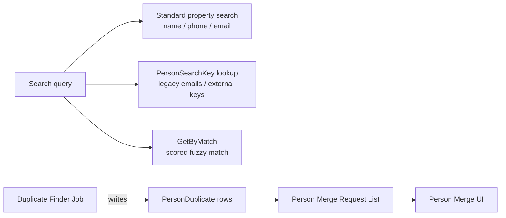

# Person Search and Duplicates

## Overview

Person search has multiple paths: `PersonService.GetByMatch` for "find by identifying fields with confidence scoring," `PersonSearchKey` for "non-Person identifiers that resolve to a Person" (legacy emails, external system keys), and the standard search blocks for name / phone / email lookup. Duplicate detection runs through the `spCrm_PersonDuplicateFinder` stored procedure, which writes scored `PersonDuplicate` candidate pairs for human review and merge.

## Why It Exists

Searching for a person in a church-management system has nuance: a married name search must find pre-marriage records, an email search must consult legacy emails (people change addresses), an external integration looking up "the person matching SSO id X" needs a non-email handle. Three mechanisms emerge:

- **Standard property search** for the typical name/phone/email case.
- **PersonSearchKey** for "this string maps to this Person" relationships (any external system key, any legacy email).
- **Match scoring** (`GetByMatch`) for "given these fields, find the best candidate" with confidence levels.

Duplicate detection exists because despite the search mechanisms, duplicates accumulate. Visitor flows, rushed registrations, and integrations that did not call `GetByMatch` all produce duplicates. The detection job catches them and queues review.

## Mental Model

Standard property search is the typical "find by name" path. It uses `Person.FirstName`, `LastName`, `Email`, plus `PersonPreviousName` for historical names.

`PersonSearchKey` is a separate index of non-Person identifiers. `SearchTypeValueId` (a DefinedValue) categorizes the key (`Email`, `Alternate Id`, custom external system); `SearchValue` is the string. The check-in family search uses these.

`GetByMatch` is for integration use cases: "I have first name, last name, email, phone; find the best Person." Returns candidates with confidence scoring.

Duplicate detection runs via `spCrm_PersonDuplicateFinder`, populates `PersonDuplicate` with scored pairs, surfaces in the Person Merge Request UI for review.

## What You Need to Know

**Add a `PersonSearchKey` for any external system key.** SSO ids, legacy email addresses, third-party member ids: each becomes a `PersonSearchKey` row with the appropriate `SearchTypeValueId`. Search blocks consult this table for non-Person-property lookups.

**`SearchTypeValueId` is a DefinedValue.** The standard types ship under `SystemGuid.DefinedType.PERSON_SEARCH_KEYS`. Custom types are added as DefinedValue rows (no schema change required).

**`IsValuePrivate = true` hides the value from UI.** Useful for sensitive identifiers (SSN-derived hashes, private external keys) that should support match-by-value but not display.

**`PersonSearchKey` is `[NotAudited]`.** Volume of search-key writes (especially from integrations) makes per-row audit history noise.

**`PersonDuplicate.ConfidenceScore` is computed.** The finder proc calculates it from the matched-vs-matchable fields. Reviewers prioritize the highest-confidence pairs.

**`IsConfirmedAsNotDuplicate = true` permanently hides the pair.** When a reviewer confirms two Persons are NOT duplicates, the row stays in the table but is filtered out of merge candidate lists. The next finder run does not re-flag the same pair.

**`IgnoreUntilScoreChanges = true` is a softer suppression.** Hides the pair until something changes one Person's properties enough to recompute a different score. Used for "probably not a duplicate, but worth re-checking later if anything changes."

**`PersonDuplicate` rows are the candidates, not commitments.** Existence in the table does NOT mean the Persons are duplicates. Human review is required.

**Search-by-name consults `PersonPreviousName`.** Search-for-married-name finds pre-marriage records. The auto-retention of last names on merge (since `4483145a96`) populates this table.

**The Nameless Person record type exists.** Some inbound flows (anonymous SMS opt-in, phone-only check-in) create Persons with no name. Reports and search results must decide whether to include nameless records; the duplicate finder includes them.

**`GetByMatch` is the canonical "find or create" entry point.** Integrations, the v2 People API, the Get Person From Fields workflow action all call it. Custom integration code should too; bypassing this is the most common source of accidental duplicates.

## Common Scenarios

**"Find a person by an external SSO id."** Add a `PERSON_SEARCH_KEYS` DefinedValue for the SSO system (e.g., "Auth0 Sub"). Insert a `PersonSearchKey` row with that type and the SSO sub. Search via `PersonSearchKeyService` or the standard search blocks (which consult the table).

**"Search for a person by their pre-marriage name."** Standard `PersonService.GetByLastName` consults `PersonPreviousName` automatically. No special call required.

**"Find candidates for a name + email + phone match."** `PersonService.GetByMatch(firstName, lastName, email, phoneNumber)` returns candidates. Used by the Person Merge Request flow.

**"Create a Person only if no match exists."** v2 People API POST with `CreatePersonIfMissing = true` (default), or `Get Person From Fields` workflow action. Both call `GetByMatch` and create only when no match.

**"Run the duplicate detection job."** `spCrm_PersonDuplicateFinder` is called by the Rock job scheduler on a configurable cadence. Manual run via Job Administration.

**"Confirm a duplicate pair is NOT actually a duplicate."** From the Person Merge Request list, mark "Not a Duplicate." Sets `IsConfirmedAsNotDuplicate = true` on the `PersonDuplicate` row.

## Key Architectural Decisions

### `PersonSearchKey` as a separate index

Email and phone are on `Person` directly (the canonical current values). Historical and external keys go on `PersonSearchKey` so the search surface scales without bloating the `Person` table.

### `PersonDuplicate` as a candidate-pair table, not a flag

A boolean `IsDuplicate` on `Person` would not capture which other Person it is a duplicate OF. The pair table holds both alias references and the score; merges can then consume the pair.

### Score-based detection with human review

Auto-merge would risk false positives. Score-based suggestion + human review is the right tradeoff.

### Confidence score on the pair, not on the Person

The score is a property of the comparison, not of either Person. Modeling it on the pair is the natural fit.

## Considered but Rejected

### Auto-merging high-confidence pairs

Rejected. Twins, intentional same-name records, and edge cases make full automation risky. Human review for every merge.

### Storing legacy emails on `Person` directly

Rejected. The `Person.Email` column holds the current email; multiple legacy emails would require either array columns (poor SQL) or repeated `Person` rows. `PersonSearchKey` is the right shape.

## Technical Reference

### Service / API

`PersonService.GetByMatch( first, last, email, phone, ... )` returns scored candidates.

`PersonSearchKeyService` provides standard CRUD for search keys.

`spCrm_PersonDuplicateFinder` is the duplicate-finder stored procedure called by the job.

### Data Model

| Entity | Role |
|---|---|
| `PersonSearchKey` | Non-Person identifier mapping to a Person via PersonAlias. |
| `PersonDuplicate` | Candidate duplicate pair with confidence score. |
| `PersonPreviousName` | Historical last names; consulted in name search. |

### `PersonSearchKey` Indexes

`(SearchTypeValueId, SearchValue)` non-unique composite for fast type+value lookup. Same `SearchValue` can repeat across types or even within a type (one Person might have two legacy emails).

### `PersonDuplicate` Indexes

`(PersonAliasId, DuplicatePersonAliasId)` unique. The pair is directional in storage but treated as bidirectional in the UI.

### Related Doc

- [docs/crm/person-merge.md](person-merge.md) for the merge side.
- [docs/core/defined-type-and-value.md](../core/defined-type-and-value.md) for the `PERSON_SEARCH_KEYS` DefinedType pattern.

## Recent Impactful Changes

- **2026-03-26** ([commit `504887dcb2`](https://github.com/SparkDevNetwork/Rock/commit/504887dcb2)). v2 People API integrates `GetByMatch` properly via the new `FindPerson` endpoint; `CreatePersonIfMissing` parameter prevents accidental duplicates.
- **2025-08-08** ([commit `09492b6867`](https://github.com/SparkDevNetwork/Rock/commit/09492b6867)). Universal Search Re-Index job for Person now runs efficiently on large datasets (Fixes #6406). Person search via Universal Search benefits.
